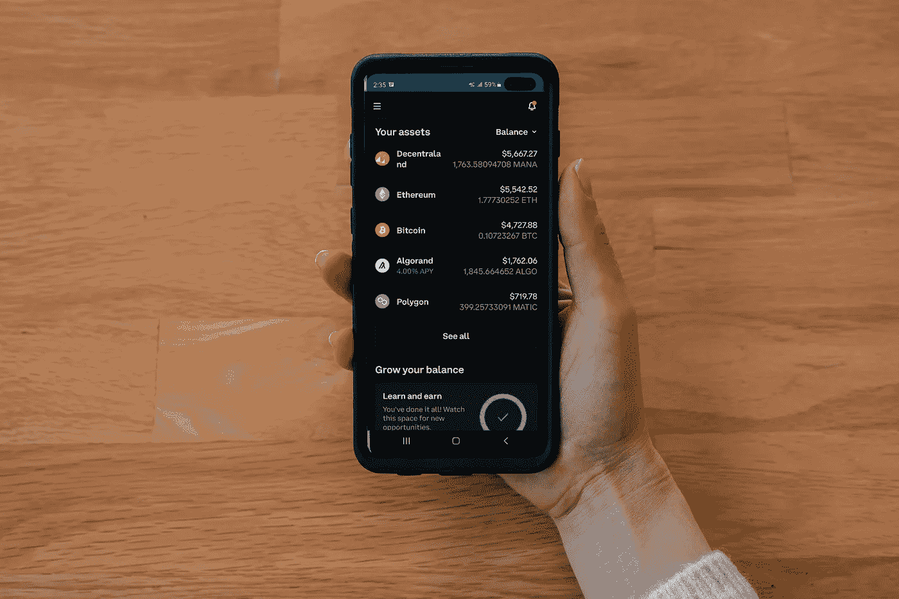

# 加密货币的五大长期投资

> 原文：<https://medium.com/coinmonks/top-5-investment-in-cryptocurrency-for-long-term-3395b5fafecd?source=collection_archive---------39----------------------->

Source photo Unsplash.com

# 莱特币

长期投资者也应该考虑莱特币。硬币创造者希望这将是可行的比特币替代品。像比特币一样，它是一种基于工作证明概念的去中心化数字货币。

例如，它是一种比比特币使用起来更快、更便宜的货币。与比特币相比，莱特币的供应量…