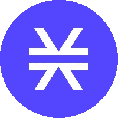

# 前五名元宇宙硬币

> 原文：<https://medium.com/coinmonks/top-5-metaverse-coin-6f4565cc6af5?source=collection_archive---------11----------------------->

极有可能，在 2021 年最后一段时间掀起大趋势的元宇宙项目，在牛市再次到来的时候，再次大受欢迎。这就是为什么我想回顾 5 个最著名的，投资和成功的元宇宙硬币。不是财务建议。

*   分散之地(MANA):分散之地是一个由以太坊区块链驱动的虚拟现实平台。用户可以创建、体验内容和应用，并从中获利。分散土地上的土地永久归社区所有，让他们完全控制自己的创作。用户在区块链的地块分类账上宣称拥有虚拟土地的所有权。土地所有者控制什么内容被发布到他们的那部分土地上，这由一组笛卡尔坐标(x，y)来标识。内容可以从静态 3D 场景到互动系统，如游戏。
    总供应量 21.9 亿，循环供应量 18.5 亿。然而，当进行长期投资时，一定要小心，因为最大供应量是无限的。随着与三星 Mana 合作伙伴关系的宣布，它在 2022 年初再次引起了人们对硬币的关注。这是今年年底最需要关注的元宇宙硬币之一。*当前价值:0.8841 美元*

*   Theta 网络(THETA):THETA 网络和协议解决了当今视频流行业面临的各种挑战。Theta Coin 项目使用利害关系共识证明。Theta 是一个区块链平台，旨在促进为开源、分散式视频流平台设计的全球计算机网络。如今，内容交付网络(cdn)是地理位置分散的运营商的网络，向最终用户交付流媒体视频内容需要付费。Theta 旨在革新直播领域。Theta 区块链引入了三个主要的新颖概念:
    -多级 BFT
    -聚合签名流言方案
    -面向资源的小额支付池
    Theta 当前显示总供应量为 1B，最大供应量为 1B。流通供应也是 1B 西塔。它会再次上涨，但稍微耐心一点的投资者会从中赚很多钱。*当前价值:1.29 美元*

*   沙盒(SAND):沙盒是一个虚拟世界，玩家可以使用平台的实用令牌 SAND 在以太坊区块链建立、拥有和货币化他们的游戏体验。他们的愿景是提供一个身临其境的元宇宙，玩家将在没有中央权威的情况下合作创建虚拟世界和游戏。他们的目标是通过向创作者提供他们作品的真实所有权作为不可替代的令牌(NFT ),并以他们的效用令牌——SAND 奖励他们的参与，来颠覆现有的游戏制造商，如《我的世界》和 Roblox。砂箱总供应量为 3D，最大供应量为 3D，循环供应量为 1.26B 砂。由于 42%的沙子在市场上，对于那些投资和交易的人来说，拥有足够多的沙子来抓住波动的机会是一个很大的优势。*当前价值:1.00 美元*

*   栈(STX):栈；它是一个开源网络，由分散的应用程序和智能合约组成，集成了比特币。同时工作的堆栈和比特币网络允许在不改变比特币链的情况下修改智能合约和分散式应用程序。原名“Blockstack”项目，2019 年名称变更，项目名称和本地币改为 Stacks。它被称为美国证券监管机构证券交易委员会(SEC)批准的第一枚硬币。总供应量为 1.35B，最大供应量为 1.82B，循环供应量为 1.32B STX。73%已经释放的事实将对未来的市场产生积极影响。它是等待并突然变得高度不稳定的硬币之一。*当前价值:0.3884 美元*

*   金恩(ENJ):金恩是一个软件，它让开发者能够在区块链以太坊创造和管理虚拟商品。金恩平台是一个区块链 PaaS(平台即服务),允许你创建和管理区块链游戏，而不需要构建和维护通常与开发和发布区块链游戏相关的基础设施的复杂性。金恩硬币(ENJ)是一种在区块链以太坊交易的 ERC-20 代币，它所基于的金恩技术为用于 NFTs、游戏和其他分布式应用的生态系统提供了动力。
    总供应量和最大供应量似乎是 1B，循环供应量似乎是 8.95 亿 ENJ。由于这种浮动是一种循环供应，波动性不会突然上升，但我认为它将在未来宣布大项目合作伙伴关系，所以我认为作为一家将与伯恩斯一起进行这一跳跃的公司。*当前值:0.5144 美元*

通过这种方式，我将继续分享那些能够引领潮流、具有潜力、并且我认为将推动区块链技术向前发展的硬币。如果你喜欢它，如果你在 Twitter、Medium 平台上关注我并支持我，我会非常高兴:)

> 加入 Coinmonks [电报频道](https://t.me/coincodecap)和 [Youtube 频道](https://www.youtube.com/c/coinmonks/videos)了解加密交易和投资

# 另外，阅读

*   [CoinFLEX 评论](https://coincodecap.com/coinflex-review) | [AEX 交易所评论](https://coincodecap.com/aex-exchange-review) | [UPbit 评论](https://coincodecap.com/upbit-review)
*   [AscendEx 保证金交易](https://coincodecap.com/ascendex-margin-trading) | [Bitfinex 赌注](https://coincodecap.com/bitfinex-staking) | [bitFlyer 审核](https://coincodecap.com/bitflyer-review)
*   [Bitget 回顾](https://coincodecap.com/bitget-review)|[Gemini vs block fi](https://coincodecap.com/gemini-vs-blockfi)cmd |[OKEx 期货交易](https://coincodecap.com/okex-futures-trading)
*   [AscendEx Staking](https://coincodecap.com/ascendex-staking)|[Bot Ocean Review](https://coincodecap.com/bot-ocean-review)|[最佳比特币钱包](https://coincodecap.com/bitcoin-wallets-india)
*   [霍比评论](https://coincodecap.com/huobi-review) | [OKEx 保证金交易](https://coincodecap.com/okex-margin-trading) | [期货交易](https://coincodecap.com/futures-trading)
*   [网格交易机器人](https://coincodecap.com/grid-trading) | [Cryptohopper 审查](/coinmonks/cryptohopper-review-a388ff5bae88) | [Bexplus 审查](https://coincodecap.com/bexplus-review)