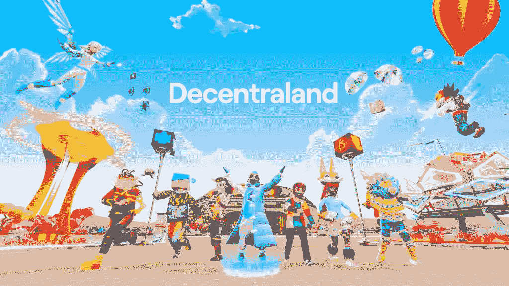
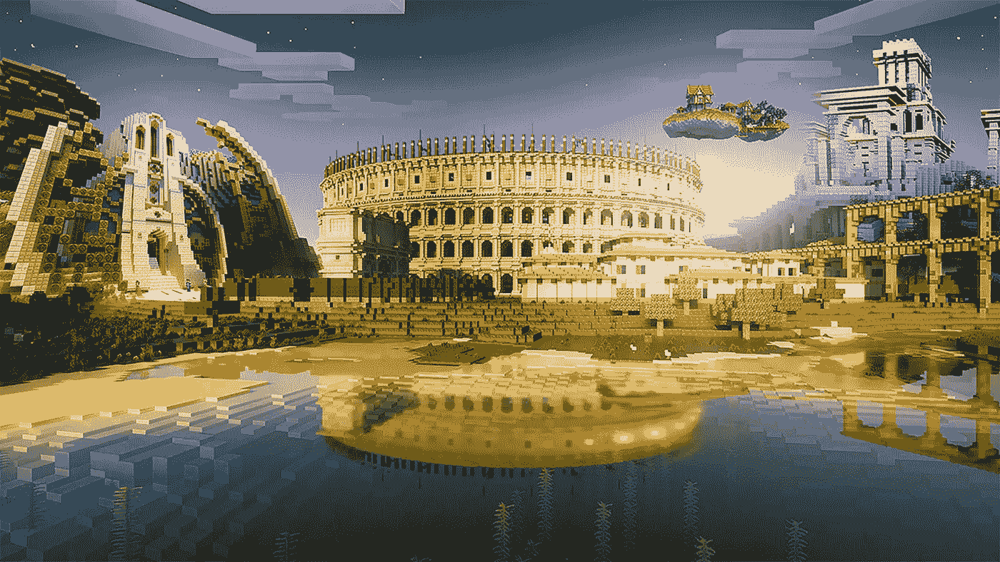
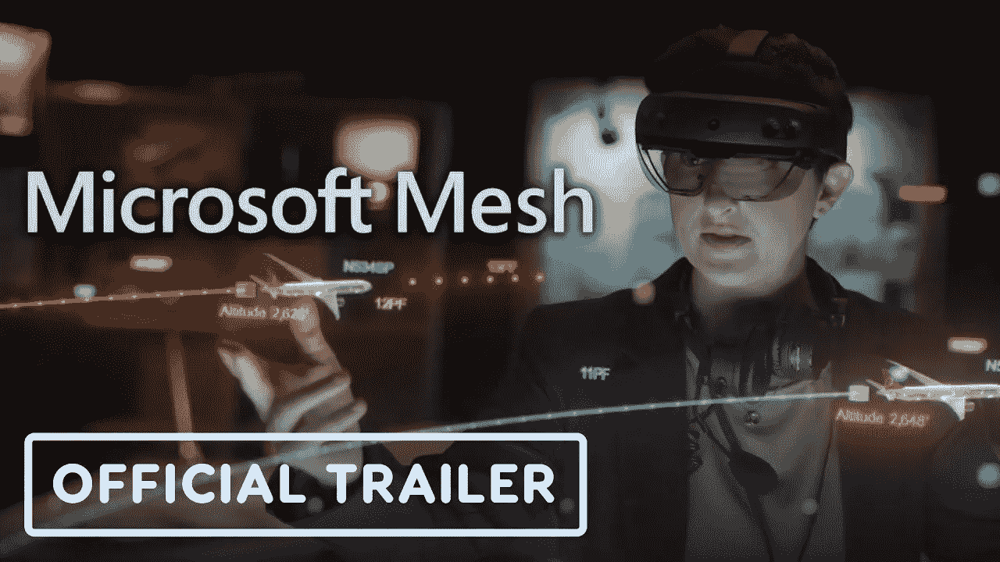
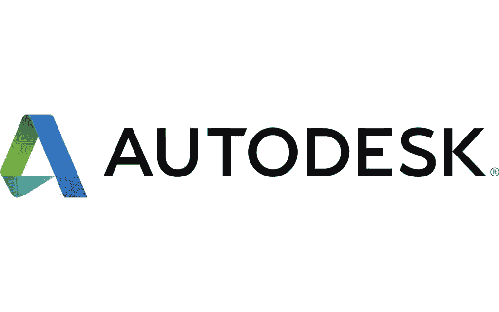

# 今天可供探索的五大元经文

> 原文：<https://medium.com/coinmonks/top-5-metaverses-available-today-to-explore-9498670db3e5?source=collection_archive---------11----------------------->

沉浸式网络空间不再是科幻小说中的东西，而是生活中的现实。元宇宙是一个由数字经济驱动的虚拟 3D 世界网络，利用了虚拟现实(VR)和增强现实(AR)等前沿技术。元宇宙通常被认为是人类进化的下一步。然而，一个精确的定义还有待发展。脸书最近对其元宇宙投资 100 亿美元，引发了对该主题的兴趣。不仅仅是脸书(已更名为梅塔)在与元宇宙竞争。

我们将在下文中探讨一些最有前途的元宇宙技术。

# 1.分散土地

阿根廷人阿里·梅里奇(Ari Meilich)和埃斯特万·奥尔达诺(Esteban Ordano)于 2015 年创立了开源虚拟世界平台“分散之地”。2017 年推出时，数字土地的价格为 20 美元，该平台的加密货币 MANA 的价格为 0.02 美元。分散化基金会负责该平台，该平台于二月份向公众开放。在元宇宙，分散土地是最早的平台之一，此前曾与三星和澳大利亚网球公开赛(AO)合作。

一层元宇宙平台[分散地](https://decentraland.org/)被分割成相等的网格。每个坐标都被称为陆地。由于土地供应有限，分散土地道可以为社区开发额外的土地。

3D 模型可以利用拖放构建工具放置在[分散的地方](https://decentraland.org/)。分散土地为专业人士提供了一个 SDK 工具，可用于创建交互式内容:分散土地允许用户导入 3D 模型并开发复杂的应用程序、游戏和动画。

在虚拟现实、增强现实和 GPS 修正三角测量风靡一时的时代，有《我的世界》在身边是一种安慰。这似乎是一个游戏。然而，这是一种生活方式，不会改变。尽管《我的世界》不是传统意义上的游戏，但它确实提供了一些很好的发展机会，这使得这个“游戏”特别有点与众不同；一个方方正正的钉子，正好嵌在一个圆形的孔里。这么多年过去了，它看起来仍然很棒，讲述了一个鼓舞人心的故事，讲述了实现梦想所需的毅力和奉献精神。《我的世界》的元宇宙应该基于用户生成的材料。游戏的“种子”地图，取自世界形成那一刻的系统时钟，让玩家参与世界的发展。

# 2.《我的世界》

在某种程度上，它类似于一个视觉区块链，用户可以在其中正确地确定他们相遇的日期。莫江，你能行的！我们开始崇拜的游戏比喻，包括多用户地下城:检查！一种生存模式被激活了！有幽默感的化身是一种天赋。“这是完全由用户创建的。”作为《我的世界》的新所有者，即使在这个大公司时代，微软也能够保持平台的愿望，将用户放在整个体验的前端和中心。对他们来说，这是有史以来最好的投资之一。元宇宙高度重视用户体验，这有助于为新玩家恢复[《我的世界》](https://www.minecraft.net/)的原有光彩。

# 3.微软网格

[微软 Mesh](https://www.microsoft.com/en-us/mesh) 让我们有机会爱上自己的倒影，就像那西塞斯一样。如果你正在寻找一个元宇宙，它能让你通过混合现实在同一时间和其他人在同一个地方，那么这就是你要找的地方。这个位置可能是任何地方。通勤回城市或从家里开始步行开会的元宇宙客户越来越有这种感觉，企业 AR 是无设备/设备选择加入/退出的一部分。这是一个由微软 Azure 支持的试验场。Mesh 正在经历一场重大的研发高峰，这意味着在一个没有法律和技术上没有世界的世界里，任何事情都可能发生，而且通常都会发生。

当涉及到制作我们自己的数字复制品和使用从体积捕捉到自然运动原理的任何东西时，微软正在推动这种跨时区的虚拟合作的感觉。在 2022 年，混合现实的概念令我着迷，因为它允许我们这样做:结合我们的世界。一旦疫情消失了，我们就能再次见到人，我们就能一只脚在现实世界，另一只脚在幻想世界。听起来很奇怪，但我们可以控制混合现实中的疯狂。是不是很刺激？

# 4.一致

在元宇宙，你还需要熟悉团结。本质上，它是一个实时开发和部署三维交互式媒体的工具。此外，这还包括允许客户通过各种第三方内容分发渠道生成内容并从中获利的解决方案。每个月有超过 25 亿人使用 Unity solutions，所以 U stock 越来越受投资者欢迎也就不足为奇了。

自从 [Unity](https://unity.com/) 刚刚公布 2021 财年第四季度和全年利润结果以来，人们对未来表达了很多希望。2021 年全年收入为 11 亿美元，比上年增长 44%。收入同比增长 43%，使该公司的收入达到 3.159 亿美元，远高于预期。

2022 年全年， [Unity](https://unity.com/) 预计收入为 15 亿美元。这超过了分析师预测的 14.3 亿美元。总体而言，Unity 似乎正朝着正确的方向前进，围绕元宇宙的预期可能是该公司的长期利益。由于这些良好的情绪，U stock 是值得关注的顶级元宇宙股票吗？

# 5.美国电脑软件公司

最后，我们来看看 [Autodesk](https://www.autodesk.ae/) 。对于那些从未听说过的人来说，设计和服务公司就是这家公司的真实面目。其技术产品和服务为客户提供有效的商业解决方案。

该公司的 Revit 软件是一个建筑信息建模(BIM)程序，允许建筑师以 3D 形式查看他们的平面图，并向客户展示。像 Autodesk Rendering 这样的插件使得将这变成虚拟现实体验成为可能。在元宇宙，这种技术可能会发挥重要作用。

Autodesk 在 1 月份宣布收购了 Moxion。这是一个基于云的数字日报平台，由新西兰的电影制作人开发。Autodesk 的媒体和娱乐云平台自然会受益于 Moxion 的专业知识和技术。因此，Autodesk 将增加新用户，同时促进内容创建的整个价值链中更无缝的工作流程。基于这些原因，ADSK 股票是否值得持续关注？

> 加入 Coinmonks [电报频道](https://t.me/coincodecap)和 [Youtube 频道](https://www.youtube.com/c/coinmonks/videos)了解加密交易和投资

# 另外，阅读

*   [Bitsgap 审查](/coinmonks/bitsgap-review-a-crypto-trading-bot-that-makes-easy-money-a5d88a336df2) | [Quadency 审查](/coinmonks/quadency-review-a-crypto-trading-automation-platform-3068eaa374e1) | [Bitbns 审查](/coinmonks/bitbns-review-38256a07e161)
*   [密码本交易平台](/coinmonks/top-10-crypto-copy-trading-platforms-for-beginners-d0c37c7d698c) | [Coinmama 审核](/coinmonks/coinmama-review-ace5641bde6e)
*   [印度的加密交易所](/coinmonks/bitcoin-exchange-in-india-7f1fe79715c9) | [比特币储蓄账户](/coinmonks/bitcoin-savings-account-e65b13f92451)
*   [OKEx vs KuCoin](https://coincodecap.com/okex-kucoin) | [摄氏替代品](https://coincodecap.com/celsius-alternatives) | [如何购买 VeChain](https://coincodecap.com/buy-vechain)
*   [币安期货交易](https://coincodecap.com/binance-futures-trading)|[3 comas vs Mudrex vs eToro](https://coincodecap.com/mudrex-3commas-etoro)
*   [如何购买 Monero](https://coincodecap.com/buy-monero) | [IDEX 评论](https://coincodecap.com/idex-review) | [BitKan 交易机器人](https://coincodecap.com/bitkan-trading-bot)