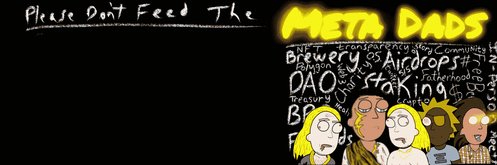

# 前 5 名 NFT 最佳实践(营销和社区 Growth)🗣

> 原文：<https://medium.com/coinmonks/top-5-nft-best-practices-marketing-and-community-growth-7025e26eb50c?source=collection_archive---------15----------------------->

难怪启动一个 NFT 项目是一项艰巨的工作，而且 95%以上的 NFT 项目都会失败…

你能关注的最好的事情是发展一个忠实和值得信赖的观众，他们愿意支持你的所有努力。

以下是一些关于如何做到这一点的建议…

[**@metadadsxyz**](https://www.twitter.com/metadadsxyz)on **Twitter**

# 五大 NFT 最佳实践:

1.  ***保持一致***
2.  ***认为盒子外***
3.  ***交朋友***
4.  ***诚实***
5.  ***牵引***

# 1.保持一致

这应该是你作为营销人员和社区领导者的首要任务，不仅仅是在 not 区块链项目领域，而是在所有行业。

如果你看看历史上所有成功的项目，它们都存在了很长时间(一致性)。当然，你可能会在生活的各个方面发现这种一致性原则的例外，但一般来说，你向潜在客户提供价值的时间越长，你背后的声誉和*信任*就越多。

驾驭一个社区，发展一个受众，就像生火一样。切割木头，把木头拖到火坑，然后点燃火焰，这些都需要时间。一旦火焰被点燃，你必须继续把木头放入火中，以防止它熄灭，否则它会像开始一样迅速熄灭。

在这个新成立的 web 3/NFT/加密/区块链/元宇宙空间中多年来保持一致的玩家将会脱颖而出。

# 2.创造性地思考

随着 NFT 和加密领域出现如此多的新竞争，几乎不言而喻的是，跳出框框思考是必须的。

如果你足够幸运，在 2021 年 11 月之前已经将你的基本的生殖 NFT 收藏作为“艺术”单独推出，那么你很幸运，可能从去年的 NFT 抢购潮中赚了数千或数百万…

我们不再生活在这样的时代，从现在开始，每一个 NFT 系列似乎都不仅仅是简单的酷艺术

当然，我见过一些项目(比如《看不见的朋友》)，他们有我见过的最基本的网站和信息图表之一，然而他们似乎在几秒钟内就卖光了……他们很酷，很创新，很艺术，并保持着圆滑的“不要说太多”的态度。我敢肯定，他们花了 5 万多美元在市场营销上，以获得如此多的宣传，但尽管如此，在可预见的未来，没有多少 NFT 项目会再次实现这样的事情。

我目前在 NFT 空间看到的“跳出框框思考”的好想法/实践是什么，还有一些尚未实现？？

——***不和谐关闭/打开***
——***WL 景点免费/付费/已赚***
——**DM 的**
——**付费影响者** ——**分享帖子，赚取奖励**
——**新公用事业**
——**合伙企业……**

# 3.交朋友

无论你去哪里，结交朋友总是一个发展社区的好办法。

你不需要出去和每个人都成为好朋友，但是你需要和一些人成为好朋友。

这些人会成为你的粉丝，当你向观众提问时，他们会回答你的问题，他们会购买你的商品，你的 NFT，分享你的推文……他们基本上会为你做任何事情，因为随着时间的推移，你已经通过持续的互动和参与建立了联系。

无论你去哪里，都要迅速参与。总经理，你今天过得怎么样？？你今天吃了什么？你今天几点起床的？

结交真正朋友的最好方式是面对面，但由于区块链空间主要是偏远的，我们需要尽可能多地创造用户互动的机会。没有成员的参与，就没有纽带形成，因此除了经济收益或很酷的艺术之外，没有理由参与你的项目…

# 4.诚实/透明

信不信由你，不是每个 NFT 项目都把你的最佳利益放在心上…

由于加密领域缺乏规则/监管/惩罚，难怪骗子/拉地毯者/黑客潜伏在每个角落。

这就是为什么在试图建立声誉时，诚实和透明会大有帮助。

“dox”自己的 NFT 项目所有者走在了游戏的前面，并获得了另一张支票。

# 5.牵引力

如果你已经在 Twitter 上呆了 5 年，并且把自己发展成了加密/NFT 领域的“专家”,毫无疑问，你已经交了一两个朋友，并且很可能已经有了一大批追随者。

上面这个人在 Twitter 上领先一步，没有“专家”身份，也不怎么使用社交媒体…除非这个人是伟大的艺术家、营销人员或区块链开发者…

为了对抗那些以时间为强项的人，新手可以使用$,或 crypto，与有影响力的人/推动者合作，快速发展一个小社区。

如果你没有时间，你就有美元，反之亦然。

你存在的时间越长，你拥有的牵引力越大，你的 NFT 落差就越大…

尝试真正利用所有牵引力在造币日释放。

在你的主要 NFT 下降之前的几个星期或几个月里，通过建立牵引力使社区有紧张感…

# 额外的

多走一步。每天离开你的粉丝时，给他们一点小费，一点额外的东西。

让他们脸上带着微笑，让他们永远不会忘记与你或你的社区互动时的感受。

当业主/社区做了额外的努力，人们会注意到这一点。

[社区经理的好日子](/coinmonks/a-good-day-for-an-online-community-leader-️-d1159cc6de31) —博客
[密码 101:初学者指南](/coinmonks/crypto-101-a-beginners-guide-345d440bd163) —博客
[成为 NFT 职业选手](/coinmonks/becoming-an-nft-pro-26cb9466b192) —博客

______________________________________________________________

# 一定要小心！！！

我怎么强调这一点都不为过！保持高度警惕，注意你点击的每一个链接，你做的每一笔交易，以及你接触的每一个人，因为骗子在这个空间里比比皆是，最好看的项目都被取消了。

点击所有链接之前，要再三检查，确保它们是你要找的官方链接。在把任何有价值的东西寄给别人之前，也要仔细检查所有的钱包地址。

**跟随我们的加密/NFT/区块链/元宇宙之旅**

请支持我发送 polygon matic 到这个 eth 地址，或者 eth:
0x b 53b 3978333 e 11 c 382 ab 619 f 02 f 469 A8 c 70750 af

> 加入 Coinmonks [电报频道](https://t.me/coincodecap)和 [Youtube 频道](https://www.youtube.com/c/coinmonks/videos)了解加密交易和投资

# 另外，阅读

*   [加密货币储蓄账户](/coinmonks/cryptocurrency-savings-accounts-be3bc0feffbf) | [加密交易机器人](https://coincodecap.com/best-crypto-trading-bots)
*   [BigONE 交易所评论](/coinmonks/bigone-exchange-review-64705d85a1d4) | [CEX。IO 审查](https://coincodecap.com/cex-io-review) | [Swapzone 审查](/coinmonks/swapzone-review-crypto-exchange-data-aggregator-e0ad78e55ed7)
*   [最佳比特币保证金交易](/coinmonks/bitcoin-margin-trading-exchange-bcbfcbf7b8e3) | [比特币保证金交易](https://coincodecap.com/bityard-margin-trading)
*   [加密保证金交易交易所](/coinmonks/crypto-margin-trading-exchanges-428b1f7ad108) | [赚取比特币](/coinmonks/earn-bitcoin-6e8bd3c592d9)
*   [WazirX vs CoinDCX vs bit bns](/coinmonks/wazirx-vs-coindcx-vs-bitbns-149f4f19a2f1)|[block fi vs coin loan vs Nexo](/coinmonks/blockfi-vs-coinloan-vs-nexo-cb624635230d)