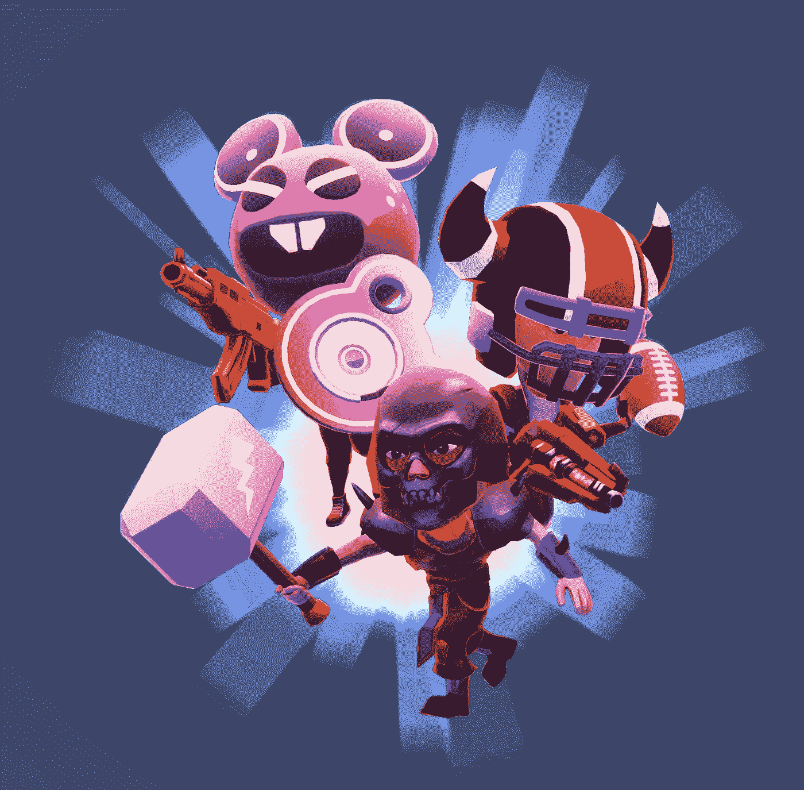

# 在不久的将来，P2E 最有可能带来惊人投资回报的五大项目

> 原文：<https://medium.com/coinmonks/top-5-p2e-projects-that-can-deliver-insane-roi-in-the-nearest-future-114458a4fbcd?source=collection_archive---------6----------------------->

现在似乎有一种 gamefi 项目的模式正在被大肆宣传。这些项目是基于技能和时间的，有好的游戏设计，有可持续的代币经济，有好的艺术，在低迷的市场中有显著的用户增长，团队正在交付，并有社区支持。

下面是我认为符合我上面列出的标准的 5 个顶级项目。

[**俱乐部:**](https://www.clubgame.app/)

俱乐部是一个元宇宙 P2E 足球游戏，奖励球员的技能，时间和精力，他们把它。在 CLUB 中，玩家将继承足球俱乐部老板(CO)的职位，并能够根据地球上最大的明星在现实世界中的表现建立他们的梦想俱乐部。在一个完全由市场和世界各地其他 COs 的行动驱动的激动人心的实时转移中实时购买和出售玩家。爬上精英俱乐部的最高级别，在那里可以找到最好的奖励！或者和朋友一起工作，分享回报。

这款游戏是 iPhone 和 Android 上的免费手机游戏，任何人都可以参与竞争，并在不花一分钱的情况下达到最高水平。为了有风格地做它并且炫耀一个 COs 梦想俱乐部，有令人想要的在游戏中的项目要收集，例如成套工具，徽章，和可以挣得，买，和卖的体育场。每件物品的稀有程度不同。目前，分类如下:普通、稀有、史诗、传奇和独特

尽管仍在进行中，但该游戏基于现实世界的球员，并已被开发为引入现实世界表现的直观评分方法，该方法对球员在游戏中的较小动作以及进球和助攻等决定性时刻进行评分。如果你在现实生活中是个好球员，你在俱乐部也会是个好球员。在俱乐部，COs 从英超球员开始。但随着他们俱乐部的升级，像哈兰德、姆巴佩和莱万多夫斯基这样的欧洲足球明星将变得可以购买。俱乐部是第一个基于欧足联排名创新性地平衡比赛得分的游戏，以确保真实性和公平性。

在许多幻想游戏中，一旦玩家在游戏周锁定了自己的队伍，他们就会成为沮丧的旁观者。这导致了很多压力和失望。然而，在现实生活中，经理可以做出改变来应对事件，俱乐部中的球员也可以！用户可以在游戏周进行替换，以提高团队在新的响应功能中的表现。通过令人兴奋的动态价格算法，使游戏中全球明星的价格实时对玩家的决定做出反应，可以锻炼他们的球探肌肉。

俱乐部在社交媒体上拥有 15 万名粉丝和 150 万名观众，与足球界领先的内容创作者建立了紧密的有机联系。该团队是匿名的，但据我们所知，这是一个专门的开发和艺术团队，由 6 名全职人员和 4 名兼职人员组成，他们都有玩游戏和赚取游戏的经验。

这款游戏有一个名为 CLUBCOIN ($CC)的内置代币。铸造包括你的俱乐部和任何游戏内物品在内的所有 NFT 都需要这个令牌。值得注意的是，要成为一个合格的俱乐部，需要积极下注(锁定)的$CC，并且需要创建 NFT 的外链货币。你下注越多，你就能赚得越快。但这是有上限的。$CC 也需要在一级销售中购买资产，或作为俱乐部市场二级销售的费用，并可能需要组建和运营名为 Crews 的合作玩家团体，以参加特殊锦标赛。

一旦玩家有了一个合格的俱乐部，他们就可以开始赚取俱乐部积分(CP)。CP 是非常重要的，因为他们需要在游戏中创造任何可赚取的 NFT。CPs 是一种只能通过游戏性获得的非连锁和不可交易的货币。CP 确保只有玩游戏的人才有权直接铸造 NFTs 允许真正的玩家根据价值首先获得最好的物品，而不是允许“鲸鱼”只是在场外购买。这也是更有效率的许多日常交易发生在链外，通过 CP。铸造游戏中的物品需要$CC 和 CP。

在今年剩下的时间里，路线图旨在加快开发速度，并为用户的快速加入留出空间。所以，如果你是一个足球迷，觉得梦幻足球很有趣，为什么不拿起这个，在做你喜欢的事情的同时获得报酬。

****:****

****

**建立在雪崩，拉格纳洛克是一个即将到来的链上发挥和赚取 MMORPG。它的目标是成为虚拟世界和现实世界之间的桥梁，融合了引人注目的故事情节、所有权和社交元宇宙，以及已经在 [http://ragnarok.xyz](https://t.co/jVkmBzlwZe) 上提供的 Alpha 版本，它受到了魔兽世界、最终幻想、Ragnarok Online(OG ver)等 OG MMORPGs 的严重影响。这使得该项目有别于该领域的大多数其他 p2e 游戏。它将是由知识驱动的，每一章都会创造新的内容。游戏以 2077 年为背景，颇有后启示录的味道。它描绘了一个整体，在这个整体中，电子人毁灭了 90%的人类，并将剩余的人类奴役到城镇中，用娱乐活动来分散他们对现实的注意力。浪人叛军居住在奴役人类的城镇之外。他们杀死怪物来升级，掠夺物品来获得新的武器，变得足够强大来对抗半机械人。**

**浪人零 NFT 是球员的性格和元宇宙的身份。只有 7700 个可用。每个 NFT 都有独特的种族、特征和武器，这影响了游戏中的统计数据。虽然游戏在 AVAX 上，但 genesis NFTs 将在以太坊上铸造，以太坊拥有最大的 NFT 社区，并受到志那都红豆的 ERC721a 合同的启发，该合同为铸造者节省了费用。游戏体验将是多人游戏，将围绕着一系列游戏角色、交易物品和参与任务的体验。浪人零 NFT 的一个独特因素是，它可以以最低的世代率繁殖新的浪人婴儿。它提供了游戏进程，寻找战利品和装备，借贷市场和赌注，也许还有潜在的空投。**

**与所有 P2E 项目一样，Ragnarok 将拥有名为 [$RAG](https://twitter.com/search?q=%24RAG&src=cashtag_click) 的游戏内令牌。它将是游戏经济中使用的货币，具有内在价值增长和赌注的潜力。**

****

**Ronin Zeroes 是进入将于 6 月举行的$RAG 代币销售的唯一途径，因为该团队不想在没有产品的情况下首先销售代币。**

**这个团队由业内知名人士组成(创始人是 [@0xfanfaron](https://twitter.com/0xfanfaron) 、社区成长是 [@skwirrl](https://twitter.com/skwirrl) 、艺术是 [@sashakimnft](https://twitter.com/sashakimnft) 、开发与成长是 [@EggNamedCregg](https://twitter.com/EggNamedCregg) 而声音/音乐是 [@yungalgorithm](https://twitter.com/yungalgorithm) )，并且能够交付预期的东西。他们是透明的，同时也是迷人的。他们花时间讨论&与社区讨论项目路线图，并在 Twitter 和媒体上详细解释思考过程和决策。当主要的不和在三月被黑的时候，这个团队的实力受到了考验，但是他们决定[补偿那些甚至在任何公开销售发生之前就被骗的人。这表明他们如何与社区站在一起，以身作则。](https://twitter.com/RagnarokMeta/status/1503026415343751173?s=20&t=EVRcgSqFmihShlaLriuumg)**

**Mint 预计在 4 月中旬初，因为团队目前只是在等待 Certik 的最终审计。此次发布预计将是一次公平的发布，因为将举行公开的荷兰拍卖，用户只需支付最终价格。任何差价都将退还。**

**该团队还拥有 Defi 著名投资者，如 [@satsdart](https://twitter.com/satsdart) 、 [@ColdBloodShill](https://twitter.com/ColdBloodShill) 、和 [@GodofCoins](https://twitter.com/godofcoins) ，并且还与  Missing Frontier 和育碧建立了长期合作伙伴关系。他们目前正在运行 2 个每周任务，直到发布。这是你得到 WL 的最后机会，去试试吧。**

**[**加密独角兽:**](https://www.cryptounicorns.fun/)**

****

**加密独角兽是一个宠物收集和农场游戏，由 Laguna games 在农场模拟游戏的风格下在区块链建造。这也是一款基于网络的 P2E 游戏。游戏于 2022 年 5 月 2 日上线。它的主要特点是建造土地和农业模拟，在那里可以种植浆果等土地资源，可以繁殖、孵化和进化独角兽。**

**浆果是独角兽成长的原因。这些独角兽然后被投入工作，收集任务和工艺游戏中的项目，以建立马厩和车间。有计划要在 PvE 和 PvP 空间中发布新的特性，比如格斗、赛车和战斗。当然，这将涉及独角兽的 RPG 元素。这些独角兽有不同的属性，每个属性都会影响游戏，因为它决定了玩家任务的成功。**

**该游戏有三个主要资产:**

*   **化身(这些是 NFT 的形式，包括独角兽、地和暗影鸡眼)。**
*   **游戏内资源(包括为更好的游戏创造助推器的收藏品)。**
*   **游戏代币(包括治理代币$RBW 和游戏内货币$UNIM，用于繁殖、进化独角兽和制造助推器)。**

**自 1 月以来，独角兽 NFT 的排名从 0.4 升至 1.08，增长了 169%。这表明了玩家的信心，预计由于游戏的推出，这一排名将持续上升至 4 月的第二周。NFT 是基于它们的稀有性(神话、稀有和普通)来区分的。**

**该游戏有一个双令牌模型。它有彩虹令牌( [RBW](https://coinmarketcap.com/currencies/rainbow-token/) )和独角兽牛奶( [UNIM](https://www.coingecko.com/en/coins/unicorn-milk) )。彩虹令牌是治理令牌，用于投票。它也可以用来增加功能。独角兽奶是游戏内货币，有更广泛的使用案例。它将主要用于游戏内活动和各种锦标赛的奖品。**

****

**秘密独角兽有多种赚钱途径。NFT 持有者和其他用户已经向美国经济注入了 1770 万美元。此外，非金融交易的累计交易额约为 4000 万美元。我预计，随着有限合伙人利用赌注机制(这些团队的目标是达到价值 1000 万美元的流动性)，交易量将会增加。加密独角兽自成立以来已有超过 335，000 笔交易，并建立在多边形网络的稳定性上，因为玩家对高额的汽油费非常敏感。自 2021 年 11 月至今，该公司的收入平均增长了 117%，因为他们收取了 2.5%的版税。尽管处于早期阶段，加密独角兽看起来很有前景，因为它具有多种汇点和燃烧机制，正在实施这些机制来管理经济。**

**开发加密独角兽的 Laguna Games 团队在游戏领域经验丰富。这位联合创始人和其他许多队友在创建加密独角兽之前，已经开发了游戏应用。他们得到了知名大合作伙伴的支持；比特克拉夫特风险投资公司和德尔福数码公司。**

****

********

****Blast Royale 是一款有趣且吸引人的 30 人 PvP 对战游戏，基于手机开发。玩家们在一场“最后一站”皇家战役生存比赛中相互竞争。此外，玩家的元库存会影响带入比赛的物品质量。玩家根据他们的表现、投入的时间和整体努力获得奖励。这是免费的发挥与门控 P2E 方面。****

********

****装备可以是游戏中免费获得的物品，也可以是 NFT 物品。一个玩家必须拥有至少 3 种不同的装备才能进行一场比赛。在比赛过程中，玩家收集弹药、健康包、盔甲和其他藏在地图上的东西。他们也可以收集其他玩家掉落的物品，包括他们的 NFT 武器。《皇家冲击波》中有数十亿件独特的装备可以装备到玩家的角色身上，这些装备都影响着角色在战斗中的表现和外观。装备重型装甲和重型武器造成巨大伤害并得到保护，或者通过装备速射武器和轻型装甲快速移动来玩打了就跑的风格。玩家不能将比赛中收集的物品带回元游戏。****

********

****通过穿戴装备和比赛，玩家可以获得装备的经验。玩家可以升级有足够经验的装备。等级越高，装备的游戏性统计就越好。即使你在市场上出售装备，装备的等级也是和装备在一起的。升级装备可以提高等级，从而提高游戏性能。这个过程既需要代币，也需要在游戏中获得一定的经验值。****

****该游戏有一个双令牌模型。拥有 ERC-20 令牌“Blastoken ($BLT)”，用于在元宇宙皇家大爆炸中执行许多操作，例如设备购买/销售、创建新项目、维修它们等。它将伴随着一个二级令牌 [—工艺香料($CS)](https://first-light-games.gitbook.io/blast-royale/tokenomics/craft-spice-usdcs) 。此外，BLT 持有人最终将能够在财政部持有这些债券，并参与投票。正如该团队在他们的白皮书中所说，5.12 亿美元的供应将用于资助游戏的早期开发和扩展，并奖励团队的第一批用户。此外，一系列的出售将被用来为在交易所上市的 BLT 提供流动性资金。****

****开发者是一个 12 人的团队，拥有多年的手机和网络游戏设计经验。他们投资组合中的重要公司有 Monument Valley、MV2、Lands End VR、Whale Trail、First Light、NaturalMotion、Wargaming、GREE 和 Capcom 等。****

********

****他们得到了亚历克斯·普伊格(首席技术官和 Caelum Labs 的联合创始人)、大卫·布里连伯格(Dune Ventures 的合伙人)和迈克尔·卡姆(增长和令牌经济学顾问)的建议。****

****[**密码攻略:**](https://cryptoraiders.xyz/)****

********

****Crypto Raiders 是一个基于实用程序的 RPG，像素地牢爬虫游戏和生态系统，具有游戏化的 Defi 元素，利用令牌和 NFT。游戏的灵感来自 Zed Run，游戏的最终目标类似于魔兽世界/ RS / Diablo。加密突袭机是建立在多边形网络上。****

****加密突袭机允许玩家将角色送上战场去掠夺地下城，击败老板并获得代币。但是要小心，如果你不能在与你的敌人的会议中幸存下来，你将没有机会带着你的战利品凯旋而归。因为游戏中的死亡是永久的。一开始听起来可能很恐怖，但是初级地下城的死亡几率是 0%,最初几个中级地下城的死亡几率只有 1% — 5%。同样，玩家在进入地牢前会知道死亡几率的百分比。增加你生存机会的最好方法是升级你角色的装备。装备越好，存活率越高。此外，该团队有一个独特的解决方案，以防止永久死亡机制破坏游戏的发展。地下城是基于随机种子建造的，每周发布一次。有玩家可以连续突袭的常青地下城，也有玩家只能在有限时间内突袭的限时地下城。****

****重要的是要注意，在加密突袭机中可拥有的资产是作为交易它们的代币而存在的。玩家可以购买攻略来运行地下城，拥有与攻略战斗的 MOBS，或者加入公会来寻找完美的玩家平衡。玩家可以突袭地下城以增加角色力量(经验/装备)，通过经验和装备增加角色力量，开始任务以赚取制作材料，在地下城中拥有暴徒以窃取玩家的货币/物品，参与 Defi 元素以赚取货币以支持他们在游戏中-钥匙，在世代活动日使用 Aurum 制造新的袭击者。****

********

****最初发售时有 7500 个角色可用，基本角色有约翰、迈克、塔米、老人、精灵、兽人、黑暗、电子人和骷髅。值得注意的是没有属性差异，玩家可以完全根据他们认为最好的来选择。所有属性都来自地下城掉落的装备和药剂。****

****加密突袭机运行在$突袭机和$金顶经济上。$RAIDER 是一个固定的供应令牌，玩家可以下注以赚取$AURUM，或者持有它以保持对整个游戏经济和生态系统的投资。$AURUM 是用于市场、招募/培育角色、运行地下城和其他未来活动的实用令牌。奖励的金币数量将基于任务或地下城的难度，不想参与掠夺地下城的持有者需要通过下注或从其他玩家那里购买来获得金币。最初的供应量是 10 亿。但是，团队保留根据需要铸造和焚烧代币的权利。因此，任何发生在 Crypto Raiders 中的交易都将使用$AURUM。您可以在 [Crypto Raiders Bank](https://bank.cryptoraiders.xyz/) 找到代币地址、购买这些代币的按钮以及更多信息。****

****三月份已经有奖金池为 15 万美元的锦标赛。攻略未来吸引电竞选手/战队的概率很大。该团队专注于此，聘请了两名团队成员专注于电子竞技。****

****虽然加密突袭机是相当新的，它的发展速度很快。如果我们看一下一些统计数据，我们可以看到每天都有大量的活动发生。在低迷的市场中，它显示了大量的用户增长，该团队一直致力于开发新功能。这款游戏的创始人在魔兽世界(WoW)和江湖上有着丰富的游戏经验。****

********

****由于团队在高水平/专业水平上玩游戏，他们很容易理解游戏机制，并可以创建一个坚实的游戏。已经有迹象表明，未来几个月将出现一个令人兴奋的路线图，比如打开 p&e 水龙头，在游戏中引入一些功能(更复杂的 PVE 和 PVP 游戏)，以及启动 unity build。在 unity 上启动意味着加密突袭机 UX/UI 将看起来和感觉都像一个真实的游戏，并将吸引更多的玩家，决斗将是主动的 PvP 而不是被动的战斗，更多的 PvP 锦标赛拥有巨大的奖金池。****

********

****加密突袭机得到了重量级风投的支持；迪法恩斯资本。在 Twitter 上，迪法恩斯资本公司(Defiance capital)的创始人从一开始就公开关注加密突袭机的进展，而且团队在加密突袭机领域的知识、加密原生体验和运输能力给他留下了深刻印象。这个游戏有一个独特的社区，有忠诚的 OG 支持者，因为团队通过透明和兑现承诺来建立信任。****

******结论:**和其他任何领域一样，如果研究得足够早，就有很大的价格发现潜力。元宇宙 P2E 提供了一个巨大的机会，并已催生了许多基础设施公司，但虽然这些是令人兴奋的观察，仍有更多的空间，这些项目/游戏的演变。记住这不是财务建议。始终努力开展进一步的个人研究，以获得进一步明确的事情，如这些。****

> ****加入 Coinmonks [电报频道](https://t.me/coincodecap)和 [Youtube 频道](https://www.youtube.com/c/coinmonks/videos)了解加密交易和投资****

# ****此外，请阅读****

*   ****[币安 vs FTX](https://coincodecap.com/binance-vs-ftx) | [Best (SOL)索拉纳钱包](https://coincodecap.com/solana-wallets)****
*   ****[如何在 Uniswap 上交换加密货币？](https://coincodecap.com/swap-crypto-on-uniswap) | [A-Ads 点评](https://coincodecap.com/a-ads-review)****
*   ****[加密货币储蓄账户](/coinmonks/cryptocurrency-savings-accounts-be3bc0feffbf) | [YoBit 审核](/coinmonks/yobit-review-175464162c62)****
*   ****[机器人大战纳波机器人大战穆德雷克斯](/coinmonks/botsfolio-vs-napbots-vs-mudrex-c81344970c02) | [Gate.io 交易回顾](/coinmonks/gate-io-exchange-review-61bf87b7078f)****
*   ****[CoinFLEX 评论](https://coincodecap.com/coinflex-review) | [AEX 交易所评论](https://coincodecap.com/aex-exchange-review) | [UPbit 评论](https://coincodecap.com/upbit-review)****