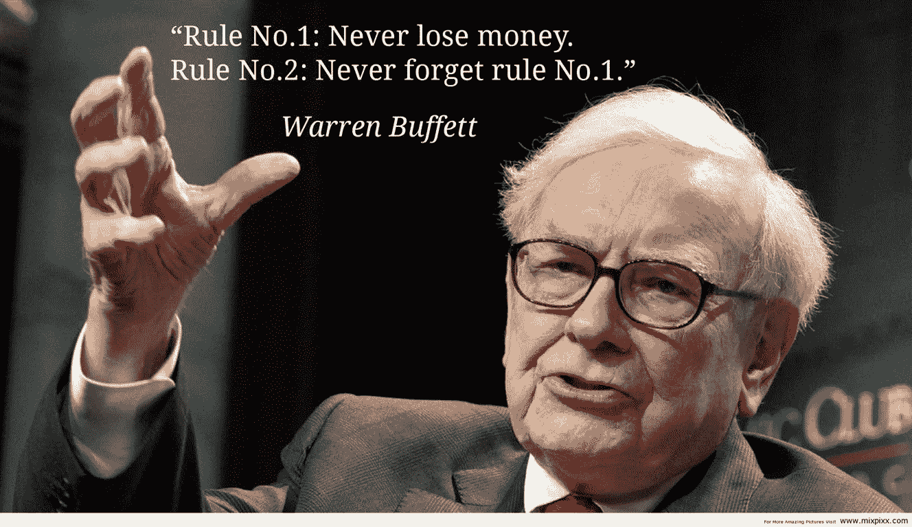

# 沃伦·巴菲特投资组合中的前五名

> 原文：<https://medium.com/coinmonks/top-5-positions-in-warren-buffetts-portfolio-3deb78b7bb23?source=collection_archive---------1----------------------->

Source photo [warren buffet quotes — Bing images](https://www.bing.com/images/search?view=detailV2&ccid=hmK4VxGl&id=EE8778F8CEE5F1E8CF8A6E7F91A83AE472A58874&thid=OIP.hmK4VxGlYY7nRnhXExe4JQHaES&mediaurl=https%3a%2f%2fth.bing.com%2fth%2fid%2fR.8662b85711a5618ee74678571317b825%3frik%3ddIilcuQ6qJF%252fbg%26riu%3dhttp%253a%252f%252fwww.worldclassseminars.com%252fwp-content%252fuploads%252f2015%252f12%252fWarren-Buffett-Quotes.jpg%26ehk%3dJfhVos%252f6SF7c1Mva%252bkchhja%252fJDrjKv0dKGZSAnTG6jg%253d%26risl%3d%26pid%3dImgRaw%26r%3d0&exph=768&expw=1328&q=warren+buffet+quotes&simid=608017711242353409&FORM=IRPRST&ck=35CE4998BE8A2191AD37B1DB99E6F611&selectedIndex=7&ajaxhist=0&ajaxserp=0)

毫无疑问，沃伦·巴菲特是当代历史上最受关注、最引人注目的投资者。毕竟，没有人比标普 500 指数有更好的表现。毫不奇怪，投资者争相效仿巴菲特的成功，检查他的投资组合，希望从中汲取哪怕是一点点巴菲特的金融智慧。