# 产生被动收入的五大索拉纳 NFT 项目

> 原文：<https://medium.com/coinmonks/top-5-solana-nft-projects-that-generate-passive-income-9d40c2451752?source=collection_archive---------0----------------------->

## 如何通过 NFT 投资，并以有趣的方式获得被动收入。

Photo by [Sharon McCutcheon](https://unsplash.com/@sharonmccutcheon?utm_source=unsplash&utm_medium=referral&utm_content=creditCopyText) on [Unsplash](https://unsplash.com/s/photos/fun-wealth?utm_source=unsplash&utm_medium=referral&utm_content=creditCopyText)

NFTs 炒作现在真的踢。老实说，作为一个密码爱好者，我很晚才意识到并加入这个炒作的行列。2022 年 1 月，我开始在一些非功能性交易中进行 ape，尤其是那些有效用或为持有者创造价值的交易。

在更进一步之前，这些都不是理财建议，只分享我的想法和经验。

## **为什么是索拉纳？**

Solana 是世界上最快的区块链，也是加密领域发展最快的生态系统，有数千个项目涵盖了 DeFi、NFTs、Web3 等等。

随着时间的推移，Solana 的 NFTs 数量正在显著增长，因为它的实用性和低廉的天然气费用是人们开始投资 Solana 的主要原因。索拉纳的 NFT 销售额已经超过了 10 亿美元。

> 交易新手？试试[密码交易机器人](/coinmonks/crypto-trading-bot-c2ffce8acb2a)或者[复制交易](/coinmonks/top-10-crypto-copy-trading-platforms-for-beginners-d0c37c7d698c)

## **我使用什么市场和钱包？**

找到好的 NFT 项目有点棘手。一些相关的风险是地毯拉扯的可能性，一个不复杂的开发团队，好得难以置信的路线图。降低这些风险的一个方法是使用官方的发射台来制造，在大多数情况下，我使用 Magic Eden 发射台来制造。魔幻伊甸园是索拉纳生态系统中领先的 NFT 市场。

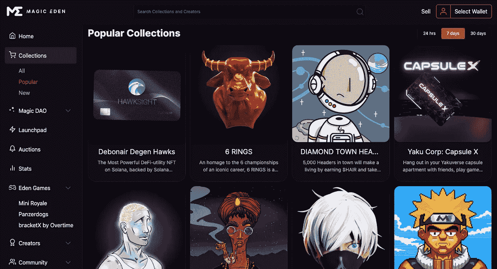

[https://www.magiceden.io/](https://www.magiceden.io/)

至于钱包，我用的是 Phantom Wallet，这是一个非保管式加密钱包**帮助你通过 Chrome 扩展在索拉纳区块链上访问 web3。**

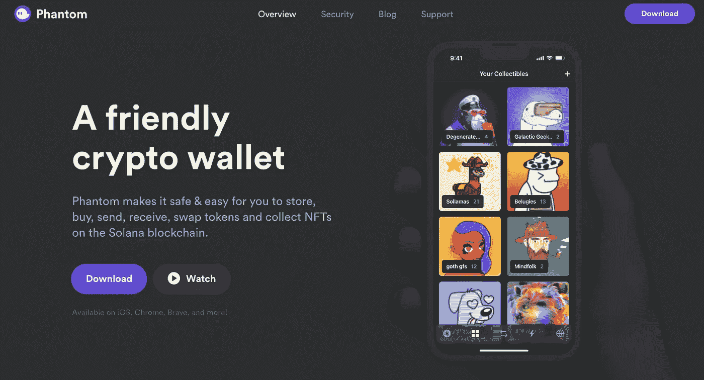

[https://phantom.app/](https://phantom.app/)

那么，我参与了哪些项目？这里有 5 个关于索拉纳的项目可以产生被动收入；

# **异次元狐联盟**

超时空狐狸联盟(TFF)是著名的狐狸联盟(FFF)系列的衍生。

著名的 Fox Federation 是 Solana 区块链上存在的 7，777 个(来自超过一百万个组合)随机生成和按风格生成的 NFT 的集合。

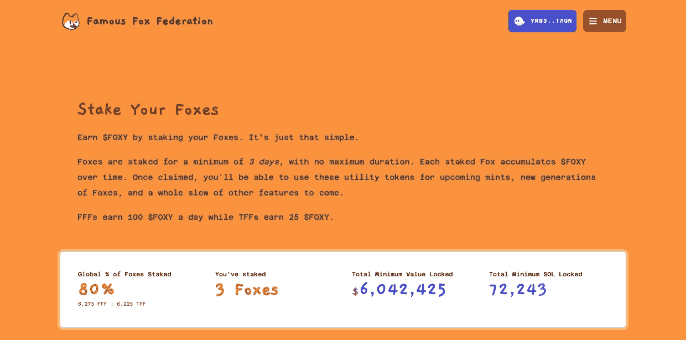

[https://famousfoxes.com/](https://famousfoxes.com/)

## **怎么赚？**

狐狸最少被关押 3 天，没有最长期限。随着时间的推移，每只被押上赌注的狐狸会积累 100 美元的狐狸代币.一旦认领，你就可以用这些代币购买即将到来的造币厂、新一代狐狸以及一系列其他功能。

自由职业者每天挣 100 美元，而自由职业者每天挣 25 美元。

我在魔法伊甸园铸造了 3 只 TFF 狐狸，每只大约 1 索尔，每天 25 美元，它将获得大约 50-60%的 APR(APR 是通过本地代币与投资代币的收益交换来衡量的)。

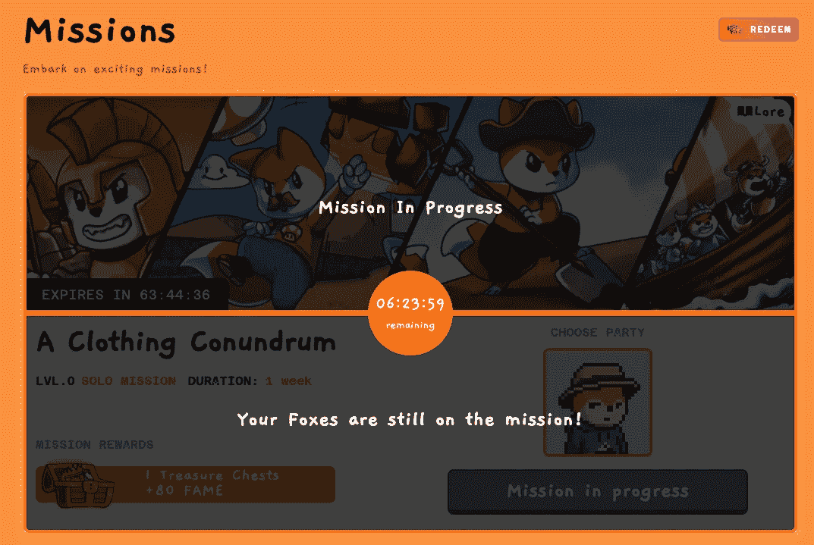

[https://famousfoxes.com/missions](https://famousfoxes.com/missions)

你也可以通过根据狐狸的属性派遣一些狐狸去完成任务来获得宝箱和经验。

# **酒店痴呆**

Hotel de Mentía 是一个 Web 3.0 NFT 游戏项目，包含社交和游戏元素。用户拥有可以在游戏中使用的 NFT 头像，挑战他们的想法、错误和后果。

[https://hoteldementia.io/](https://hoteldementia.io/)

Hotel de Mentía 系列中的每一款 NFT 都代表着酒店客人的新生活。这些具有收藏价值的艺术品是由 assembly 7 组件创建的，它将告诉你客人的背景故事。

现在，有 3 个老年痴呆症酒店的收藏:新奇，邀请和盛大舞会(即将举行)

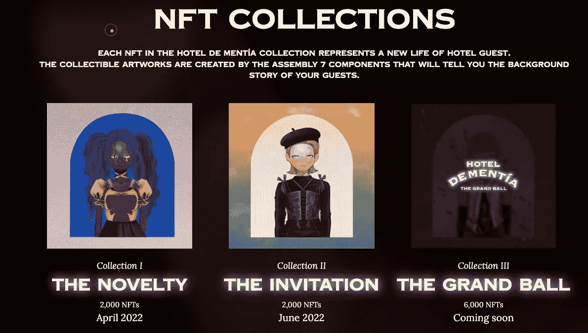

**怎么赚？**

通过拥有一个 NFT 并把它放入钻石金库(【https://diamondvaults.io/vault/hoteldementia】)你有权以每天 0.004 索尔(或一年 1.46 索尔)的价格赚取$索拉纳。以目前的底价 1 索尔，那么它将是 146%的年利率。

# **大片明星**

Blockstars 是一款在索拉纳区块链上的深度社交、深度沉浸和深度参与的音乐管理模拟游戏。这些角色是带有独特乐器的 3D 形状的积木。

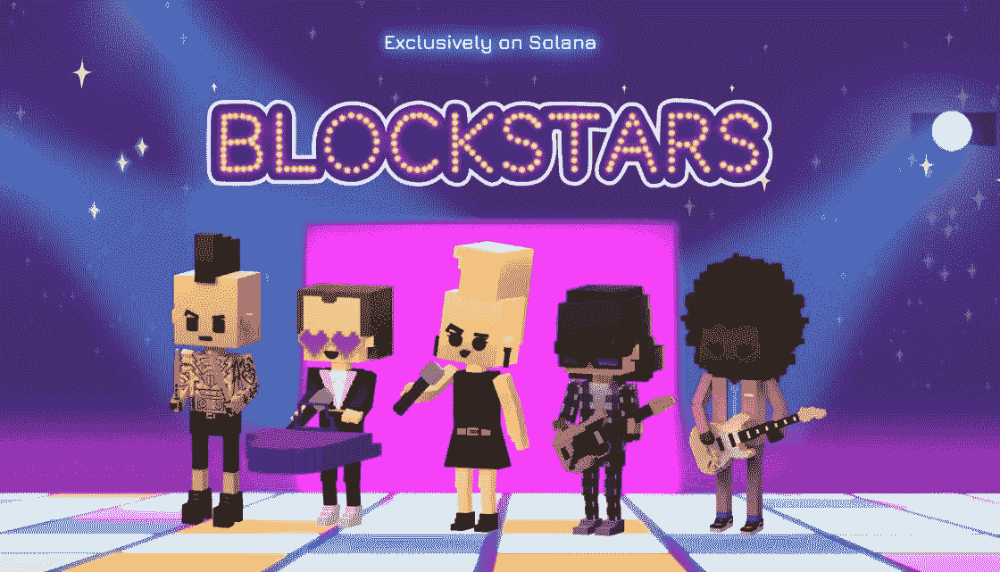

[https://blockstars.gg/](https://blockstars.gg/)

**怎么赚？**

我非常喜欢这个项目的一点是，你不需要把它放在网上。NFT 只需要放在钱包里。这意味着大约每 30 分钟，你会收到 30 美元的 ROL 代币，每块星在钱包里，他们驻留在空投的时刻。

我在 Magic Eden Launchpad 上的公共造币厂以每个 1 索尔的价格铸造了这个，并且还在二级市场上添加了更多。在写这篇文章的时候，还没有估计出$ROL 的价值，但是$ROL 将在游戏中作为代币使用。

# **阿骨打没有猫**

我在索拉纳最喜欢的项目之一。阿库马·诺·猫是阿库马弗斯的创世纪系列，大小为 1，555。

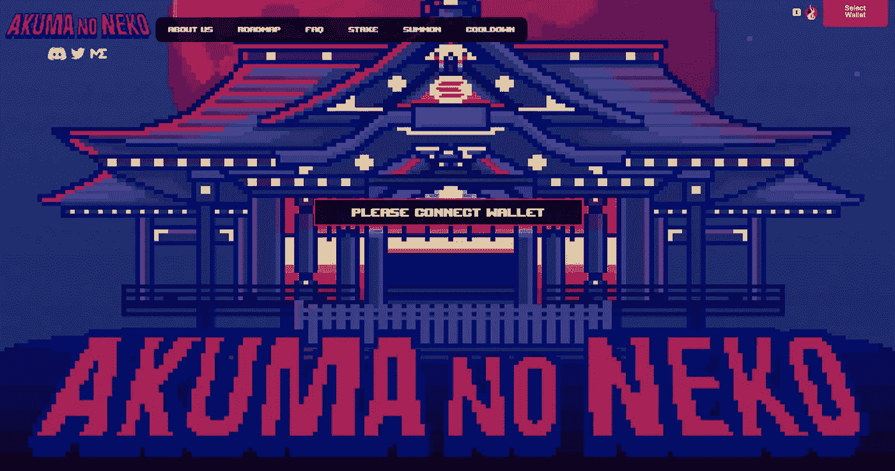

[https://www.akumaverse.io/#about-us](https://www.akumaverse.io/#about-us)

**怎么赚？**

通过下注阿骨打，您将每天收获$HONO 代币。每个阿库玛在 24 小时内会产生大约 5 美元的 HONO。最初，通过收集 300 $HONO，你将有资格产生一个 Gen 2 Akuma。$HONO 的数字每个月都会膨胀+50%。目前，它需要 450 美元 HONO 来产生第二代。

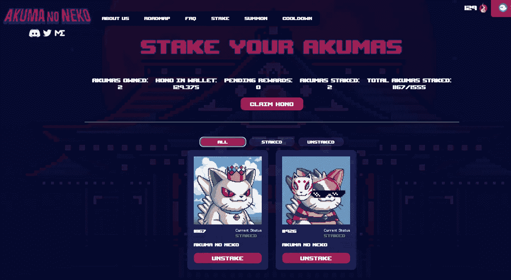

[https://www.akumaverse.io/staking](https://www.akumaverse.io/staking)

我在魔法伊甸园市场买了这个，1.5 索尔和 1.8 索尔两个。以每天 5 美元的 HONO，它将赚取大约 30-33%的年利率

# **家族 Sol**

Sol 家族是一个 6666 个真正独特的角色，由名人、政治家、演员、历史人物和龙组成。家庭索尔角色的灵感来自于流行的卡通《一家人》。

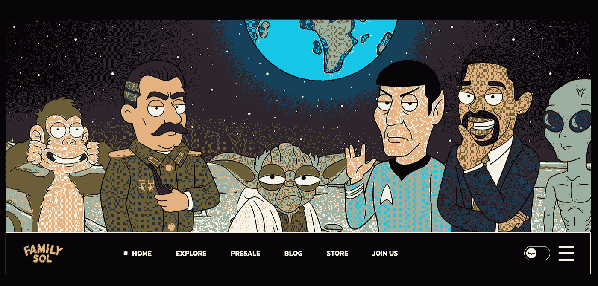

[https://familysolnft.com/](https://familysolnft.com/)

**怎么赚？**

我在一次公开拍卖中铸造了这个家庭溶胶，每个大约 1 溶胶。通过抵押家庭贷款，你将每天获得 0.3 美元的家庭贷款，年利率约为 30-35%。

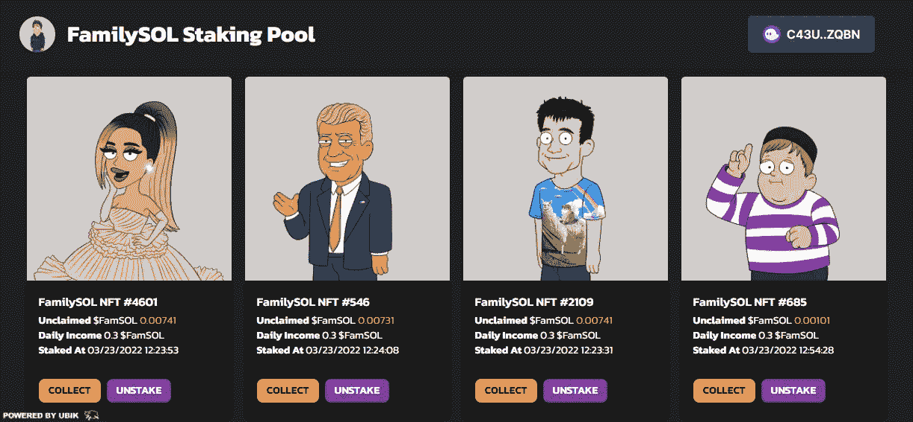

[https://stake.familysolnft.com/](https://stake.familysolnft.com/)

# 赚到代币后，做什么？

赢得代币后，您有两种选择。首先，你可以根据流动性池的可用性，将 Raydium 等 Solana 分散式交易所的代币交换为 USDC 或 SOL，例如将宇宙公寓的$SPACEGOLD 交换为 SOL。

*注意每次交换的滑动公差。较高的滑点(2%以上)意味着流动性不够大，价格波动很大，估计价格和执行价格可能相差很大。*

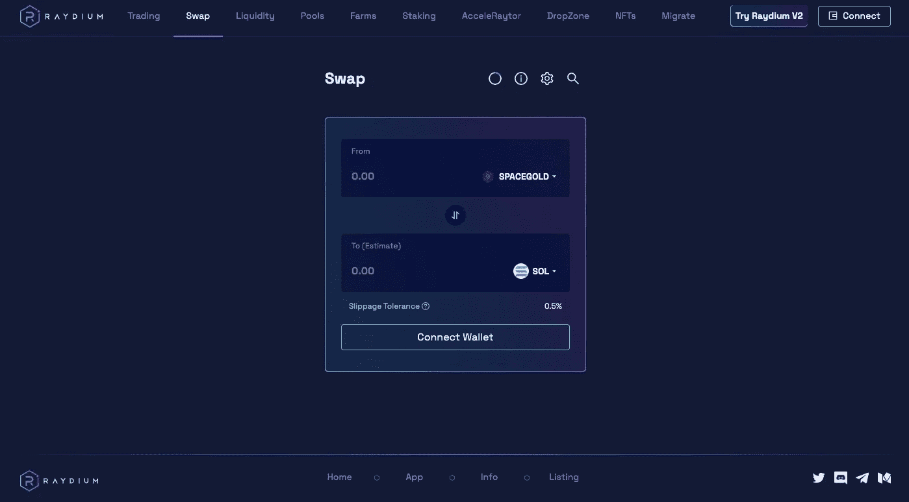

[https://raydium.io/swap/](https://raydium.io/swap/)

第二，你可以简单地保留代币，用于项目的进一步开发，如繁殖(召唤)第二代，游戏中的实用工具，或赌注代币。投资愉快！

> 加入 Coinmonks [电报频道](https://t.me/coincodecap)和 [Youtube 频道](https://www.youtube.com/c/coinmonks/videos)获取每日[加密新闻](http://coincodecap.com/)

## 另外，阅读

*   [复制交易](/coinmonks/top-10-crypto-copy-trading-platforms-for-beginners-d0c37c7d698c) | [加密税务软件](/coinmonks/crypto-tax-software-ed4b4810e338)
*   [网格交易](https://coincodecap.com/grid-trading) | [加密硬件钱包](/coinmonks/the-best-cryptocurrency-hardware-wallets-of-2020-e28b1c124069)
*   [最佳加密交易所](/coinmonks/crypto-exchange-dd2f9d6f3769) | [印度最佳加密交易所](/coinmonks/bitcoin-exchange-in-india-7f1fe79715c9)
*   开发人员的最佳加密 API
*   [密码电报信号](/coinmonks/top-3-telegram-channels-for-crypto-traders-in-2021-8385f4411ff4) | [密码交易机器人](/coinmonks/crypto-trading-bot-c2ffce8acb2a)
*   [NFT 十大市场造币集锦](https://coincodecap.com/nft-marketplaces)
*   [AscendEx Staking](https://coincodecap.com/ascendex-staking)|[Bot Ocean Review](https://coincodecap.com/bot-ocean-review)|[最佳比特币钱包](https://coincodecap.com/bitcoin-wallets-india)
*   [Bitget 回顾](https://coincodecap.com/bitget-review) | [双子 vs 区块链](https://coincodecap.com/gemini-vs-blockfi) | [OKEx 期货交易](https://coincodecap.com/okex-futures-trading)
*   [美国最佳加密交易机器人](https://coincodecap.com/crypto-trading-bots-in-the-us) | [经常性回顾](https://coincodecap.com/changelly-review)
*   [在印度利用加密套利赚取被动收入](https://coincodecap.com/crypto-arbitrage-in-india)
*   最佳[密码借贷平台](/coinmonks/top-5-crypto-lending-platforms-in-2020-that-you-need-to-know-a1b675cec3fa)
*   [免费加密信号](/coinmonks/free-crypto-signals-48b25e61a8da) | [加密交易机器人](/coinmonks/crypto-trading-bot-c2ffce8acb2a)
*   杠杆代币的终极指南