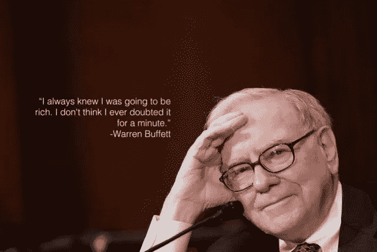

# 沃伦·巴菲特认为应该买入并持有的五大股票

> 原文：<https://medium.com/coinmonks/top-5-stocks-to-buy-and-hold-according-to-warren-buffett-d792bc41b794?source=collection_archive---------16----------------------->

Source photo [warren buffett citate — Bing images](https://www.bing.com/images/search?view=detailV2&ccid=FA%2f0nRAw&id=F078D9A6926829D952CCD32C1E45E8D26526532B&thid=OIP.FA_0nRAw3nw4e0QHthT45wEyDM&mediaurl=https%3a%2f%2fi.pinimg.com%2f736x%2f52%2f5a%2ff3%2f525af374e6b5bfd9876cc68578f74249--warren-buffet-quotes-finance-quotes.jpg&cdnurl=https%3a%2f%2fth.bing.com%2fth%2fid%2fR.140ff49d1030de7c387b4407b614f8e7%3frik%3dK1MmZdLoRR4s0w%26pid%3dImgRaw%26r%3d0&exph=427&expw=640&q=warren+buffett+citate&simid=608042969946927656&FORM=IRPRST&ck=C53DDFFB0EC74E0D4A58810DACD7DB9D&selectedIndex=8&ajaxhist=0&ajaxserp=0)

在本帖中，我们将介绍沃伦·巴菲特最想购买并保留几十年的 5 只股票。如果你想跳过我们对巴菲特投资理论的详尽解释，请点击沃伦·巴菲特的五只股票，买入并持有几十年。

传奇投资者沃伦·巴菲特被广泛认为是世界上最熟练的金融家和对冲基金经理，也是…