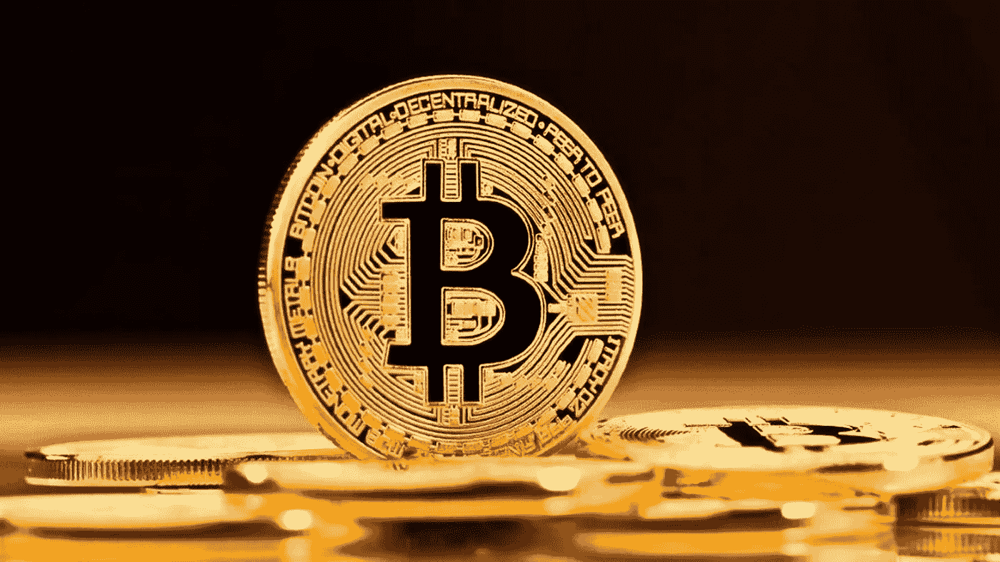
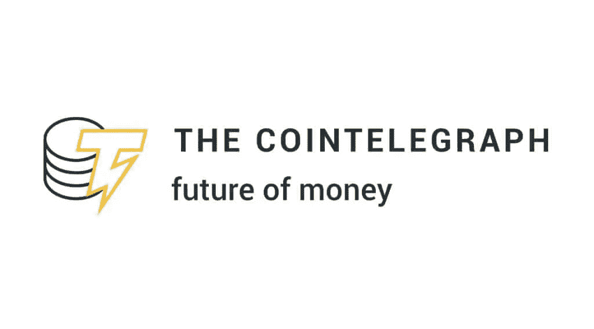
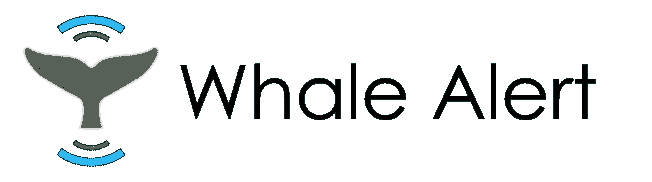

# 加密新闻的五大电报频道

> 原文：<https://medium.com/coinmonks/top-5-telegram-channels-of-crypto-news-c10650cb5900?source=collection_archive---------24----------------------->

**介绍加密货币的电报组和通道**

这些频道专注于经济新闻和加密货币，此外，还提供适合所有加密爱好者的教育和分析内容，无论他们的专业水平如何。

在这些频道上，会员还可以讨论各种话题，如交易、采矿、ico 和其他常见话题。

所以我们来介绍一下他们:

1.  **密码交易新闻电报** **频道/约 165 万用户**

这个网站使用这个频道发布最新的新闻标题。通过加入这个频道，您将有机会了解整个行业正在发生的新闻和事件。除了新闻，该频道还发布各种硬币的分析和关于未来 ico 的详细信息以及行业内的其他相关事件。

**2。CoinTelegraph 电报频道/约 164000 用户**

CoinTelegraph 是受欢迎的加密货币通讯社的另一个网站，由于发布最新消息，它在加密货币世界中占有特殊的地位。

该平台为其用户提供最新的加密货币行业新闻，如比特币新闻，Altcoins 新闻，区块链新闻，立法新闻，骗局以及区块链行业的所有新闻和事件。

CoinTelegraph 的网站有自己的电报频道，为观众提供最新消息。除了新闻，这个频道还包含全面的市场分析，以及一系列重要的指南和说明。

**3。币安公告电报频道/约 536，000 用户**

在币安公告频道，你可以看到最近在币安交易所上市的所有硬币和代币。当不同货币的不同交易被激活时，这个渠道也会向你发送通知。

这个渠道对在币安交易的人很有用；当然，其他交流办公室的积极分子也可以使用这个渠道的信息。

**4。CoinMarketCap 公告电报频道/约 950.300 用户**

该频道发布著名的 CoinMarketCap 网站的新闻和新的更新，在该频道中，您还可以看到最近在该参考网站上列出的硬币和代币。也不要担心新的赚取凯文市场杯活动！因为在这个频道里，所有这些新闻和事件都是快速发布的。CoinMarketCap Earn 是一个新的机会，你可以通过研究各种项目和参加测验来获得。在下面的链接中，您将了解更多关于 earn 的信息。

**5。鲸鱼警报电报频道/约 343000 用户**

鲸鱼警报频道是区块链专业人士的追踪者或追随者，报道通常由鲸鱼(货币兑换商或个人)发送的大额交易。此内容用于向交易所发送交易，也用于从交易所发送交易。您可以在交易中使用这些信息。当然，交易要看很多东西，要考虑很多东西，但是鲸警频道信息也能帮到你。