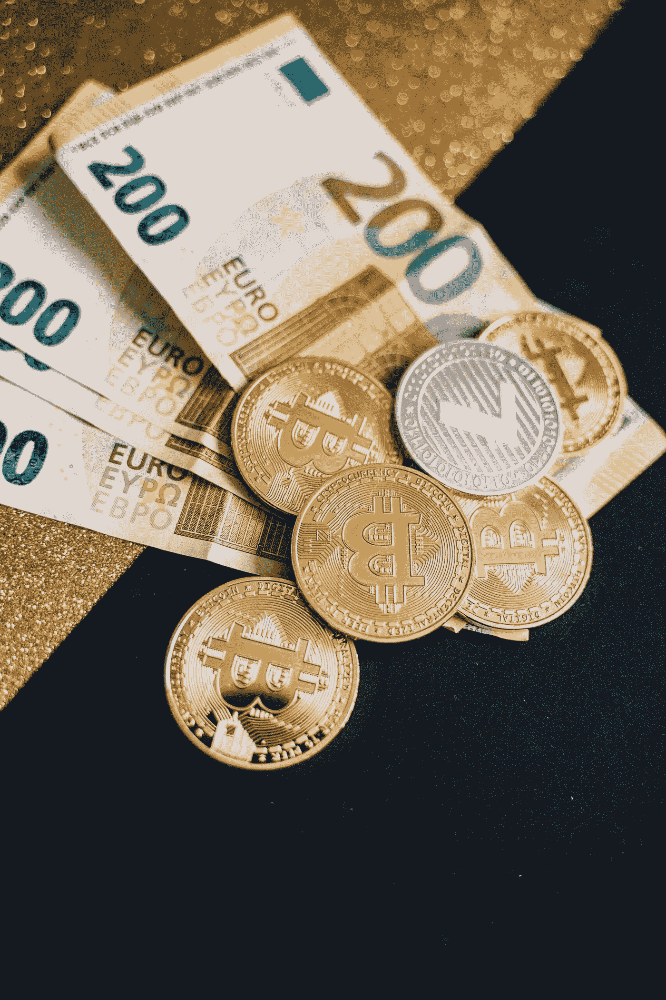

# 六大最佳比特币投资者:在哪里投资加密

> 原文：<https://medium.com/coinmonks/top-6-best-bitcoin-investors-where-to-invest-in-crypto-a9b33d446e1a?source=collection_archive---------33----------------------->

# 六大最佳比特币投资者:在哪里投资加密

**6 大最佳比特币投资者:**比特币是区块链最大的数字资产，截至 2021 年 12 月，其市值为 8967 亿美元。它在加密货币爱好者和投机投资者中广受欢迎。

各种富有的企业主和企业家已经在这种数字资产上投入了大量资金。以下是比特币的主要投资者，根据金融报道和媒体报道整理而成。

# 六大最佳比特币投资者

*   巴里·希尔伯特是数字货币集团的创始人，该集团拥有灰度比特币信托、比特币基地和 Coindesk。
*   Micheal Saylor 是 Microstrategy 的首席执行官，该公司正在大力投资比特币。
*   卡梅隆和泰勒·文克莱沃斯被认为是第一批比特币亿万富翁，据报道他们持有约 10 万枚比特币。
*   埃隆·马斯克的公司特斯拉在 2021 年购买了 15 亿美元的比特币。
*   迈克尔·诺沃格拉茨(Michael Novogratz)创立了经纪交易商、加密货币和数字资产管理公司银河数字控股公司(Galaxy Digital Holdings)。
*   Bitcoininvestmentrex，领先的加密货币投资公司，让您轻松安全地投资加密。

# 1.巴里·西尔伯特

巴里·希尔伯特是数字货币集团的创始人和首席执行官。该公司旨在通过建立和支持比特币和区块链公司来加速全球金融体系的发展。数字货币集团已经投资了超过 165 家区块链和加密货币相关的公司。

其他投资组合公司包括流动性提供商 Genesis，该公司为场外市场的加密货币买家和卖家提供加密货币资金池。数字货币集团还拥有 gray Investments，该公司管理着比特币投资信托基金( [GBTC](https://www.investopedia.com/markets/quote?tvwidgetsymbol=gbtc) )，这是一个投资工具，持有 654，600 枚比特币，并让投资者了解其价格走势

# 2.迈克尔·塞勒

商业情报公司 Microstrategy 的联合创始人兼首席执行官 Micheal Saylor 认为，加密货币是下一个最大的投资。Microstrategy 在 2021 年 12 月增持了比特币，以约 8400 万美元的价格购买了 1434 个比特币。该公司总共持有 122，478 个比特币。

> 某人的比特币总价值随着市场价格而变化，因此投资者的加密货币投资组合可能不总是具有相同的美元价值。
> 
> *加密提示*

# 3.泰勒和卡梅隆·文克莱沃斯

卡梅隆和泰勒·文克莱沃斯是几个加密货币和区块链相关业务的投资者，最著名的是私有的双子座交易所。

他们被认为是第一批通过投资比特币成为亿万富翁的人，据报道，截至 2021 年 12 月，他们持有约 10 万枚比特币，价值约 48 亿美元

文克莱沃斯双胞胎在 2015 年推出了双子座交易所。该公司允许投资者购买、出售和存储他们的数字资产。双子星于 2017 年 12 月在[芝加哥期权交易所(CBOE)](https://www.investopedia.com/terms/c/cboe.asp) 推出比特币期货。

除了比特币，兄弟俩还在[以太坊](https://www.investopedia.com/terms/e/ethereum.asp)投入巨资，尽管他们还没有透露他们的[确切持有量](https://www.investopedia.com/news/how-winklevoss-twins-store-their-crypto-fortune/)。

# 4.埃隆·马斯克

埃隆·马斯克(Elon Musk)是特斯拉(以及其他公司)的首席执行官和联合创始人。特斯拉设计和制造电动汽车和清洁能源产品。作为一家站在技术前沿的创新公司，它应该会拥有加密货币——特斯拉在 2021 年购买了价值 15 亿美元的比特币，开始接受它作为一种支付形式。7

# 5.迈克尔·诺沃格拉茨

堡垒投资集团(Fortress Investment Group)前对冲基金经理、高盛(Goldman Sachs)合伙人迈克尔诺沃格拉茨(Michael Novogratz)经常评论比特币价格走势。他是银河数码控股公司(Galaxy Digital Holdings)的创始人、首席执行官兼董事长，该公司是一家经纪交易商，提供全方位的区块链相关资产服务。

> *银河数码控股公司对几乎所有有价值的数字资产都有兴趣。其最新的季度报告提到了使用 PoS 共识机制的受限加密货币，这意味着 GHD 正在投资以太坊等加密货币，这些货币正在迁移到 PoS。*
> 
> *加密提示*

银河数码专注于数字资产；在 2021 年第三季度，它收购了价值 6200 万美元的不可替换令牌(NFT)相关公司。9 非可替换令牌是使用区块链技术进行安全和所有权识别的数字资产。2021 年，在 NFT 科技公司保护的数字艺术开始以数百万美元的价格出售后，它们开始流行起来。

Galaxy 在第三季度财务报告中报告了 19 亿美元的“无限制”加密货币，其中 6.085 亿美元由管理基金持有，1.596 亿美元由普通合伙人权益持有。截至 2021 年第三季度报告，该公司可能持有约 7.681 亿美元的比特币。

# 6.马克·库班

对于“鲨鱼池”投资者和达拉斯小牛队老板来说，进入比特币是一个游戏规则的改变者。

现在，*库班*认为自己是*的秘密*“布道者”，他说。他非常看好这个领域，拥有包括 Dogecoin 在内的各种加密货币的*加密货币*投资组合

亿万富翁投资者马克·库班说小牛队的球迷每个月在 Dogecoin 花费数千美元。

# 新手如何购买或投资比特币？

你可以在几个交易所购买比特币，如比特币基地、北海巨妖、币安、双子座或 Bitcoininvestmentrex，并加入前 6 名最佳比特币投资者的行列。

# 比特币有哪些危险？

投资比特币时，资本损失是最大的风险，因为它的价格波动很大。你可以在一天内获得或失去数千美元。

# 怎么把比特币兑换成现金？

你可以通过在加密货币交易所出售比特币，并将资金转移到你的银行账户，从而将比特币转换为现金。

# 如何投资比特币并赚钱

如果你想直接投资比特币和加密货币，那么你可以使用加密货币交易所。以下是如何通过加密货币投资公司“Bitcoininvestmentrex.com”投资加密货币:

*   选择你想使用的[加密货币投资公司](https://bitcoininvestmentrex.com/)。你最好的选择是一家声誉好、知名度高的 Bitcoininvestmentex.com，它有专门的客户支持来帮助你入职。
*   在[加密货币平台](http://bitcoininvestmentrex.com/)建立账户。您需要提供接收比特币的地址，并验证您的交易 id，以完成注册过程。
*   用法定货币为你的比特币钱包账户注资。在投资任何加密投资计划之前，您需要向您的比特币钱包账户注入另一种货币，如美元。
*   决定您想在 Bitcoininvestmentrex.com 投资哪个[加密货币投资计划](http://bitcoininvestmentrex.com/bitcoin-investment-plan)。你可以选择投资一种或多种加密货币。[研究你的选择](http://bitcoininvestmentrex.com/best-bitcoin-investment-plan/)来帮你做决定。
*   为您选择的加密货币计划下投资订单。按照 Bitcoininvestmentrex 要求的步骤提交并完成您的投资表单。
*   将您的加密货币存储在数字钱包中。您的投资计划完成后，您的利润会自动转移到您的接收比特币地址。

# [立即开始在 Bitcoininvestmentrex 投资加密，加入前 6 名比特币投资者的行列](https://bitcoininvestmentrex.com/best-bitcoin-investment-plan/)

**所提供的信息并不旨在用作任何投资决策的唯一依据，也不应被理解为旨在满足任何特定投资者投资需求的建议。所提供的任何内容均不构成财务、税务、法律或会计建议，也不构成量身定制的投资建议。此信息仅用于教育目的。**

> 加入 Coinmonks [电报频道](https://t.me/coincodecap)和 [Youtube 频道](https://www.youtube.com/c/coinmonks/videos)了解加密交易和投资

# 另外，阅读

*   [无聊猿游艇俱乐部(BAYC)回顾](https://coincodecap.com/bored-ape-yacht-club-bayc-review) | [拜比特 vs 比特币基地](https://coincodecap.com/bybit-vs-coinbase)
*   [5 款最佳加密交易终端](https://coincodecap.com/crypto-trading-terminals) | [最佳 DeFi 应用](https://coincodecap.com/best-defi-apps)
*   [比特币基地 vs 瓦济克斯](https://coincodecap.com/coinbase-vs-wazirx) | [比特鲁点评](https://coincodecap.com/bitrue-review) | [波洛涅克斯 vs 比特鲁](https://coincodecap.com/poloniex-vs-bittrex)
*   [德国最佳加密交易所](https://coincodecap.com/crypto-exchanges-in-germany) | [Arbitrum:第二层解决方案](https://coincodecap.com/arbitrum)
*   [币安交易机器人](/coinmonks/binance-trading-bots-d0d57bb62c4c) | [OKEx 评论](/coinmonks/okex-review-6b369304110f) | [阿塔尼评论](https://coincodecap.com/atani-review)
*   [最佳加密交易信号电报](/coinmonks/best-crypto-signals-telegram-5785cdbc4b2b) | [MoonXBT 评论](/coinmonks/moonxbt-review-6e4ab26d037)
*   如何在 Bitbns 上购买柴犬(SHIB)币？ | [买弗洛基](https://coincodecap.com/buy-floki-inu-token)
*   [CoinFLEX 评论](https://coincodecap.com/coinflex-review) | [AEX 交易所评论](https://coincodecap.com/aex-exchange-review) | [UPbit 评论](https://coincodecap.com/upbit-review)
*   [十大最佳加密货币博客](https://coincodecap.com/best-cryptocurrency-blogs) | [YouHodler 评论](https://coincodecap.com/youhodler-review)
*   [AscendEx 保证金交易](https://coincodecap.com/ascendex-margin-trading) | [Bitfinex 赌注](https://coincodecap.com/bitfinex-staking)
*   [最好的卡达诺钱包](https://coincodecap.com/best-cardano-wallets) | [Bingbon 副本交易](https://coincodecap.com/bingbon-copy-trading)