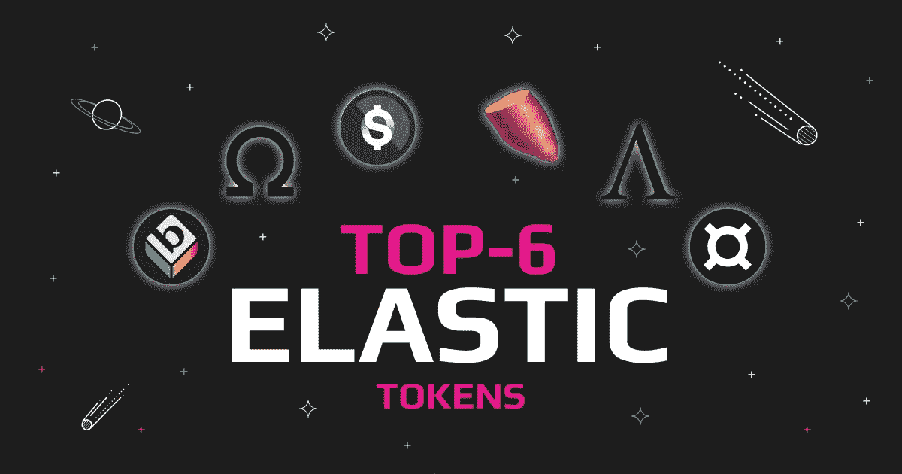
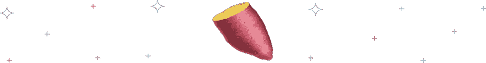

# 六大弹性标志:了解 DeFi 的新一面

> 原文：<https://medium.com/coinmonks/top-6-elastic-tokens-getting-to-know-a-new-side-of-defi-338435f64a77?source=collection_archive---------25----------------------->

区块链出现了一种新的金融产品，称为分散金融(DeFi ),而弹性供应代币在 DeFi 领域是一个相对较新且鲜为人知的想法。这些代币的数量通过智能合约在算法上进行修改，这一过程称为 rebase。因此，弹性供应令牌有时被称为重定基数令牌。这篇文章解释了什么是弹性供给令牌，我们为什么需要它们，以及它们是如何工作的。

# 什么是弹性供给代币？

弹性供应代币，也称为重定基数代币，是其供应根据其价格而变化的资产。这些代币的数量通过被称为 rebase 的过程在算法上被修改；因此，名称 rebase 令牌。当代币价格高于或低于规定的目标价格时，自动进行供给变化以增加或减少代币的数量。这些供应调整旨在吸收波动性，同时通过时变令牌供应争取目标价格，令牌供应根据时间加权平均价格(TWAP)每 24 小时调整一次。

# 弹性令牌是如何工作的？

因此，虽然我们知道少数稳定的硬币(如 USDC，由美元支持)保持其价值，但这仍有许多不足之处。考虑以下场景:您建立了一个与单一价格相关联的硬币(比如美元)。显然，如果加密货币的价格是固定的，其需求不会增加供应。这就是弹性供给令牌的灵活性发挥作用的地方。

这些通过算法构建的弹性供给令牌随着需求而增加和收缩。令人震惊！因此，随着需求的增长和价格的上涨，供应会同步攀升，直到价格回到固定水平，反之亦然。钉住汇率本质上是一种稳定资产(如法定货币或贵金属)的支持，可以降低波动性。这就是为什么它被称为“弹性”供应令牌。然而，由于还有很多需要改进的地方，这种款式从未真正占据市场的大部分。

# 弹性供应代币有什么风险吗？

投资价格波动的代币可能有点冒险。弹性供给代币增加了赔钱的几率。当然，这可能是有利可图的，因为它可以帮助你增加收入，但也可以帮助你增加损失。如果折价发生在代币价格下跌的时候，你不仅会赔钱，而且每次折价你拥有的代币也会越来越少。风险类似于任何其他加密或股票投资。

# 正负重定基数

那么，让我们来看看一个基本的 rebase 是如何工作的。假设您购买了一个 rebase 令牌；1000 ELASTIC 为 1，000 美元，这是一个假设的 rebase 令牌，目标价格为 1 美元，这是几个弹性供应令牌的共同价格目标。假设购买压力推动 AAPL 价格上涨 20%，至 1.20 美元。开始重定基数，使弹性货币的总供应量增加了 20%(任意百分比)。由于这 20%是按比例分配的，客户将获得 1200 AAPL 的正再基准和 1，200 美元的提升组合价格。

但是如果真的有卖压力而不是买压力呢？为了重新锁定价格，出现了负的重定基数，在这种情况下，智能合约引入了通货紧缩，试图提高代币需求。虽然这种方法在理论上似乎可行，但已经有算法稳定的硬币进入死亡螺旋。在下跌的市场中，价格低于目标将导致市值下降，从而导致逐渐亏损。虽然这种方法在理论上似乎可行，但也有算法稳定的硬币进入死亡螺旋的实例。

# 弹性供给令牌的弱点

弹性令牌是一种非常不稳定的加密资产。正如 rebase tokens 所证明的那样，加密市场非常不稳定。它们是投机性投资，只有经验丰富、知识渊博、能够有效管理风险的投资者才应该参与。当市场处于上升期时，上涨就存在，类似于期货交易，你往往会获得巨大的牵引力。不幸的是，同样的结果会发生在下跌中:当每一次重定基期发生时，你就会失去市场价值和总持有量，形成一个负重定基的螺旋。这是最糟糕的情况，供应调整无法提振需求、重塑价格和市值稳定。

# 顶级弹性代币

尽管还处于起步阶段，弹性供应令牌项目正在获得牵引力，并可能在 DeFi 领域提供新的用例。这里有一个简短的列表，列出了一些值得研究的最好的弹性令牌。

# 安普尔福思(AMPL)

[安普尔福思(AMPL)](https://swapzone.io/currencies/ampleforth) 根据需求调节循环供给，需求增加时增加供给，需求减少时减少供给。AMPL 的价值通过算法设定为 1 美元。另一方面，AMPL 没有密码或美元的支持，它的目标是降低波动性，而不是消除波动性。

# 原产地美元(OUSD)

起源美元(OUSD) 为区块链和加密世界的收入激励增加了一个新奇的转折。stablecoin 让您只需将 OUSD 放在钱包中即可获得奖励。起源美元(OUSD)是一种基于以太坊的 ERC 20 稳定币。预计与美元的汇率为 1:1。其他稳定的主要竞争对手像、戴和也是 1:1。stablecoin 还有一个独特的分散应用平台，名为“原始美元 dApp”dApp 使得买卖 OUSD 更加容易。此外，为买卖 OUSD 代币提供最具竞争力的价格。

# 奥林巴斯(欧姆)

Olympus DAO(协议控制值— PCV)支持基于[欧姆令牌](https://swapzone.io/currencies/olympus-v2)的分散储备货币协议。为了避免跌破，欧姆得到了奥林巴斯财政部一篮子加密资产的支持，其中包括戴和。实质上，除了 OHM token 之外，他们还提供打桩和粘合服务。他们希望将来成为一个世界性的贸易单位和现实世界中的货币交换手段。

# 法克斯(Frax)

[FRAX](https://swapzone.io/currencies/frax) 是市场上第一种同时提供抵押和算法模型的安全加密货币。弹性供给支持 FRAX 1 美元的目标价。用户自己可以控制 Frax 协议——事实上，任何人都可以请求更新抵押品比率。由于这种策略，Frax 比菲亚特支持的 stablecoins 更分散，资本效率更高，也比算法 stablecoins 更稳定可靠。

# 基本协议($BASE)

基础协议(Base)是一种硬币，其价格为 1:1 万亿，与所有加密货币的整个市值捆绑在一起。有了 BASE，交易者只需一个令牌就可以对整个密码市场进行投机。例如，如果加密市值为 1 万亿美元，则基数与 1 美元相关。如果密码市场价值 2.5 万亿美元，这个弹性令牌就是 2.50 美元。

# 山药金融(山药)

2020 年 8 月 11 日，山药金融宣布推出其系统和价格弹性山药币。该倡议被吹捧为“公平农业、治理和弹性的实验”，尽管它尚未经过审计。然而，许多 DeFi 用户很快就支持了 Yam 的概念，该项目迅速获得了支持。值得注意的是，该项目被构建为一个 DeFi Frankenstein，其代码中使用了 Ampleforth 的弹性供应、Synthetix 的 staking 机制和 Compound 的治理模块。然而，除此之外，Yam 协议的建立是为了在 Yam 的可管理的财政部的正 rebases 期间购买 yCRV 令牌，使其超过其各部分的总和。

# 弹性供给代币的未来

弹性供应令牌最近得到了很多媒体的关注，带来了贪婪和犯罪行为者来欺骗加密社区中粗心的成员。我们敦促用户关注这一切，因为在密码世界里，小故障和有趣的行为永远不会是有限的。总的来说，这些代币提供了一个独一无二的系统，它渴望像货币或商品一样进行交换。原则上，由于 rebase 机制是按比例传递给用户的，所以供求是价值的决定因素。

虽然产生巨大利润的前景令人兴奋，但这不应该是购买 rebase tokens 的主要动机。相反，投资者应该确保在做出决定之前，他们确切地知道他们将要进入的是什么。在投资或购买一枚硬币之前，了解重定基础的目标是至关重要的；设定适当的期望值将确保你不会马上失去你的钱。

> 加入 Coinmonks [电报频道](https://t.me/coincodecap)和 [Youtube 频道](https://www.youtube.com/c/coinmonks/videos)了解加密交易和投资

# 另外，阅读

*   [AscendEx 保证金交易](https://coincodecap.com/ascendex-margin-trading) | [Bitfinex 赌注](https://coincodecap.com/bitfinex-staking) | [bitFlyer 点评](https://coincodecap.com/bitflyer-review)
*   [麻雀交换评论](https://coincodecap.com/sparrow-exchange-review) | [纳什交换评论](https://coincodecap.com/nash-exchange-review)
*   [支持卡审核](https://coincodecap.com/uphold-card-review) | [信任钱包 vs 元掩码](https://coincodecap.com/trust-wallet-vs-metamask)
*   [TraderWagon 回顾](https://coincodecap.com/traderwagon-review) | [北海巨妖 vs 双子 vs 比特亚德](https://coincodecap.com/kraken-vs-gemini-vs-bityard)
*   [Exness 回顾](https://coincodecap.com/exness-review)|[moon xbt Vs bit get Vs Bingbon](https://coincodecap.com/bingbon-vs-bitget-vs-moonxbt)
*   [如何开始用加密贷款赚取被动收入](https://coincodecap.com/passive-income-crypto-lending)