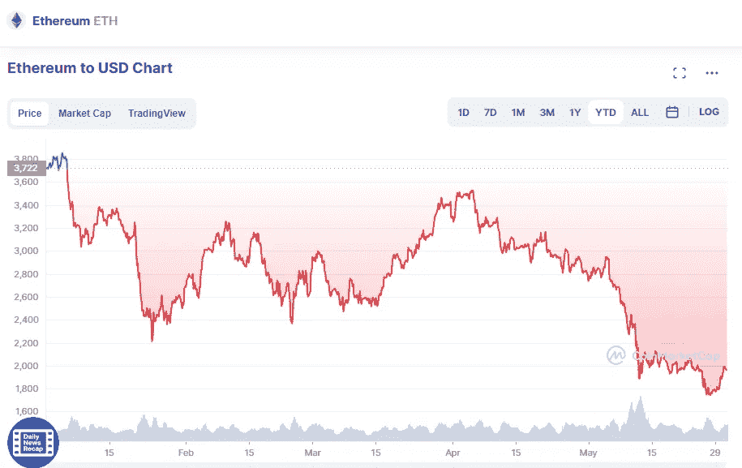

# 2022 年最具购买潜力的五大加密货币

> 原文：<https://medium.com/coinmonks/top-7-cryptocurrencies-with-high-potential-to-buy-in-2022-c7a356aa71?source=collection_archive---------4----------------------->

# 1.以太坊

Source photo [Ethereum price today, ETH to USD live, marketcap and chart | CoinMarketCap](https://coinmarketcap.com/currencies/ethereum/)

然而，很明显，以太坊仍然是智能链的无可争议的君主，并且拥有比任何其他平台都多的 DeFi、meme 货币和元宇宙项目。因此，它比我们到目前为止讨论的许多其他智能链拥有更广泛的受众。