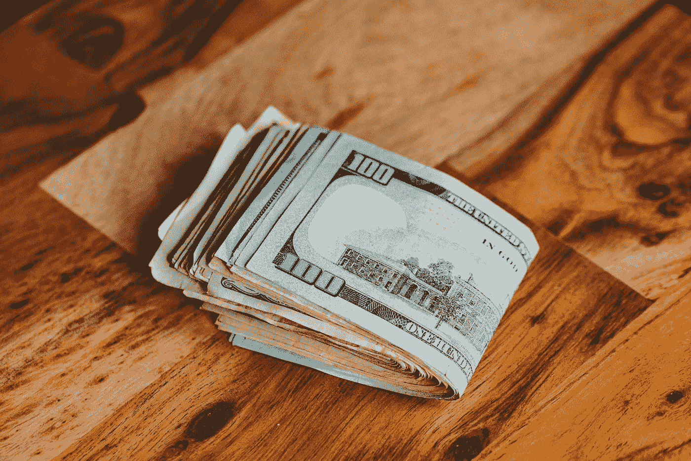

# 通货膨胀的 7 大影响及如何保护自己

> 原文：<https://medium.com/coinmonks/top-7-effects-of-inflation-and-how-to-protect-yourself-ac0b2b68cb57?source=collection_archive---------39----------------------->

Source photo Unsplash.com

作为一个到了一定(咳咳)年龄的美国成年人，我不禁注意到如今的商品比我小时候贵了多少。自 20 世纪 80 年代以来，一加仑牛奶的价格上涨了 59%，从大约 2.2 美元涨到 3.5 美元。一级邮资的价格翻了两番多。平装小说的价格大约翻了两番，从 1988 年的不到 5 美元涨到了 14 美元…