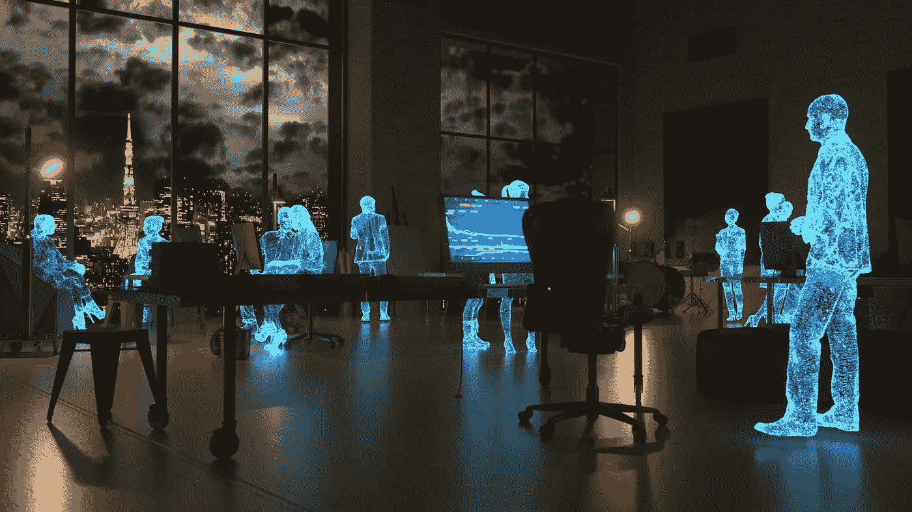

# 元宇宙未来的七大工作

> 原文：<https://medium.com/coinmonks/top-7-metaverse-jobs-of-the-future-f9d8588ec554?source=collection_archive---------47----------------------->

自从元宇宙带着虚拟世界的所有承诺成为焦点以来，已经有一段时间了，虚拟世界将为我们提供一种新的、独特的体验。尽管我们可能渴望这成为一种正常的现实，但我们也有必要超越承诺，审视元宇宙将如何转变工作方式。

在元宇宙的有力支持下，我们必须思考我所称的工作的未来和未来的工作。换句话说，一旦元宇宙成为我们生活的一部分，会有什么样的工作呢？

问这个问题，你不需要过度思考。由于元宇宙将影响我们做事的方式和我们所做的事情，思考这项技术将如何为技术爱好者创造新的工作和新的机会是人类的自然本能。

这篇文章讨论了未来十年元宇宙将会出现的工作类型。

以下是未来十年元宇宙将出现的工作岗位:

*   元宇宙营销专家
*   体验设计师
*   元宇宙安全经理
*   阿凡达服装设计师
*   区块链工程师
*   硬件设计师
*   元宇宙活动协调员

# 元宇宙营销专家

自然，广告会跟随人们。正是在这种逻辑下，元宇宙营销专家的角色将会出现。随着越来越多的品牌继续涌向元宇宙，预计他们会聘请营销专家来协调他们在元宇宙的整个营销，以确保业务的持续增长。

目前，谷歌广告、元广告等在社交媒体中普遍存在。在元宇宙，你可以期待一种改进的营销方式。数字广告牌、web3 社交媒体广告等将是元宇宙营销专家必须为其组织制定和部署的一些东西。

# 体验设计师

元宇宙背后的整个想法是创造虚拟世界，让人类能够享受身临其境的体验。这种体验必须由专门的个人来设计，他们的角色将是双重的。

首先，他们将与项目团队合作，以确保即将到来的 metaverses 旨在最大限度地提高人类体验。其次，体验设计师将与项目团队合作，进一步探索如何进一步开发现有的 metaverses 以满足用户需求。总的来说，这些人的任务是通过为人类提供一个真正享受自己并拥有接近肉体的人际关系的途径来确保元宇宙不负众望。

# 元宇宙安全经理

安全经理的角色可以分为两类。首先，安全经理将负责确保元宇宙内人员的安全互动。随着越来越多的人进入虚拟世界，一些人可能会表现出某些对其他人来说似乎不方便的行为和特征。例如，像网络欺凌这样的行为需要报告和预防。元宇宙安全经理的职责是确保每个人都有一个安全的虚拟世界。

第二，安全管理人员也可能负责网络保护。黑帽黑客肯定会瞄准项目来利用漏洞。安全管理器可能是防止此类事件发生的技术合适人选。

# 阿凡达服装设计师

这一角色已经很明显，因为大型商业品牌如古驰和巴黎世家已经深入元宇宙。随着越来越多的服装品牌转向虚拟世界，虚拟化身服装设计师将需要创造适合虚拟化身的 3D 设计和新服装系列。

当 Etsy、T2 大卡特尔、Shopify 等品牌最终进驻元宇宙时，元宇宙的服装设计师也将脱颖而出。

# 区块链工程师

元宇宙将依靠区块链为其虚拟经济提供动力，因此，对区块链工程师的需求将比以往任何时候都大。他们将把虚拟世界整合到区块链，设计数字货币和代币组学，并最终确保项目不会出错。

# 硬件设计师

我们可能看不到或摸不到区块链和元宇宙，但这些技术仍然需要专门设计的硬件来将人类带入数字经济和虚拟世界。

本质上，元宇宙要求用户拥有虚拟现实耳机，以便享受虚拟世界的全部功能。此外，增强现实和设计平台将会兴起。预计未来十年将出现更多的元宇宙硬件设计公司，它们都将创造创新产品，提升元宇宙的用户体验。

# 元宇宙活动协调员

这一工作角色将处于元宇宙人类体验的核心。随着娱乐和旅游业在元宇宙的发展，元宇宙活动协调员的角色将变得更加突出。

他们将通过规划行程、带领游客游览，以及确保所有希望充分体验元宇宙荣耀的人获得总体顺利的体验，来协调各项活动。

# 结论

预计随着元宇宙的继续发展，将会出现新的角色。本文提供的列表只是先睹为快。随着时间的推移，我们会看到，但现在，让我们放松下来，享受互联网下一次迭代的演变。

> 加入 Coinmonks [电报频道](https://t.me/coincodecap)和 [Youtube 频道](https://www.youtube.com/c/coinmonks/videos)了解加密交易和投资

# 另外，阅读

*   [CoinFLEX 评论](https://coincodecap.com/coinflex-review) | [AEX 交易所评论](https://coincodecap.com/aex-exchange-review) | [UPbit 评论](https://coincodecap.com/upbit-review)
*   [AscendEx 保证金交易](https://coincodecap.com/ascendex-margin-trading) | [Bitfinex 赌注](https://coincodecap.com/bitfinex-staking) | [bitFlyer 审核](https://coincodecap.com/bitflyer-review)
*   [Bitget 回顾](https://coincodecap.com/bitget-review)|[Gemini vs block fi](https://coincodecap.com/gemini-vs-blockfi)cmd |[OKEx 期货交易](https://coincodecap.com/okex-futures-trading)
*   [AscendEx Staking](https://coincodecap.com/ascendex-staking)|[Bot Ocean Review](https://coincodecap.com/bot-ocean-review)|[最佳比特币钱包](https://coincodecap.com/bitcoin-wallets-india)
*   [霍比评论](https://coincodecap.com/huobi-review) | [OKEx 保证金交易](https://coincodecap.com/okex-margin-trading) | [期货交易](https://coincodecap.com/futures-trading)
*   [网格交易机器人](https://coincodecap.com/grid-trading) | [Cryptohopper 审查](/coinmonks/cryptohopper-review-a388ff5bae88) | [Bexplus 审查](https://coincodecap.com/bexplus-review)