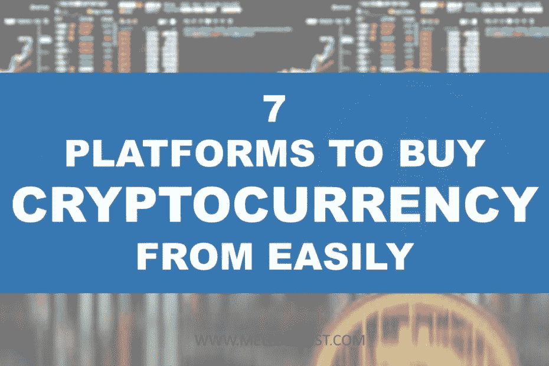
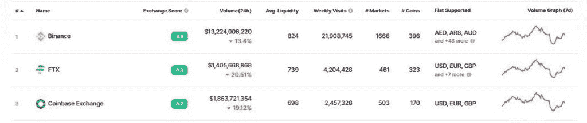

# 最容易购买加密货币的 7 大平台——Mellon post

> 原文：<https://medium.com/coinmonks/top-7-platforms-to-buy-cryptocurrency-from-easily-mellonpost-1e07ef4a28b2?source=collection_archive---------59----------------------->

在这篇文章中，如果你想进入加密交易，我将与你分享 7 个容易购买加密货币的平台。

# 比特币基地

比特币基地是美国最大和最受欢迎的加密交易平台之一，支持数百种数字货币和替代硬币。

自 2012 年成立以来，比特币基地一直保持着巨大的增长，最近还以比特币基地全球公司(COIN)的名义上市

比特币基地平台非常强大，可以满足许多加密爱好者的需求，因为它有一个强大的购买、交易、赚取和存储加密货币的基础设施。

该平台对初学者友好，易于操作，但是，它也为专业人士和更有经验的交易者提供了更高级的选择。

据该公司称，它已在 100 多个国家开展业务，拥有近 1 亿名认证用户，超过 11，000 名机构收养。

如果你正在寻找一种简单的方法进入 crypto，你可以看看比特币基地。

# 罗宾汉

[Robinhood](http://robinhood.com) 是一个已经存在了一段时间的经纪平台，但直到 2018 年该公司才加入加密领域，使人们可以非常容易地购买加密货币。

自那以后，它继续在平台上开发加密空间，以支持大多数流行的硬币。

到目前为止，它支持大约 7 种加密货币，这包括:比特币，以太坊，以太坊经典，比特币现金，Dogecoin，莱特币和比特币 SV。

该应用程序非常用户友好，非常吸引那些希望进入加密领域的新用户。

然而，该应用程序获得了很大的人气，因为它没有交易佣金，但用户只需支付因交易而异的订单流费。

鉴于其他平台对交易收取大量费用，这一功能是 Robinhood 的独特销售主张。

该应用程序还支持购买股票、交易所交易基金和其他期权，你可以用最低 1 美元开始投资，并且没有最低存款额。

为了确保用户资产的安全，该平台通过热存储(在线)和冷存储(离线)相结合的方式来保证硬币的安全

# 币安

[币安](https://mellonpost.com/binance)是目前世界上交易量最大的加密交易平台，在这里你可以购买加密货币。

该公司之所以排名第一，是因为根据 Coinmarketcap 的数据，在撰写本文时，它每天的交易量超过 130 亿英镑，每天的访问量接近 2200 万次。

该公司多年来一直使其平台非常易于使用，他们目前仍在移动应用程序上的东西，以确保他们增加平台的易用性。

在这个平台上，你可以买卖密码、交易期权、保证金和期货。

我认为使该平台非常受欢迎并被广泛接受的一个特性是 P2P 特性，用户可以很容易地在平台上购买和出售密码。

这个功能被许多人广泛使用，因为该平台提供了各种各样的法定货币，所以你可以很容易地用你自己的本地货币从你所在地的人那里购买加密。

他们在平台上提供数百种不同的加密货币和法币对，并且他们还定期采用新项目。

你可以轻松地用新的替代硬币进行主要的加密货币交易，也可以毫无障碍地从任何硬币转换成你喜欢的硬币。

它还有很低的交易费用和直观的图表工具，所以很多日内交易者喜欢使用它。

如果你是一个新手，你也可以通过币安学院的短视频学习加密交易和区块链，让学习变得简单有趣。

又念: [**区块链技术讲解**](https://mellonpost.com/blockchain-technology-explained/)

然而，由于监管规定，该公司在美国有一个单独的平台，称为币安美国。

# 双子星座

[双子座](http://gemini.com)是一家由文克莱沃斯双胞胎创立的公司，在马克·扎克伯格经营之前，他们最初有了脸书的想法。

经过多年的法律斗争，马克·扎克伯格后来用一大笔钱解决了兄弟俩的问题，用一部分钱他们开始了他们在加密领域的旅程，这就是 2014 年双子星座的由来。

到目前为止，交换平台是加密交换领域最受信任的名字之一，在这里你可以购买加密货币，因为它自称非常符合安全性和交换合规性。

最初，它主要提供比特币和以太币，但随着时间的推移，它增加了更多内容，现在允许用户交易多达 70 种其他密码，如 Tezos、Terra 和其他菲亚特支持的稳定硬币。

因为该公司是一家信托公司，它非常重视安全，并接受网络安全审计。

也可以阅读: [**如何开始并成功进行联盟营销**](https://mellonpost.com/how-to-start-and-succeed-in-affiliate-marketing/)

作为其安全策略的一部分，该公司将交易所的大部分硬币放在冷库中，而那些放在交易所钱包中的在线硬币是有保险的。

如果你真的担心你的加密资产在交易所的安全性，那么你最好去看看 Gemini，他们也给新的美国客户，他们在上船后在 ETH 注册 7 美元。

# FTX

[FTX](https://ftx.com/en) 是一个发展相对迅速的美国监管交易平台，在这里你可以很容易地购买加密货币。

它拥有数百万用户，在密码交易员中非常受欢迎，因为它是由交易员专门为交易员打造的。

然而，由于许多交易所的交易费用很高，该公司确保通过向持有和持有其 FTT 令牌的用户提供折扣来吸引 it 用户。

所以，你持有的 FTT 越多，你在 FTX 交易费用上得到的折扣就越多。另一方面，这一战略有助于其令牌(FTT)的采用，并加强其区块链。

除了拥有强大的加密交换平台，该公司还涉足了 NFT 领域，为其用户提供了一个能够创建、购买和出售不可伪造代币的平台。

# 北海巨妖

[北海巨妖](http://kraken.com)是一种加密交易平台，在加密领域建立了高度信任。

自 2011 年成立以来，该交易所一直在不断改进其功能，尽管它为初学者的加密交易者提供了一个很好的地方，但它也有一种迎合专业交易者的先进技术。

Krakens Pro 网站拥有非常强大的基础设施和功能，对于对交易保证金和期货感兴趣的高级交易者和机构交易者非常有吸引力。

该公司以从头开始构建其平台而自豪，正因为如此，他们能够注入许多安全层，以确保安全交易和保护用户的资产。

更重要的是，该交易所还能够通过自己的 API 支持其他第三方交易平台和算法交易。

如果你正在寻找一种快速而强大的技术，能够轻松扩展并保持速度，以便随时执行任何订单，你应该看看北海巨妖。

# 库科恩

[Kucoin](http://kucoin.com) 是一个非常受欢迎的加密交易平台，你可以在这里购买加密货币，它自称是世界上排名第一的比特币交易所。

Kucoin 是最大的社交交易加密平台，拥有超过 1000 万投资者、500 多枚硬币、8000 亿美元的累计交易量，业务遍及 200 多个国家。

另请阅读: [**如何创办和发展一家社交媒体机构**](https://mellonpost.com/how-to-start-and-grow-a-social-media-agency/)

尽管它的交易量不如币安，但它在密码交易员中仍然很受欢迎。

Kucoin 不仅为比特币、以太币、莱特币等流行的加密货币提供了一个安全的交易和投资平台，还为许多其他替代货币和最近的 meme 币提供了一个安全的交易和投资平台，如 Dogecoin、Shiba Inu 等。

该平台非常易于使用，并且在加密领域提供非常低的交易费用。

在这个应用程序上，你可以用你的 Visa 或 Mastercard 或者利用 USDT 来购买 crypto。它还提供 P2P 交易，可以轻松使用银行转账，有 20 多种货币选项。

Banxa、Simplex 和 BTCDirect 等第三方服务也可在该平台上使用。

在交易方面，Kucoin 为其用户提供现货交易、保证金交易、衍生品、交易机器人和独家 API 特权。

有了交易机器人，你甚至可以在不监控市场的情况下从交易中获利。

该平台还可以很容易地借出密码来赚取利息，如果你持有其 KCS 令牌，你将获得额外的奖励。

到目前为止，无论是新手还是专业人士，都可以在这 7 大平台上轻松购买、交易和投资 crypto。

祝你好运。

*原载于 2022 年 4 月 14 日*[*【https://mellonpost.com】*](https://mellonpost.com/top-7-platforms-to-buy-cryptocurrency-from-easily/)*。*

> 加入 Coinmonks [电报频道](https://t.me/coincodecap)和 [Youtube 频道](https://www.youtube.com/c/coinmonks/videos)了解加密交易和投资

# 另外，阅读

*   [Bookmap 评论](https://coincodecap.com/bookmap-review-2021-best-trading-software) | [美国 5 大最佳加密交易所](https://coincodecap.com/crypto-exchange-usa)
*   最佳加密[硬件钱包](/coinmonks/hardware-wallets-dfa1211730c6) | [Bitbns 评论](/coinmonks/bitbns-review-38256a07e161)
*   [新加坡十大最佳加密交易所](https://coincodecap.com/crypto-exchange-in-singapore) | [购买 AXS](https://coincodecap.com/buy-axs-token)
*   [红狗赌场评论](https://coincodecap.com/red-dog-casino-review) | [Swyftx 评论](https://coincodecap.com/swyftx-review) | [CoinGate 评论](https://coincodecap.com/coingate-review)
*   [投资印度的最佳密码](https://coincodecap.com/best-crypto-to-invest-in-india-in-2021)|[WazirX P2P](https://coincodecap.com/wazirx-p2p)|[Hi Dollar Review](https://coincodecap.com/hi-dollar-review)