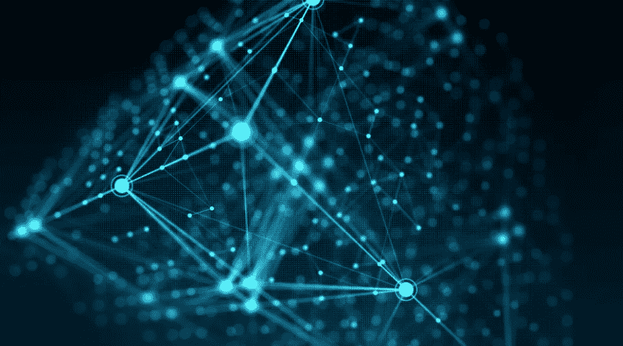

# 你应该知道的 7 大真实区块链用例

> 原文：<https://medium.com/coinmonks/top-7-real-life-blockchain-use-cases-you-should-know-6be801c665be?source=collection_archive---------54----------------------->

区块链技术对世界各地的许多人来说仍然是陌生的。事实上，除了加密货币，许多人想不出该技术的任何其他有形部署和使用案例。如果你属于这一类，这没什么大不了的，因为在其存在的大部分时间里，围绕该技术的嗡嗡声和噪音一直集中在比特币、以太坊、NFTs 以及最近的元宇宙上。

所有这些用例的核心都是加密货币。总是关于一枚硬币或项目令牌如何促进生态系统内的交换和交易。

然而，区块链的技术远远超越了加密货币。该技术本身提供了一种永久存储数据的方式，其中包含的信息既不能被操纵也不能被擦除。因此，这项技术已经在世界各地的几个部门得到应用。

我在这篇文章中的目的是解释部署区块链技术的七个最重要的例子。准备好出发了吗？让我们开始吧。

# 金融

这更像是给定的。这大概是第一个容易想到的用例。过去十年，区块链技术逐渐并持续地扰乱了全球金融。这在很大程度上可以归因于以太坊网络及其智能合约功能的出现。

尽管比特币的出现是为了创造一种数字替代交易手段，但真正分散全球金融的是以太坊。以太坊有效地开启了去中心化金融(简称 DeFi)的时代。

现在，人们可以在区块链上获得金融服务，如借贷、保险、证券投资、赌博、农业生产、贸易和许多其他金融服务。

如今，您可以舒舒服服地在家进行交易，进行本地和国际支付。最近，加密支付网关也出现了，开创了一个新时代，加密持有者可以简单地用他们的信用卡/借记卡支付服务。

[阿尔格兰德](https://www.algorand.com/)、[币安](https://www.binance.com/en)、[博学者](https://polymath.network/)和[圈子](https://www.circle.com/en/)，这些都是在区块链提供金融和投资服务的著名名字。

# 数据隐私和保护

世界从未像现在这样重视数据保护。在先进技术和数据挖掘的时代，越来越明显的是，用户数据是新的石油。

在正确的人手中，数据可以用来为民众做出明智的决定，而如果在错误的人手中，它可能会被操纵，产生毁灭性的影响。这使得区块链成为一个安全的地方，用户数据可以在这里存储和保护，而不必担心可能的危害。

就其本质而言，区块链是一个安全的网络，数据是匿名处理的。添加专门的数据保护项目的额外层进一步保证了个人数据的安全。

# 健康

你应该会觉得这很有趣，但区块链在健康领域的基本概念遵循记录永久存储的逻辑。

有了区块链技术，病人现在可以将他们的病历安全地保存在区块链上。这直接执行两个关键功能。首先，在区块链上可以很容易地跟踪病人的健康记录，因为他们完全知道这些记录没有被篡改。这使得随着时间的推移跟踪患者的进展和病史变得容易。

其次，将患者的医疗记录存储在一个安全且防篡改的位置，可以创建一个中心位置，在需要时可以在获得许可的情况下访问这些信息。这进一步意味着，患者可以从世界任何地方得到治疗，医疗从业者通过简单地访问患者的跟踪记录就可以立即知道该做什么。

# 选举透明度

区块链技术凭借其固有的特性，使得进行自由公平的选举成为可能。它通过保存每一张选票的永久记录，为选举过程的透明度创造了一个渠道。

Followmyvote 是一个总部位于区块链的平台，致力于提高投票过程的透明度。它通过向投票者分配在投票过程中只能使用一次的代币来做到这一点。这有助于防止多重投票和各种形式的操纵。最终，所有投票的永久记录得以实现，真正的决定有效地交到了选民手中。

# 版权管理

没有什么比不可替换的令牌做得更好了。NFT 是数字令牌，其值是唯一的，不能重新创建或交换。这在近年来的版权管理中派上了用场。

NFT 现在可以被创造成某种独特事物的数字代表。包含在该 NFT 中的将是指示创意的合法所有者的信息，该所有权然后可以根据原始所有者的判断转移给其他人。

一个很好的例子是杰克·多西第一条推特的销售。在推特上创造了一个 NFT 之后，杰克·多西实际上成为了推特的版权所有者，而推特的出售意味着他实际上将所有权转移给了买家。转让记录永久保存在区块链上，而所有权由一个新的实体持有。

它不能被篡改，区块链将记录永久保存。

# 供应链

我们已经知道，供应链就是将商品和服务交付给最终消费者的整个过程。借助区块链技术，现在供应链中的所有各方都可以监控整个流程的流程和进度。

他们可以实时查看所有信息，并跟踪流程的每个方面。这自动地创造了信任，减少了各方之间不断沟通的需要，给他们空间去关注真正重要的事情。

总的来说，有了区块链技术，各方可以在信任的基础上增强关系。他们还可以节省成本，集中精力提供高质量的产品和服务。

# 房地产

如果有一个行业可能不在这个名单上，那就是房地产。众所周知，在资产购买和转让方面，房地产行业是抵制变化和缺乏流动性的。然而，它却是从区块链技术中获益匪浅的行业之一。

在房地产领域，买家与房地产公司之间存在问题往往是一个常见的场景。有关土地分配、销售和交易确认的问题。有了区块链的技术，所有这些问题都得到了完美的解决。如今，可以在区块链上跟踪支付情况(如果是加密支付),可以在区块链上访问交易和协议的永久记录。

还有部分资产所有权的出现。通过众筹，投资者现在可以集中资源购买房产，每个人都拥有相当于其贡献份额的代币。知名平台如[令牌化](https://www.tokenizer.cc/)和[证券化](https://securitize.io/)帮助企业将资产令牌化，允许投资者持有部分所有权。

# 结论

区块链已经超越了加密货币和替代硬币。然而，我们必须承认，金融服务占据了主导地位。然而，其他行业也逐渐认识到采用区块链技术并相应部署其流程的必要性。随着区块链技术最终进入我们的日常生活，我们只能期待这种趋势会持续到未来。

> 加入 Coinmonks [Telegram group](https://t.me/joinchat/Trz8jaxd6xEsBI4p) 并了解加密交易和投资