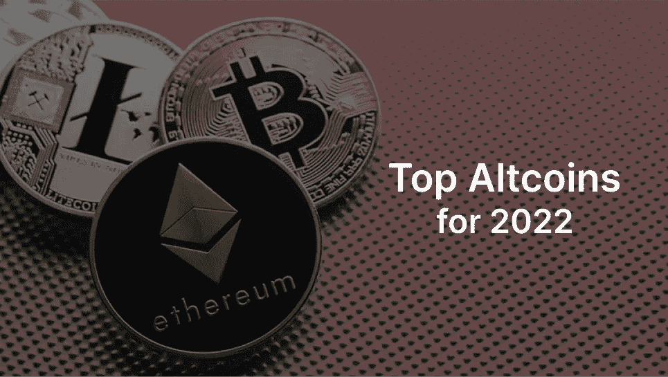

# 2022 年的顶级替代硬币

> 原文：<https://medium.com/coinmonks/top-altcoins-for-2022-638c45c1af7d?source=collection_archive---------32----------------------->

鉴于市场上有大量的加密货币，这很容易让人感到困惑和不知所措。市场上总是有新的硬币和趋势，使旧硬币消失在人们的记忆中。

如果你只是想尝试进入加密市场，或者你是一个有经验的交易者，那么这篇文章是给你的。这篇文章会给你一个开头的硬币，你应该注意。这篇文章也将让你开始，并激发你对这些硬币做更多的研究，以避免被骗。

> DYOR——做你自己的研究，这是密码市场中的流行术语，用来避免成为骗子的猎物

这不是金融建议，所以做你的研究将说服你对硬币，你应该密切关注，并可能交易它们。

你还需要注意，这些硬币很容易被新趋势所取代，但重要的是这些硬币的使用情况。

## ⑴步骤 n

STEPN ($GMT)是一款 web3 move2earn 生活方式应用，用户在移动中获得收入。几个月来，STEPN 一直在关注加密市场的趋势，目的是试图革新 web3 生态系统。用户因跑步、慢跑和努力保持健康而获得奖励。

STEPN 有一个内置的钱包、交换、市场和许多应用程序内的功能，便于用户加入。STEPN 将会看到更多的增长，有了一个强大的社区，它会发展得很好。

## (2)硬币

APECOIN ($APE)是一个治理工具令牌，由 Bored Ape 游艇俱乐部社区和其他相关社区使用。硬币一直在上升，有这么高的期望和受欢迎程度，是无聊的猿 NFT 的本地令牌。因为无聊的猿 NFT 表现得很好，而且 APECOIN 的持有者是加密行业的名人，这种硬币有潜力与它附带的实用程序结合起来做得很好。

## (3)土地

Terra，它的本地令牌称为($LUNA)是一个区块链协议，在全球支付系统中使用钉住的稳定硬币。例如

UST→美元

KRT→韩国

EUT→欧洲

新挂钩的货币可以通过 TerraStation 上的民主投票随时铸造。Terra 允许其持有者支付网络费用并参与管理。Terra 在亚洲市场变得如此受欢迎，是因为它的使用案例，并给出了它在熊市期间表现良好的更多原因。

## (4)接近协议

Near 协议($NEAR)是 NEAR 生态系统的原生令牌。这是一种第 1 层区块链技术，使用茄片分割技术来实现可伸缩性(可伸缩性意味着系统适应不断增长的需求的能力)。由于区块链的高需求以及比特币和以太坊在可扩展性方面的挑战，可扩展性已成为日益增长的需求。这导致在这些网络上进行交易需要支付高额的燃气费，用户也变得望而却步。Near 协议通过彩虹桥使用名为 Aurora 的第二层解决方案来实现互操作性。这使得支付速度更快，交易费用更低。随着近协议社区和用例的不断增长，这种令牌还会有更多的宣传。

我希望你喜欢这篇文章，请联系我

[jamesobande2015@gmail.com](http://www.jamesobande2015@gmail.com/)

[推特](https://twitter.com/jeamz007)

> 加入 Coinmonks [电报频道](https://t.me/coincodecap)和 [Youtube 频道](https://www.youtube.com/c/coinmonks/videos)了解加密交易和投资

# 另外，阅读

*   [比特币基地赌注](https://coincodecap.com/coinbase-staking) | [热点评论](/coinmonks/hotbit-review-cd5bec41dafb) | [库币评论](https://coincodecap.com/kucoin-review)
*   购买 Dogecoin 的 7 种最佳方式
*   [iTop VPN 审查](https://coincodecap.com/itop-vpn-review) | [曼陀罗交易所审查](https://coincodecap.com/mandala-exchange-review)
*   [比特币基地 vs 瓦济克斯](https://coincodecap.com/coinbase-vs-wazirx) | [比特鲁点评](https://coincodecap.com/bitrue-review) | [波洛涅克斯 vs 比特鲁](https://coincodecap.com/poloniex-vs-bittrex)
*   [美国最佳加密交易机器人](https://coincodecap.com/crypto-trading-bots-in-the-us) | [不断回顾](https://coincodecap.com/changelly-review)
*   [A-Ads 审查](https://coincodecap.com/a-ads-review) | [Bingbon 审查](https://coincodecap.com/bingbon-review) | [Mudrex 投资](https://coincodecap.com/mudrex-invest-review-the-best-way-to-invest-in-crypto)
*   [瓦济里克斯 NFT 评论](https://coincodecap.com/wazirx-nft-review)|[Bitsgap vs Pionex](https://coincodecap.com/bitsgap-vs-pionex)|[Tangem 评论](https://coincodecap.com/tangem-wallet-review)