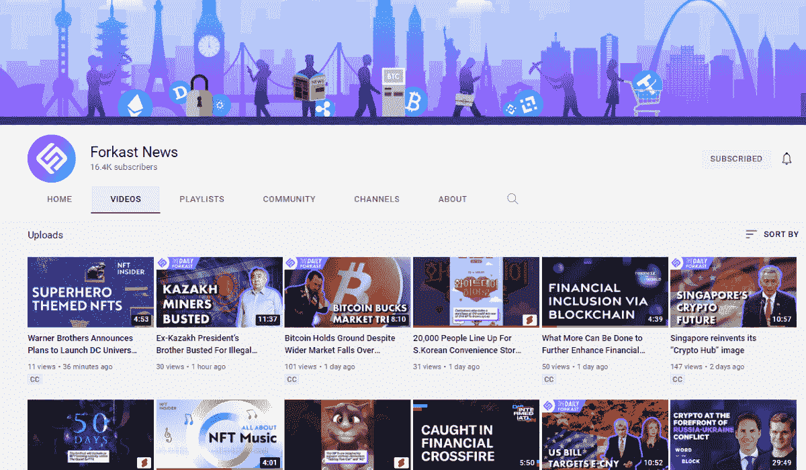
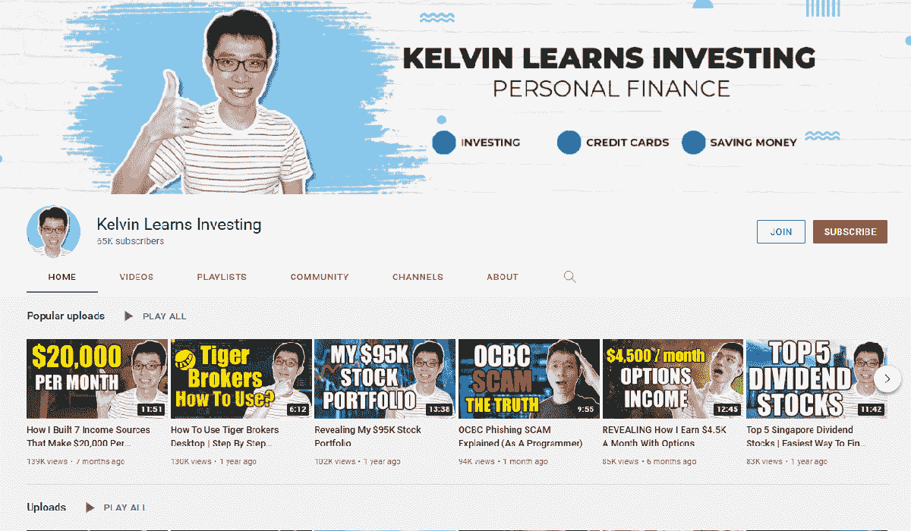
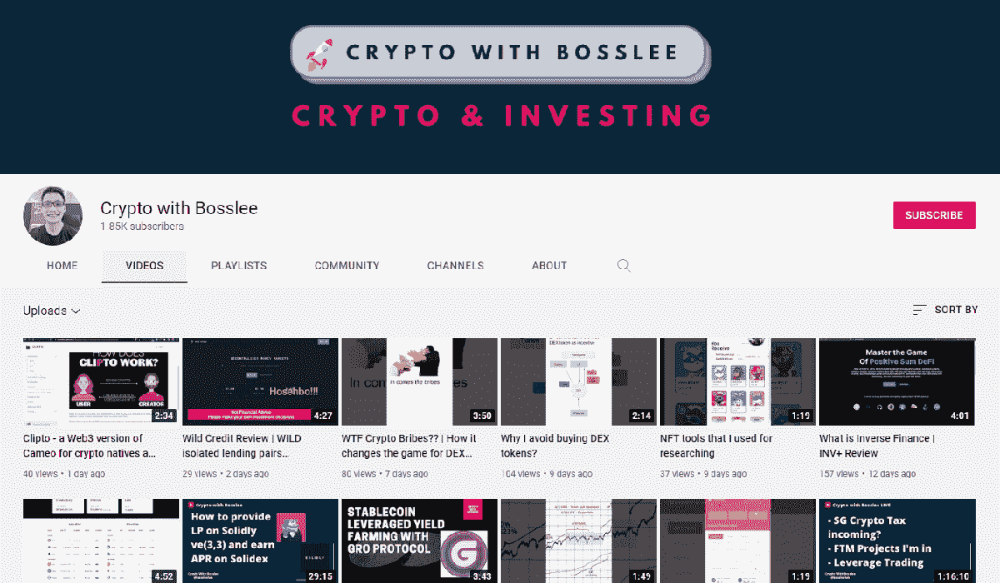
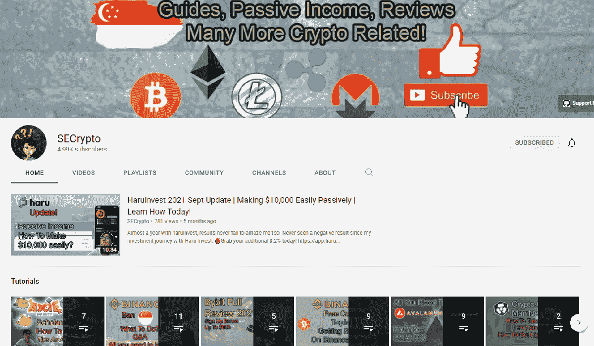
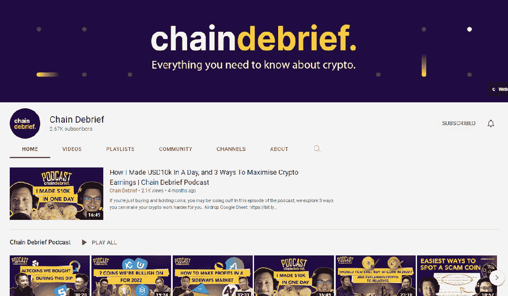
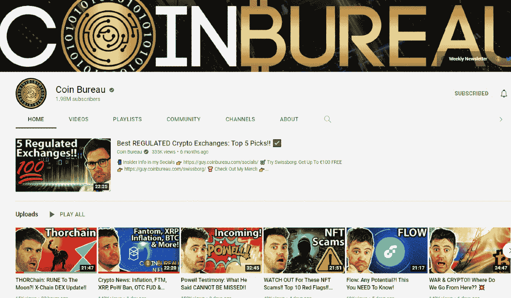
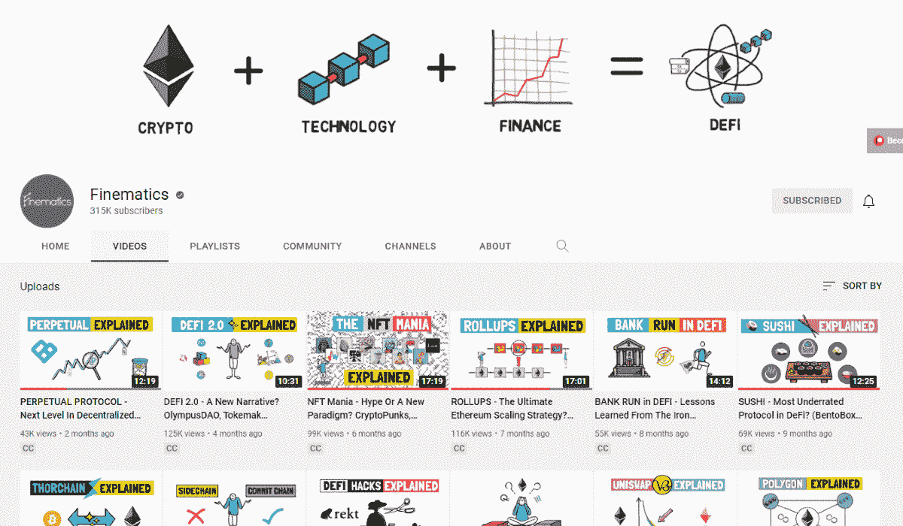
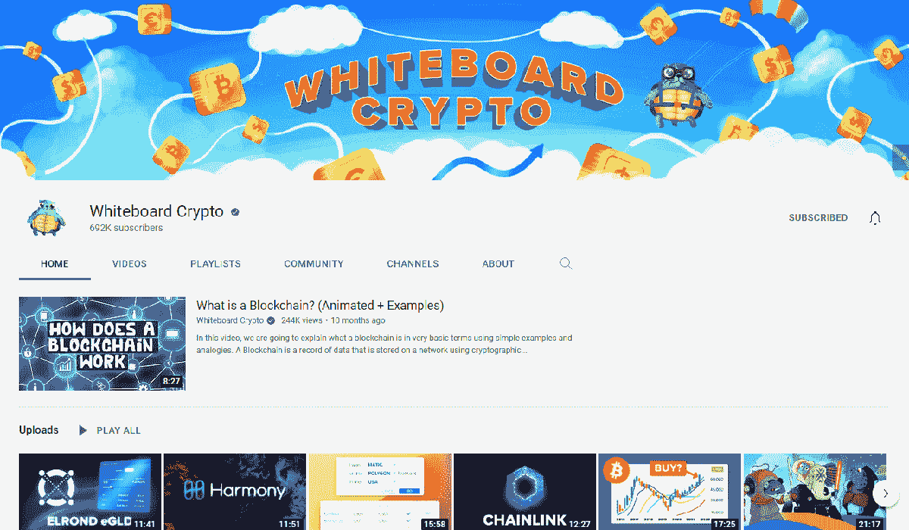
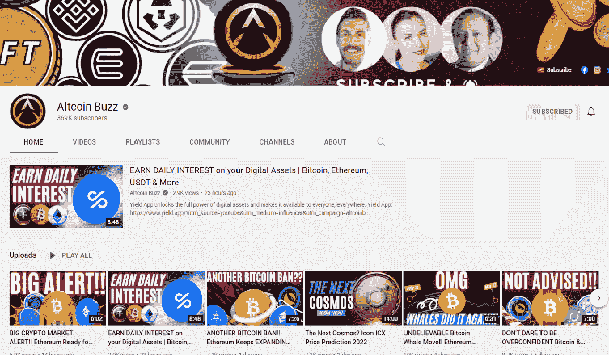
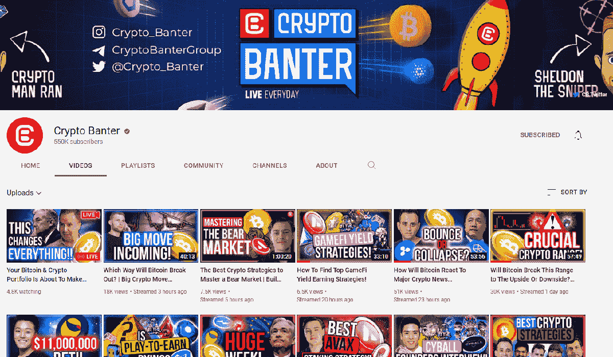

# YouTube 上的顶级加密频道提升您的加密游戏

> 原文：<https://medium.com/coinmonks/top-crypto-channels-on-youtube-to-up-your-crypto-game-21e5866bf783?source=collection_archive---------15----------------------->

想要了解最新的加密新闻吗？以下是 YouTube 上的几个顶级加密频道，你应该关注它们以保持消息灵通。

无论你是一个想要了解更多关于加密的新手，还是一个想要了解每日新闻的有经验的交易者，YouTube 无疑是获取新闻和信息的首选平台之一。

视频谈[区块链](https://coinpasar.sg/what-is-blockchain/)和加密货币的基础知识？检查。当前的价格市场运动和评论？检查。网上有各种适合您加密需求的视频，但是您如何穿过聊天窗口获得您需要的信息呢？以下是我们最喜欢的 YouTube 顶级加密频道。

# 新加坡和 APAC

# [福克斯新闻](https://www.youtube.com/c/ForkastNews)

如果你想了解亚太地区的加密货币新闻，你的第一站应该是 Forkast News。这家数字媒体公司专注于区块链、加密货币和该地区新兴技术的时事。

福卡斯特新闻频道的创始人兼总编辑 Angie Lau 负责该频道的日常工作，为观众提供该领域的最新新闻。此外，她和她的团队不断采访密码领域的知名人士，了解他们对当前事件的看法，并制作关于区块链的信息视频来教育他们的观众。

**订阅如果**:你正在关注 APAC 地区的加密新闻。

# [凯尔文学习投资](https://www.youtube.com/c/KelvinLearnsInvesting)

kelvin learning Investing 是新加坡的一个本地频道，专注于通过明智的投资和储蓄实现财务自由。

虽然他的内容并不完全是关于加密的，但其中相当大的一部分是致力于教育他的观众如何在新加坡购买加密，回顾加密货币金融工具，并分享他对最新加密新闻的看法。

新加坡加密空间的新来者在从加密交易所购买他们的第一笔加密投资时，将会感谢这个频道上的有用指南。

**订阅** **如果**:你是加密空间的新手。

# [boss lee 加密](https://www.youtube.com/c/CryptowithBosslee)

这个由科技频道转型而来的加密顾问 YouTuber 专注于加密领域，并谈论即将到来的加密货币和 NFT 项目。

Tuck Sing 是该频道的幕后策划者，他通过视频分享了在 DeFi 空间导航的经验。用户不仅可以更好地欣赏各种分散的金融项目，而且他们也可以很容易地理解塔克辛的中肯的新加坡式评论的过程。Crypto with Bosslee 的目标用户是熟悉 DeFi 的用户，观众可能希望在浏览他的视频之前更新他们的 DeFi 词汇。

**订阅 if** :你熟悉密码领域，对 DeFi 有很好的了解。

# [秘语](https://www.youtube.com/c/SimplyEverything)

寻找一个可以讨论世界上所有秘密的频道？那你可能想收听 SECrypto。由 Youtuber Zaine 主持，频道名称中的“SE”代表“简单的一切”。正如他所说，这个频道包含了所有和密码有关的东西。

无论是关于新代币的信息，学习购买密码，还是谈论 NFT 游戏，你都可以在频道上找到。内容的范围可能看起来有点杂乱，你可能需要浏览他的视频列表才能找到你想要的信息。

尽管如此，SECrypto 已经覆盖了加密空间相当一部分，他的著名视频详细讨论了加密骗局。如果你不确定某个项目或空投代币是不是骗局的一部分，他是可以获得更多信息的人。

**订阅如果**:你想学习更多关于加密的一般知识或者学习如何识别加密骗局。

# [连锁汇报](https://www.youtube.com/channel/UCeyZc2TOJ81QTMgTygd8Gtw/featured)

Chain Debrief 由 Jacky Yap 创建，他也是 GRVTY Media 旗下 Vulcan Post 和 SG 千禧一代的负责人，旨在通过教育指南、新闻更新和观点文章成为所有加密内容的首选。

Chain Debrief 团队以轻松的态度看待传统上严肃的加密内容，以一种随意但引人入胜的方式展示他们的加密内容，打破了行话。通过他们的加密速成系列课程了解加密的来龙去脉，或者通过他们及时的加密每周汇报了解最新的新闻更新。

**订阅如果**:你是这个领域的新人，或者如果你想要一个关于加密的轻松旋转。

这些是我们在 YouTube 上的顶级加密频道，可以在本地观看。但是，如果你正在寻找一个全球视角，这里有一些我们最喜欢的来自世界各地的内容创作者。

# 全世界的

# [硬币局](https://www.youtube.com/c/CoinBureau)

提到 YouTube 上的顶级加密频道，首先想到的是硬币局。该频道展示了关于不同令牌项目的经过充分研究的内容，并以数字和正在进行的新闻的逻辑事实支持他们的预测。

Guy 是该频道的联合创始人和形象代言人，他以务实的风格提供内容，对他正在展示的项目持公正的观点。该视频有时可能看起来像独白，但硬币局的事实内容给观众留下了一个你可以信任的频道的信任印象。

内容从令牌发展到对当前事件的深入评论，如加密法规，我们向新手和有经验的加密用户推荐这个频道。

如果你想从一个可信的渠道获得加密的新闻和信息，偶尔还会有英式幽默的一面，那就订阅吧。

# [Finematics](https://www.youtube.com/c/Finematics/featured)

如果你想知道分散金融(DeFi)是如何工作的，Finematics 通过 YouTube 上的插图解释了这些概念。

Finematics 的所有者和生产商 Jakub 认为，正如我们所知，DeFi 很有可能扰乱金融业。这个空间经常陷入术语和金融概念的泥潭，这让新用户感到害怕，Jakub 旨在通过他详细的视频解释来消除这种困惑。

他的内容以手绘风格的动画呈现在空白画布上，概念被分类成简单的插图，使观众易于消化。Finematics 没有详细说明流动性池和智能合约等基本的 DeFi 术语，所以在观看他的视频之前有一个基本的了解是很好的。

**订阅如果**:你是一个熟悉加密，区块链和 DeFi 工作的用户。

# [白板加密](https://www.youtube.com/c/WhiteboardCrypto)

如果您正在寻找一个了解加密和区块链基础知识的渠道，白板加密就是您的答案。虽然在撰写本文时，该频道才成立一年，但由于其易于跟随的插图视频，它已经积累了近 70 万粉丝。

白板加密侧重于解释每个令牌的用例及其在加密空间中的位置。如果你想了解 Terra、Shiba Inu 和 Solana 等项目，这个频道背后的团队会帮你搞定。

**订阅如果**:你是一个加密新手，更喜欢容易分解概念的图解视频。

# [山寨币嗡嗡声](https://www.youtube.com/c/AltcoinBuzz)

寻找比特币和以太坊以外的加密货币的价格更新和市场消息？你会想订阅 Altcoin Buzz 获取他们的每日新闻。

这个 YouTube 频道已经关注加密领域几年了，他们的内容跟踪市场上流行的 altcoin 加密货币的新闻和更新，以及他们的观众感兴趣的新的即将到来的加密项目。

Altcoin Buzz 综合了评论、价格分析和象征性的深度挖掘，如果你想随时了解最新动态，值得订阅。

**订阅如果**:你想了解最新的加密价格和市场新闻。

# [隐秘的戏谑](https://www.youtube.com/c/CryptoBanterGroup)

捕捉领先的加密数字对加密戏谑的最新意见！YouTube 上的这个加密频道经常采访或邀请加密思想领袖，以获得他们对该空间内当前形势的看法。

Crypto Banter 团队也经常分享他们的市场预测和深入分析，还有一个大师级系列，你可以观看以了解更多关于技术分析的信息。除此之外，该频道还经常更新关于 DeFi farming 和 Play-to-Earn 策略的内容。总而言之，他们是一个全面的渠道，每天都会给你带来不同的新内容。

**订阅如果**:你想定期更新密码分析，DeFi 和新元宇宙项目。

> *加入 Coinmonks* [*电报频道*](https://t.me/coincodecap) *和* [*Youtube 频道*](https://www.youtube.com/c/coinmonks/videos) *了解加密交易和投资*

# 另外，阅读

*   [Bookmap 点评](https://coincodecap.com/bookmap-review-2021-best-trading-software) | [美国 5 大最佳加密交易所](https://coincodecap.com/crypto-exchange-usa)
*   最佳加密[硬件钱包](/coinmonks/hardware-wallets-dfa1211730c6) | [Bitbns 评论](/coinmonks/bitbns-review-38256a07e161)
*   [新加坡十大最佳加密交易所](https://coincodecap.com/crypto-exchange-in-singapore) | [购买 AXS](https://coincodecap.com/buy-axs-token)
*   [红狗赌场评论](https://coincodecap.com/red-dog-casino-review) | [Swyftx 评论](https://coincodecap.com/swyftx-review) | [造币厂评论](https://coincodecap.com/coingate-review)