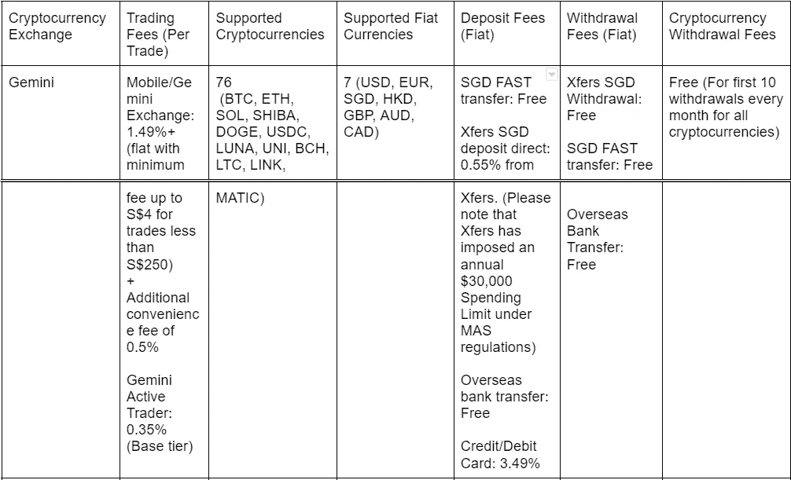
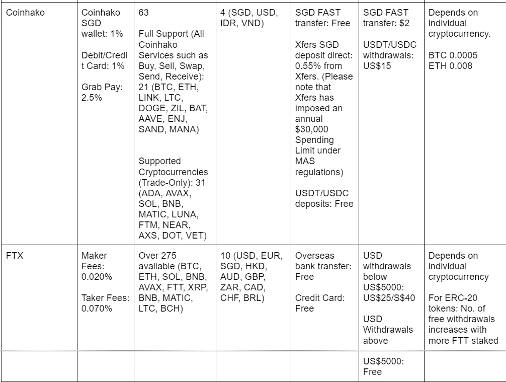
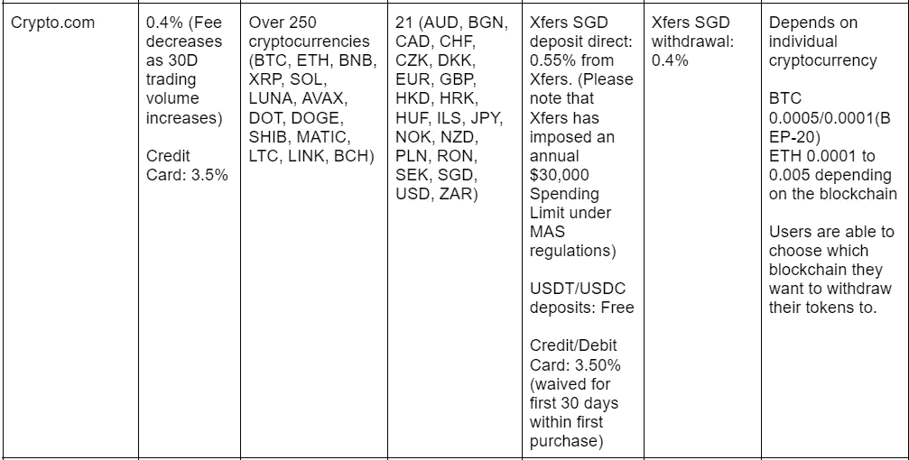
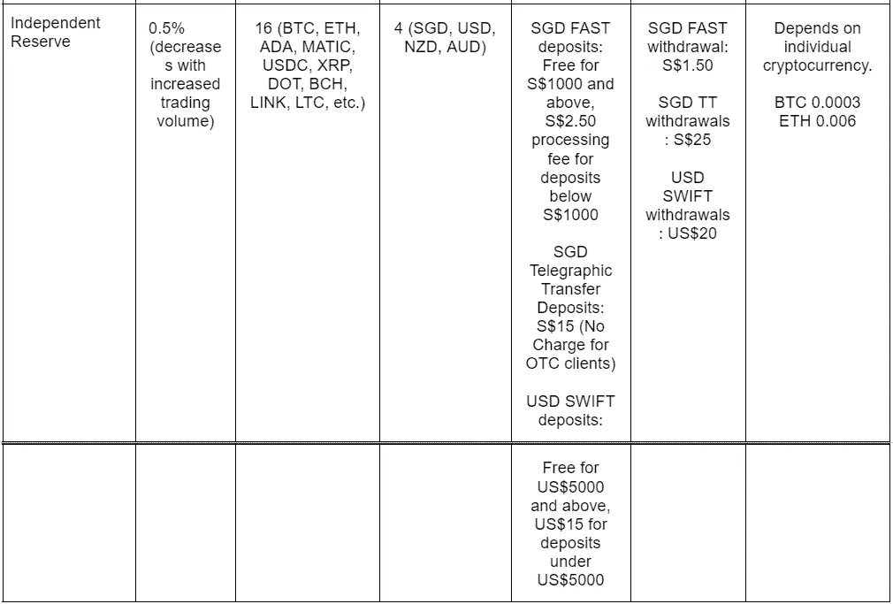
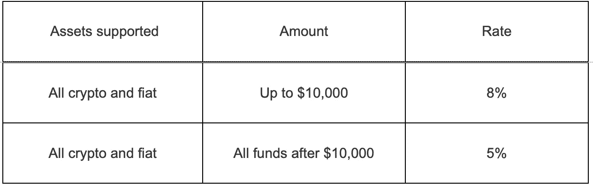
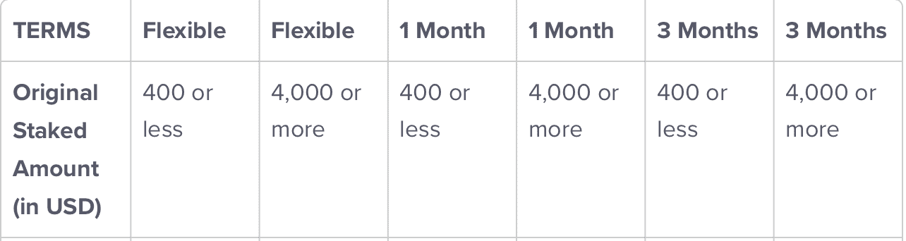
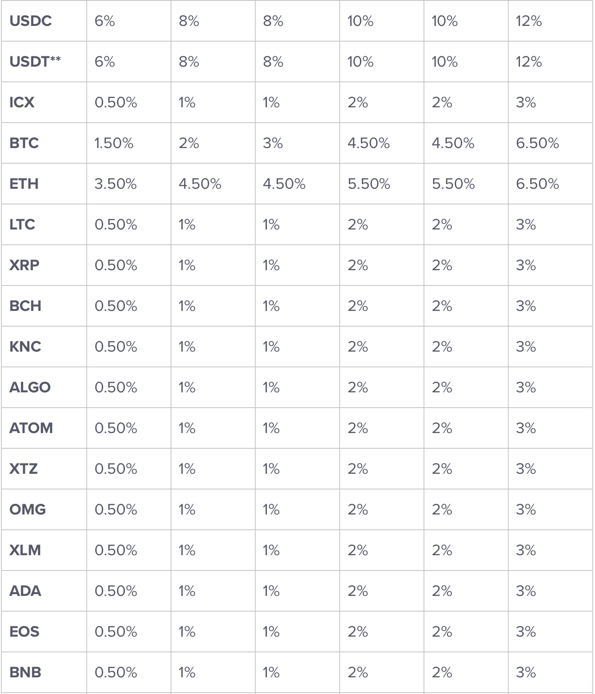
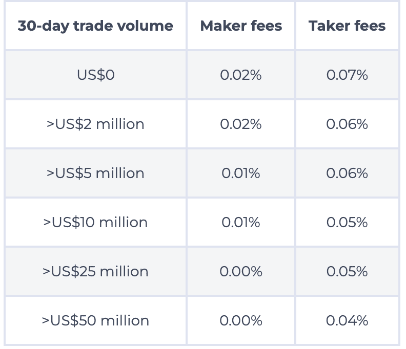
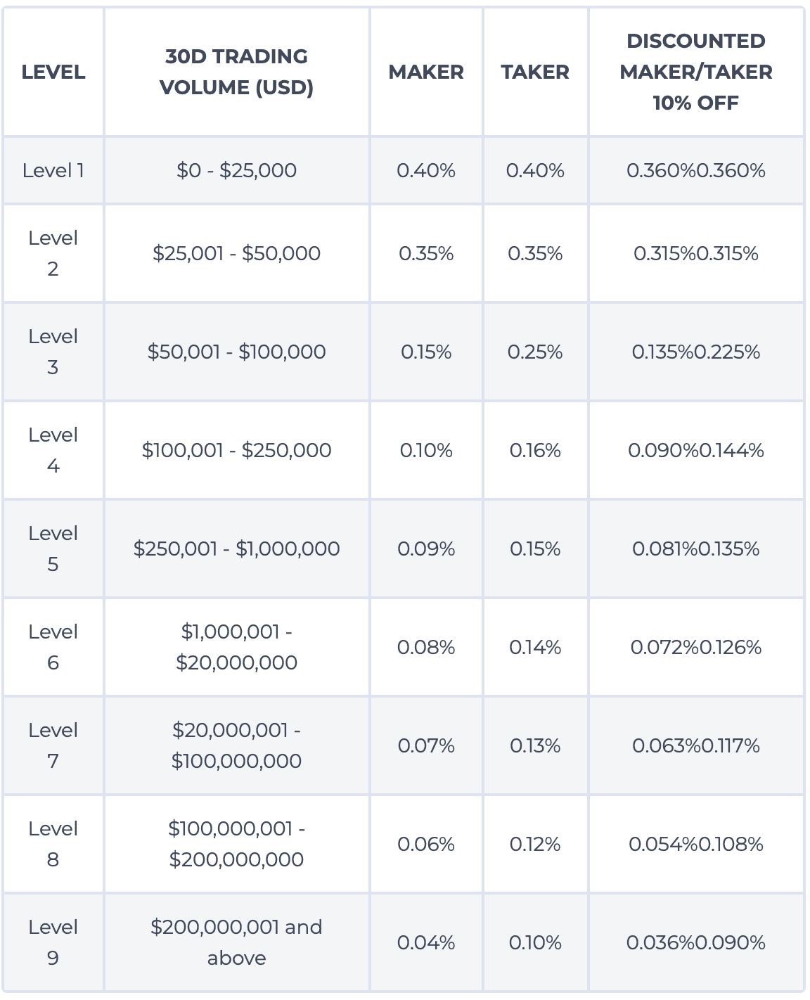

# 顶级加密交易所 2022:哪些是最好的加密货币交易所？(新加坡)

> 原文：<https://medium.com/coinmonks/top-crypto-exchange-2022-which-are-the-best-cryptocurrency-exchanges-to-use-singapore-534a36db95ed?source=collection_archive---------44----------------------->

*请注意，本文中的任何信息都不是财务建议，仅供娱乐。

最近，比特币和以太坊等加密货币在传统投资者中越来越受欢迎。随着越来越多的投资者涌入加密货币，了解加密货币交易的不同交易所非常重要，以便投资者能够做出自己的金融决策。

为了评估加密货币交易所，我们将考察几个不同的因素，以帮助我们进行更好的比较。这些因素包括交易费用、受支持的加密货币数量、盈利计划等。

请注意，本指南主要针对新加坡的消费者，但其他读者也可以使用我们的指南来更好地了解这些交易所如何相互竞争。

我们将关注的主要加密货币交易所包括:

1.  双子星座
2.  Coinhako
3.  FTX
4.  Crypto.com
5.  独立储备

请注意，币安已经停止在新加坡的业务，在币安的交易是不可能的。KuCoin 的网站在 2020 年被新加坡高等法院锁定。比特币基地目前不提供销售服务。Huobi Global 已逐步淘汰新加坡用户，以遵守新加坡的法律。因此，这些交易所将被排除在名单之外。

比较表

请原谅使用截图，因为 Medium 不支持表格。

**收入计划:**

让我们也来看看各种可用的赚取和下注程序，用户可以通过他们在各种平台上持有的加密货币赚取被动收入。这些奖励会定期(每周、每月等)发放给持有者。)

双子座:

Gemini 开展了一项名为 Gemini Earn 的贷款项目。用户将其持有的加密货币借给机构借款人，并从其加密货币中赚取利息。Gemini Earn 根据其风险管理框架审查其借款合作伙伴，该框架审查我们合作伙伴的抵押管理流程。请注意双子座的风险。

利息在美国东部时间每天下午 4 点支付。付款从资金转移到 Gemini Earn 的下一个工作日开始。只要用户的资金转移到 Gemini Earn，Gemini 允许用户从其持有的资产中获得奖励。利息也以存入的货币支付(如果你存入 BTC，你将在 BTC 得到回报)。

到目前为止，Gemini Earn 支持 45 种加密货币。

以下是 Gemini 上一些回报最高的加密货币和一些更常见的加密货币的利率。

BTC: 1.01%

失业率:1.26%

溶胶:4.29%

双子座美元:8.05%

USDC: 7.99%

泰拉美元:7.99%

填充率:7.25%

戴:6.43%

BCH: 5.12%

卢娜:4.52%

长期资本充足率:1.51%

链接:0.50%

马蒂奇:2.02%

Coinhako:

Coinhako 经营着一个名为 Coinhako Earn 的盈利项目，Coinhako 使用各种收益产生方法(赌注、贷款等)。)为他们的用户提供回报。

对于 Coinhako，用户只能根据令牌和可用日期将其令牌锁定一段指定的时间(7 天、28 天、60 天)。奖励只在锁定期后发放给用户。用户可以在截止日期前赎回基金，但不会获得任何奖励。利息也以存入的货币支付(如果你存入 BTC，你将在 BTC 得到回报)。

到目前为止，Coinhako Earn 支持 13 种加密货币，尽管这个列表在未来将会增加。这 13 种加密货币是 BTC、ETH、DOGE、DOT、ZIL、XTZ、SOL、LUNA、MATIC、AVAX、BNB、KSM、XLM。

以下是 Coinhako Earn 上代币的利率，其范围取决于赚取期。请注意，利率可能会根据课程的不同而有所不同。

BTC: 2.45%-2.9%

失业率:2.0%

XRP: 4.15%

卢娜:5.2%

点:5.50%-6.00%

ZIL: 8.00%

FTX:

FTX 赚是一个全功能的加密货币平台，赚取硬币的利息。FTX 运行一个更标准的收入系统，允许用户赚取相同的利率，无论他们在账户中持有何种加密货币或法定货币。

收益按小时支付，并在资金存入 FTX 后立即支付。利息也以相同的货币支付，加密或法定存款(如果你存入 BTC，你将在 BTC 得到回报)。

请注意，用户可以随时提取他们的本金并产生付款。赚取期的长短没有限制。

FTX Earn rates

Crypto.com:

Crypto.com 的收入计划 Crypto Earn 在很大程度上依赖于放在 Crypto Earn 计划中的 Crypto.com 本土标志 CRO 的数量。下注时间越长，CRO 下注越多，回报就越高。

利息将每 7 天支付一次，并将存入您的加密钱包，可立即使用。利息也以存入的货币支付(如果你存入 BTC，你将在 BTC 得到回报)。

Crypto.com 在其盈利计划中支持 50 个代币。在新加坡，只有 43 个可用(TAXG、PAX、PAXG、TUSD、TAUD、TCAD 和 TGBP 不可用)。

独立储备:

迄今为止，独立储备没有任何盈利计划。

**加密货币交易所审核:**

双子座:

双子座信托公司(Gemini)由脸书的卡梅隆和泰勒·文克莱沃斯兄弟于 2014 年创立。该公司旨在建立一个安全的下一代加密货币交易所和托管机构，允许购买、出售和存储数字资产。

**优点:**

*   交易费用相对较低。记得激活 Gemini 账户上的 ActiveTrader，享受每笔交易 0.35%的低交易费。ActiveTrader 不需要额外的资金存款或付款，完全免费。否则，要注意 250 新元以上的订单交易费是 1.49%。
*   可以直接和新币交易。
*   通过快速转账存款真的又快又免费。资金通常在几分钟内到达。
*   多种加密货币(76 种)可供选择。值得注意的除外责任包括 ADA、DASH、EOS 等。
*   每月前 10 个月的加密货币取款是免费的。
*   Gemini Earn 计划允许用户享受非常好的收益，提款也很灵活。此外，奖励是每天发放的。这使得更好的复利效应。
*   平台易于导航。
*   高度安全。Gemini 将其大部分加密保存在离线、有空气间隙的冷库中。其余的钱存在一个在线热门钱包里，这是针对某些类型损失的保险。
*   对于专业交易者来说，也有杠杆产品、期货和其他工具。
*   双子座有一个贷款平台和 NFT 市场。

**缺点:**

*   如果你忘了打开 ActiveTrader，交易费用会像上面提到的那样相当高。
*   Gemini 只支持与 BTC 和 ETH 的 SGD 交易对，因此用户可能需要先将 SGD 交易到 BTC/ETH，然后再将 BTC 和 ETH 交易到 altcoins。
*   Gemini Earn 对更大的加密货币如比特币和以太坊的利率可能低于其他平台。

Coinhako:

Coinhako 是一个加密货币交易平台，由新加坡企业家 Yosho Liu 和 Gerry Eng 于 2014 年创立。他们的目标是成为一个简单易用、初学者友好的平台，供消费者购买、出售和保护他们的数字资产。

**优点:**

*   新加坡元存款是快速和免费的使用快速转移。资金通常在几分钟内到达。
*   多种加密货币可供选择。(63)
*   平台真的很简单，初学者友好。
*   可以直接和新币交易。
*   Coinhako 是安全的，以前从未被黑客攻击过。

**缺点:**

*   费用很高(1%)。
*   Coinhako Earn 计划不提供最佳收益率。此外，申请是不灵活的，因为它只能在锁定期结束时进行。在锁定期结束前申请是允许的，但是用户不会得到任何奖励。
*   加密货币的种类仍然没有其他平台广泛。
*   Coinhako 中的大多数加密货币都没有完整的可用功能。例如，人们不能从平台中提取一些加密货币或将加密货币存入平台。

FTX:

FTX 由山姆·班克曼·弗里德(Sam Bankman-Fried)于 2019 年创立，是一家加密货币衍生品交易所。它为买家提供现货市场，也为交易者提供其他交易工具。

**优点:**

*   低交易费用(0.02%的做市商费用和 0.07%的基础层收取费用)。

*   275 种加密货币可供选择。
*   在 FTX 上存款和取款是免费的，除了 ERC-20 代币和小额 BTC 提款。
*   有经验的交易者可以使用各种各样的工具。
*   FTX 有一个很棒的收入计划，有不错的工资，奖励是按小时发放的。收入计划的存款和提款也很灵活。
*   海外银行转账和信用卡存款免费。
*   FTX 是安全的，因为它有类似银行的安全特征。资金存放在冷库，之前从未被黑过。

**缺点:**

*   对于新手买家和交易者来说，交易平台可能看起来很复杂，令人生畏。
*   法定取款费很高，5000 美元以下的取款要收取 25 美元/40 新元的手续费。

Crypto.com:

Crypto.com 于 2016 年由克里斯·马斯扎克创立。这是一家总部在新加坡的香港公司。

**优点:**

*   交易费用低(0.40%及以下)。

*   通过外汇交易支持新加坡元存款。
*   多种加密货币可供选择(250 多种)
*   加密学习计划有理想的收益，并灵活使用和导航。
*   加密取款是灵活的，客户可以选择取款到哪个区块链。(例如，客户可以选择是撤回 BTC 持有的比特币还是币安·区块链的比特币)。
*   高度安全。Crypto.com 使用硬件钱包来存储他们的大部分密码。

**缺点:**

*   Crypto.com 之前被黑过 3000 万美元。
*   Xfers 的年度支出上限是 3 万美元，这对一些人来说可能太低了。
*   没有 CRO 的参与，收益会很低。

独立储备:

独立储备成立于 2013 年，是一家面向澳大利亚、新西兰和新加坡客户的机构级加密货币交易所。

**优点:**

*   合理的交易费用(0.50%及以下，随着交易量的增加而增加)
*   通过 MAS 认证，拥有良好的声誉。
*   易于使用的平台。

**缺点:**

*   只有 20 种加密货币可供交易。
*   目前没有 earn 课程。
*   固定存款会产生成本。

以上是新加坡使用最广泛的 5 种加密货币交易所。哪些是你最喜欢的？请在下面评论并与我们分享。

> 加入 Coinmonks [电报频道](https://t.me/coincodecap)和 [Youtube 频道](https://www.youtube.com/c/coinmonks/videos)了解加密交易和投资

# 另外，阅读

*   [加密副本交易平台](/coinmonks/top-10-crypto-copy-trading-platforms-for-beginners-d0c37c7d698c) | [五大 BlockFi 替代方案](https://coincodecap.com/blockfi-alternatives)
*   [CoinLoan 点评](https://coincodecap.com/coinloan-review)|【Crypto.com】点评 | [火币保证金交易](/coinmonks/huobi-margin-trading-b3b06cdc1519)
*   [Bybit vs 币安](https://coincodecap.com/bybit-binance-moonxbt)|[stealth x 回顾](/coinmonks/stealthex-review-396c67309988) | [Probit 回顾](https://coincodecap.com/probit-review)
*   [顶级付费加密货币和区块链课程](https://coincodecap.com/blockchain-courses)
*   [CBET 评论](https://coincodecap.com/cbet-casino-review) | [库科恩 vs 比特币基地](https://coincodecap.com/kucoin-vs-coinbase) | [拜比特 vs 比特币基地](https://coincodecap.com/bybit-vs-coinbase)