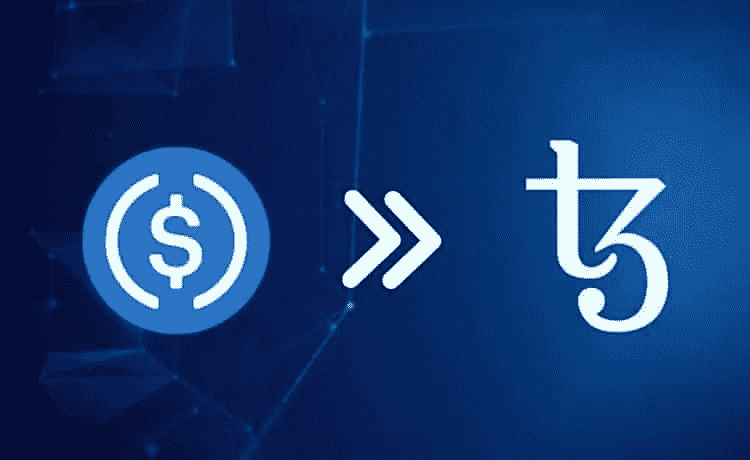
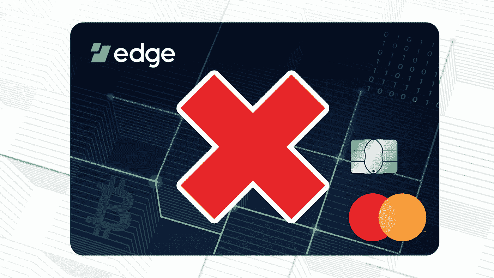

# 六月份的顶级加密新闻标题第二部分

> 原文：<https://medium.com/coinmonks/top-crypto-news-headlines-for-june-pt-2-cad956eefa66?source=collection_archive---------69----------------------->

六月到目前为止，发生了很多事件、新闻和更新，尤其是在六月的第二周，这里有一些你可能想重温的。

## PAYPAL 最终接受加密

仍在 crypto 的一周，PayPal 终于同意在其平台上支持不同加密货币的转移。这意味着用户现在可以在 PayPal 上发送、接收和存放受支持的密码。

你现在可以向你的 PayPal 帐户发送一些受支持的密码，如比特币、以太坊、莱特币等，并从 PayPal 向不同的密码交易所、硬件或软件钱包发送同样的信息。

## 泰索斯·区块链的大动作

在 Luna stable 硬币崩溃期间，Tether 正在采取一项革命性的举措，以确保其成为领先的加密货币稳定硬币之一。

Tether 已经在包括以太坊在内的 11 个不同的区块链推出，最近刚刚宣布在 Tezos 区块链推出，使其成为第 12 个区块链。

根据 tether 首席技术官 Paolo Ardino 的说法，此次发布将有助于 Tether 的长期发展。那么，你觉得这次发布会怎么样？

# 埃隆·马斯克请求获取 TWITTER 原始数据

特斯拉的所有者埃隆·马斯克(Elon Musk)也在 4 月份刚刚收购了 twitter，他要求 twitter 提供数亿条每日推文的原始数据文件，以解决机器人、垃圾邮件和虚假账户问题。

我们都知道这些虚假账号在社交媒体上造成的危害。但是，你觉得仅仅为了鉴定这个就公开几百万的用户数据是对的吗？

# [EDGE 禁用“机密万事达卡”](https://coinmarketcap.com/alexandria/article/edge-disables-confidential-mastercard-after-pushback-from-credit-card-giant)

根据 Coinmarketcap 上的一篇帖子，万事达卡谴责其推出的保密信用卡。

Edge 宣布，这种卡的特点之一是，一个匿名的人可以用这种卡在世界任何地方每天进行 1000 美元的交易。

你觉得这是个好机会还是洗钱的机会？请在评论区分享你的观点。

**不管怎样，这是我们一周的简要回顾。别忘了点击“喜欢”按钮，订阅我的页面获取更多的加密新闻。**

# 关于作者

Igwe Ihuoma Patience 是一名自学成才的创意和特定行业内容作家，也是一名加密货币爱好者，拥有 2 年多的经验和不断发展的区块链空间的知识。

我擅长内容创作、文案撰写、字幕管理、视频编辑和手机图形设计，我教其他人如何在加密货币和区块链领域起步，我的目标是让区块链的学习和更新易于任何人理解。

> 加入 Coinmonks [电报频道](https://t.me/coincodecap)和 [Youtube 频道](https://www.youtube.com/c/coinmonks/videos)了解加密交易和投资

# 另外，阅读

*   [币安期货交易](https://coincodecap.com/binance-futures-trading)|[3 commas vs Mudrex vs eToro](https://coincodecap.com/mudrex-3commas-etoro)
*   [如何购买 Monero](https://coincodecap.com/buy-monero) | [IDEX 评论](https://coincodecap.com/idex-review) | [BitKan 交易机器人](https://coincodecap.com/bitkan-trading-bot)
*   [尤霍德勒 vs 科恩洛 vs 霍德诺特](/coinmonks/youhodler-vs-coinloan-vs-hodlnaut-b1050acde55a) | [Cryptohopper vs 哈斯博特](https://coincodecap.com/cryptohopper-vs-haasbot)
*   [顶级付费加密货币和区块链课程](https://coincodecap.com/blockchain-courses)
*   [MXC 交易所评论](/coinmonks/mxc-exchange-review-3af0ec1cba8c) | [Pionex vs 币安](https://coincodecap.com/pionex-vs-binance) | [Pionex 套利机器人](https://coincodecap.com/pionex-arbitrage-bot)
*   [如何在印度购买比特币？](/coinmonks/buy-bitcoin-in-india-feb50ddfef94) | [瓦济克斯审查](/coinmonks/wazirx-review-5c811b074f5b)