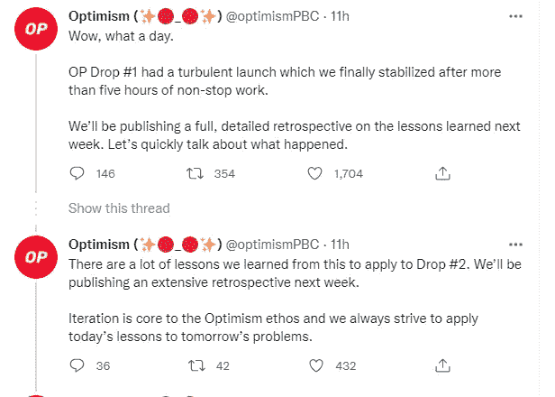
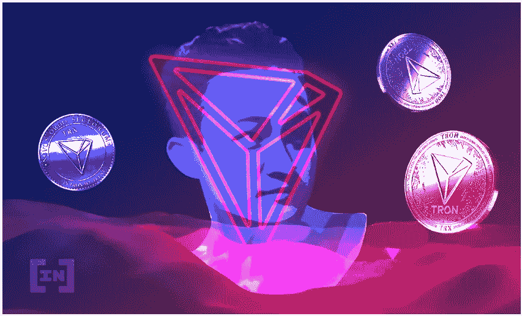
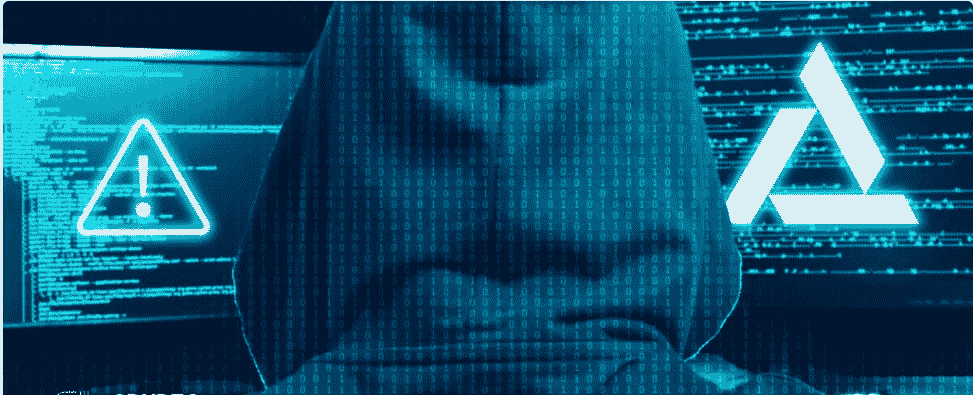

# 六月顶级加密新闻标题

> 原文：<https://medium.com/coinmonks/top-crypto-news-headlines-in-june-f3b7d7208cc5?source=collection_archive---------53----------------------->

六月的第一周发生了许多事件、新闻和更新，这里是你可能想重温的几个。

## 乐观空投传奇

期待已久的乐观令牌，据说是与空投一起发射，终于发生了，然而，空投分配并不顺利。这是因为，主网被大量的流量堵塞了，很多对失败不满意的用户在 Twitter 上表达了他们的不满。然而，乐观网络承认了它的缺陷，并向社区反馈了所发生的事情。

他们还宣布将会有第二次空投，这意味着如果你有资格空投但没有收到，那么你应该期待第二次空投。

乐观是一个以太坊第二层扩展解决方案，也已经在几个交易所推出，如 kucoin，huobi，gate.io 等。所以，如果你想购买或投资这个项目，那么你可以去任何一个交易所购买。

## 创创始人采取极端手段保护 USDD

USDD 看起来很像特拉 UST，因为他们共享几乎相同的算法。然而，在 terra 崩溃的几周前，Tron 的创始人 Justin Sun 和 terra 的创始人 Do Kwon 在一次采访中讨论了他们如何创造稳定的，能够抵抗监管干预的 coins，用 Sun 的话说，

> **“我们需要让行业内稳定的硬币像比特币一样去中心化，这样就没人能碰它了”。**

这是在区块链大地崩溃之前。现在，随着围绕 terra 崩溃的新闻铺天盖地，孙先生采取了更大的措施来确保 USDD 稳定硬币的安全，他在 2022 年 6 月 5 日宣布，他正在制定计划，以增加支持其自身稳定硬币(USDD)的资本数额。你认为这是一个明智的想法吗？

## 镜像协议黑客

在 Terra Luna 崩溃期间，Terra 网络上的一个分散金融平台 mirror protocol 被宣布因其新 terra token 的价格馈送错误而被黑客攻击超过 200 万美元。这也导致了一些大众的价值在价格上下降。问题是，他们在想什么？

**不管怎样，这是我们一周的简要回顾。别忘了点击“喜欢”按钮，订阅我的页面获取更多的加密新闻。**

> 加入 Coinmonks [电报集团](https://t.me/joinchat/Trz8jaxd6xEsBI4p)，了解加密交易和投资

# 关于作者

Igwe Ihuoma Patience 是一名自学成才的创意和特定行业内容作家，也是一名加密货币爱好者，拥有 2 年多的经验和不断发展的区块链空间的知识。

我擅长内容创作、文案撰写、字幕管理、视频编辑和手机图形设计，我教其他人如何在加密货币和区块链领域起步，我的目标是让区块链的学习和更新易于任何人理解。