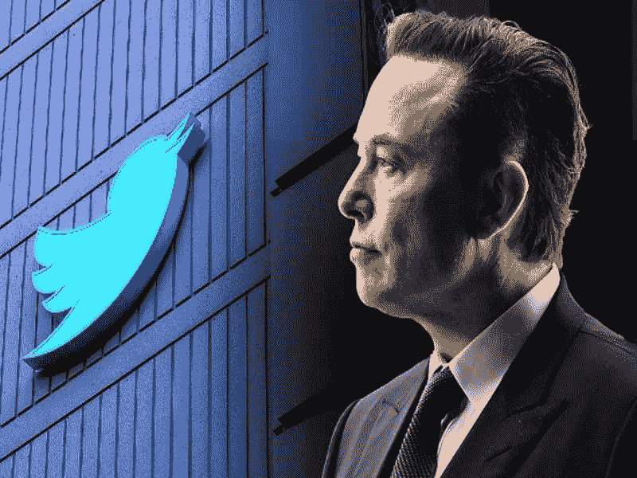
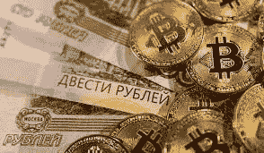

# 6 月份顶级加密新闻标题 PT3

> 原文：<https://medium.com/coinmonks/top-crypto-news-headlines-in-june-pt3-7c9e518b69d5?source=collection_archive---------30----------------------->

我们带给你另一期的区块链新闻，你可能想继续关注，在六月的第三周。以下是你可能错过的头条新闻。因此:

## COINBASE 解雇了一些员工

COINBASE 最终裁掉了大约 18%的员工。这包含在一条直接来自其首席执行官和联合创始人布莱恩·阿姆斯特朗的信息中。

他说，裁员是加密行业当前经济低迷的必然结果，我需要保护公司，让公司做好准备，应对经济衰退期间可能发生的任何不测，这甚至可能导致加密冬天。

他指出，比特币基地此前已经熬过了四个主要的加密冬天，尤其是在这种时候努力管理支出的结果。

然而，他解释说，一些一揽子计划已经到位，以减轻受影响的人将面临的任何困难。该套餐包括最少 14 周的遣散费，以及超过 1 年的每一年额外增加 2 周的雇佣期，4 个月的美国 COBRA 健康保险，4 个月的全球心理健康支持，以及进入人才中心的机会，在人才中心，比特币基地团队的成员将努力与你联系其他公司的空缺职位。

他感谢他们与比特币基地共度的时光，并祝愿他们未来一切顺利。

对此你有什么看法？你认为这是个更好的提议吗？

## 埃隆·马斯克和 TWITTER 员工之间的会议到底发生了什么？

在会议中，埃隆·马斯克(Elon Musk)坚持认为，Twitter 整合加密支付是有意义的。他进一步指出，在这一点上，货币现在基本上是数字的，并且已经有一段时间了，因此 Twitter 需要完全接受加密货币。在会议上，马斯克还表示，Twitter 也必须裁员，以便根据当前的经济现实削减支出。成本不能超过收入。

马斯克在这次虚拟会议上提出的这些问题似乎是他推迟敲定 Twitter 交易的原因，也指出了如果他在最近的时间内完成对 Twitter 的收购，他可能会走的方向。

## 加拿大需要监管加密货币

加拿大银行高级副行长 Carolyn Rogers 女士认为，中央银行不会等到加密技术变得更大时才在该领域实施监管控制。她坚持认为，加密正在以极快的速度增长，不应该继续不受监管。

根据加拿大央行的数据，2020 年加拿大人拥有比特币的比例约为 5%。然而，在 2021 年，它以指数形式增长到 13%，并一直在这条快车道上行驶到 2022 年。她进一步指出，这样一个拥有如此巨额资金和许多人资产的行业需要监管。

对此你有什么看法？你认为加密监管会破坏分散化，还是会给适当的资金管理带来机会？请在评论区分享你的观点。

这是对六月第三周 crypto 一周的简要回顾。别忘了点击“喜欢”按钮，订阅我的页面获取更多的加密新闻。

# 关于作者

Igwe Ihuoma Patience 是一名自学成才的创意和特定行业内容作家，也是一名加密货币爱好者，拥有 2 年多的经验和不断发展的区块链空间的知识。

我擅长内容创作、文案撰写、字幕管理、视频编辑和手机图形设计，我教其他人如何在加密货币和区块链领域起步，我的目标是让区块链的学习和更新易于任何人理解。

> 加入 Coinmonks [电报频道](https://t.me/coincodecap)和 [Youtube 频道](https://www.youtube.com/c/coinmonks/videos)了解加密交易和投资

# 另外，阅读

*   [分散交易所](https://coincodecap.com/what-are-decentralized-exchanges) | [比特恩斯 FIP](https://coincodecap.com/bitbns-fip) | [宾邦评论](https://coincodecap.com/bingbon-review)
*   [用信用卡购买密码的 10 个最佳地点](https://coincodecap.com/buy-crypto-with-credit-card)
*   [加拿大最佳加密交易机器人](https://coincodecap.com/5-best-crypto-trading-bots-in-canada) | [Bybit vs 币安](https://coincodecap.com/bybit-binance-moonxbt)
*   [阿联酋 5 大最佳加密交易所](https://coincodecap.com/best-crypto-exchanges-in-uae) | [SimpleSwap 评论](https://coincodecap.com/simpleswap-review)
*   购买 Dogecoin 的 7 种最佳方式 | [ZebPay 评论](https://coincodecap.com/zebpay-review)
*   [最佳期货交易信号](https://coincodecap.com/futures-trading-signals) | [流动性交易所评论](https://coincodecap.com/liquid-exchange-review)