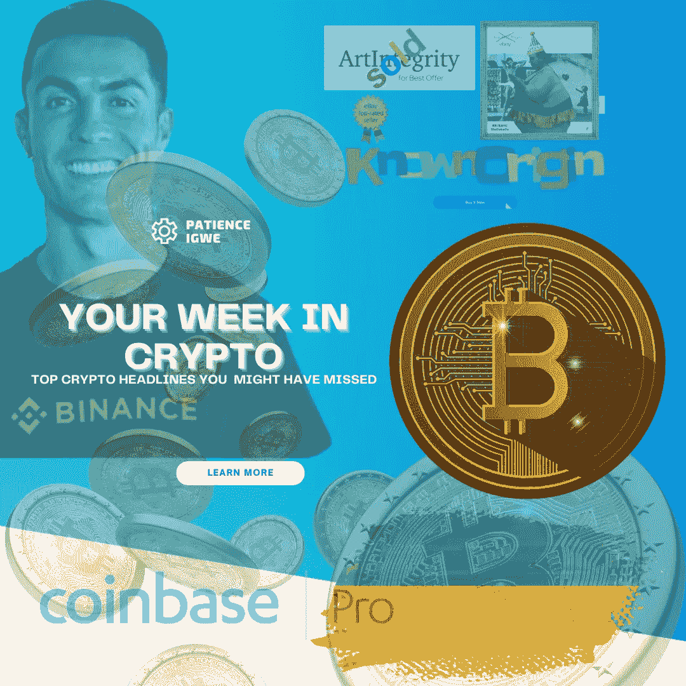
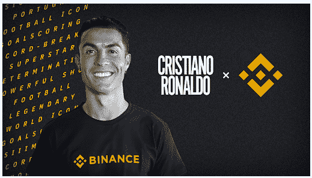
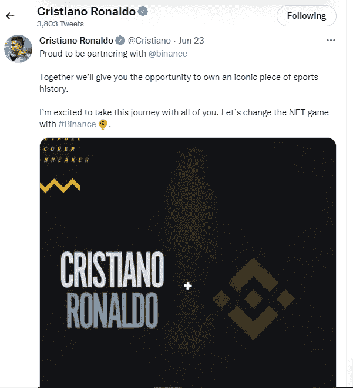
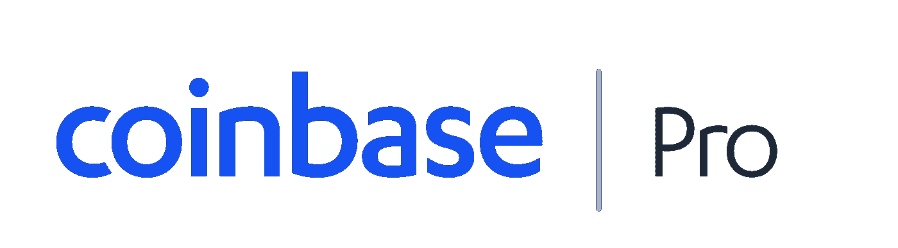
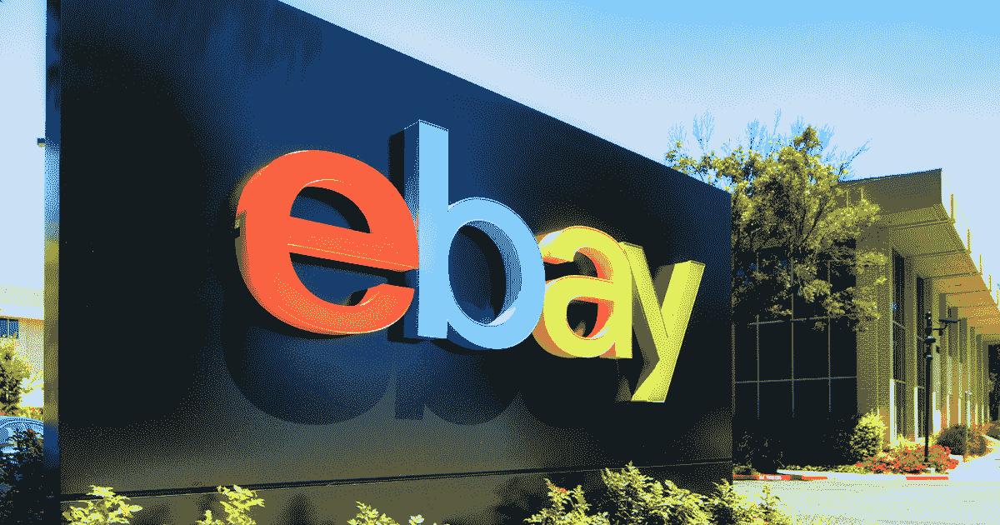
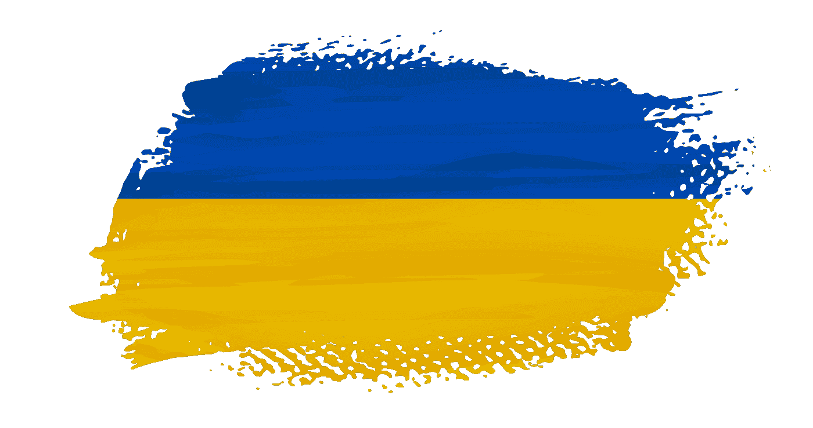
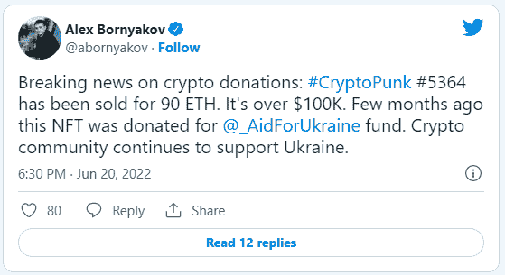
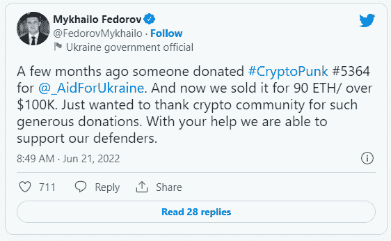

# 你可能错过的顶级加密新闻标题

> 原文：<https://medium.com/coinmonks/top-crypto-news-headlines-you-might-have-missed-d21603daaa5d?source=collection_archive---------19----------------------->

仍然是在 crypto 的这一周，这里有一些你可能错过的 6 月第 4 周的顶级加密新闻标题，因此:

## 克里斯蒂亚诺·罗纳尔多与 BIINANCE 签署独家合作协议

CR7 PARTNERS WITH BINANCE

葡萄牙足球传奇克里斯蒂亚诺·罗纳尔多，也被称为 cr7，已经在他的推特页面上发布了他与币安顶级加密货币交易所在 NFT 的多年合作伙伴关系。

他在推特上说，

“很荣幸能与@币安合作，我们将一起给你机会，让你拥有一个体育史上的标志性作品。我很高兴能和你们一起踏上这段旅程。让我们用#币安来改变 NFT 的游戏。

当他转发了由[币安](https://twitter.com/binance/status/1539969367726620674)发布的声明时，这一点得到了进一步的证实。

近年来，与体育相关的 Nft 变得越来越重要，许多足球俱乐部、球员和名人都投身于 Nft 领域，捕捉最难忘的事件，甚至创造机会与他们的粉丝在同一空间。

罗纳尔多将创造一系列 NFT 系列，这些都将在币安 Nft 市场出售，每个人都有机会拥有这些 Nft 中的任何一个。

这项合作协议无疑将改变 NFTs 的游戏规则，并为 web3 带来更多的采用。

## COINBASE PRO 正在关闭

COINBASE PRO TO SHUT DOWN

加密交易所 coinbase 最近宣布，coinbase pro(一个子集版本，提供更具技术性的交易功能，同时降低交易费用)将很快关闭。尽管还没有确定日期，但据透露，pro 功能将被 advance trade 取代，这将在主要的 coinbase 应用程序上推出。

这样做的原因是为了最大限度地降低从应用程序到专业版的切换率，因此，高级交易的推出将使 coinbase 应用程序成为一个一体化的应用程序，从而促进您的过渡，提供更多的技术功能，并降低交易费用。

## EBAY 已经加入了 NFT 游戏——购买了 NFT 市场

EBAY BUY NFT MARKETPLACE

尽管如此，在寻求将数百万买家与卖家联系起来的过程中，世界顶级电子商务网站之一的易贝加入了 Nft 游戏，他们宣布收购 NFT 市场的“KnownOrigin”，该网站“为艺术家提供一个以 Nft 形式创作独特、真实、数字收藏品的地方”。

由于我们越来越认识到 web3 的增长和采用，易贝的这个新市场肯定会使它更加相关，并为其平台带来更多用户。

## CRYPTOPUNK 为乌克兰筹集资金

CRYPTOPUNK RAISES CASH FOR UKRAINE

加密作为良好经济管理的替代工具的地位是显而易见的，因为乌克兰政府通过出售价值 90 ETH 的加密朋克 NFT 筹集了超过 100，000 美元。

这是由数字转型部长米哈伊洛·费多罗夫和他的副手亚历山大·博尔尼亚科夫在社交媒体上宣布的，他们在推特上说，这个独特的收藏品被一位不知名的投资者以 90 ethers ( [ETH](https://markets.bitcoin.com/crypto/ETH) )的价格收购。

对于我们中一些可能不知道什么是隐朋克的人来说，隐朋克是以太坊区块链上的 NFT 收藏。这是 2017 年推出的首批加密收藏品之一。

自从邻国乌克兰入侵以来，国际社会一直通过使用 cryptos、NFT 等数字资产为乌克兰提供资金支持，Cryptopunk 就是众多捐赠的 NFT 之一。

这是对六月第四周 crypto 一周的简要回顾。不要忘记点击“喜欢”按钮，订阅我的页面以获取更多的加密新闻和更新。

感谢阅读

# 关于作者

Igwe Ihuoma Patience 是一名自学成才的创意和特定行业内容作家，也是一名加密货币爱好者，拥有 2 年多的经验和不断发展的区块链空间的知识。

我擅长内容创作、文案撰写、字幕管理、视频编辑和手机图形设计，我教其他人如何在加密货币和区块链领域起步，我的目标是让区块链的学习和更新易于任何人理解。

> 加入 Coinmonks [电报频道](https://t.me/coincodecap)和 [Youtube 频道](https://www.youtube.com/c/coinmonks/videos)了解加密交易和投资

# 另外，阅读

*   [用于 Huobi 的加密交易信号](https://coincodecap.com/huobi-crypto-trading-signals) | [HitBTC 审查](/coinmonks/hitbtc-review-c5143c5d53c2)
*   [TraderWagon 回顾](https://coincodecap.com/traderwagon-review) | [北海巨妖 vs 双子星 vs BitYard](https://coincodecap.com/kraken-vs-gemini-vs-bityard)
*   [如何在 FTX 交易所交易期货](https://coincodecap.com/ftx-futures-trading)
*   [OKEx vs KuCoin](https://coincodecap.com/okex-kucoin) | [摄氏替代品](https://coincodecap.com/celsius-alternatives) | [如何购买 VeChain](https://coincodecap.com/buy-vechain)
*   [ProfitFarmers 回顾](https://coincodecap.com/profitfarmers-review) | [如何使用 Cornix 交易机器人](https://coincodecap.com/cornix-trading-bot)
*   [如何匿名购买比特币](https://coincodecap.com/buy-bitcoin-anonymously) | [比特币现金钱包](https://coincodecap.com/bitcoin-cash-wallets)