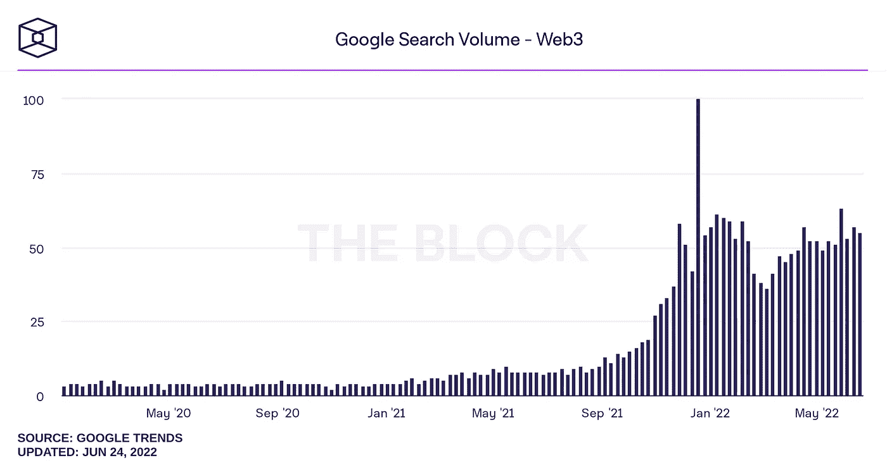
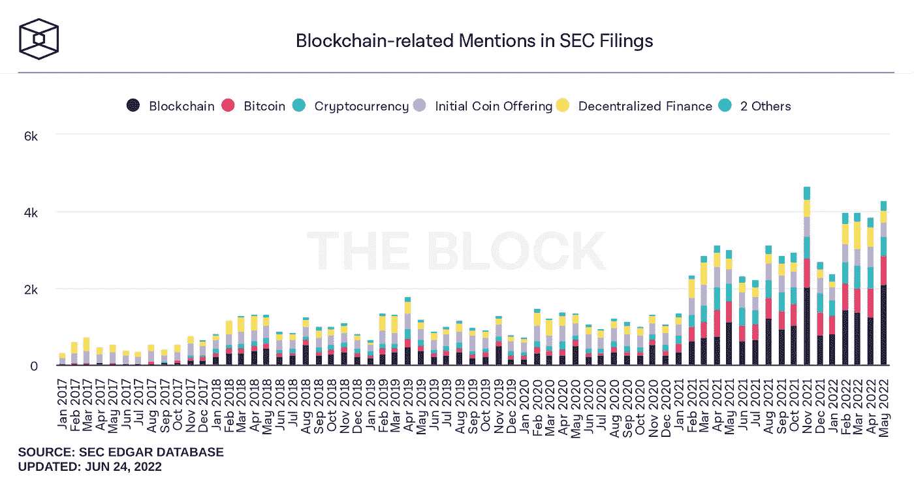

# 顶级秘密故事(6 月 18 日至 6 月 26 日)

> 原文：<https://medium.com/coinmonks/top-crypto-stories-june-18-june-26-f301137434bc?source=collection_archive---------27----------------------->

去杠杆化和去风险化的后果一直持续到 6 月底。然而，有趣的是参与者 TradFi 遇到 DeFi 的另一个例子。

加密贷款平台 BlockFi 已经从 FTX 获得了循环信贷便利。总部位于巴哈马的加密货币交易所无疑是主要的市场领导者，在没有裁员的情况下度过了低迷时期，同时保持了稳健的财务状况，并增加了影响力。

Celsius 早些时候暂停了从其平台的提款，因为其杠杆头寸的清算影响了其获得现金的能力，该公司正寻求高盛的帮助。Coindesk 报道了 TradFi 投资银行如何通过公司重组购买该银行资产的计划。

最后，与 Luna/Terra 倒闭案有关的四面楚歌的对冲基金 3AC 正走向破产法庭，并带走了其他人。总部位于温哥华的 Voyager Digital 已经限制了提款，并就借给对冲基金的资金向 3AC 发出了违约通知。

一如既往地以积极的方式结束。Solana 是 FTX 的一个关联项目，它宣布了一项基于其网络和技术堆栈开发智能手机的计划，该计划被恰当地命名为 Solana Mobile Stack。尽管构建硬件并非易事，但其网络以能够以最低成本处理最大交易吞吐量而闻名(当它启动并运行时)。

移动电话项目看起来是一个重大的发展，为目前的现状提供了一个 Web3 的替代方案。该项目将整合基于 Solana 的应用程序、钱包和支付功能，与 Android 操作系统一起运行。

最后，互联网搜索数据和美国证券交易委员会的文件显示，更广泛的公众和企业都保持了他们对加密空间的兴趣和好奇心。尽管代币价格出现波动，这两个指标仍保持在原有水平。

FTX 向 BlockFi 提供 2.5 亿美元信贷时，班克曼-弗里德说“一切正常”

 [## FTX 向 BlockFi 提供 2.5 亿美元信贷时，班克曼-弗里德说,“一切正常。”

### 加密贷款平台 BlockFi 已经从第二大加密平台 FTX 获得了 2.5 亿美元的循环信用额度

thedefiant.io](https://thedefiant.io/ftx-lends-blockfi-250m/) 

**高盛牵头投资集团购买 Celsius 资产:消息来源**

 [## 消息来源:高盛牵头投资集团购买 Celsius 资产

### Tracy Wang 是 CoinDesk 的高级记者。她拥有 BTC、ETH、MINA、ENS、各种 stablecoins 和一些 NFT。高盛…

www.coindesk.com](https://www.coindesk.com/business/2022/06/24/goldman-sachs-raising-funds-to-buy-celsius-assets-sources/) 

**债权人发出三记最后通牒，要么偿还 6 . 58 亿美元债务，要么面临违约**

 [## 债权人发出三支箭，最后通牒，要么偿还 6 . 58 亿美元债务，要么面临违约——这是挑衅

### 三箭资本必须在 6 月 27 日之前拿出 6.58 亿美元，否则将被一家正在运营的贷款机构推至违约

thedefiant.io](https://thedefiant.io/creditor-slaps-three-arrows-with-ultimatum-to-pay-658m-in-debt-or-face-default/) 

**鲍威尔表示，美联储正在评估 SEC 对数字资产托管的立场**

 [## 鲍威尔称，美联储评估 SEC 对数字资产托管的立场

### 杰西·汉密尔顿是 CoinDesk 负责全球政策和监管的副执行主编。他没有任何密码。美国…

www.coindesk.com](https://www.coindesk.com/policy/2022/06/22/us-fed-evaluating-secs-position-on-digital-assets-custody-powell-says/) 

**比特币基地将逐步淘汰对交易者友好的“专业”交易所**

 [## 比特币基地将逐步淘汰对交易者友好的“专业”交易所-解密

### 比特币基地今天宣布，它计划停止其先进的，以交易者为中心的比特币基地专业服务，由年底…

decrypt.co](https://decrypt.co/103611/coinbase-to-phase-out-trader-friendly-pro-exchange) 

**索拉纳开发智能手机加速 Web3 的应用**

 [## 索拉纳将开发智能手机以加速 Web3 的采用

### 索拉纳在 6 月 23 日宣布，它正在开发一款智能手机，这是一个大胆的举动，旨在推动 web3 的采用。是的…

thedefiant.io](https://thedefiant.io/solana-mobile-phone-saga/?utm_source=substack&utm_medium=email) 

本周图表:

Crypto and Web3 retains and grows mindshare of the wider public. Despite crypto volatility and uncertainty Web3 weekly Google searches maintain consistant levels.

More importantly, corporate interest in blockchain retains a high level. Companies mentions of blockchain and cryptocurrency in their SEC filings maintain their levels as companies plot their course into the space.

> 加入 Coinmonks [电报频道](https://t.me/coincodecap)和 [Youtube 频道](https://www.youtube.com/c/coinmonks/videos)了解加密交易和投资

# 另外，阅读

*   [加密交易机器人](/coinmonks/crypto-trading-bot-c2ffce8acb2a) | [OKEx vs 币安](https://coincodecap.com/okex-vs-binance)
*   [币安 vs FTX](https://coincodecap.com/binance-vs-ftx) | [最佳(SOL)索拉纳钱包](https://coincodecap.com/solana-wallets)
*   [如何在 Uniswap 上交换加密？](https://coincodecap.com/swap-crypto-on-uniswap) | [A-Ads 审查](https://coincodecap.com/a-ads-review)
*   [加密货币储蓄账户](/coinmonks/cryptocurrency-savings-accounts-be3bc0feffbf) | [YoBit 评论](/coinmonks/yobit-review-175464162c62)
*   [Botsfolio vs nap bots vs Mudrex](/coinmonks/botsfolio-vs-napbots-vs-mudrex-c81344970c02)|[gate . io 交流回顾](/coinmonks/gate-io-exchange-review-61bf87b7078f)
*   [CoinFLEX 评论](https://coincodecap.com/coinflex-review) | [AEX 交易所评论](https://coincodecap.com/aex-exchange-review) | [UPbit 评论](https://coincodecap.com/upbit-review)