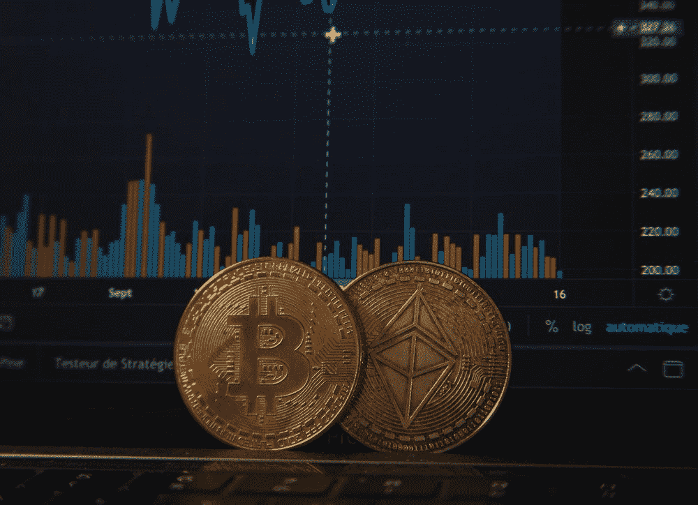

# 尼日利亚顶级加密货币应用

> 原文：<https://medium.com/coinmonks/top-cryptocurrency-apps-in-nigeria-8bd297d247db?source=collection_archive---------31----------------------->

应用程序比网站灵活得多，但是也有一些特性让应用程序脱颖而出。作为一个加密爱好者，移动加密应用程序是必要的，你可以轻松地与市场保持联系。围绕“哪款应用最适合加密领域的交易？”这一话题展开了讨论。我们将看看尼日利亚最好的加密交易应用程序。

多年来，不同的金融科技公司推出了各种平台来促进加密交易。我们将深入探讨其中一些应用程序及其功能。选择尼日利亚最好的加密货币交易所对任何人来说都是一项艰巨的任务，尤其是对该领域的新手来说。有几个选项可供选择，决定哪一个最适合你可能是一项非常困难的任务，所以我们将分析尼日利亚的交易所类型、尼日利亚的顶级交易所平台及其特点。

**尼日利亚的交易所类型**
尼日利亚的加密领域有不同类型的交易所，在进入加密领域之前了解这些交易所非常重要。

1.  集中式交易所:集中式交易所是法定货币(如美元)或加密货币资产(如 BTC 和 ETH)之间的加密交易场所。属于这一类别的热门交易所有币安、北海巨妖、Kucoin、Gate.io 和 Bitfinex。它们在交易中充当可信的中介，通过存储和保护您的资金发挥作用。
2.  分散交易所:分散交易所(DEX)是一个点对点市场，用户可以以非托管方式交易加密货币，而不需要中介来促进交易或托管他们的资金。没有机构监督或监管交易。分散平台在区块链网络之上运行，由智能合约提供支持。用户完全负责保管他们的资金。这类受欢迎的交易所包括:双子座、Crypto.com 和比特币基地。

**尼日利亚顶级加密货币应用**

1.  币安:这是世界上最受欢迎的交易所之一。它的应用程序对初学者来说还行，界面美观，易于使用。他们有大量的密码可以交易。play store 和 AppStore 上都有。
2.  Dart Africa: [Dart Africa](http://dartafrica.io) 仍然是尼日利亚交易比特币和其他加密现金的最佳平台，因为其支付速度快，利率优惠。该平台允许您以安全的方式在线销售加密货币。他们随时提供尼日利亚最好的加密速率，平台配备了速率计算器。要开始交易，[在 Play Store 和 App Store 上下载“Dart Africa”](https://play.google.com/store/apps/details?id=com.dartafrica&gl=US)应用程序，轻松开始交易加密。
3.  Luno: Luno 也是尼日利亚最受欢迎的加密货币交易所之一。这是一个平面加密交换平台。它有一个免费存款和低取款费用的用户友好的界面。Play Store 和 AppStore 上都有
4.  Roqqu:另一个流行的加密交换应用程序是 Roqqu，它的安全和快速的支付结构使它在尼日利亚人中很受欢迎。在 Roqqu 上，很容易购买、出售和保存您的加密资产。
5.  Kucoin: KuCoin 是一个国际加密货币交易所，允许用户购买、出售和交易加密资产。其平台还允许用户使用保证金、期货和 P2P 交易。对于有兴趣投资或出借密码的用户，KuCoin 提供了下注和出借选项。
6.  Paxful: Paxful 是一个交易加密货币的点对点平台。该平台促进了买家和卖家之间的加密货币直接交换。
7.  Yellowcard.io: Yellow Card 是一家声誉良好的加密货币交易所，让你可以在尼日利亚安全方便地买卖比特币。

加密货币是一个新兴的不断增长的市场，因此，在交易时选择一个声誉良好的平台非常重要。一个可靠的平台将为您提供交易时做出明智决策所需的工具和资源，以及出现问题时的支持。寻找安全措施强的平台。在注册之前，一定要彻底研究每一个平台，这样你就可以确信你正在为你的投资做出最好的决定。

> 加入 Coinmonks [电报频道](https://t.me/coincodecap)和 [Youtube 频道](https://www.youtube.com/c/coinmonks/videos)获取每日[加密新闻](http://coincodecap.com/)

# 另外，阅读

*   [如何购买 Monero](https://coincodecap.com/buy-monero) | [IDEX 评论](https://coincodecap.com/idex-review) | [BitKan 交易机器人](https://coincodecap.com/bitkan-trading-bot)
*   [CoinDCX 评论](/coinmonks/coindcx-review-8444db3621a2) | [加密保证金交易交易所](https://coincodecap.com/crypto-margin-trading-exchanges)
*   [红狗赌场评论](https://coincodecap.com/red-dog-casino-review) | [Swyftx 评论](https://coincodecap.com/swyftx-review) | [CoinGate 评论](https://coincodecap.com/coingate-review)
*   [Bookmap 评论](https://coincodecap.com/bookmap-review-2021-best-trading-software) | [美国 5 大最佳加密交易所](https://coincodecap.com/crypto-exchange-usa)
*   [如何在 FTX 交易所交易期货](https://coincodecap.com/ftx-futures-trading) | [OKEx vs 币安](https://coincodecap.com/okex-vs-binance)
*   [CoinLoan 评论](https://coincodecap.com/coinloan-review) | [YouHodler 评论](/coinmonks/youhodler-4-easy-ways-to-make-money-98969b9689f2) | [BlockFi 评论](https://coincodecap.com/blockfi-review)
*   [XT.COM 评论](https://coincodecap.com/profittradingapp-for-binance)币安评论 |