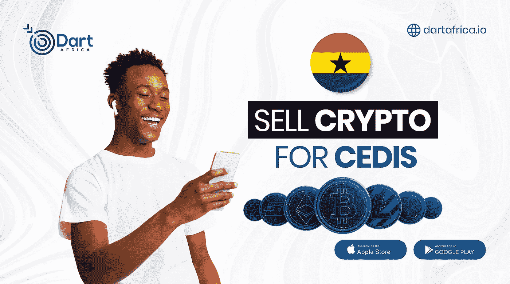

# 加纳顶级加密货币交易所

> 原文：<https://medium.com/coinmonks/top-cryptocurrency-exchange-in-ghana-a137531bdc58?source=collection_archive---------55----------------------->

加密货币是一种数字或虚拟货币，它使用一种加密机制来保证安全性，这使得重复消费或伪造几乎不可能。大多数加密货币是基于区块链技术的分散式网络。区块链是由各种计算机节点维护的公共分布式账本。加密货币的关键挑战在于其分散性，它不受任何中央机构的控制或监控，这使得它们在理论上不受政府干预或操纵。

加密货币可以从加密交换平台挖掘或购买。加密货币正逐渐被零售店接受，但并非所有网站都接受加密支付。然而，加密价值的不断增加使它们成为流行的交易工具。在某种程度上，它们也被用于跨境转移。

**加密货币的种类**

比特币是最有价值、最古老的加密货币。一个名叫中本聪的假名人物创造了它，并在 2008 年通过一份白皮书向世界介绍了它。如今的加密市场充斥着一千多枚加密硬币。

每个密码都有不同的目的或功能。例如，比特币被创造出来作为现金的替代品，以太声称是以太坊智能合约的气体，XRP 被银行用来刺激不同地理位置之间的转移。

比特币于 2009 年向公众开放，目前仍是交易和覆盖最广的加密货币。截至 2022 年 5 月，流通中的比特币超过 1900 万个，总市值超过 6000 亿美元。只有 2100 万个比特币能够存在。

## **加密货币合法吗？**

法定货币作为支付手段的权威来自政府或中央货币当局。例如，每一美元钞票都由美联储支持。

但加密货币没有任何政府或金融机构的支持。因此，在世界不同的金融管辖区证明它们的法律地位是一项挑战。加密货币能够在任何金融监管之外发挥作用的事实无助于证明它们在世界上的合法性。

加密货币多年来在全球市场上获得了认可，这要归功于它在特斯拉等大公司以及有时在一些国家的认可。这些年来，它经历了起起落落，加密货币仍然是一个不断发展的概念，仍然有很多东西有待发现。

如果你想出售加密货币，这里有一些平台，你可以很容易地在加纳把它卖出去换成现金。

## [**镖非洲**](http://dartafrica.io) :

Sell Crypto For Cedis

[Dart Africa](http://dartafrica.io/) 是领先的加密货币交易平台，在非洲销售包括比特币在内的各类加密货币。Dart Africa 已经能够拉近客户对加密交换平台的期望与最终交付的服务之间的差距。如果你在 Dart Africa 的网站上出售你的比特币，支付是即时的。加纳人和尼日利亚人都可以参加 Dart Africa。

Dart Africa 提供外汇市场上最好的汇率之一。尽管 crypto 的价值不断变化，Dart Africa 提供的汇率始终对客户有利。您可以随时使用 [Dart Africa 的硬币计算器](https://dartafrica.io/coincalculator)来检查您的加密硬币的当前汇率。

您可以通过访问他们的[网站](http://dartafrica.io)或通过在 [Play Store](https://play.google.com/store/apps/details?id=com.dartafrica&hl=en_US&gl=US) 和 App Store 下载的移动应用程序来访问 Dart Africa 的交换服务。该平台采用用户友好型设计，便于用户在上面进行交易。

**支持的加密硬币**

*   比特币
*   以太坊
*   莱特币
*   Dogecoin
*   泰达币
*   USDC
*   BUSD

[今天在 Dart Africa 上出售您的加密货币](http://dartafrica.io)

## **BitAfrika**

BitAfrika 成立于 2017 年，是加纳当地的一个加密交易所，允许你买卖加密资产，它有一个内置的加密钱包来存储你的加密货币。

如果你想在当地交易加密货币，BitAfrika 让用户有机会在加纳当地购买比特币、Dogecoin、莱特币和比特币现金。

要创建一个账户，用户必须完成一个强制性的 KYC(了解你的客户)表格。BitAfrika 与大多数合法的本地加密交易所一样，遵循严格的反洗钱政策，遵守全球加密规则和法规，以保护客户免遭盗窃和犯罪。

BitAfrika 有 1.5%的标准化费用在平台上购买加密货币。菲亚特取款从 BitAfrika 的本地支付处理器中提取 1%的取款费。

## **息税前利润点**

eBitPoint 是一家位于加纳的加密货币交易所，它允许您购买、出售和交换加密资产。

eBitPoint 主要向加纳市场提供服务，允许客户直接存入加纳塞地以换取加密货币。该平台支持比特币、以太坊、BCH、LTC、DASH 和 XRP 的交易。

> 加入 Coinmonks [电报频道](https://t.me/coincodecap)和 [Youtube 频道](https://www.youtube.com/c/coinmonks/videos)了解加密交易和投资

# 另外，阅读

*   [从 WazirX 转向 CoinDCX 的 5 个理由](https://coincodecap.com/reasons-to-switch-from-wazirx-to-coindcx)
*   [Unocoin 评论](https://coincodecap.com/unocoin-review) | [最佳加密赌注硬币](https://coincodecap.com/best-crypto-staking-coins)
*   [如何使用 MetaMask Wallet 获取 KCC 地址？](https://coincodecap.com/kcc-address-metamask)
*   [如何获得自己的。XYZ 领域？](https://coincodecap.com/xyz-domain)
*   [最佳加密交换平台](https://coincodecap.com/best-crypto-swap-platforms) | [最佳加密交易所](https://coincodecap.com/crypto-exchange)
*   [购买比特币印度](/coinmonks/buy-bitcoin-in-india-feb50ddfef94) | [Pionex 评论](/coinmonks/pionex-review-exchange-with-crypto-trading-bot-1e459d0191ea) | [加密交易机器人](/coinmonks/crypto-trading-bot-c2ffce8acb2a)