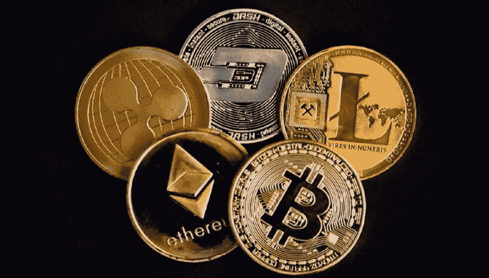

# 2022 年最值得购买的加密货币

> 原文：<https://medium.com/coinmonks/top-cryptocurrency-to-buy-in-2022-b70184404400?source=collection_archive---------36----------------------->

过去几年，加密货币一直是一个蓬勃发展的行业。越来越多的人对它感兴趣，它正在成为一个受欢迎的投资选择。但随着如此多的新加密货币进入市场，很难知道哪种货币在未来表现最好。这就是为什么我做了研究，并提出了 2022 年我的十大加密货币名单。

Top Cryptocurrency To Buy In 2022

# 比特币

比特币是最受欢迎的加密货币，也是最古老的。尽管现实世界中的用例数量有限，但它通常被用作加密货币的参考点。

虽然由于缺乏实用性，比特币可能不是 2022 年购买的最佳加密货币，但它在今天的市场上仍然很有价值和受欢迎。

# 以太坊

以太坊是一个运行智能合约的分散平台:应用程序完全按照编程运行，没有任何停机、审查、欺诈或第三方干扰的可能性。

以太坊是一个允许开发者创建去中心化应用(dApps)的平台。这些 dApps 在定制的区块链上运行，这是一个非常强大的共享全球基础设施，可以移动价值并代表财产的所有权。

这使得开发商能够创建市场，存储债务或承诺的登记册，根据很久以前发出的指令(如遗嘱或期货合同)转移资金，以及许多其他尚未发明的东西，所有这些都没有中间人或交易对手的风险。

# 新的

NEO 是一个基于社区的非营利性区块链项目，它利用区块链技术和数字身份将资产数字化，使用智能合同自动管理数字资产，并通过分布式网络实现“智能经济”。

简而言之，它是一个内置商务的智能合同平台。

NEO 通常被称为“中国以太坊”，因为它的运作方式与以太坊非常相似。它允许开发者在其区块链之上构建分散式应用(dApps ),就像以太坊为以太/以太坊令牌所做的那样。但是 NEO 和以太坊等其他平台有什么不同呢？让我们来看看您应该投资 NEO 的 3 个原因:

# XRP 代币

Ripple 是一个实时支付结算系统(RTGS)、货币兑换和汇款网络。它每秒可以处理多达 1500 个事务，能够快速适应数量不断增加的事务。

Ripple 的目标是改善世界各地人们的金融服务，它已被许多银行和支付提供商采用，作为一种将资金从一个国家或货币无缝转移到另一个国家或货币的方式。这使得它与比特币和以太坊等主要作为投资工具或价值储存手段的其他加密货币非常不同。

# 莱特币

Litecoin 是一个对等加密货币和开源软件项目，在 MIT/X11 许可下发布。硬币的创造和转移是基于一个开放源码的加密协议，不受任何中央机构的管理。莱特币是早期的比特币衍生产品或 altcoin，始于 2011 年 10 月。

它是由查理·李创建的，他是谷歌的一名工程师，后来创建了比特币基地，现在仍担任工程总监。他从流行的视频游戏“超级马里奥兄弟”中得出了它的名字:“Lite”(光的日语发音)加硬币。

自比特币推出以来，相对于比特币的莱特币数量已经增长，其市值从 2017 年 5 月的 10 亿美元增长到 2018 年 2 月的 70 亿美元。

# 莫内罗

最受欢迎的加密货币之一是 Monero。它于 2014 年 4 月推出，并继续受到欢迎，因为它为用户提供隐私和匿名。对于那些希望保持交易私密的人来说，这是一种很好的加密货币，但还有其他原因让你可能想考虑投资 Monero:

*   无交易费
*   快速付款确认(2 分钟)
*   由于其区块链架构，安全可靠，不会受到黑客攻击

要了解更多关于 Monero 的信息，请查看他们的网站或阅读我们关于如何购买 Monero 的文章。

# 破折号

Dash 是一种加密货币，最初被称为 XCoin，后来被称为 Darkcoin，最后被更名为 Dash。它是比特币的一个分支，旨在成为世界上最用户友好和链上可扩展的加密货币。

Dash 具有即时交易确认、双重支出保护、由激励性全节点驱动的自我管理、自我融资模式，以及使用称为“主节点”的定制硬件在链上扩展到高达 400MB 数据块的清晰路线图，这些硬件因参与而获得奖励。

该项目通过 2014 年的首次硬币发行(ICO)获得了资金。

# 能母

NEM 是一个点对点加密货币和区块链平台，于 2015 年 3 月 31 日推出。NEM 有一个广泛分布模型的既定目标，并引入了区块链技术的新功能，如其重要性证明(POI)算法。

NEM 区块链公司的软件被用于名为 Mijin 的商业区块链，日本和国际上的金融机构和私营公司正在对其进行测试。

# 比特币现金

比特币现金是由于如何扩大比特币规模的争论而发生的硬分叉的结果。该协议的块大小为 8MB，比比特币区块链上的传统块大小大得多。

它还拥有 2100 万枚硬币的总供应量，而比特币的总供应量为 2100 万枚。其交易费用通常为 0.05 美元，这使得它非常适合不紧急或需要立即处理的交易，因为交易可能需要 10 分钟到 1 小时不等，具体取决于网络的繁忙程度。同样值得一提的是，您可以通过我们的兑换服务使用 BCH 购买其他加密货币

# 奥米塞戈

OmiseGo 是一个完全分散的交易所、流动性提供者机制、票据交换所信息网络和资产支持的区块链网关。根据 OmiseGo (Omise)的官方网站，这是一种基于公共以太坊的金融技术，用于主流数字钱包，实现跨管辖区和组织孤岛的实时点对点价值交换和支付服务。

OmiseGO 背后的团队正在建立一个分散的交易所，该交易所将建立在以太坊区块链的基础上，允许以低成本即时交换资产。OmiseGo token 在 2017 年的一次 ICO 期间出售，仅在 5 分钟内就筹集了 2500 万美元！

众所周知，加密货币是一个新兴的动态市场，难以预测。然而，有一些加密货币，我们可以相当肯定地说，在未来仍将是强有力的竞争者。你必须在投资前进行彻底的研究，但如果你想对加密货币进行长期投资，那么这 10 种加密货币绝对应该在你的考虑范围之内。

> 加入 Coinmonks [电报频道](https://t.me/coincodecap)和 [Youtube 频道](https://www.youtube.com/c/coinmonks/videos)了解加密交易和投资

# 另外，阅读

*   [OKEx vs KuCoin](https://coincodecap.com/okex-kucoin) | [摄氏替代品](https://coincodecap.com/celsius-alternatives) | [如何购买 VeChain](https://coincodecap.com/buy-vechain)
*   [ProfitFarmers 回顾](https://coincodecap.com/profitfarmers-review) | [如何使用 Cornix Trading Bot](https://coincodecap.com/cornix-trading-bot)
*   [如何匿名购买比特币](https://coincodecap.com/buy-bitcoin-anonymously) | [比特币现金钱包](https://coincodecap.com/bitcoin-cash-wallets)
*   [瓦济里克斯 NFT 评论](https://coincodecap.com/wazirx-nft-review) | [比茨盖普 vs 皮奥克斯](https://coincodecap.com/bitsgap-vs-pionex) | [坦吉姆评论](https://coincodecap.com/tangem-wallet-review)
*   [如何使用 Solidity 在以太坊上创建 DApp？](https://coincodecap.com/create-a-dapp-on-ethereum-using-solidity)