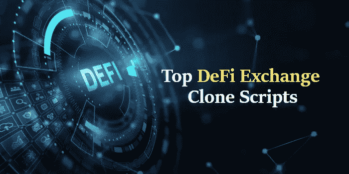

# 顶级 DeFi Exchange 克隆脚本

> 原文：<https://medium.com/coinmonks/top-defi-exchange-clone-scripts-bc4857314dc4?source=collection_archive---------14----------------------->

DeFi exchange 是一个加密货币交易所，它优先考虑去中心化方面。与大多数交易所不同，DeFi 交易所作为加密交换机制运行，因为它便于用户将一个加密货币令牌交换为另一个相同标准的加密货币令牌。

目前，加密领域相当一部分加密货币用户正在转向 DeFi 交易所。这是因为大多数集中交易在看涨或看跌趋势之间不断波动。这增加了交易的风险。但是，在 DeFi 交易所，交易不是唯一的选择，你可以借入、借出、赚取利息、交易衍生品、交易资产和投资加密保险。DeFi 交易所本质上表现得像一个分散的银行系统，而不仅仅是一个加密货币市场。此外，一些专家声称 DeFi 是加密生态系统的未来。

这就是 DeFi exchange 克隆脚本发挥作用的地方。对于所有对加密市场感兴趣的企业家来说，DEX 克隆脚本是在 DeFi 交换平台上起步的方法。

# **什么是 DeFi Exchange 克隆脚本？**

DeFi exchange 克隆脚本是现成的软件包，使初创公司能够创建一个新的 DeFi 平台。您创建的平台将包含目前存在于各种其他 DEX 平台中的所有功能，而且还带有额外的补充功能。此外，这些克隆脚本采用集成了顶级安全特性的加密技术。

DeFi exchange 克隆软件拥有最新的分散式架构，具有分散式金融机构的所有优势。除此之外，该软件带有灵活的代码，为您提供了大量的定制选项。换句话说，你可以很容易地改变软件的特性、功能、视觉美感等等，以适应你的口味。如果你想以玩家的身份快速进入加密市场，那么最好的方法就是启动你的 DeFi 交易所。而最简单的入门方式就是选择合适的 DeFi exchange 克隆脚本和合适的公司为你提供。

# **DeFi Exchange 克隆脚本如何帮助您启动 DEX 平台？**

随着对 DeFi 领域兴趣的增长，现在是您通过创建自己的 DeFi 交换平台进入密码市场的时候了。但是你可能想知道如何建立一个 DeFi 交易所 。我会告诉你，但在此之前，请记住，创办任何企业都很困难，而一家 DeFi 交易所也不例外，然而，与此同时，这也不是一项不可能的任务。正如我所知的最新密码市场，我有一个快速的解决方案给你。从头开始创建一个 DeFi 交易所可能是一个问题，它需要时间，需要一个专门的创作者和软件专家团队，以及大量的资本。相反，可以使用克隆脚本软件创建一个 DeFi 交换平台，该软件既易于部署，风险也小得多，因为它降低了开发成本。

DeFi 行业的发展方向比许多人希望的更具创新性。因此，市场上有许多不同类型的 DeFi exchange 克隆脚本。不要担心，因为我已经将最好的 DeFi exchange clone 脚本与它的所有核心功能和它用来帮助您更好地理解的底层技术进行了排名。这样，您就可以摆脱所有的困惑，选择您认为最适合您的业务想法的最佳克隆脚本。

# **在密码市场上流行 DeFi Exchange 克隆脚本**

1.  Uniswap 克隆脚本
2.  PancakeSwap 克隆脚本
3.  SushiSwap 克隆脚本
4.  1 英寸 Exchange 克隆脚本
5.  SunSwap 克隆脚本
6.  BakerySwap 克隆脚本

# ***Uniswap 克隆脚本***

Uniswap (V3)是当今密码市场上最受欢迎的 DeFi 交易之一。它是每日交易量最高的公司之一，每天的加密交易量一直超过 10 亿美元。由于 Uniswap 是最早推出的 DeFi 交易所之一，因此将其视为企业家可以在 DeFi 加密空间中建立的基本业务类型，这不再是不可能的任务。

Uniswap clone 脚本为您提供了一个强大但可灵活定制的 DeFi exchange 平台，该平台能够提供易于使用的访问系统和内置的安全加密。你可以用这个克隆脚本在一周内建立一个像 Uniswap 这样的平台，很简单。以下是 Uniswap 克隆脚本的核心特性。

*   多块链支持
*   动态交换
*   AMM
*   代币农业
*   流动性池
*   托管人权利
*   臭虫赏金奖励系统
*   多重加密钱包支持

# ***全克隆交换克隆脚本***

PancakeSwap 是一个分散的交易所，主要用于交换 BEP20 代币，但其用户通常更喜欢其创新的流动性池。当市场上没有供给时，流动性池人为地创造需求来满足供给，从而防止市场停滞。这就是为什么 PancakeSwap 是一种可以在任何市场生存的商业模式，也是为什么如果你在寻找业务的一致性，你应该选择 [**PancakeSwap 克隆脚本**](https://www.coinsclone.com/pancakeswap-clone-script/?utm_source=medium&utm_medium=topdefi&utm_campaign=sinu) 。

PancakeSwap 克隆脚本帮助您构建一个健壮的平台，可以根据您的口味进行独特的定制。如果你正计划在币安区块链上启动 DeFi exchange，那么我向你保证 PancakeSwap 克隆脚本是你的正确选择。让我为您列出 PancakeSwap 克隆脚本的核心特性。

*   即时交换
*   AMM 模型
*   流动性池
*   已识别的飞行物(identified flying object)
*   多钱包支持
*   立桩标界
*   高产农业
*   多语言帮助

# ***SushiSwap 克隆脚本***

SushiSwap 是一个在以太坊区块链上运行的 DeFi 交换平台，支持 ERC20 代币的交换。潜在的想法是激励 DeFi 空间中的用户网络集体操作该平台。该平台旨在实现更高层次的去中心化操作，用户可以在没有管理员干预的情况下买卖密码。它本质上是一个更加分散的 Uniswap 版本。

对许多企业家来说，SushiSwap 可能是一种有吸引力的商业模式，因为作为一名管理人员，它几乎不需要你做什么工作。使用 SushiSwap 克隆脚本，您可以构建并运行一个平台，在这个平台上，职责被委托给整个社区，从而减轻您的工作量。这让您有更多的时间来探索更多的创新想法，以升级平台和改善您的业务。如果你想创建一个具有这种分散架构的平台，那么 SushiSwap 克隆脚本就是你实现这一目标的通行证。

*   用户和管理员控制面板
*   多设备兼容性
*   即时令牌交换
*   添加和移除流动性
*   加密标桩
*   密码借贷
*   流动性迁移
*   多重加密钱包支持

# ***1 英寸交换克隆脚本***

1inch 是具有智能路由的 DeFi 聚合器交换机。DeFi 聚合器平台执行与 AMM 模型相同的功能，因为它们支持交换加密，但它们在获取交易流动性的方式上有所不同。1inch 不是运行流动性池，而是从互联网上不同区块链托管的各种 DEX 平台收集流动性，以确保其用户获得最佳交易。

作为一个创业者，1inch 的聚合器模式是目前为止最好的商业模式，可以保证在最短的时间内获得最多的利润。聚合器模型的多样化令牌组学允许 1inch 克隆脚本确保所有 API 中最安全的 API。这就是为什么如果您渴望获得最快的结果，1 英寸克隆脚本是您开始的最佳方式。利用你在市场上的竞争来支持你的业务的成功，是一个甜蜜的概念，不是吗？这就是 1 英寸克隆脚本帮助您实现的目标。

*   无限令牌集成
*   多区块链支持
*   保证高流动性
*   高级 DEX 聚合器
*   多重钱包连接
*   安全 API 集成
*   端到端加密

# ***SunSwap 克隆脚本***

SunSwap (V2)是 SushiSwap 的经济替代品，除了它在 Tron 区块链上运行，主要用于交换 TRC20 代币。就像 SushiSwap 一样，运行 SunSwap 这样的平台需要很少的努力，因为它的分散程度很大。作为一个有抱负的商人，你可以利用现在的机会，开始用 SunSwap 克隆脚本做生意，以确保你的利润随着 Tron 网络的增长。

这就是为什么 SunSwap 克隆脚本可以帮助您启动进入 DeFi 行业的旅程。创新需要远见，SunSwap clone 脚本是迄今为止设计的最灵活、最可定制的软件，对于有远见但也是初学者来说，这是一个完美的工具。让我为您列出 SunSwap 克隆脚本的核心特性。

*   动态交换
*   AMM 模型
*   立桩标界
*   流动性池
*   多重钱包连接
*   高级用户界面/UX
*   多语言支持
*   综合交易登记处
*   轻松访问管理仪表板

# **T5【BakerySwap】克隆脚本 **

BakerySwap 与上述其他 DeFi 交易所不同，它是第一个在 DeFi 领域结合了 AMM 模型和 NFT 的 DEX。在币安智能链上运行，其交换设施是像 PancakeSwap 这样的 BEP20 代币所独有的，但它也内置于币安区块链上的 NFT 市场。对于希望在一个平台上经营两个业务领域的雄心勃勃的人来说，BakerySwap 是一个不错的选择。

BakerySwap 克隆脚本提供了 BakerSwap 平台的所有功能以及随之而来的 NFT 市场，更不用说可以进一步添加以使您的项目多样化的插件了。这将有助于您在 DeFi 市场和 NFT 市场同时获利。这就是为什么您应该为您的业务考虑 BakerySwap 克隆脚本。

*   DeFi 发射台
*   流动性池
*   即时交换功能
*   多钱包支持
*   高产农业
*   伊多语
*   用户友好的管理门户

# **最终想法**

DeFi 交易所是这十年来创新的金融机构，在线，分散，无许可，透明，但安全。随着对加密货币的需求不断增长以及智能合约技术的创新发展，DeFi 市场仍处于青春期。

即便如此，DeFi 空间的总市值已经达到 1200 亿美元。想象一下，当市场真正成长为成年市场时，我们会看到下一个金融行业。

这确实是采取行动的时候了，是进入 DeFi 空间的时候了，不是作为一个用户或投资者，而是作为一个企业主。因此，选择最适合您业务需求的 [**DeFi exchange 克隆脚本**](https://www.coinsclone.com/defi-exchange-development-company/?utm_source=medium&utm_medium=topdefi&utm_campaign=sinu) ，开始您的 DeFi exchange 业务之旅。

> 加入 Coinmonks [电报频道](https://t.me/coincodecap)和 [Youtube 频道](https://www.youtube.com/c/coinmonks/videos)了解加密交易和投资

# 另外，阅读

*   [CoinDCX 评论](/coinmonks/coindcx-review-8444db3621a2) | [加密保证金交易交易所](https://coincodecap.com/crypto-margin-trading-exchanges)
*   [红狗赌场评论](https://coincodecap.com/red-dog-casino-review) | [Swyftx 评论](https://coincodecap.com/swyftx-review) | [CoinGate 评论](https://coincodecap.com/coingate-review)
*   [Bookmap 评论](https://coincodecap.com/bookmap-review-2021-best-trading-software) | [美国 5 大最佳加密交易所](https://coincodecap.com/crypto-exchange-usa)
*   [如何在 FTX 交易所交易期货](https://coincodecap.com/ftx-futures-trading) | [OKEx vs 币安](https://coincodecap.com/okex-vs-binance)
*   [CoinLoan 评论](https://coincodecap.com/coinloan-review) | [YouHodler 评论](/coinmonks/youhodler-4-easy-ways-to-make-money-98969b9689f2) | [BlockFi 评论](https://coincodecap.com/blockfi-review)