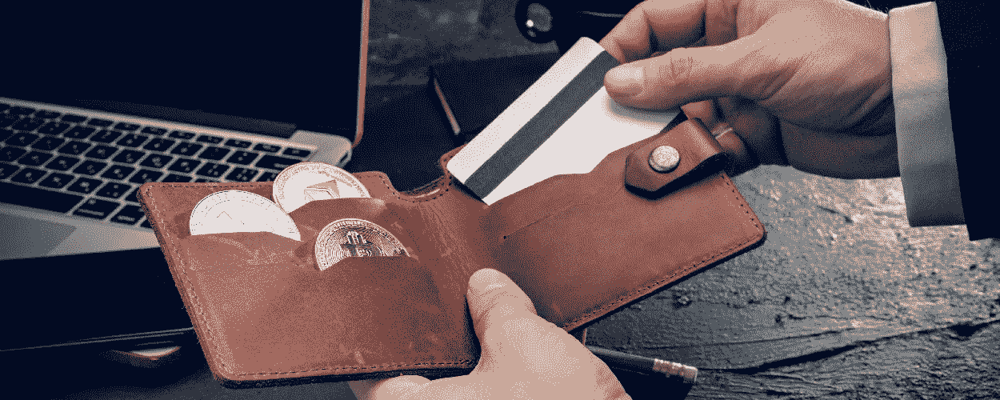

# 顶部平坦的坡道上交换新币到加密和回来

> 原文：<https://medium.com/coinmonks/top-fiat-on-ramps-to-swap-sgd-to-crypto-and-back-2b9d98baa833?source=collection_archive---------4----------------------->

加密货币是下一个投资的新资产，但是如何将你的纸币转换成加密代币呢？这里有几个菲亚特的坡道平台，你可以看看。

您已经完成了对[区块链](https://coinpasar.sg/what-is-blockchain/) &加密货币的研究，您已经准备好进行您的第一次加密购买。只有一个问题——你如何将你的法定货币转换成加密货币？为了做到这一点，加密投资者使用带有菲亚特入口或出口服务的平台作为他们的转换模式。

# 什么是菲亚特入口匝道和出口匝道？

在加密术语中，这两个术语可以理解为将你的法定货币转换为加密货币(入口)，反之则是从加密货币转换为法定货币(出口)。

投资者使用法定货币的两种常见方法是，将法定货币存入[加密货币交易所](https://coinpasar.sg/best-cryptocurrency-exchanges-singapore/)，然后将其兑换成代币，或者直接用信用卡进行加密购买。后一种选择确实会产生额外费用，从而导致更高的入口匝道成本。

除此之外，这里有一些平台，你可以用来增加或减少你的菲亚特美元。要查看使用这些平台的分步指南，请访问我们的页面 [coinpasar.sg](https://coinpasar.sg/top-fiat-on-ramps-to-swap-sgd-to-crypto-and-back/) 。

# 双子星座

我们名单上的第一个是双子座。加密货币交易所拥有免费且易于使用的菲亚特入口和出口服务，用户可以随时使用两个不同的银行账户，这在提取资金时提供了更大的灵活性。

同样，从交易所向您的账户转移新币的取款过程也是免费的。只需选择您想要汇款的银行账户，点击“请求取款”按钮，您的请求就开始了。此外，在保护我们的资金安全方面，交易所声誉良好的安全性也是一个优势。

# Crypto.com

我们榜单上的第二个平台是[Crypto.com](https://crypto.com/)；这个受欢迎的交易所有一个高效的 fiat on-ramp 流程，允许新加坡用户链接他们的 StraitsX 帐户来购买加密货币，这个流程只花了我们 5 分钟就设置好了。

当你在 StraitsX 上存款时，整个过程是通过将 SGD 转换成 XSGD 来完成的。XSGD 是什么？这是一种与新加坡元一比一的稳定货币。一旦链接成功，你就可以选择你的 StraitsX 账户作为购物时的付款方式。

# Okcoin

[这个加密货币交易所](https://www.okcoin.com/)可能不是将新加坡元兑换成加密货币的明显选择，但这个位于美国的平台是另一个可行的选择，这要归功于它最近与新加坡加密利益公司 Hodlnaut 的合作。

要将您的新币转换为加密货币，您只需将您的资金存入交易所，在相关的交易对中将其兑换为 BTC 或瑞士联邦交易所，如果您愿意，您可以将您的资产转移出去或兑换为其他加密货币。

如果你只是在寻找一个可以将你的现金转换成加密货币的法定入口服务，而不是相反，这将为你提供更多可以利用的平台。请注意，这些选项只允许新加坡元的信用卡，我们建议使用它们，如果你不介意更高的费用。也就是说，这里有两个你可以在网上找到的流行选项。

# 斜坡网络

[Ramp Network](https://ramp.network/) 是一项入口服务，允许用户通过信用卡直接向他们的加密钱包购买加密货币。就像您在网上购物时输入您的卡的详细信息一样，在 Ramp Network 上购买 crypto 时，同样的过程也适用。

请注意，Ramp Network 的交易费用是整个交易的 2.9%，任何购买的最低费用是 2.49 欧元(3.72 新元)。

# 月薪

为了提高各地加密货币的采用率， [Moonpay](https://www.moonpay.com/) 信守承诺，在他们的网站上简化加密货币的购买。这项在线 fiat on-ramp 服务允许您使用借记卡或信用卡进行交易，并将代币直接购买到您的加密钱包中。

这就是你如何轻松地将法定货币转换成加密货币的方法。你有其他方法来增加你的钱吗？在评论里分享给我们吧！

> 加入 Coinmonks [电报频道](https://t.me/coincodecap)和 [Youtube 频道](https://www.youtube.com/c/coinmonks/videos)了解加密交易和投资

# 另外，阅读

*   [最佳加密分析或链上数据](https://coincodecap.com/blockchain-analytics) | [Bexplus 评论](https://coincodecap.com/bexplus-review)
*   [NFT 十大市场造币集锦](https://coincodecap.com/nft-marketplaces)
*   [AscendEx Staking](https://coincodecap.com/ascendex-staking)|[Bot Ocean Review](https://coincodecap.com/bot-ocean-review)|[最佳比特币钱包](https://coincodecap.com/bitcoin-wallets-india)
*   [Bitget 回顾](https://coincodecap.com/bitget-review)|[Gemini vs block fi](https://coincodecap.com/gemini-vs-blockfi)|[OKEx 期货交易](https://coincodecap.com/okex-futures-trading)
*   [美国最佳加密交易机器人](https://coincodecap.com/crypto-trading-bots-in-the-us) | [不断回顾](https://coincodecap.com/changelly-review)
*   [在印度利用加密套利赚取被动收入](https://coincodecap.com/crypto-arbitrage-in-india)