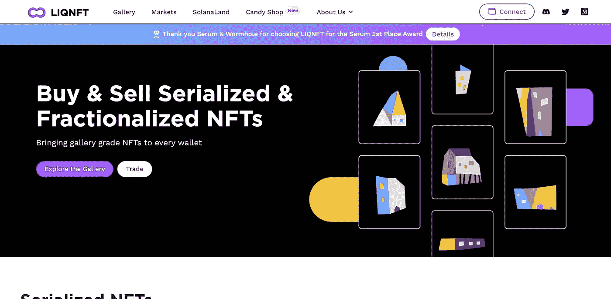

# 五大分裂的 NFT 市场开始 F-NFT 交易。

> 原文：<https://medium.com/coinmonks/top-four-fractionalized-nft-marketplace-to-begin-f-nft-trading-f70c3af32807?source=collection_archive---------7----------------------->

分数化的 NFT (F-NFT)是一种 NFT，被分裂或分解成更小的部分，也称为分数。所以一个 NFT 被分解成更小的部分。阅读下面的文章，获得细分的 NFT 的简要概述，它们是如何工作的，以及它们为市场提供的优势。

[https://nftnanny . medium . com/NFT-fractionalization-what-about-it-5 BDB 9d 5408 af](https://nftnanny.medium.com/nft-fractionalization-what-about-it-5bdb9d5408af)

Fractional NFTs illustrated by cointrust

在这篇文章中，我们来看看顶级细分 NFT 市场，并对这些市场进行深入的审查。

大多数常见的 NFT 市场，如 opeansea.io 或 rarity。工具不提供 F-NFT，所以您可能想知道在哪里可以买到 NFT 分数？

嗯，我们已经找到了四个正在成长和迅速发展的 NFT 市场，它们虽然还很新，但已经被使用和信任

## **1。Fractional.art**

分数。art 是领先的市场和 NFT 社区之一，通过分数协议铸造 NFT。这是一个智能合约、去中心化的平台，它是无许可的，这意味着它对每个人都可用，不受任何人控制。

Fractional.art Homepage

分数。艺术品也由 PeckShield 和 Harchi Audit 担保和审计，因此这可以让您的投资稍微放心一些。

截至撰写分数的时候。art 有 195 个金库，其中包括流行的 NFT，如来自 CryptoPunkss 的 punk 和流行的 Etherrock。此外，志那都红豆即将分裂的 NFT，布布，将最有可能在这个平台上分裂。

Fractional.art 还允许你作为卖家对整个收藏进行细分。一个叫做“NFT 篮子”的特写(相当有趣)。

只有在买断拍卖的情况下或者在用户已经购买了 100%的代币的情况下，才能撤回细分的 NFT。这可以防止地毯拉扯和意外的 NFT 退出。

代币持有人也可以在购买代币后对代币的保留价格进行投票，保留价格将是所有代币持有人累积投票的平均值，这使您可以在一定程度上控制您的投资。

该公司还在最近的种子基金轮次中筹集了超过 790 万美元的种子资金，Paradigm、Robot Ventures、Delphi Digital、Variant Fund、Divergence Ventures、Flamingo DAO 和 Mechanism capital 是主要投资者

## **2。NFTfy.com**

NFTfy 是一个细分的市场，它将 F-NFT 交易分为三个简单的步骤。它还允许你集体出售你的分数；这意味着你可以在它被细分之前卖给一群人(代币持有者),然后从一群人那里购买。

NFTfy homepage

对于集体销售，NFTfy 收取 NFT 最终价值的 5%,如果你问我们，这有点公平。

NFTfy 平台是去中心化和安全的，你的 NFT 被堆叠成一个小合同。可以通过支付保留价格或欠 100%的 NFT 来取消非堆叠。

作为卖家(NFT 所有者)，你也可以在任何人参与购买你的 NFT 分数之前取消或更改你的销售，一旦有人购买分数，你就不能再编辑销售。所以你应该在销售前得到所有你想要的销售参数和条件。

NFtfy 还允许您在不同的区块链上细分 NFTs 以太坊、多边形、BNB、雪崩和方顿。尽管目前，大部分可供购买的 NFT 收藏品都在以太坊和多边形上。

## **3。LIQNFT**

你爱索拉娜吗？LIQNFT 也爱索拉纳。LIQNFT 专注于购买和销售索拉纳区块链上的系列化和细分化的 NFT。

LIQNFT Homepage

序列化与细分化有很大不同。有了电子版，你就拥有了 NFT 有限的连载版的完全所有权。

这个概念类似于购买有限的奢侈品，例如，一些汽车只生产了 50 辆。所以你可以买 50 个中的 1 个或者 50 个中的 15 个(你现在可能已经明白了)。

通过电子监管，NFT 被抵押到一个金库中，您可以定义打印供应、所有权价格等参数。在 LIQNFT 国库中抵押你的 NFT 也要付费。

我看到的唯一缺点是，目前没有太多的项目列在平台上。

**4。有奥的斯**

WithOtis 是一个平台，允许你买卖 NFTs、艺术品和收藏品的股票。使用 WithOtis 进行细分的非功能性测试的主要优势之一是移动应用程序，该应用程序在 AppStore 和 GooglePlay store 上都可以免费获得。

WithOtis Homepage

由 Behance 前雇员 Michael Karnjanaprakorn 创建。Michael 精通技术领域，也曾与 skillshare 合作过。

奥的斯将您在 NFT 的资产存放在安全的设施中，NFT 由**阿斯彭美国保险公司承保。**

有各种各样的费用，低至 5%，高至 15%。当你收到一个报价时，你会发现这个费用的明细，它被称为搜索费

奥的斯目前有很多蓝筹 NFT，如 Cryptopunk #2142、#543、口袋妖怪红、格里姆斯 NFT 收藏，以及其他一些有趣的收藏，可用于细分。

一些主要投资者是 Maveron、Next View 和 kindred ventures。

**5。Unic.ly**

由 OxLeia 建立的 Unicly 是另一个著名的细分 NFT 市场，它允许你买卖 NFT 分数。

Unic.ly homepage

Unicly 与 ERC-721 和 ERC-1155 NFTs 兼容。您目前只能买卖 ETH NFTs。

NFT 的碎片作为乌托肯出售，买家可以设置在藏品解锁前需要投票的乌托肯数量。

一旦收藏解锁，你交换你的 uTokens 到 ETH 购买那些 NFT。

Unicly 不仅仅是 F-NFT 的市场。他们也有互换、农场和各种可用的加密工具。因此，如果你有兴趣了解加密项目的最新进展，并关注 F-NFT 市场，这就是你的平台

Unicly 目前拥有最大的市场份额，在 NFT 四大流动性池中锁定了近 8000 万美元的 43%以上。

目前，当你购买部分 NFT 时，你必须等待整个金库解锁，但新版本的 uni ly V2 承诺解决这一问题，并允许单个 NFT 在任何时候拍卖。

> 加入 Coinmonks [电报频道](https://t.me/coincodecap)和 [Youtube 频道](https://www.youtube.com/c/coinmonks/videos)了解加密交易和投资

# 另外，阅读

*   [Exness 点评](https://coincodecap.com/exness-review)|[moon xbt Vs bit get Vs Bingbon](https://coincodecap.com/bingbon-vs-bitget-vs-moonxbt)
*   [如何开始通过加密贷款赚取被动收入](https://coincodecap.com/passive-income-crypto-lending)
*   [加密货币储蓄账户](/coinmonks/cryptocurrency-savings-accounts-be3bc0feffbf) | [加密交易机器人](https://coincodecap.com/best-crypto-trading-bots)
*   [BigONE 交易所评论](/coinmonks/bigone-exchange-review-64705d85a1d4) | [CEX。IO 审查](https://coincodecap.com/cex-io-review) | [交换区审查](/coinmonks/swapzone-review-crypto-exchange-data-aggregator-e0ad78e55ed7)
*   [最佳比特币保证金交易](/coinmonks/bitcoin-margin-trading-exchange-bcbfcbf7b8e3) | [比特币保证金交易](https://coincodecap.com/bityard-margin-trading)
*   [加密保证金交易交易所](/coinmonks/crypto-margin-trading-exchanges-428b1f7ad108) | [赚取比特币](/coinmonks/earn-bitcoin-6e8bd3c592d9)
*   [WazirX vs CoinDCX vs bit bns](/coinmonks/wazirx-vs-coindcx-vs-bitbns-149f4f19a2f1)|[block fi vs coin loan vs Nexo](/coinmonks/blockfi-vs-coinloan-vs-nexo-cb624635230d)
*   [BlockFi 信用卡](https://coincodecap.com/blockfi-credit-card) | [如何在币安购买比特币](https://coincodecap.com/buy-bitcoin-binance)