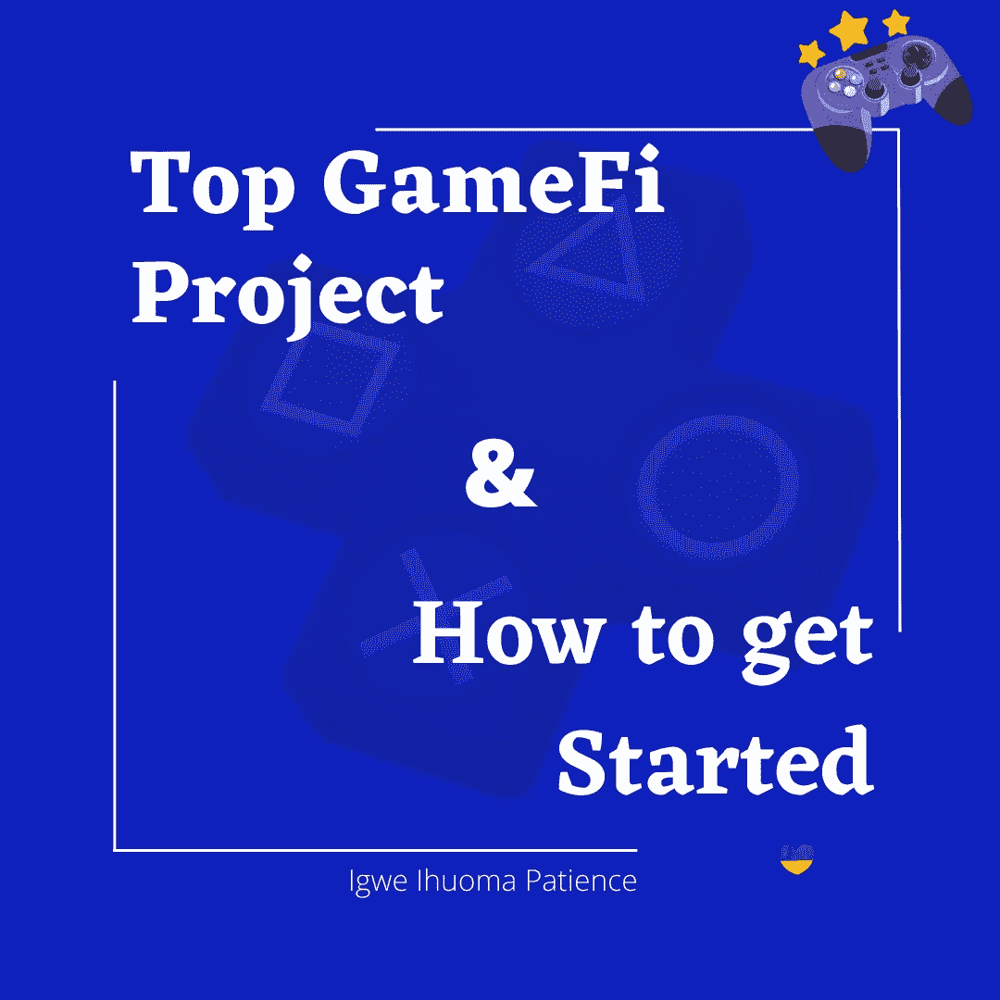
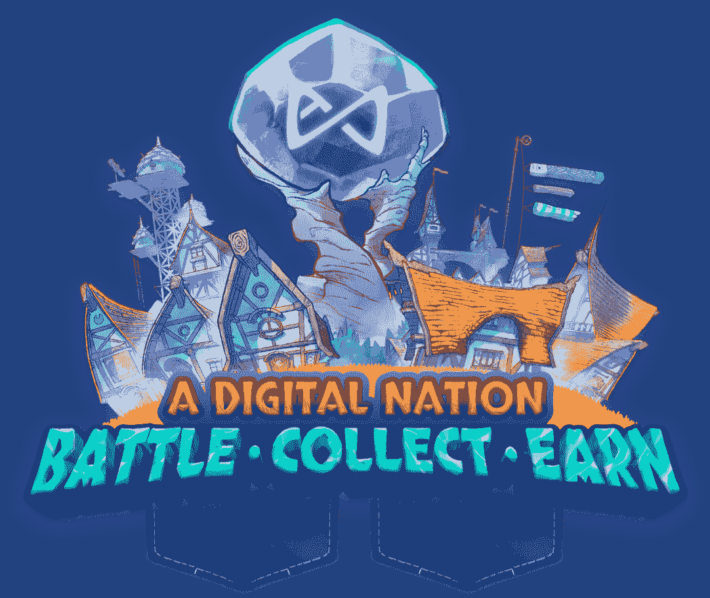
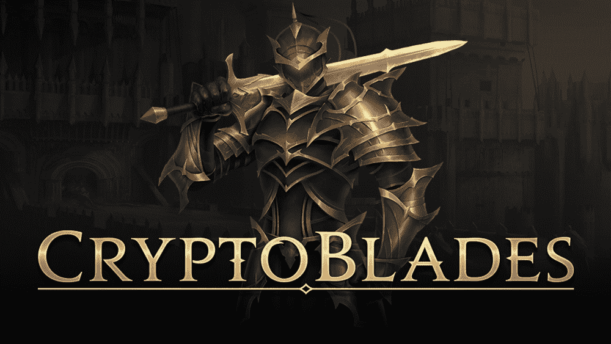
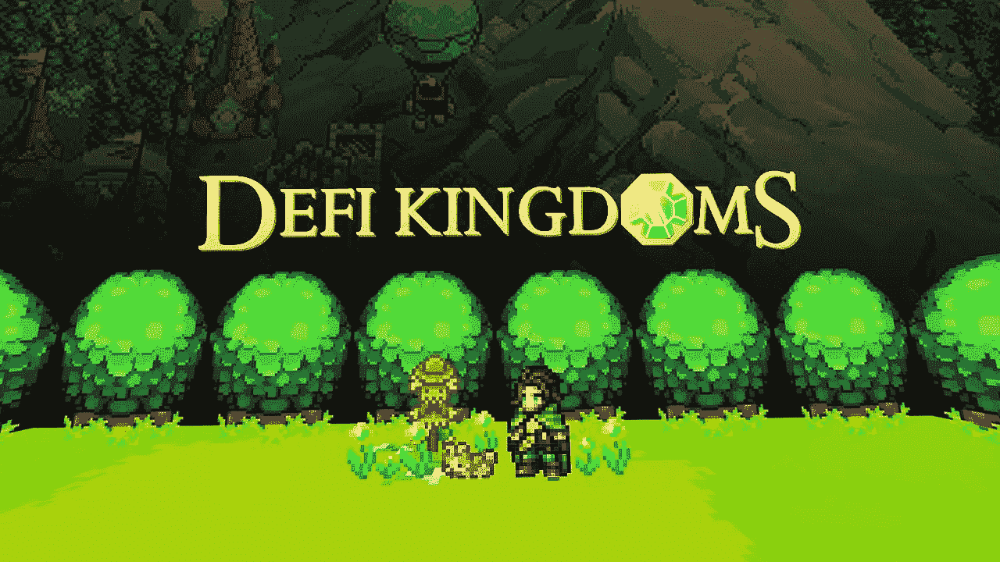
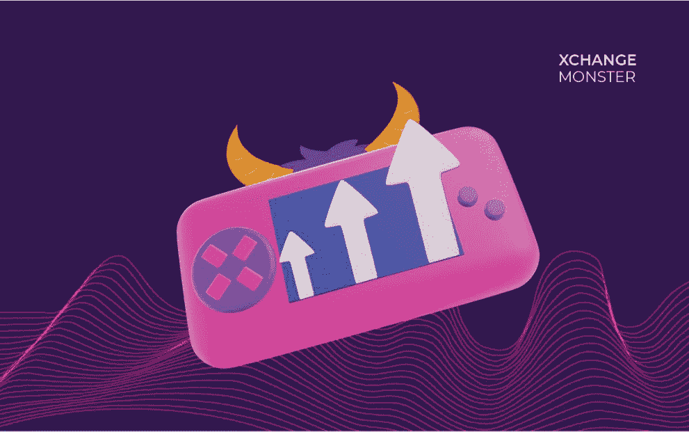
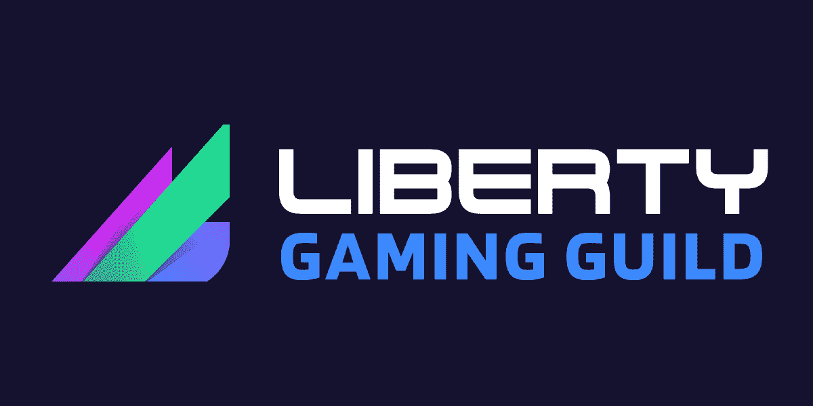
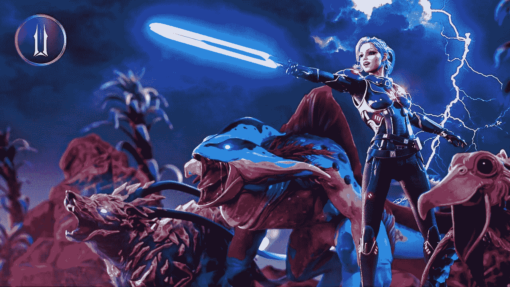

# 顶级 GameFi 项目和如何开始

> 原文：<https://medium.com/coinmonks/top-gamefi-projects-and-how-to-get-started-c8e08d07d2b6?source=collection_archive---------4----------------------->

由于 Gamefi 的广泛接受性以及玩家和其他利益相关者的巨大收入，毫不奇怪我们目前在这个领域有许多 Gamefi 项目。事实上，DappRadar 的报告称，仅在 2022 年 1 月，GameFi 项目就筹集了超过 10 亿美元。

Gamefi 项目的数量是指数级的，但是我们将在这里把自己限制在顶级项目以及如何开始使用它们。

1.  无限轴
2.  CRP 刀片
3.  DeFi 王国
4.  Xchange 怪兽
5.  自由游戏
6.  伊卢维乌

## 无限轴

Axie Infinity 是一款基于不可替换令牌(NFT)的在线视频游戏。这款游戏由越南工作室 Sky Mavis 开发。它以使用基于以太坊的加密货币的游戏内经济而闻名。Axie Infinity 是一个社区驱动的数字宠物游戏，允许玩家在战斗、繁殖、饲养和交易称为 Axie 的数字宠物的同时赚钱。

Axies 属于与 Pokémons 相似的九个类别之一。每个轴有 500 多个可能的身体部位中的 6 个。每个身体部位都有三个基因(显性、隐性和微隐性)。Axie 的功能组合决定了它的胜率，并最终决定了投资回报。我们的目标是在玩的时候获得这些产品，我们可以随时用它们换钱。

## 隐叶片

CryptoBlades 是一款新的区块链游戏，允许用户通过测试获得技能令牌。用户还可以创建角色和武器来击败敌人或在操场上出售游戏中的资产。

为了有资格玩，用户必须用 BNB 代币购买一个英雄。

## DEFI 王国

DeFi 王国是一个典型的跨链，玩赚在线视频游戏，建立在一个强大的 DeFi 协议。DeFi 王国被认为是 GameFi 生态系统中最完整的游戏赚取游戏。

就市值和 NFT 销售的终身价值而言，它还没有达到 Axie Infinity 的水平，但它已经取得了很大的进步。

## XCHANGE 怪兽

Xchange Monster 太好用了。它通过创建一个高度价值驱动的生态系统，将游戏社区和发行商聚集在一起。Xchange Monster 旨在加强游戏社区和运营商之间的互动，以增强游戏体验。

Xchange Monster 通过为游戏提供商提供一个完全受监管的平台，避免了去中心化世界中的灰色地带。这给更多的游戏创作者灌输了信心。这个特殊的 GameFi 平台有许多产品，包括一个使用 fiat onramps 的支付网关、一个 NFT 市场、一个交易交易所和一个钱包应用程序。因此，游戏创作者可以立即拥有完整的基础设施来从头到尾处理用户交互。

对于玩家来说，Xchange Monster 提供了低交易成本(汽油费)和即时访问他们的游戏内 NFT，可以直接兑换成法定货币。

## 自由游戏

Liberty Gaming 是“游戏赚钱”游戏世界中的一个突破性项目和社区。该公会将成为游戏玩家进入区块链游戏界昂贵且难以进入的 NFT 的“门户”,并为他们提供一个在新游戏时代学习和发展的生态系统。

Liberty 正在降低参与 Axie Infinity 等区块链游戏的门槛，向我们的社区玩家(“学者”)提供游戏内 NFT。这极大地增加了他们在游戏中成功的机会，通过利用优秀的角色、工具、军械库等等，为学者创造更大的收入潜力。

Liberty Gaming 通过支付玩家购买 NFT 的初始投资来为玩家提供奖学金。

## 淀积层

Illuvium 是一款区块链游戏，旨在将高质量的游戏带到“玩赚”(P2E)世界。虽然核心游戏仍处于开发阶段，但最近伊卢维纳提议会(DAO 选出的管理特许经营方向的代表)做出了重大批准。

Illuvium 的玩家也不用担心高昂的汽油价格，这是由于不可改变的 X 的第二层解决方案。这极大地改善了 Illuvium 上的游戏体验和性能。

# 结论

Gamefi 行业的进步如此之快。我们目前在这个领域也有很多其他的 Gamfi 项目，但此时此刻，我们将停止讨论这些迄今为止塑造了 gamefi 行业的顶级知名项目。

和开始是所有关于遵循每个游戏的规则，就像我们在特别区块链进化之前在其他传统游戏中做的那样。

这只是关于顶级 gamefi 项目和如何开始的一点补充。请不要对你学到的东西或你想让我谈论的下一篇文章发表评论。此外，不要犹豫，看看我们之前关于 GAMEFI 的文章——如何通过区块链赚钱。点击[此处](/coinmonks/gamefi-earn-money-through-blockchain-3d911ad4fcce)查看

# 关于

Igwe Ihuoma Patience 是一名自学成才的创意和行业特定内容作家，加密货币爱好者，拥有 2 年多的经验和不断发展的区块链空间的知识。

我擅长内容创作、文案写作、字幕管理、视频编辑和手机图形设计，我教其他人如何在加密货币和区块链领域起步，我的目标是让区块链的学习和更新易于任何人理解。

> 加入 Coinmonks [电报频道](https://t.me/coincodecap)和 [Youtube 频道](https://www.youtube.com/c/coinmonks/videos)了解加密交易和投资

# 另外，阅读

*   [最好的卡达诺钱包](https://coincodecap.com/best-cardano-wallets) | [Bingbon 副本交易](https://coincodecap.com/bingbon-copy-trading)
*   [印度最佳 P2P 加密交易所](https://coincodecap.com/p2p-crypto-exchanges-in-india) | [柴犬钱包](https://coincodecap.com/baby-shiba-inu-wallets)
*   [8 大加密附属计划](https://coincodecap.com/crypto-affiliate-programs) | [eToro vs 比特币基地](https://coincodecap.com/etoro-vs-coinbase)
*   [最佳以太坊钱包](https://coincodecap.com/best-ethereum-wallets) | [电报上的加密货币机器人](https://coincodecap.com/telegram-crypto-bots)
*   [交易杠杆代币的最佳交易所](https://coincodecap.com/leveraged-token-exchanges) | [购买 Floki](https://coincodecap.com/buy-floki-inu-token)