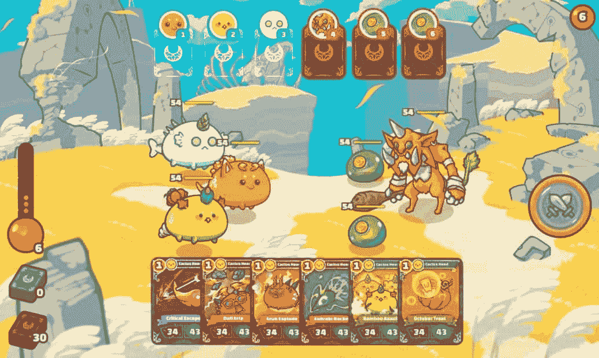
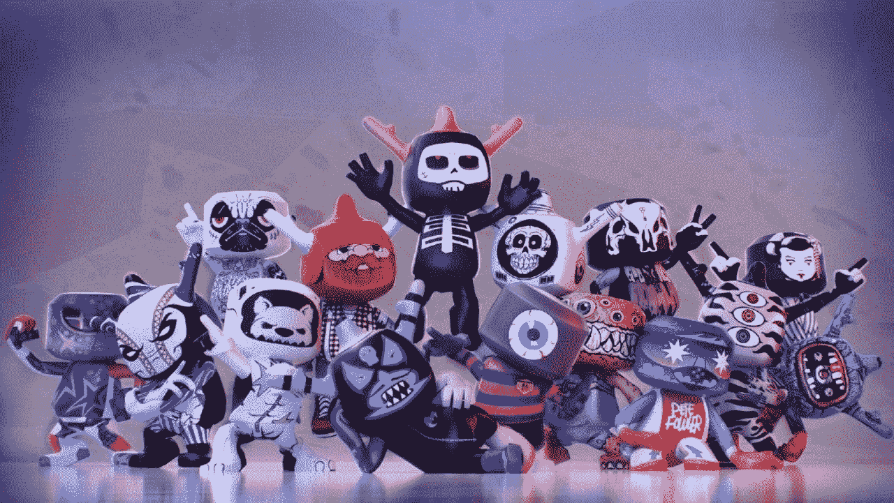
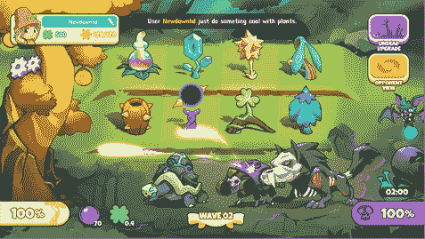
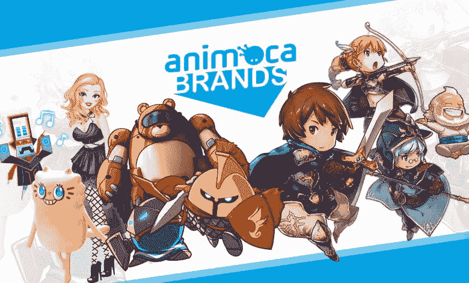

# 顶级游戏平台 2022

> 原文：<https://medium.com/coinmonks/top-gaming-platforms-2022-a50f6db5abdf?source=collection_archive---------39----------------------->

最有趣的区块链游戏之一，我们认为将很快成为平台上最受欢迎的游戏之一。分散土地是一个基于以太坊的计划，旨在鼓励全球用户网络管理一个共享的虚拟环境。

分散土地的用户可以在这个虚拟环境中探索、参与和玩游戏，同时买卖数字房地产。由于该平台的发展，用户现在可以使用交互式应用程序、在线支付和点对点通信。

Axie Infinity 背后的公司 Sky Mavis 可能是目前该领域最重要的区块链游戏公司之一。它不仅是第一批成功的游戏之一，而且迄今为止经受住了时间的考验，在相当长的一段时间里一直有大量的玩家。像其他基于 NFT 的游戏一样，被用来玩的名为 Axies 的 NFT 可以在 OpenSea 上出售或交易——用户也可以培育新的游戏，然后出售给其他人。

Axie Infinity 实际上是 Play2Earn 概念的同义词——在加密游戏中，通过玩游戏赚钱是一种真正的可能性。对许多人来说，尤其是在第三世界国家，这实际上是一种非常有利可图的赚钱方式，而在西方，用户通常只是做一些额外的零花钱，以支持他们的投资。

神话游戏是另一家大型区块链游戏公司，具体来说，是负责 2020 年发布的 Blankos Block Party 游戏的公司。与许多不同的项目不同，他们没有推出预售令牌，或者发布概念证明或游戏的 alpha 版本。这种基于社区的开发方法在加密游戏领域的小型独立项目中非常常见——然而神话游戏却走了一条不同的路。

他们在游戏完成后发布了他们的游戏，他们也采取了不同的方式来营销他们的游戏——他们没有专注于游戏的区块链方面，而是试图强调游戏中以玩家为主导的经济。仅此一点就足以让他们在这份名单上占有一席之地！

植物大战亡灵允许玩家成为真正的农民，并获得光能令牌(LP)，游戏中的货币，可以转换为植物大战亡灵令牌(PVU)。为了赚取光能代币(LP)，玩家需要从事农业工作，如收获种子、给植物浇水，包括完成其他日常任务。

此外，该平台有自己的市场，玩家可以在这里买卖他们在 NFT 的工厂或土地。游戏运行在可连接至 MetaMask 钱包的币安智能链上。

这家总部位于香港的公司很容易成为世界顶级品牌之一——他们负责 NFT 游戏 hit the Sandbox，以及其他总部位于 NFT 的游戏，如疯狂国王和疯狂防御英雄。与许多初创工作室不同，他们已经有了几款游戏，其中包括与大 IP 合作，如 WWE、漫威、Power Rangers 和 f1。

他们还与其他加密游戏公司合作，如 Dapper Labs、OpenSea 和 Sky Mavis。他们已经进行了几次非常成功的融资，并毫不费力地将 play to earn、传统游戏和新区块链科技整合在一个品牌下。这很容易让他们成为 2022 年最值得关注的公司！

值得警惕的区块链游戏公司！

虽然这些项目在区块链/游戏保真领域的规模和影响力还不如名单上的公司，但它们仍有望为现有的加密游戏领域提供一些独特而有趣的东西。下面就来看看吧！

这个开发工作室与整个区块链游戏趋势的推出密切相关——早在 2017 年，他们就发布了 CryptoKitties，这是第一个以 NFTs 和加密相关游戏为特色的成功的 P2E 游戏。虽然游戏本身的受欢迎程度已经下降，但 Dapper Labs 继续创造更多的内容，包括 Cheeze Wizards。

如果没有 Dapper Labs，可能就不会有我们现在这样的区块链游戏经济——或者至少，它会看起来很不一样。这将永远巩固 Dapper Labs 作为加密游戏历史的基石——当然，它足以在这个列表中获得一席之地，并在未来的任何版本中得到您的关注。

基于以太坊的平台金恩自 2009 年就已经存在，最近他们收到了来自纳斯达克的热情推荐。金恩为潜在的开发者提供了一个独特的平台，在这里他们可以创建 NFT 和某些游戏元素，而不必了解经常阻止 NFT 游戏创意出现的编码知识。

创造了数十亿资产，安装了数百万个钱包——因此，虽然金恩并不完全是新的，但他们的平台为这个快节奏、高要求的行业提供了一个不寻常的、简单的切入点。

总部位于台湾的 Onix 公司是区块链领先的游戏平台之一，专门为独立游戏开发商开发。它使用 Qtum 区块链基础设施来生产一种独特的产品，该产品结合了比特币的区块链特征和安全功能，并利用以太坊虚拟机(EVM)来实施智能合约。Onix 为负担得起的 NFT 游戏提供了一套工具。第一款游戏已经申请在 Onix 区块链上开发，目前正在开发中。命名为军队的加密，该项目承诺通过一个战略结构带来兴奋与 NFTs 作为一个可收集的纸牌游戏(CCG)。这些卡片将代表一些对加密行业产生重大影响的人物，他们为该技术的发展和认知做出了贡献。更多信息可以通过本文链接的网站获得。随着拼图拼凑在一起，该团队预计在 2022 年第三季度发布第一款游戏，作为开发人员将他们的项目集成到 Onix NFT 生态系统的模型。

Gala Games 还负责几个受欢迎的区块链游戏。帝国的回声，蜘蛛坦克，传奇重生，强化和行尸走肉:帝国都是他们创造的游戏。与 Polygon、Brave 和 Flare 等名称合作。这并不奇怪 Gala Games 背后的团队包括 Zynga 的联合创始人之一 Eric Schiermeyer。

他们的系统是基于节点系统的，并且已经取得了一些成功——例如,《帝国的回声》已经看到 NFTs 卖到了大约 300 万美元。他们对加密游戏的概念是，加密元素应该是“不可见的”,并在后台运行，而不会对游戏产生负面影响，减慢或破坏体验。

著名的 Voxies 和 Voxie 战术背后的公司仍然很强大。你的角色可以被买卖或用作独特的角色扮演角色——有职业、属性、宠物等等。AGG 的独特之处在于他们以社区为中心的方法。在 Axie 等游戏需要大量投资才能开始的地方，你可以免费玩 Voxie 战术——拥有 Voxie 只会让游戏更有趣，体验更可定制。

他们的游戏和 NFT 已经开发了多年，尽管还没有完全出来，相关的 Voxie NFTs 的价格一直在稳步上升，同时也培养了一个活跃的，令人惊讶的无毒社区。

作者:TreyTrillionaire

来源:[https://www.esports.com/](https://www.esports.com/)|[https://onix coin . io](https://onixcoin.io/)|[https://zipmex.com/learn/the-future-of-blockchain-gaming/](https://zipmex.com/learn/the-future-of-blockchain-gaming/)

*最初发表于*[*【https://www.reddit.com】*](https://www.reddit.com/user/TreyTrillionaire/comments/styckc/top_gaming_platforms_2022/?utm_source=share&utm_medium=web2x&context=3)*。*