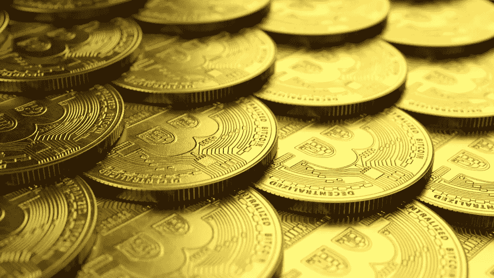

# 顶级 NFT 统计和趋势品牌需要知道

> 原文：<https://medium.com/coinmonks/top-nft-stats-trends-brands-need-to-know-bb57ecb6dc38?source=collection_archive---------28----------------------->

加密货币的前景正随着正在掀起波澜的新 NFT 趋势而动荡。对许多人来说，这是非常令人兴奋的！

即使对于这个领域的新来者来说，不可替代的代币显然将在未来改变商业交易的世界。虽然艺术界已经从非传统艺术的出现中获得了巨大的利益，但是大量的大公司、名人和 [**有影响力的**](https://blog.atisfyre.com/heres-the-inspiration-you-need-to-become-an-nft-influencer/) 也是如此。对 NFT 的需求突然爆发，席卷全球。

这个博客的趋势和 NFT 的统计数据将有助于品牌在 2022 年理解和穿越这一现象。

# 统计数字

# 1.市场尺寸

## 总市场——400 亿美元

2021 年，相当于 409 亿美元的资金花在了不可替代代币(NFT)上，显示了这个在 2020 年仅产生 10 亿美元的行业前所未有的增长。随着社会继续向数字化发展，很明显非功能性测试有了新的意义。

## 2021 年钱包数量–2860 万

根据 NFT 最大的市场 OpenC 的统计数据，NFT 的销售额在 8 月达到顶峰，然后在 9 月、10 月和 11 月下降，在 12 月反弹。从 9 月到 11 月，比特币和以太都升值了。因此，这可能与加密货币的价格波动无关，加密货币经常被用于购买 NFT。根据 DappRadar 的数据，2021 年有超过 2860 万个钱包进行了 NFT 交易，高于 2020 年的约 545，000 个。

# 2.史上最贵的 NFT

帕克的《合并》是有史以来卖出的最贵的 NFT 作品。2021 年 12 月，它在 Nifty Gateway 上以 9180 万美元的价格售出。许多购买者可以购买任意数量的代币，而不是将代币卖给单个出价者。每台设备的价格从 575 美元开始，每隔几个小时逐渐上涨 25 美元。它最终以 9180 万美元的价格卖给了 3 万多人。

Pak 在 2021 年的最大销售并不是唯一的一次。4 月，这种替代品在 Nifty Gateway 上出版，售价 1700 万美元。

# 3.人口统计数据

## 千禧一代购买的可能性是 Z 一代的 3 倍

根据 Morning Consult 的数据，千禧一代最有可能从事 NFTs。千禧一代买卖这些资产的可能性是 Z 世代的三倍。

调查还显示，由于“收集”的强烈愿望，人们对非食物疗法的广泛兴趣正在扩大。大约三分之一的美国人声称有收集有形物品的爱好。大约 42%的千禧一代也有大量收藏，这使他们成为当前 NFT 潮流的一部分。

## 男性比女性多 4 倍

男女之间的巨大差距也很明显。根据这项研究的结果，15%的男性受访者说他们收集非营养食物。另一方面，只有 4%的女性受访者说她们收集非传染性非典型肺炎。

# 4.增长率

## 从 2020 年到 2021 年，NFT 的销售额增长了 131 倍

据 NonFungible.com 称，NFT 市场的销售数量目前创下历史新高。从 2020 年第一季度到 2021 年第一季度，市场增长了惊人的 131 倍。这表明客户和利益相关者的数量正在迅速增加。

## NFT 的销售量目前可以达到每周 1.5 万至 5 万辆

NonFungible.com 的数据还显示，NFT 的销售额平均每周从 1000 万美元到 2000 万美元不等。目前，NFT 的销量可能在每周 1.5 万至 5 万辆之间。在 2017 年下半年出现巨大峰值之前，每周只有 100 笔销售。仅这一新数字就表明了 NFT 市场在短短几年内的扩张程度。

# 5.销售与铸造

## 大多数 NFT 的销售额都在 200 美元以下

根据艺术家金泊利·帕克和一位匿名数据科学家进行的一项研究，53.6%的 NFT 售价低于 200 美元。事实上，在七天内，超过三分之一的 NFT 销售额低于 100 美元。只有大约四分之一的销售额在 600 美元到 700 美元之间。

虽然仅在 2021 年，几个 NFT 就卖了数百万美元，但平均售价要低得多。

**制造和销售 NFT 的成本约为 100 美元**

虽然一幅 NFT 的典型价格大约是 200 美元，但你可能需要支付其中的一半来制作和出售艺术品。标准费用在 70 美元到 120 美元之间，然而，有些人支付数千美元。

由于区块链的使用，创建 NFT 可能是一件昂贵的事情。根据 Slate 的说法，生成一个 NFT 的成本可能从 1 美元到 1000 美元不等，这取决于所应用的技术。

# 趋势

# 1.多用途和伙伴关系

NFT 有巨大的潜力重塑品牌与消费者互动的方式。由于疫情，人们对数字环境的兴趣增加了，NFT 纪念品开始出现在网络上。早期进入的企业将会取得成功，经验教训只会让他们在未来受益。品牌对 NFT 的用途不仅仅是制作收藏品。NFT 对企业很重要的一个主要因素是表现数字产品，如艺术、音频和视频。它们适应性很强，可以表现各种类型的创造性工作，包括虚拟房地产、虚拟世界、时尚等等。

# 2.票务和支付转型

用于现场活动门票和支付接受(如订阅)的 NFTs 和加密货币并不新鲜。但它将在 2022 年加入 NFT 潮流。随着技术的进步和接受度的提高，越来越多的公司将致力于采用区块链技术来解决问题，重新思考品牌体验是什么样的，并拓宽票务的工作方式，使其不仅限于允许参加活动和单一支付来源。

在 2022 年 ，更多品牌将利用 NFTs 通过向粉丝提供标准分销方式无法提供的独家折扣和促销来培养 [**品牌忠诚度。**](https://blog.atisfyreach.com/10-social-media-hacks-for-your-brand-to-soar-in-2022/)

# 3.虚拟品牌房地产

我们甚至可能在 2022 年看到通过 NFT 或加密货币出售的完全品牌化的房地产。多个数字域构成了元宇宙。每一个都像一个 3d 虚拟城市，虚拟人物在这里生活、工作和玩耍。任何玩过 [**著名视频游戏**](https://www.gamemarketinggenie.com/blog/crypto-blockchain-gaming?__hstc=177041658.b4c5ca11e57e7712879192984d7d2f1e.1625811682291.1647256499914.1647326576033.351&__hssc=177041658.2.1647326576033&__hsfp=2115620160) 的人，比如《堡垒之夜》、《动物穿越》或者《机器人宇宙》都见过这些世界是什么样子的。虚拟现实、流媒体视频、手机游戏、虚拟角色和人工智能都被用来创建身临其境的数字体验。

然而，元宇宙房地产投资仍然非常投机，没有人能说这种繁荣是下一个伟大的事情还是下一个大泡沫。

# 4.企业新的收入来源

由于疫情而遭受收入损失的行业(有些仍然如此)将依靠数字机会，如 NFTs，来创造新的收入和提高品牌认知度。随着消费者对这项技术越来越熟悉，也越来越经常地使用它，实物商品将开始被非功能性食品所取代。我们将看到更多的企业试图使用 NFTs 和区块链来解决其商业模式中的供应链问题，就像我们看到有形商品品牌这样做一样。

# 5.品牌将雇佣更多的 NFT 和加密货币专家

如果公司想在这一领域受到重视，他们必须提高他们的游戏水平，并找出如何让区块链面向普通大众，而不仅仅是加密迷。除了加密资产上的标识，企业还需要更加积极地营销和推广 NFT 产品。品牌可以通过雇佣该领域合适的专家来提高对非功能性食物、它们是什么以及如何以顾客能够理解的方式使用它们的认识，从而铺平道路。

# NFT 2022，市场与未来

我们想留给您一些问题，这些问题可以帮助您决定 NFT 是否是您品牌的未来，或者您是否应该放弃它们:

*   您的客户会使用 NFTs 吗？如果是，你能创建知识库和社区在这个领域蓬勃发展吗？
*   你能投资到推广你在 NFT 的投资所需的合适的支持吗？
*   如果出现环境、财务和法律问题，您是否有应对策略？

凭借完善的营销策略，我们相信你能够穿越元宇宙！除了品牌，创意者也在投身于当前的 NFT 潮流。现在正是 [**与 NFT 有影响力的**](https://blog.atisfyreach.com/smart-guide-to-nft-influencer-marketing/) 合作，趁热打铁成为行业声音的时候。Atisfyreach 可以帮你做到这一点。

Atisfyreach 的人工智能驱动算法根据活动的目标将品牌与理想的影响者匹配起来——无论是提高品牌知名度、更多参与还是增加规模收入。通过 atisfyreach 与影响者合作，让您的品牌具有全球知名度。

[在 Atisfyreach 注册您的兴趣](https://atisfyreach.com/)。

> 加入 Coinmonks [电报频道](https://t.me/coincodecap)和 [Youtube 频道](https://www.youtube.com/c/coinmonks/videos)了解加密交易和投资

# 另外，阅读

*   [ProfitFarmers 回顾](https://coincodecap.com/profitfarmers-review) | [如何使用 Cornix Trading Bot](https://coincodecap.com/cornix-trading-bot)
*   [如何匿名购买比特币](https://coincodecap.com/buy-bitcoin-anonymously) | [比特币现金钱包](https://coincodecap.com/bitcoin-cash-wallets)
*   [瓦济里克斯 NFT 评论](https://coincodecap.com/wazirx-nft-review) | [比茨盖普 vs 皮奥克斯](https://coincodecap.com/bitsgap-vs-pionex) | [坦吉姆评论](https://coincodecap.com/tangem-wallet-review)
*   [如何使用 Solidity 在以太坊上创建 DApp？](https://coincodecap.com/create-a-dapp-on-ethereum-using-solidity)
*   [币安 vs FTX](https://coincodecap.com/binance-vs-ftx) | [最佳(SOL)索拉纳钱包](https://coincodecap.com/solana-wallets)
*   [如何在 Uniswap 上交换加密？](https://coincodecap.com/swap-crypto-on-uniswap) | [A-Ads 评论](https://coincodecap.com/a-ads-review)