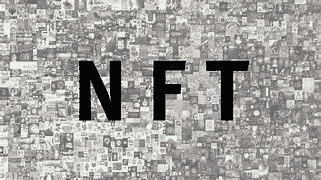

# 顶级 NFT 使用案例

> 原文：<https://medium.com/coinmonks/top-nft-use-cases-2a05834dcf7c?source=collection_archive---------43----------------------->

## 为什么 NFT 行业不是摇钱树

仅在一年零几个月前，在区块链存放不可替代的数字艺术品和收藏品的想法还很牵强。

现在，非功能性测试正在我们生活的更多方面成为主流。

越来越多的名人加入，越来越多的公司采用。

随着其目前的采用，有一个几乎立即翻转铸造和转售以获取利润的习惯。

摇钱树心态可以吸引那些不知道有这么多非功能性测试的人进入这个领域。

我将讨论几个用例，以及 NFT 如何让我们的生活变得更好，并可能影响我们的未来。

除了已经占据互联网的主流数字艺术和收藏品。

这些用例包括:

赌博

游戏玩家现在可以拥有他们的游戏内资产(剑、化身等等)作为 NFT，并且可以随时出售。

他们可以竞争并获得更多这些资产。

截至 2021 年 10 月，Axie Infinity 的估值为 30 亿美元。而这仅仅是开始。

这个行业将在这十年里经历快速增长。

不动产

这是一个有趣的用例，因为 NFTs 可以在虚拟和现实中用于房地产。

事实上，在像去中心化这样的平台上，你可以购买土地和房产。这些可以出租、建造，或者只是为了增值而持有。

在现实中，假设您想购买一块土地，您可以看到它以前的交易、真正的所有者和价值(都存储在区块链上)。

当你购买这件作品，所有权 NFT 转移给你。太神奇了。

音乐

由于某些原因，这种方式的采用速度很慢。大型唱片公司和流媒体平台尚未采纳和试验这一想法。

一般来说，艺术家不会从他们的版税中得到很好的份额，NFTs 可以通过很多方式解决这个问题。

您可以通过将音频附加到 NFT 来创作一段可收藏的音乐。

流媒体平台可以基于区块链，区块链在那里追踪版税。

实物资产

就像房地产用例一样，现实生活中的财产可以作为 NFT 存在。这可以用于显示真实性和便于销售等目的。

交易在区块链上得到验证和存储后会变得更容易。

当你购买一件物品时，相应的 NFT 将会寄给你。

这也有助于这些资产的物流。他们不需要总是被转移。

当然，这种奇妙的创新还有很多其他方式可以改善我们的生活。

NFT 起初令人难以置信，但在短时间内获得了非凡的采用

随着我们获得越来越多的采用，这些将逐渐成为主流。

> 加入 Coinmonks [电报频道](https://t.me/coincodecap)和 [Youtube 频道](https://www.youtube.com/c/coinmonks/videos)了解加密交易和投资

# 另外，阅读

*   [WazirX vs coin dcx vs bit bns](/coinmonks/wazirx-vs-coindcx-vs-bitbns-149f4f19a2f1)|[block fi vs coin loan vs Nexo](/coinmonks/blockfi-vs-coinloan-vs-nexo-cb624635230d)
*   [BlockFi 信用卡](https://coincodecap.com/blockfi-credit-card) | [如何在币安购买比特币](https://coincodecap.com/buy-bitcoin-binance)
*   [火币交易机器人](https://coincodecap.com/huobi-trading-bot) | [如何购买 ADA](https://coincodecap.com/buy-ada-cardano) | [Geco。一次审查](https://coincodecap.com/geco-one-review)
*   [加密副本交易平台](/coinmonks/top-10-crypto-copy-trading-platforms-for-beginners-d0c37c7d698c) | [五大 BlockFi 替代方案](https://coincodecap.com/blockfi-alternatives)
*   [CoinLoan 点评](https://coincodecap.com/coinloan-review)|[Crypto.com 点评](/coinmonks/crypto-com-review-f143dca1f74c) | [火币保证金交易](/coinmonks/huobi-margin-trading-b3b06cdc1519)
*   [Bybit vs 币安](https://coincodecap.com/bybit-binance-moonxbt)|[stealth x 回顾](/coinmonks/stealthex-review-396c67309988) | [Probit 回顾](https://coincodecap.com/probit-review)