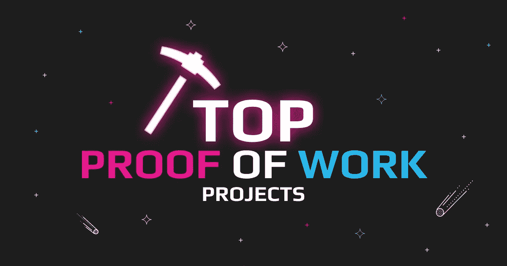
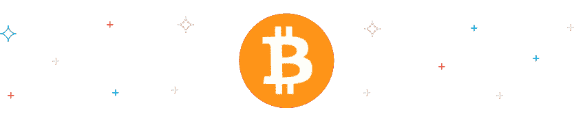
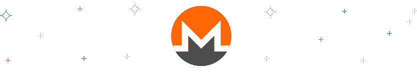
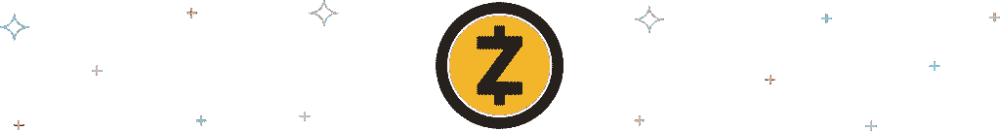
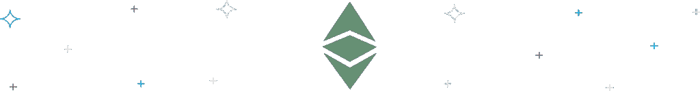

# 顶级工作证明硬币:以太坊正在离开的行列

> 原文：<https://medium.com/coinmonks/top-proof-of-work-coins-the-ranks-ethereum-is-leaving-4e176004a679?source=collection_archive---------17----------------------->

2022 年 6 月 8 日被定为以太坊合并的日子——第二大加密公司正处于最终走向股权证明的终点线。有人说 PoW consensus 已经到了极限，还有一些(数量更少)——这是第一个原创的加密技术，尽管有所有的负面影响，它仍然存在。在这篇文章中，我们不会对 PoW 进行评论，但会对最大的工作证明项目进行总结，并向您介绍使用 PoW 的最重要的硬币。

# 什么是工作证明？

对加密货币的主要批评是双重消费问题。由于加密货币仅仅是数据，在系统注册之前，用户可能会使用相同的数字货币单位进行多次交易。

比特币的创造者[中本聪](https://bitcoin.org/bitcoin.pdf)设计了一种共识机制来解决这个问题。工作证明包括矿工解决一个复杂的代数问题，以认证区块链上的新加密交易。矿工被激励承担加密回报的密集任务。

加密货币总市值的近 [66%](https://cryptoslate.com/cryptos/proof-of-work/) 使用工作证明来达成共识。以下是使用工作证明验证的顶级加密货币列表。

# 比特币(BTC)——强大的权力巨头

[比特币(BTC)](https://swapzone.io/currencies/bitcoin) 是第一种出现的加密货币。2019 年，由一位匿名互联网用户[中本聪](https://bitcoin.org/bitcoin.pdf)首次提出，这种去中心化的货币使用点对点网络在平等和独立的参与者之间直接进行交易。作为第一种上市的加密货币，比特币在为区块链领域的其他进步铺平道路方面发挥了最大的作用。

比特币是通过一个叫做“采矿”的过程产生的。矿工因验证并向区块链提交交易而获得新的比特币奖励。

这种验证和提交交易的过程就是新比特币加入流通的方式。随着越来越多的人加入比特币网络，挖掘变得更加困难，需要更多的计算能力。这导致了矿商之间的军备竞赛，比特币奖励的减少使得这一过程的利润日益减少。

比特币是通货紧缩的，这意味着只会有 2100 万枚比特币存在。按照目前的开采速度和 10 分钟的区块时间，2140 年将开采出最后一个比特币。

# 以太坊(ETH)——即将进行大转移

以太坊(ETH) 是第一层区块链，是第一个分散整个金融系统的机构，不像比特币这样的交易。这是通过智能合约(区块链上不可变的自动执行代码)实现的。

以太是 T2 市值第二大的加密货币，仅次于比特币，是以太坊网络的原生加密货币。

乙醚最初的销量超过 6000 万。该加密项目通过众包获得资金，并在 2014 年进行了[0.311 美元的首次硬币发行(ICO)。ETH 的目标是成为 DApps 的全球分散平台。作为上市的最大网络之一，ETH 也被认为是区块链智能合约的先驱。](https://icodrops.com/ethereum/)

就像比特币一样，以太坊也使用工作共识证明方法来验证交易。然而，该网络正处于过渡阶段，将转向利益证明模式，以提高吞吐量和可持续性。

# 莱特币

Litecoin (LTC) 是众多使用区块链技术来促进安全金融交易的加密货币之一。它与比特币等其他加密货币的不同之处在于，它使用了一种称为“Scrypt”的不同挖掘算法，旨在让普通用户更容易挖掘硬币。

它的交易费用极低，是微交易和销售点交易的良好选择。它于 2011 年推出，是仅次于 BTC 的第二大流行加密货币。

每个区块的 LTC 采矿量每四年减少一次。这是由于网络上的块奖励减半计划。Litecoin 使用工作证明算法来防止任何停机时间并快速验证交易。

# 比特币现金(BCH)

虽然 BTC 拥有最受欢迎的加密货币的头衔，但它有一些缺点，这使得它对一些投资者不利。

[比特币现金(BHC)](https://swapzone.io/currencies/bitcoin-cash) 于 2017 年开发，作为解决比特币一些问题的替代方案。这是一种点对点的电子现金系统，提供了一种更便宜、更快捷的支付方式。

由于 BHC 矿业的高度竞争性，矿工倾向于采用更高的散列率来生产更多被网络接受的区块。需要挖矿设备和全节点软件才能开始挖矿比特币现金。

# 莫内罗(XMR)

Monero (XMR) 于 2014 年推出，目标是为用户提供安全匿名的交易模式。区块链的透明性阻止了像 BTC 这样的加密货币真正匿名。相反，它们被认为是假名。另一方面，XMR 使用先进的加密技术来隐藏用户的身份。

XMR 的目标是完全去中心化。为了帮助实现这一目标，网络使用[密码夜](https://monerodocs.org/proof-of-work/cryptonight/)进行保护，这是一种工作验证算法的变体。这种算法的本质阻止了大型采矿场捕鲸。

# 兹卡什(ZEC)

[Zcash (ZEC)](https://swapzone.io/currencies/zcash) 是又一种旨在优先保护用户隐私的加密货币。虽然 ZEC 交易使用公共网络，但交易的细节仍然是保密的。但是，根据监管规范，此类信息可能会在需要时披露。

该网络使用 zk-SNARK，这是一种基于工作共识机制证明的零知识证明技术。它允许网络节点快速验证交易，而无需披露与支付相关的敏感信息。

# 以太坊经典(等)

通过在 ETH 的一次硬叉创立，[以太坊经典(ETC)](https://swapzone.io/currencies/ethereum-classic) 于 2016 年上市。硬币的主要功能是作为一个智能合同网络。它托管和支持各种分散的应用程序(DApps)。尽管这一点得到了 ETH 的支持，但这两个网络的路线图却大相径庭。

ETC 使用工作验证算法来保护其网络。然而，作为一个少数民族链，它一直是众多攻击的目标，包括 51%的攻击挖掘散列率和双花硬币。作为一种通缩措施，采矿 ETC 的回报会随着时间的推移而下降。

# Dogecoin (DOGE)

[Dogecoin (DOGE)](https://swapzone.io/currencies/dogecoin) 由比利·马库斯和杰克逊·帕尔默于 2013 年开发。流行的柴犬迷因启发了开源硬币的名称和标志。这枚硬币原本是针对比特币等加密货币的一个讽刺笑话，但最终，它通过 Reddit 的讨论和 Elon Musk 的推文获得了价值。

Dogecoin 使用 Scrypt 技术来证明工作。Dogecoin 的供应没有上限，因此可以开采无限数量的硬币。矿工可以单独采矿或加入采矿池。采矿的系统要求非常简单——一台装有 Windows、iOS 或 Linux 的 PC，以及一个 GPU。

# 破折号

Dash (DASH) 发布了一份[白皮书](https://github.com/dashpay/dash/wiki/Whitepaper)，称该项目旨在通过向用户提供更好的隐私和更快的交易来改善 BTC。Dash 这个名字是由“数字现金”组合而成的。

它于 2014 年推出，是作为莱特币的一个分支开发的。该网络提供独特的功能，如 InstaSend、ChainLocks 和 PrivateSend。

为了安全起见，Dash 使用双层网络系统进行交易。第一层使用通过 X11(Dash 独特的工作验证算法)验证数据块的节点。它使用 11 种散列算法来完成序列。在交易可以被添加到区块链之前，至少 51%的节点必须批准。第二层依赖于使用服务证明算法的主节点。

# 结论

由于算法的安全性，工作证明加密货币占了市场资本的大部分。一些市值最大的加密货币基于工作证明共识机制衍生出自己的算法，以更好地适应其独特的目标。

虽然这是一个能源密集型流程，但与委托利益证明(dpo)或历史证明等其他模式相比，它是现有的最安全、最分散的共识模式之一。

> 加入 Coinmonks [电报频道](https://t.me/coincodecap)和 [Youtube 频道](https://www.youtube.com/c/coinmonks/videos)了解加密交易和投资

# 另外，阅读

*   [WazirX vs coin dcx vs bit bns](/coinmonks/wazirx-vs-coindcx-vs-bitbns-149f4f19a2f1)|[block fi vs coin loan vs Nexo](/coinmonks/blockfi-vs-coinloan-vs-nexo-cb624635230d)
*   [本地比特币审核](/coinmonks/localbitcoins-review-6cc001c6ed56) | [加密货币储蓄账户](https://coincodecap.com/cryptocurrency-savings-accounts)
*   [什么是保证金交易](https://coincodecap.com/margin-trading) | [美元成本平均法](https://coincodecap.com/dca)
*   [维护卡审核](https://coincodecap.com/uphold-card-review) | [信任钱包 vs MetaMask](https://coincodecap.com/trust-wallet-vs-metamask)
*   [Exness 点评](https://coincodecap.com/exness-review)|[moon xbt Vs bit get Vs Bingbon](https://coincodecap.com/bingbon-vs-bitget-vs-moonxbt)
*   [如何开始通过加密贷款赚取被动收入](https://coincodecap.com/passive-income-crypto-lending)