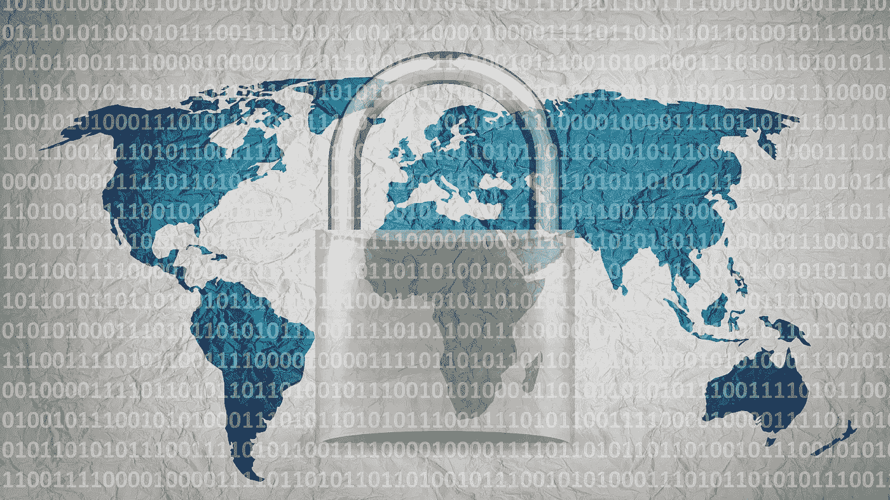

# 保持数据安全和隐私的七大网络安全建议

> 原文：<https://medium.com/coinmonks/top-seven-cybersecurity-suggestions-for-keeping-your-data-safe-and-private-32ef36b35e3e?source=collection_archive---------38----------------------->

## 网络安全提示对于保持信息安全和消除信息中断非常重要

如今，网络保护比任何时候都更重要。随着个人投入更多的精力浏览互联网，他们同样分享更多的私人数据。此外，这块石头是关键和危险的，因为你的信息可能会落入不可接受的人手中。这就是获取敏感信息至关重要的原因——对个人和组织都是如此。

假设你对最近的技术新闻了如指掌，你大概知道最近网络保护越来越受关注。组织处理信息的方式至关重要—不幸的是，信息泄露是正常的，而且会产生严重的影响。假设信息泄露影响了您的信息，那么您的机密数据就不再安全了。

程序员可能会得到你的财务数据或社会安全号码——信息泄露经常会导致欺诈。经历信息中断的组织可能会失去他们的地位和收入。更重要的是，他们获得许可的创新同样可能受到损害。

无论你是创业者还是个人，获取你的信息是基本。在本文中，我们分享了关于保护您的数据的七个主要网络保护技巧。

## 过度警惕

俗话说，在任何情况下，被保护比心碎更好。不管网上的许多东西是否安全，你都应该知道你点击的连接。下载程序和访问语言环境时要小心。他们可能会立即引入恶意软件，无论如何都不会让你注意到。很明显，你的电脑会受到威胁。

类似的规则也适用于您获得连接的情况。假设你确定托运人的个性，你可以安全地打开它。无论如何，无论如何，你都不应该利用它，因为它会伤害你的框架——不管它看起来是不是无辜的。对基于网络的娱乐、电子邮件和互联网保持这种坚定的怀疑可能是有价值的，因为它帮助你获得你在任何情况下都不会注意到的东西。

## 定期备份您的数据

信息强化是你的虚拟和真实文件的复制。如果你的文件由于网络攻击而变得遥远或受到损害，拥有一个这样的文件是非常谨慎的。所以，这是一个惨败的休养计划。
此外，这是从关键信息灾难或勒索软件攻击中恢复的最佳答案。您应该在不同的驱动器、区域或小工具上强化敏感的个人信息。如果发生了令人吃惊的事情，有了增援可以保证你的信息恢复到原来的状态。假设您的信息间歇地变化，您应该不断地备份您保存个人信息的每一个小工具。

## 使用可靠的密码

你可能会被诱惑为你的每一个记录制作一个单独的秘密钥匙，因为这样更容易回忆起来。尽管如此，我们并不建议这样做，因为程序员很有可能会得到它。一种受保护的做法是在你的每一条记录中都包含一个备用的秘密单词。你可能会想，一个人怎么可能记住这么多的密码。然而，您并不需要这样做——从各方面考虑，您可以利用一个密钥管理器。编程让你的密码一个接一个，你只需要回忆起你需要用来得到不同密码的秘密短语。鉴于你不需要把密码记录在纸上，你应该绝对远离这一事实，秘密密钥主管同样有效。
尽管如此，无论您是否利用 a 的优势领域，网站仍会不时遭到黑客攻击。如果您成为网络犯罪的受害者，感到恐惧和愤怒是很正常的。然而，你可以保证在英国获得信息泄露的报酬，并使自己公平。总的来说，保护你的信息是协会的责任，假设你经历了任何物质或精神伤害，获得赔偿是你的权利。

## 使用防火墙和防病毒软件

安装防病毒软件，很可能是对抗网络犯罪最有效的方法。它阻止恶意软件和不同种类的感染进入您的电脑，危及您的每一个信息。因此，从可靠的卖家那里挑选感染程序，并把它介绍给你的小工具。

防火墙同样可以保护你的信息免受有害攻击。它可以筛选出感染，程序员，和互联网上发生的各种有害演习。此外，它还列出了哪些流量可以进入您的小工具。麦金塔 OS X 和 Windows 现在有防火墙作为一个组件，命名为 Mac 防火墙和 Windows 防火墙。

## 设置双因素或多方面确认

利用双因素或多方面的验证，为在线确认的常用机密短语策略增加一层安全保护。通常，您需要输入用户名和机密短语，但是对于双因素验证，您需要输入额外的确认策略，如个人识别码。或者另一方面，你可以利用一个手指印或添加另一个秘密短语。

多方面的确认提供了显著更高的安全性，因为它需要多种额外的验证技术。例如，在登录网站时，您应该输入一个额外的时间密钥，您可以在电话或电子邮件中获得该密钥。设置 MFA 制造了一个多层防护，使未经批准的人更难获得您的信息。

## 除非你真的需要，否则尽量不要使用公共无线网络

公共 Wi-fi 听起来可能很完美，然而，它很可能对你的信息不安全。除非你别无选择，否则与公共组织打交道从来都不是明智之举。如果你真的需要使用公共 wi-fi，尝试连接虚拟专用网。如果你不这样做，你的流量可以呈现给任何安排好的客户。

VPN 编程保证你的流量被编码，数字违法者不能毫无问题地得到你的信息。万一你在公共场所，有一个重要的任务，你需要完成，利用你的电话信息更安全。

## 远离不重要的下载

下载是网络犯罪分子进入您组织的典型策略。通过这种方式，限制您的下载以保护您的信息和电脑是最理想的。你应该远离无意义的程序增强或编程。同事在网上下载任何与协会有关的东西都应该得到批准。

每当你认为一个下载是受保护的，你应该选择一个自定义介绍，并仔细观察。如果在创建过程中你的小工具上出现任何扩展或附加项目，试着拒绝它们。

> 加入 Coinmonks [电报频道](https://t.me/coincodecap)和 [Youtube 频道](https://www.youtube.com/c/coinmonks/videos)了解加密交易和投资

# 另外，阅读

*   [3 商业评论](/coinmonks/3commas-review-an-excellent-crypto-trading-bot-2020-1313a58bec92) | [Pionex 评论](https://coincodecap.com/pionex-review-exchange-with-crypto-trading-bot) | [Coinrule 评论](/coinmonks/coinrule-review-2021-a-beginner-friendly-crypto-trading-bot-daf0504848ba)
*   [莱杰 vs Ngrave](/coinmonks/ledger-vs-ngrave-zero-7e40f0c1d694) | [莱杰 nano s vs x](/coinmonks/ledger-nano-s-vs-x-battery-hardware-price-storage-59a6663fe3b0) | [币安评论](/coinmonks/binance-review-ee10d3bf3b6e)
*   [Bybit Exchange 评论](/coinmonks/bybit-exchange-review-dbd570019b71) | [Bityard 评论](https://coincodecap.com/bityard-reivew) | [Jet-Bot 评论](https://coincodecap.com/jet-bot-review)
*   [3 commas vs crypto hopper](/coinmonks/3commas-vs-pionex-vs-cryptohopper-best-crypto-bot-6a98d2baa203)|[赚取加密利息](/coinmonks/earn-crypto-interest-b10b810fdda3)
*   最好的比特币[硬件钱包](/coinmonks/hardware-wallets-dfa1211730c6) | [BitBox02 回顾](/coinmonks/bitbox02-review-your-swiss-bitcoin-hardware-wallet-c36c88fff29)
*   [BlockFi vs 摄氏](/coinmonks/blockfi-vs-celsius-vs-hodlnaut-8a1cc8c26630) | [Hodlnaut 点评](/coinmonks/hodlnaut-review-best-way-to-hodl-is-to-earn-interest-on-your-bitcoin-6658a8c19edf) | [KuCoin 点评](https://coincodecap.com/kucoin-review)
*   [Bitsgap 审查](/coinmonks/bitsgap-review-a-crypto-trading-bot-that-makes-easy-money-a5d88a336df2) | [Quadency 审查](/coinmonks/quadency-review-a-crypto-trading-automation-platform-3068eaa374e1) | [Bitbns 审查](/coinmonks/bitbns-review-38256a07e161)