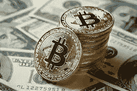
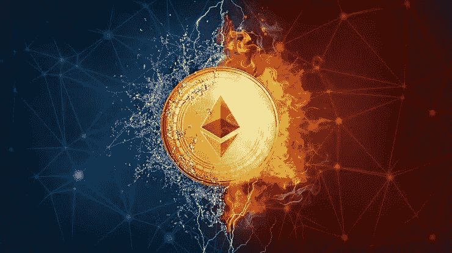
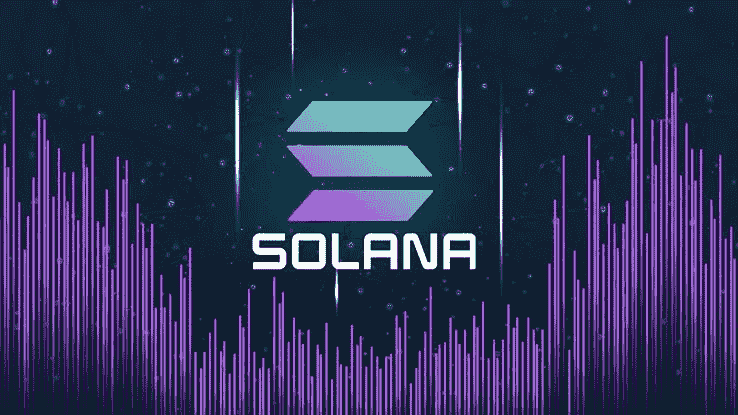
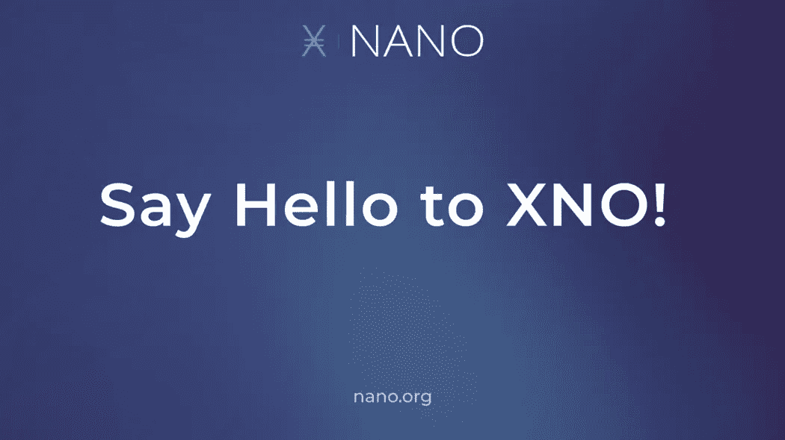
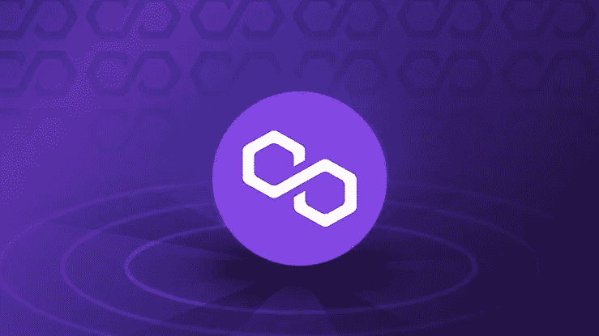
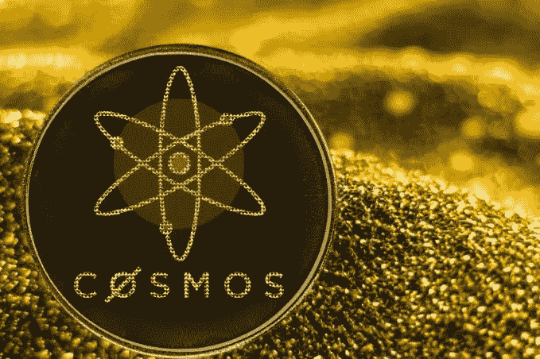
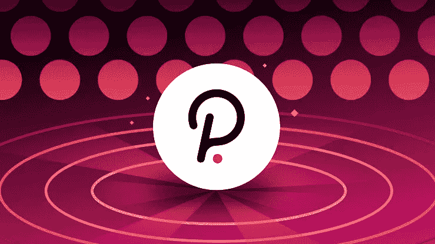

# 2022 年投资的十大加密货币项目

> 原文：<https://medium.com/coinmonks/top-ten-crypto-currency-projects-to-invest-in-april-2022-770aa79f6896?source=collection_archive---------29----------------------->

如果你是一个害怕或非常小心浪费辛苦赚来的钱在密码空间的人

在这篇文章中，我将谈论一些大多数人忽略的东西，这当然使他们在金融市场上如此宽松，

大家好，我是 Emmanuel Onoja，大家都知道我叫 **Enigma** ，我对数字资产、密码学和区块链的兴起和创新充满热情，对 Defi 和 Cefi 领域也很感兴趣。

许多投资者只是因为交易或投资他们几乎不了解或根本不了解的项目而损失了金钱，而市场上有数千种加密货币的事实让许多加密投资者感到困惑。一般来说，市值较小的加密货币比比特币和以太坊等大型成熟的数字代币更不稳定。随着俄乌冲突，以及中国的加密禁令，
比特币和其他主要加密货币目前处于熊市。因此，为了实现回报最大化，许多加密投资者将赌注押在了最有前景的加密货币上。这篇文章列出了这些年来最有希望购买和投资的十大加密货币，它们已经被证明有强大的社区支持和创新的用例，我认为对你的投资是安全的

*请注意，这不是一个财务建议，因为加密货币永远无法 100%预测，列表包含我根据自己的研究列出的项目。 以下是几个有效的研究策略，以及我自己对这些项目和它们各自的使用案例的理解，在你投资任何一个列出的项目之前，确保你(DYOR)做了自己的研究！ 在冒险之前了解项目
记住这一点，让我们开始*

**比特币** 
比特币是使用频率最高的加密货币之一。

2009 年，人民币成为首个获得关注的区块链货币。加密货币的投资者一直试图找出哪一种是下一个比特币或最伟大的加密货币来投资。尽管最近出现了一系列新的替代硬币，BTC 仍然是无可争议的领导者。

与其他加密货币相比，比特币也受到许多加密货币投资者的青睐。投资比特币的最佳时机是现在，因为最近比特币的价格出现了波动，所以现在获得并保留你的比特币是大多数长期投资者应该接受的一件事。

目前比特币的市值为 891，921，729，539 美元(T1)，交易量为 27，402，627，806 美元(T2)和 27，402，627，806 美元(T4)你也可以在这里研究当前的价格: [**在 coingecko 上查看价格走势**](https://www.coingecko.com/en/coins/bitcoin) 并在 [Twitter](https://twitter.com/BTCTN?t=ElFlkfUSKQZkg6DlWWw7Xw&s=09) 上关注比特币的更新，查看[官方网站，](https://bitcoin.org/en/)他们是如此多的购买和交换比特币的平台

**以太坊** 
以太坊是第一个实现智能合约的大型项目，也是以太坊最先这么做的。开发人员可以使用这些智能合约来创建基于区块链的移动和桌面分散应用程序(dApps)。

以太坊网络上驻留着数以千计的代币，正是这些代币引发了 ICO 狂潮。

它是 2022 年 3 月最有前景的加密货币之一，你应该考虑购买一些
以太币，其当前市值约为**397，534，628，688 美元**，平均 24 小时交易量为**14，500，106，356 美元**你可以在 coingo geco[价格和其他分析](https://www.coingecko.com/en/coins/ethereum)上查看价格走势，

关注 [***推特***](https://twitter.com/ethereum?t=K74XZLKkUgnP5Dn9GSOlMA&s=09)) 获取原始第一手资料，更多官网 [***官网、***](https://ethereum.org/en) ***以太坊*** *可在币安网*购买

**索拉纳** 
索拉纳是最有投资前景的加密货币之一。它的基础区块链网络，类似以太坊，

作为开发人员创建和托管 DApps 的平台。但是，它仍然存在初期问题，这已经导致了多次中断。

尽管如此，这项技术正在获得很大的吸引力。索拉纳目前的市值为 35，414，546，815 美元，交易量为 1，807，943，790 美元

**BNB**

旅游预订、娱乐、在线服务和金融服务。币安货币有望改善交易所和生态系统的表现。它涵盖了币安交易所的各种功能，包括交易费、交易费、上市费和任何其他费用。

Bnb 的市值约为 **$72，639，326，629** 而交易量为 **$1，541，975，023** 你可以在 Coingecko 上查看更多信息和 [***价格走势***](https://www.coingecko.com/en/coins/bnb)**也可以关注 BNB 的* [**推特**](https://twitter.com/binance?t=8iEJ-AMJRoUuzJX5-PRBJA&s=09) ，你可以购买和*

***美术工具箱***

> *市值..……………..*
> 
> *ArtKit 是一个社交媒体 NFT 平台，允许用户创建、共享和合作，以讲述一个故事并在 NFT 上使用。ArtKit 也是一个任何人都可以享受艺术和展示的地方。这将为展览在元宇宙建造一个博物馆，这样每个人都可以欣赏任何关于艺术的东西*

**

*ArtKit 正在开发一个本地 NFT 和社交媒体平台。该平台可以像其他社交媒体一样使用。用户可以创造和写一个故事背后的 NFT。此外，他们可以吸引买家，收藏家或观察者来评论，喜欢和分享他们的作品。因此，NFT 将更具互动性。他们也可以通过捐款或互相合作来创作一个更有趣的故事来支持 NFT 的创造者。*

**

***NANO** 
Nano 本质上是一种免手续费的数字货币。Nano 对每个人来说都是实用和包容的，因为它是免费传输的。*

*纳米是一个可持续的货币系统，不依赖于采矿，印刷或铸造。你准备好了，Nano 就准备好了，所以你不用等了。*

*选择 nano 进行交易可以确保 100%的金额直接发送到接收方，就像您钱包中的现金一样。Nano 的创建是为了让本地和国际支付更容易、更实惠。*

*Xno 是一个很有前途的项目，它通过非常强大的社区支持和创新的用例来确保您的资金安全，如果您是一个正在寻找有保证的投资空间的投资者，XNO 是值得期待的

XNO 目前的市值约为 **$340，872，938** ，交易量为 **$25，977，318**[**coin gecko**](https://www.coingecko.com/en/coins/nano)跟踪 XNO 趋势*

*XNO [**网站**](https://nano.org/en) 你可以在 [**Nanswap**](https://nanswap.com/) 上购买和交换你的 NaNo*

**

***POLYGON(Matic)**
POLYGON 基本上把以太坊变成了一个功能齐全的多链系统(又名区块链互联网)。*

*这种多链系统类似于 Polkadot、Cosmos、Avalanche 等其他系统，但具有以太坊的安全性、蓬勃发展的生态系统和开放性。*

*对于基于等离子体-POS 链的现有生态系统，什么都不会改变。通过 Polygon，可以在现有的成熟技术上开发新的功能，以提高开发者生态系统的能力，满足广泛的需求。*

*Polygon 将继续改进基础技术，以扩大其生态系统。*

*$MATIC 令牌将无限期保留，并将在系统的安全性和治理中发挥越来越重要的作用*

*Matic 的市值约为 **$11，839，299，927** ，而其目前的交易量为 **$739，176，132** 了解更多信息，请查看 [**Coingecko**](https://www.coingecko.com/en/coins/polygon) 上的价格走势，并在 [Twitter](https://twitter.com/0xPolygon?t=LRl9oV-AUlHllo7_B681cg&s=09) 上关注 Polygon 以获取更多信息和更新..*

**

*FTM

Fantom 网络的高吞吐量、快速终结和低廉成本使 FTM 令牌成为支付和收款的完美选择。Fantom 上的货币交易耗时约一秒，成本约为 0.0000001 美元。是的，那里有很多前导零。*

*对于链上治理，需要 FTM。因为 Fantom 是一个完全无权限、无领导的分散式生态系统，所以链上治理负责所有网络决策。涉众可以通过治理对修改和改进进行提议和投票。*

*治理令牌 FTM 是参与投票过程所必需的。*

*FTM 用于支付网络成本，如交易费和部署智能合约或创建新网络的费用。*

*如果没有最低限度的屏障，网络将很容易成为垃圾邮件的目标。Ftm 目前的市值约为 **$3，697，413，161** 美元，交易量为 **$485，339，804** 美元，即使在其两名高级员工(高级解决方案架构师 Anton Nell 和多产开发人员 Andre Cronje)离开后，Ftm 仍被证明是不可动摇的，但没有提供任何关于他们为什么离开的线索。尽管 Ftm 下降了约 22%,但该项目仍在强劲增长*

*在 [**Coingecko**](https://www.coingecko.com/en/coins/fantom) 上查看更多 Ftm，并在 [**Twitter**](https://twitter.com/FantomFDN?t=YEglGV6PzuqUTpf8XzD4Mg&s=09) 上关注更新*

**

***ATOM**
Cosmos Hub 是一个具有 ATOM 原生令牌的多资产分布式分类帐。原子可以用于三种不同的用途:垃圾邮件防护、标记令牌和治理投票。作为一种防止垃圾邮件的技术，Atoms 被用来支付费用。类似于以太坊的“gas”概念，费用可能与交易执行的处理量成比例。费用分配发生在协议内，如本协议定义中所定义。
原子可以通过充当赌注代币来“绑定”获得区块奖励。原子的数量决定了宇宙中心的经济有多安全。抵押的原子越多，线上的“皮”就越多，价格就越高。市值为**8874784779 美元**，24H 交易量为**671874744 美元***

*更多关于[**coin gecko**](https://www.coingecko.com/en/coins/cosmos-hub) 跟随 [**碎碎念**](https://twitter.com/cosmos?t=S0U-_ixEqWJNZWZesfRGXQ&s=09)*

**

*POLKADOT 之所以多样，是因为它完全可以适应，并且对网络链的类型或结构不做任何假设。如果满足一组要求，甚至非区块链系统或数据结构也可以变成副链。Polkadot 类似于独立链的集合(如以太坊、以太坊经典、名称币和比特币)，但有两个关键区别:池化安全性和无信任链间可交易性。
Polkadot 运行时环境 SDK(例如奇偶校验技术公司的底层)将用于编写 Polkadot 的许多本机副链*

*当前市值为 25，379，817，523，交易量为 898，874，822 美元*

*在流行的分散交换网络上购买和交换点号*

*在 [**Twitter**](https://twitter.com/Polkadot?t=MpWGH3OKX698OtlcvrBxBA&s=09) 上关注 Polkadot，在 [**Coingecko**](https://www.coingecko.com/en/coins/polkadot) 上关注价格*

*在我们的下一篇文章中，我们将讨论如何获得免费加密投资，如果你不准备冒险你的手赚的钱作为一个初学者，所以保持关注*

*关注我的 [**Twitter**](https://twitter.com/Enigma_Creativ?t=_djIVenPMMAzmDW8zE2nsA&s=09) 消息我上 [**WhatsApp**](https://wa.link/c9vpfj)*

*特别感谢 CEO Jionerd，关注他的 [**Twitter**](https://twitter.com/ceo_jionerd?t=7Hra5yhWg-RO2ISBseN1Ww&s=09) 获取更多更新，关注他的**DG Crypto Tv**on[**WhatsApp****Twitter**](https://wa.me/message/IAROE2C27UUTO1)*

> *加入 Coinmonks [电报频道](https://t.me/coincodecap)和 [Youtube 频道](https://www.youtube.com/c/coinmonks/videos)了解加密交易和投资*

# *另外，阅读*

*   *[加密货币储蓄账户](/coinmonks/cryptocurrency-savings-accounts-be3bc0feffbf) | [YoBit 审核](/coinmonks/yobit-review-175464162c62)*
*   *[Botsfolio vs nap bots vs Mudrex](/coinmonks/botsfolio-vs-napbots-vs-mudrex-c81344970c02)|[gate . io 交流回顾](/coinmonks/gate-io-exchange-review-61bf87b7078f)*
*   *[CoinFLEX 评论](https://coincodecap.com/coinflex-review) | [AEX 交易所评论](https://coincodecap.com/aex-exchange-review) | [UPbit 评论](https://coincodecap.com/upbit-review)*
*   *[AscendEx 保证金交易](https://coincodecap.com/ascendex-margin-trading) | [Bitfinex 赌注](https://coincodecap.com/bitfinex-staking) | [bitFlyer 点评](https://coincodecap.com/bitflyer-review)*
*   *[Bitget 回顾](https://coincodecap.com/bitget-review)|[Gemini vs block fi](https://coincodecap.com/gemini-vs-blockfi)cmd |[OKEx 期货交易](https://coincodecap.com/okex-futures-trading)*