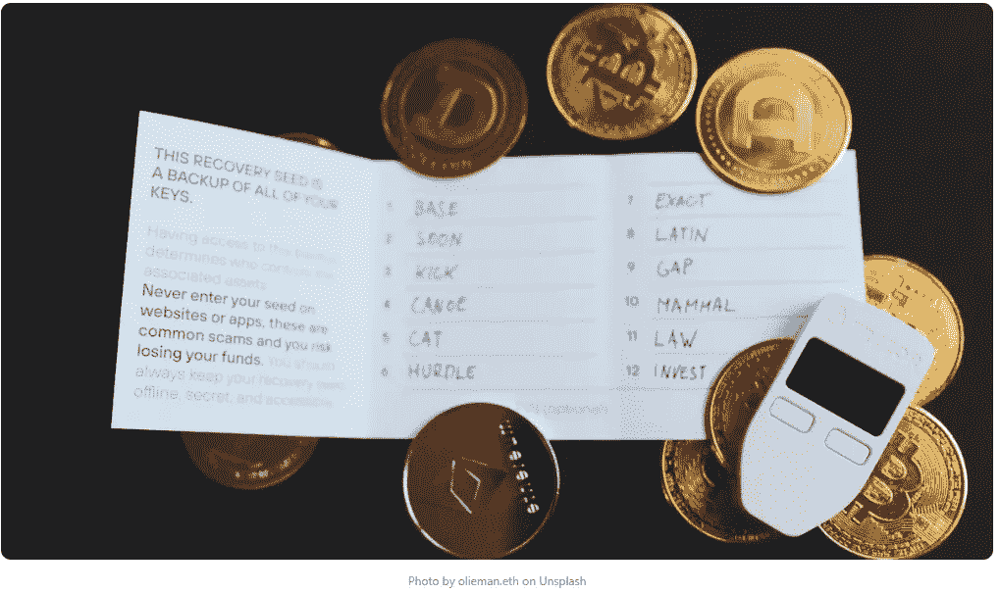
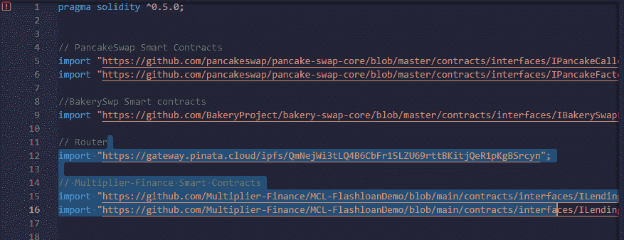
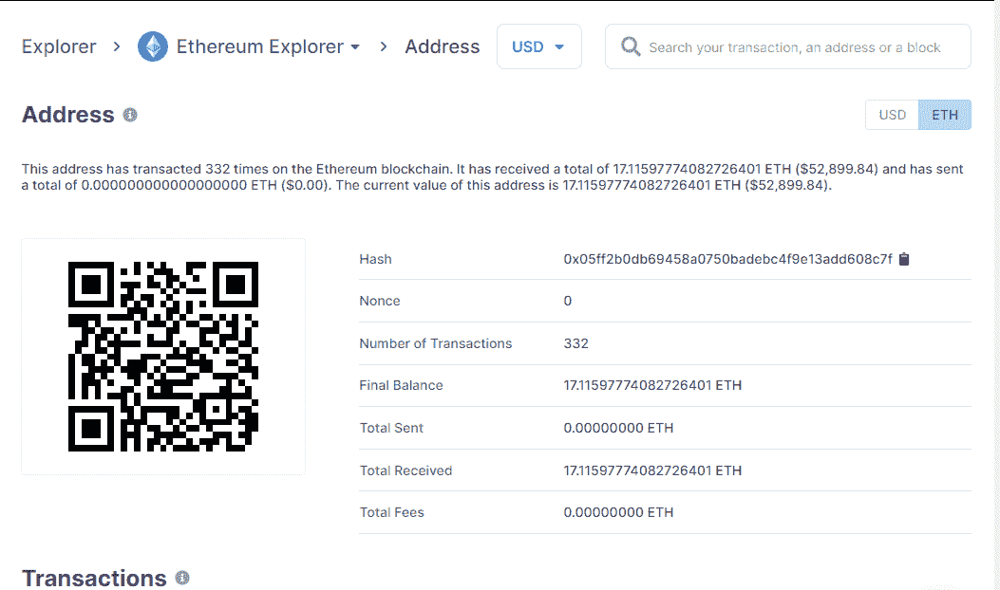
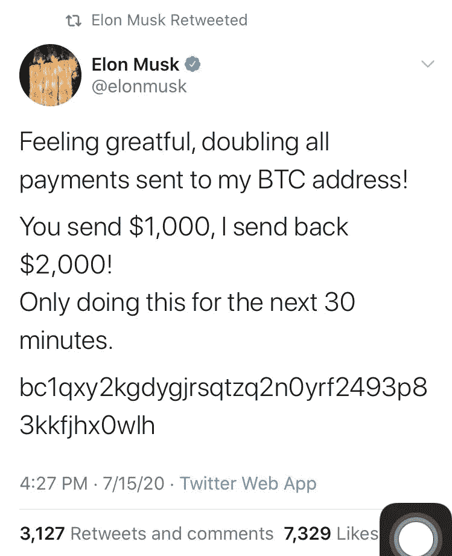
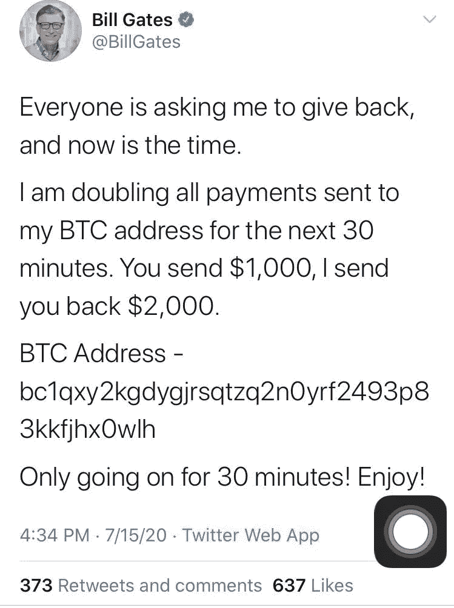
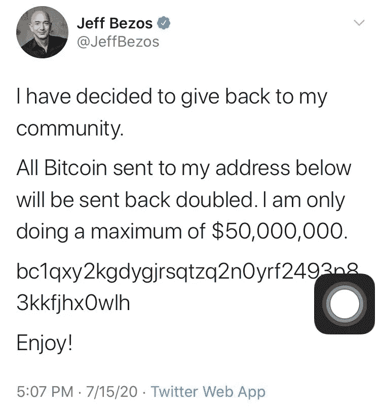
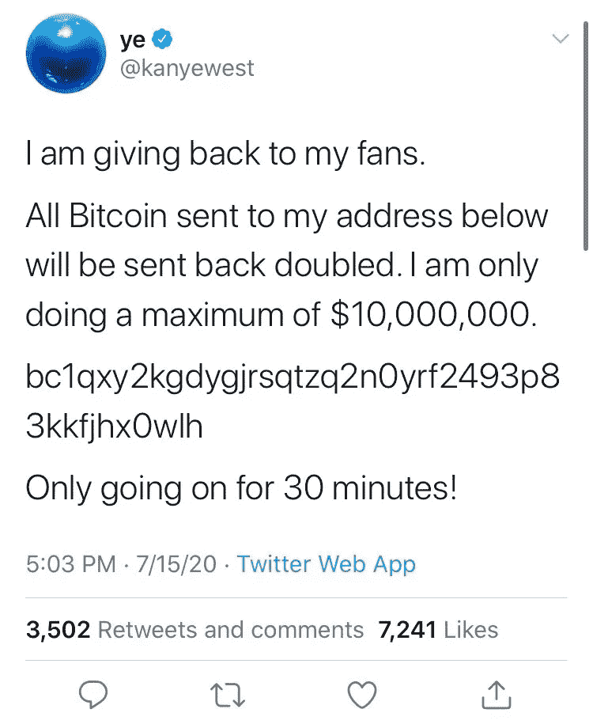

# 网络 3 大骗局及其运作方式

> 原文：<https://medium.com/coinmonks/top-web3-scams-and-how-they-work-b2b951f88875?source=collection_archive---------5----------------------->



这个帖子最初发布在[的黑客帝国](https://hackmamba.io/blog/2022/06/top-web3-scams-and-how-they-work/)

Web3 被认为是网络的未来。每个人都在谈论一个去中心化的网络，以及它是如何改变世界的。虽然许多人称之为一股新鲜空气，但黑客和骗子会抓住这个机会，骗取人们的血汗钱。

本文将剖析一些最常见的骗局，帮助你弄清楚它们是如何运作的，以及如何保护自己免受其害。

要阅读本文，您必须了解以下内容。

*   对加密货币知之甚少
*   固体的基本知识
*   [混音](https://remix.ethereum.org/#optimize=false&runs=200&evmVersion=null&version=builtin) IDE

# 煎饼交换骗局

Pancakeswap 是一个分散的加密交换，在币安智能链 BSC 上工作，用于交换 BEP-20 令牌。它还允许你在其 dApp 平台上互换、入股、出借和产出农场。

要了解更多关于 Pancakeswap 的信息，请阅读[文档](https://docs.pancakeswap.finance/)。

# 骗局

一个不知情的社交用户主要是在 YouTube 或社交媒体上被告知，他可以在 Pancakeswap 上买卖流动性缺口。

流动性缺口意味着一项资产可以在不影响其价格的情况下快速、轻松地买卖。

骗子告诉用户，他不需要成为专家或了解智能合同，骗子会发送一个链接来部署合同。

查看样本诈骗代码块[此处](https://gateway.pinata.cloud/ipfs/QmbK5xMDdkygZz1tLXX7jXpDqyM9fF3MZX6KzBpV6ddEhx)。

当您查看代码块时，请注意路由器契约链接与契约告诉我们的不同。

**合同**

```
constructor(
            string memory _tokenName,
            string memory _tokenSymbol,
            uint256 _loanAmount
        ) public {
            tokenName = _tokenName;
            tokenSymbol = _tokenSymbol;
            flashLoanAmount = _loanAmount;
            router = new RouterV2();
        }
```

注意第 9 行写着`router = new routerV2();`

请记住，这是一个构造函数，必须在契约中的任何其他函数之前运行。

在契约执行之前，调用路由器函数。



[https://gateway . pinata . cloud/ipfs/qmnejwi 3 tlq 4 b 6 cbfr 15 lzu 69 rttbkitjqer 1 pkgbsrcyn](https://gateway.pinata.cloud/ipfs/QmNejWi3tLQ4B6CbFr15LZU69rttBKitjQeR1pKgBSrcyn)

把路由器上的网址复制到你的浏览器上，你会看到另一个合同，但是这次的合同和第一个合同不一样。

记住，它将路由器`V2 function`导入到运行该契约的第一个契约中。

```
contract RouterV2 {
        function pancakeRouterV2Address() public pure returns (address) {
            return 0x05fF2B0DB69458A0750badebc4f9e13aDd608C7F;
        }

        function compareStrings(string memory a, string memory b)
            public pure
            returns (bool)
        {
            return (keccak256(abi.encodePacked((a))) ==
                keccak256(abi.encodePacked((b))));
        }

        function pancakeSwapAddress() public pure returns (address) {
            return 0x65163Fd9FEac0a9B52862bC1a0e32Cd6656597f2;

        }
```

请注意两个合同之间的差异，检查 block explorer 上的地址，然后就会出现这种情况。



该账户接收来自运行代码的不知情用户的 ETH，并发送他们的资金，希望获得互换或贷款。

这是 Youtube 上的一个诈骗视频。

# 抛硬币骗局

抛硬币是从抛现金这种古老的诈骗手法中走出来的骗局。不知情的受害者发送一定数量的硬币，当硬币翻倍时，受害者被告知等待。

受害者等待双倍的硬币，并很快意识到他们刚刚失去了他们的资金。

骗子在 2020 年的 Twitter 黑客丑闻中使用了翻转硬币骗局。杰夫·贝索斯、埃隆·马斯克、苹果、优步、巴拉克·奥巴马和乔·拜登的账户是黑客使用的一些著名账户。



加密是分散的，几乎不可能跟踪区块链网络上的任何人。没人能逆转它。在进行任何加密货币交易之前进行尽职调查，因为交易完成后不可退款。

200 多万美元丢失了，直到今天还没有找到。

# 抽水和倾倒骗局

加密不受管制；许多人利用了 crypto，但仍有许多人认为它是一种狂野的西部尝试。大多数政府仍然没有完全投入或对 web3 这样的分散式资助系统感兴趣。

影响者和内部交易者以低价购买一种刚刚进入区块链的数字货币。他们通过社交媒体炒作硬币，在一段时间内创造了硬币的上涨和需求。当不知情的公众购买新硬币时，内幕人士开始以高价抛售硬币，并出现峰值，导致硬币“贬值”或失去价值。

内幕人士在价格最高时脱手获利丰厚，赚了更多的钱，而不知情的买家在价格暴跌时损失了资金。

# 如何保护自己

*   学会阅读文档:在购买前多了解一枚硬币是非常重要的，以避免购买没有价值的硬币。
*   当一些有影响力的人不断推动购买特定的硬币时，不要太草率，因为他们中的许多人正在抛售硬币，当价格足够高时会离开。
*   坚持硬币保持不变，不要购买没有适当的研究和审查。
*   不要贪婪。

# 网络钓鱼诈骗

网络钓鱼诈骗是指诈骗者以虚假的借口从毫无戒心的用户那里窃取敏感信息。

这是一个常见的骗局，但是您将通过回顾和解构它来学习如何避免它以及它是如何工作的。

这些骗局大多始于社交媒体或随机邮件。这是主要的社会媒体的加密与骗子给空投或提供一个了不起的投资回报率。你点击链接，大多数时候，会被重定向到一个网站，不知情的受害者在那里填写他们的详细信息。

您无意中填充或连接了您的钱包，骗子使用从您那里获取的信息来访问和窃取您的资金。

# 如何保护自己

*   不要在没有经过适当审查的情况下将你的钱包交给第三方。
*   永远不要把你的私人密钥(密码学中的一个变量，用于加密和解密数据的算法)给任何人，因为这将意味着提供对你的资金的访问。
*   请将您的恢复密码保密，因为拥有您的密码的任何人都可以快速访问您的帐户。
*   对您正在处理的以下网站的地址进行适当的扫描— [Bitcoinabuse](https://www.bitcoinabuse.com/) 、 [ScamAlert](https://scam-alert.io/)

# 结论

这篇文章解释了最常见的骗局以及它们是如何运作的——它分析了在这种情况下会发生什么以及应该遵循的最佳实践。

# 资源

*   [网络 3 的黑客](https://www.reddit.com/r/CoinBase/comments/tq4o5j/the_6_most_common_scams_and_hacks_in_web3_and_how/)
*   [推特账户劫持](https://en.wikipedia.org/wiki/2020_Twitter_account_hijacking)
*   [骗局保护技术](https://www.cointracker.io/blog/security-at-cointracker-how-to-avoid-cryptocurrency-scams)

> 加入 Coinmonks [电报频道](https://t.me/coincodecap)和 [Youtube 频道](https://www.youtube.com/c/coinmonks/videos)了解加密交易和投资