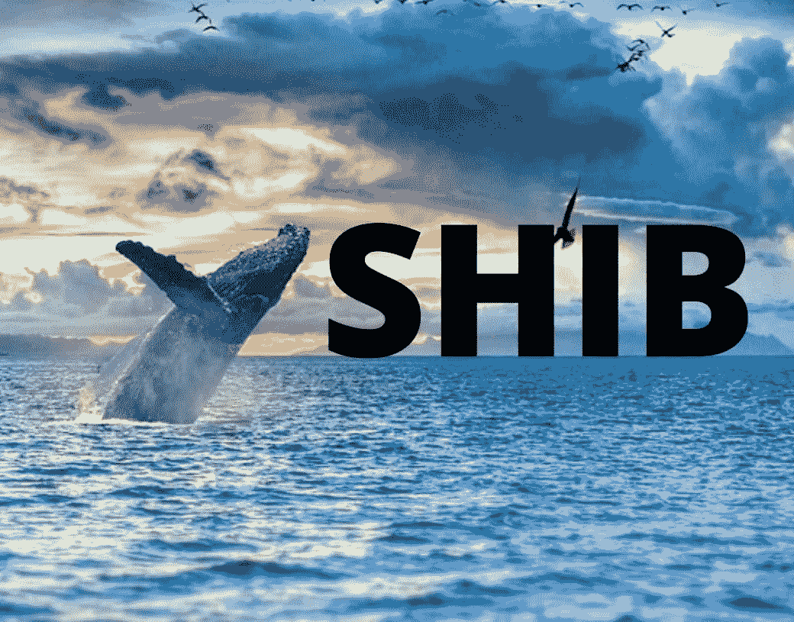
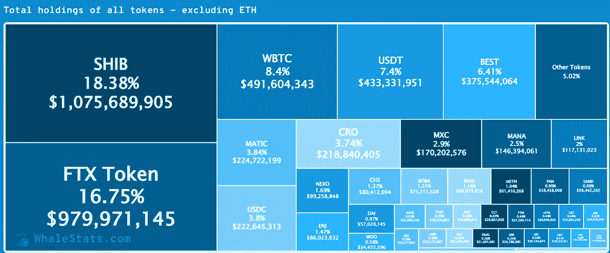

# 顶级鲸鱼投资者购买了 1705 亿美元的 Shib

> 原文：<https://medium.com/coinmonks/top-whales-investors-bought-shib-of-170-5-billion-50fd68a8bcfb?source=collection_archive---------67----------------------->

虽然 Shib 最近没有出现任何大规模的价格飙升，但大型以太坊鲸鱼继续收购它，从汇率的小幅上涨中获利。

因此，在过去的两天里，鲸鱼已经购买了价值近 400 万美元的这种犬类令牌。

# 这些顶级投资者购买了 1750 亿 SHIB

WhaleStats 数据平台跟踪包括以太坊和 BNB 连锁店在内的几家连锁店的最大钱包，分享了今天早些时候和 4 月 27 日两次购买柴犬迷迷令牌的详细信息。

这两笔交易都是“蓝鲸 0073”钱包的主人做的，昨天钱包里有 700 亿 SHIB，今天早些时候总共有 100，469，653，862 柴犬。这些秘密金额的法定等值分别为 1，619，800 美元和 2，329，891 美元。

# SHIB 从 FTT 手中夺回了第一的位置

WhaleStats 网站已经分享到，刚刚柴犬已经恢复了以太坊投资者中最大持股的位置。此前，token 已经输给了 FTX·托肯(FTT)，它在这一荣誉位置上的老对手。

目前，按美元价值计算，SHIB 是鲸鱼最大的加密持有者，MATIC 是最广泛持有的令牌，UMA 是交易最多的令牌。

鲸鱼持有的 SHIB 数量占其投资组合的 18.38%，即 46，163，625，767，697 枚柴犬代币，价值 1，075，689，905 美元。

撰写本文时，ETH whales 拥有的 FTT 数量为 24，493，640 枚硬币，价值略低于 10 亿美元。

> 加入 Coinmonks [电报频道](https://t.me/coincodecap)和 [Youtube 频道](https://www.youtube.com/c/coinmonks/videos)了解加密交易和投资

# 另外，阅读

*   [OKEx vs KuCoin](https://coincodecap.com/okex-kucoin) | [摄氏替代品](https://coincodecap.com/celsius-alternatives) | [如何购买 VeChain](https://coincodecap.com/buy-vechain)
*   [币安期货交易](https://coincodecap.com/binance-futures-trading)|[3 comas vs Mudrex vs eToro](https://coincodecap.com/mudrex-3commas-etoro)
*   [如何购买 Monero](https://coincodecap.com/buy-monero) | [IDEX 评论](https://coincodecap.com/idex-review) | [BitKan 交易机器人](https://coincodecap.com/bitkan-trading-bot)
*   [CoinDCX 评论](/coinmonks/coindcx-review-8444db3621a2) | [加密保证金交易交易所](https://coincodecap.com/crypto-margin-trading-exchanges)
*   [红狗赌场评论](https://coincodecap.com/red-dog-casino-review) | [Swyftx 评论](https://coincodecap.com/swyftx-review) | [CoinGate 评论](https://coincodecap.com/coingate-review)