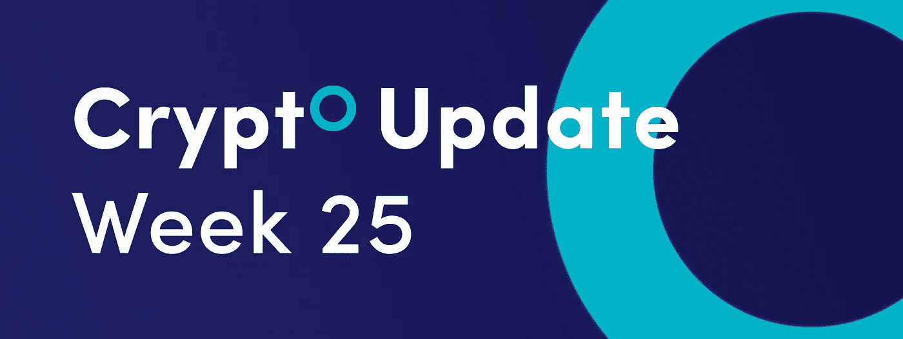
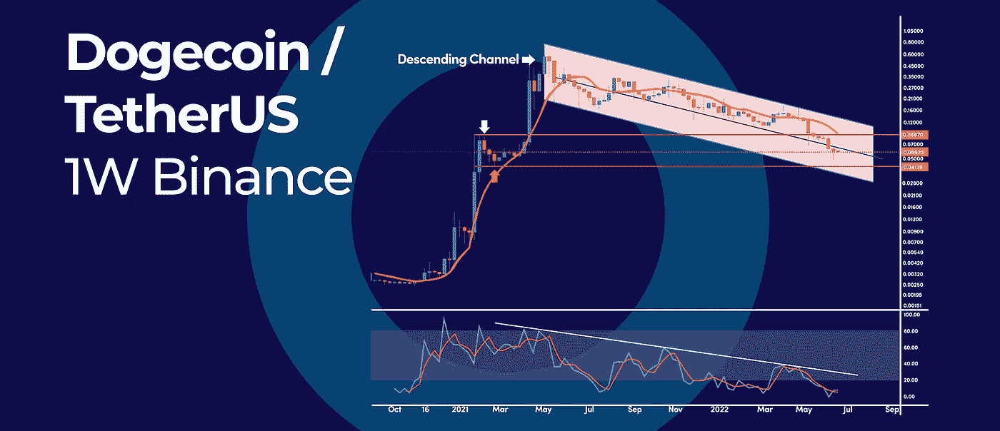
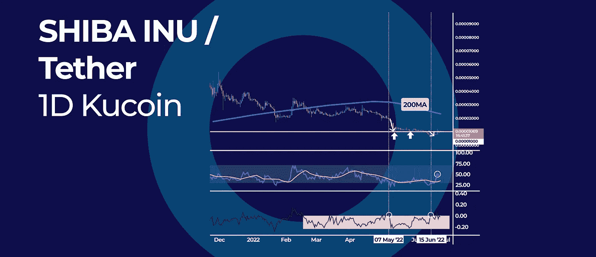
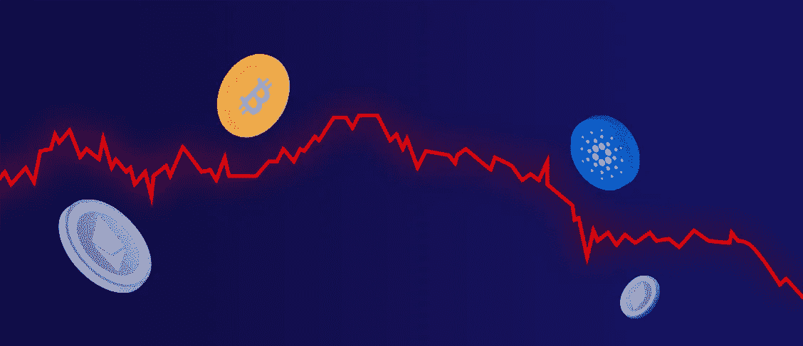

# 总的加密市场资本崩溃了 70% |在这个星期的加密更新更多。

> 原文：<https://medium.com/coinmonks/total-crypto-market-capitalization-crashed-70-and-more-in-this-weeks-crypto-update-9e350fea454a?source=collection_archive---------45----------------------->

Total Crypto Market Capitalization Crashed 70% | And More in This Weeks Crypto Update.

*   总加密市值暴跌 70%
*   长期 Dogecoin 通道显示底部有多远
*   柴金现金流指标显示柴犬的积累量很低

# 长期 Dogecoin 通道显示底部有多远

在过去的 13 个月里，价格一直处于下降趋势，在下降通道内交易。在本文中，我们使用周线日志图缩小，看看这个熊市周期的底部离这里有多远。

## 下行通道

当缩小时，封装从 2021 年 5 月峰值开始的价格行动的长期下降通道更加明显。短期来看，我们跌破并收于通道中位下方，这暴露了通道下方的支撑。

通道的底部位于 0.036 美元，接近导致 [DOGE](https://coinmarketcap.com/currencies/dogecoin/) 价格上涨的前期盘整的底部。因此，这个区域是 DOGE 可以见底的重要价格区域。

目前，0.05 美元的支撑保持住了，价格反弹了，但只要我们保持在下降通道的中部以下，情绪就仍然是看跌的。

## 随机振荡器

随机振荡指标也是有史以来最超卖的，它已经有一个上涨的交叉点。这种发展可能会减缓当前的抛售压力，但最终我们仍然被吸引到通道的底部。

## 什么是随机振荡器？

随机振荡指标是一个动量指标，它显示了一段时间内(通常是 14 天)加密的收盘价相对于加密价格高低范围的位置。它是按 0 到 100 的标度绘制的。

## **期待**

任何随后的反弹都可能在 0.063 美元到 0.07 美元的价格区域附近遇到阻力，这是通道的中间位置。

# 柴金现金流指标显示柴犬的积累量很低

柴犬(SHIB)价格从 0.0000085 美元的关键支撑位反弹，但反弹现在很快消退，缺乏强劲的看涨势头和跟进。此外，根据柴金资金流(CMF)指标，没有大机构和鲸鱼积累加密货币的迹象。

## 柴金资金流

在短暂突破 0 中心线后，CMF 振荡指标回到了 0 以下，显示出疲软。最近两次 CMF 振荡器显示相同的模式，SHIB 的价格实际上创造了新低。

自今年年初以来，大多数 CMF 指数都低于零，这证实了鲸鱼没有通过这个熊市进行积累。这表明机构已经倾向于分配。

## 柴金资金流指标是如何工作的？

柴金资金流指标使用累积/分配线来衡量资金进出证券的情况。累积/分配线是一个基于成交量的指标，使用证券的收盘价和成交量。柴金资金流量(CMF)指标是一个动量指标，跟踪资金进出证券的数量或流量。

## RSI 动量

RSI 指标也证实了最近的价格走势，因为它显示了更多的看跌动力压力。该振荡指标短暂突破 50 的中间水平，但这一趋势无法持续，显示了当前反弹的弱点。

在技术方面，多头无法守住 0.00001 美元的大整数，再次表明这个市场仍然非常疲软。

## 展望未来

SHIB 的价格可以稳定在目前的价格水平附近，并看到更多的整合，这是熊市中常见的价格行为。然而，如果 SHIB 价格超过 0.00001 美元的大整数，这将标志着多头重新控制，新的牛市正在展开。

# 总加密市值暴跌 70%

随着大多数加密货币从峰值价格暴跌 80%以上，加密市场的总市值已跌破 1 万亿美元大关。与此同时，比特币(BTC)今年损失了超过 50%的价值，目前交易价格接近 20，000 美元的心理数字。

## 加密市值

今年年初，加密市场总市值为 2.24 万亿美元(根据 CoinMarketCap 数据)，低于 2.97 万亿美元的历史峰值。在撰写本文时，整个加密市场的估值仅为 8800 亿美元。

相比之下，比特币的市值已经从年初的 9020 亿美元降至 3620 亿美元。在其历史巅峰时期，比特币的总市值为 1.27 万亿美元。

## 什么是加密市场资本总额，为什么它很重要？

加密市值显示了加密货币市场的总价值。通过将每个加密硬币和代币的价格乘以流通中的硬币或代币的数量来计算该值。

市值很重要，因为它显示了加密货币市场的整体价值。它还用于比较不同加密货币的市值。

例如，比特币的市值用于了解比特币相对于其他加密货币(如以太坊、Ripple、EOS、Dogecoin 等)的价值。

## 崩溃的历史

今年加密市场的崩溃标志着自 2017 年以来的第三大崩溃。然而，这是自 2020 年 3 月“黑色星期四”以来最大的崩盘，当时市场在 24 小时内损失了超过 2000 亿美元。

## 展望未来

比特币的价格目前反映了围绕加密市场的负面情绪。多位专家认为，按市值排名第一的加密货币很可能会跌破 2 万美元的支撑位。

订阅我们的媒体每周博客和更新。
在[推特上关注我们](https://twitter.com/cryptohopper) | [脸书](https://www.facebook.com/cryptohopper)|[Reddit](https://www.reddit.com/r/CryptoHopper/)|[insta gram](https://www.instagram.com/cryptohopper/?hl=nl)

在 [Cryptohopper](https://www.cryptohopper.com/) 开始交易！

> 加入 Coinmonks [电报频道](https://t.me/coincodecap)和 [Youtube 频道](https://www.youtube.com/c/coinmonks/videos)了解加密交易和投资

# 另外，阅读

*   [有哪些交易信号？](https://coincodecap.com/trading-signal) | [Bitstamp vs 比特币基地](https://coincodecap.com/bitstamp-coinbase) | [买索拉纳](https://coincodecap.com/buy-solana)
*   [密码交易机器人](/coinmonks/crypto-trading-bot-c2ffce8acb2a) | [维护审查](https://coincodecap.com/uphold-review)
*   [如何给 MetaMask 钱包添加 Arbitrum？](https://coincodecap.com/how-to-add-arbitrum-to-metamask-wallet)
*   [KuCoin vs 北海巨妖 vs BitYard](https://coincodecap.com/kucoin-vs-kraken-vs-bityard)
*   [加密交易的最佳 VPN](https://coincodecap.com/best-vpns-for-crypto-trading)
*   [ProfitFarmers 回顾](https://coincodecap.com/profitfarmers-review) | [如何使用 Cornix Trading Bot](https://coincodecap.com/cornix-trading-bot)