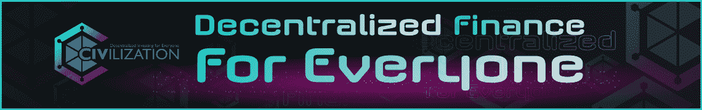
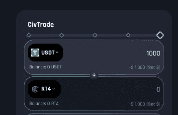
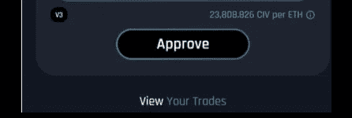
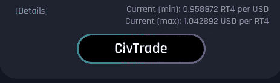
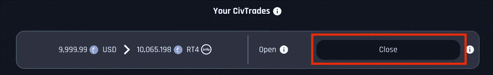

# 迈向文明的下一个阶段:最后一轮

> 原文：<https://medium.com/coinmonks/towards-the-next-stages-of-civilization-final-round-e423ad65beab?source=collection_archive---------28----------------------->

## $文明$硬币僧侣

## 加入我们全 DeFi token 产品的最后机会

Join our Journey

> 你最后的机会:在你的日历上标记 2022 年 3 月 21 日，星期一！

# 概述

上周日，文明成功完成了第一阶段 50 万美元的筹款。1 小时内达到目标，收盘时超额认购 22%。

在此过程中，我们还展示了 CivTrade 如何提供一个新的、无计划但有效的用例:**创新的 DeFi launchpad** ，因其平稳运行和公平性而受到投资者的广泛赞誉。

# 现在

现在**邀请你加入第二(也是最后)阶段**，下周**2022 年 3 月 21 日星期一**太平洋时间早上 6 点/美国东部时间早上 9 点/英国时间下午 2 点/欧洲中部时间下午 3 点开始。

*   最高可达 **1，000，000 USDT @ 33.3%的价格折扣。没有设定最低或最高投资金额**
*   至少开放到 3 月 25 日星期五**与发布时间相同，太平洋时间上午 6 点/美国东部时间上午 9 点/英国时间下午 2 点/欧洲中部时间下午 3 点**
*   在 ETH 网络上使用 **CivTrade 与 USDT 进行交易**
*   **只有在本轮**结束后，用户必须手动关闭 CivTrade 上的头寸，以便在钱包中获得正确的代币

如果该轮超额认购，您将获得与您的承诺成比例的分配，以及未分配部分的 USDT 退款。

# 详细的步骤

Example pre-filled CivTrade interface

1.  点击直接链接加入，**1-点击** **预填链接:**[【https://app.civfund.org/prefill/USDT/RT2/1.00059015】T21](https://app.civfund.org/prefill/USDT/RT2/1.00059015)
2.  **设置您的 USDT 数量**，在第一个字段中手动输入或使用上面的滑块。保持预填充界面的其余部分不变。
3.  **批准 CivTrade 消费您的 USDT** 并确认您钱包中的交易。如果您之前已经完成了一次性批准，请继续下一步。

Approve USDT pair

> 最后推送 CivTrade，确认钱包里的订单提交。

等到确认。

Confirm your transaction

# 完成

在这一轮结束时，即 3 月 25 日星期五，您可以使用“*关闭*”按钮申领您的代币。交易在您的钱包中确认后，您将收到您的代币。

Remove your order

您将在钱包中收到名为“ ***Right2*** ”的代币。这些“ ***权利 2*** ”代表您在发布后获得新奖励代币的权利。

至于所有的代币，它们是可以交换和转让的:请务必保管好它们，直到你收到最后一批新代币。

*右*代币将仅用于奖励代币的分发:一旦完成，它们将不再用于任何其他目的。

您也可以在本轮筹款结束前，使用“*您的 CivTrade* ”部分“*关闭*”按钮取消您的订单。确认您钱包中的交易。这将撤回您的 USDT，并自然地放弃您之前获得您的“ ***权利 2*** ”的请求。除非你因为任何原因改变主意，否则只要按照计划等到阶段结束就行了！

> 但是，如果第二轮目标没有实现，会发生什么呢？

为了吸引**战略合作伙伴和长期盟友，**如果在 DeFi 发售结束时仍有剩余金额，我们将在国库中保留相应的代币供未来合作伙伴使用。

在最初的 96 小时内，提前点击并没有什么特别的好处。如果我们超额认购，这意味着超过 100 万 USDT 承诺，每个人都将收到相同比例的分配和未使用的 USDT 余额送回你的钱包。

这种分配方法称为“*比例分配*”，完全由 CivTrade 自动完成。也没有机器人。

在这几周里，机构投资者和战略合作伙伴表现出了兴趣:一些人加入了第一轮，另一些人表示愿意参加第二轮。

因此，在第 2 轮中未分配的任何代币将保存在 multisign 钱包中，供战略合作伙伴将来使用。

# 后续步骤

筹集的资金将用于扩大开发团队，并为新的代币交易和 CivFarm 开展营销活动(赞助、推广)。最后，我们将按照路线图完成基金。

> 想想看:第一个完全公平、公开、透明和免费的分配。文明带来的创新从未停止！

期待来自我们开放透明的社区的反馈和问题。#WeAreCIV

[加入文明电报小组，发现我们的创新路线图](https://t.me/civsettlers)

幸福文明大厦

PS:要了解更多关于文明的知识，请阅读我们的 [vision 博文](https://news.civfund.com/civilization-civ-decentralized-investing-for-everyone-99a8b38cb485):

 [## 文明$CIV:为每个人分散投资

### 全球首只 Dex 基金

news.civfund.org](https://news.civfund.org/civilization-civ-decentralized-investing-for-everyone-99a8b38cb485) 

# 关于文明

文明是世界上第一个分散投资基金:由自己的投资者直接拥有和管理。令牌$CIV:社区投资工具。

它的 CivTrade 在第一个月就达到了 500 万美元的交易量，每笔交易额外获得 1718 美元，同时比 Uniswap 节省了 37.5%的汽油。[唯冠](https://app.civfund.org/pro-trade/0x37fe0f067fa808ffbdd12891c0858532cfe7361d)升级实现了与币安的功能等同，但完全 DeX / DeFi。

也被称为金融的[燃烧人，文明现在计划 CivFarm 和 CivFund，让每个人都能享受分散金融的好处。有什么问题吗？请加入全球](https://news.civfund.com/the-burning-man-of-finance-fead2d86dffb)[电报](https://t.me/civsettlers)群。

[文明](http://civfund.org/) | [媒介](https://blog.civfund.com/)|[|](https://www.reddit.com/r/Chainlink/)[不和](https://discord.gg/Ja2nwAHEQd) | [电报](https://t.me/civsettlers) | [推特](https://twitter.com/civfund) | [道](http://dao.civfund.org/)|[Github](https://github.com/CivilizationCIV)|[Reddit](https://www.reddit.com/r/civfund/)

> 加入 Coinmonks [电报频道](https://t.me/coincodecap)和 [Youtube 频道](https://www.youtube.com/c/coinmonks/videos)了解加密交易和投资

# 另外，阅读

*   [用于 Huobi 的加密交易信号](https://coincodecap.com/huobi-crypto-trading-signals) | [HitBTC 审查](/coinmonks/hitbtc-review-c5143c5d53c2)
*   [如何在 FTX 交易所交易期货](https://coincodecap.com/ftx-futures-trading) | [OKEx vs 币安](https://coincodecap.com/okex-vs-binance)
*   [OKEx vs KuCoin](https://coincodecap.com/okex-kucoin) | [摄氏替代度](https://coincodecap.com/celsius-alternatives) | [如何购买 VeChain](https://coincodecap.com/buy-vechain)
*   [ProfitFarmers 回顾](https://coincodecap.com/profitfarmers-review) | [如何使用 Cornix 交易机器人](https://coincodecap.com/cornix-trading-bot)
*   [如何匿名购买比特币](https://coincodecap.com/buy-bitcoin-anonymously) | [比特币现金钱包](https://coincodecap.com/bitcoin-cash-wallets)
*   [瓦济里克斯 NFT 评论](https://coincodecap.com/wazirx-nft-review)|[Bitsgap vs Pionex](https://coincodecap.com/bitsgap-vs-pionex)|[Tangem 评论](https://coincodecap.com/tangem-wallet-review)