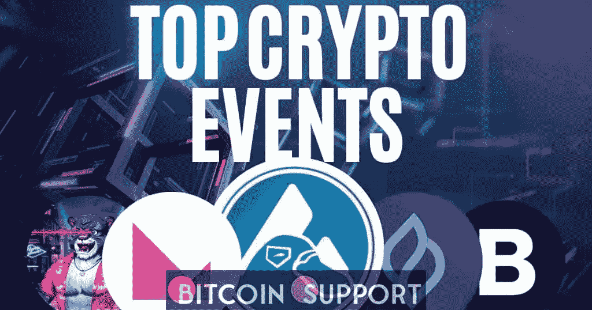

# 东洋 IGO 在 Seedify 上售罄| 2 月第 4 周加密活动

> 原文：<https://medium.com/coinmonks/toyo-igo-sold-out-on-seedify-february-week-4-crypto-events-d2f1c89266b0?source=collection_archive---------58----------------------->

[https://bitcoinsupports.com/](https://bitcoinsupports.com/)

Travala AVA 空投 3 和 BitTorrent BTFS 2.0

的预期 mainnet 部署全球比特币市场仍呈下行趋势。截至本文撰写之时，比特币现在的交易价格为 39283 美元，在过去七天中下跌了 7.0%。在同一时间段内，以太坊的价值下跌了近 4.9%，目前的交易价格为 2745 美元。

为了让我们的读者了解最新消息，我们制作了本周即将发生的一些最重要的加密事件的列表。Travala airdrop 3 和即将推出 Seedify 的 TOYO IGO 是两个最受期待的加密事件。让我们来看看更多即将到来的加密货币事件。

**1。空投 3:trava la(AVA)**

trava la 是区块链领先的旅游预订公司，现在正在进行一系列空投。2022 年 2 月 18 日，空投正式启动(世界协调时上午 7 点)。根据新闻稿，空投计划在发射后 7 天内进行。这表明 Travala airdrop 3 将在 2022 年 2 月 25 日左右发生。

AVA 持有者将获得 1000 万 TRVL 代币作为空投的一部分。用户必须获得至少 50 个 AVA 代币才能参与。同样值得注意的是空投将发生在币安智能链(BSC)上。

[https://twitter.com/travalacom/status/1493657939999014914](https://twitter.com/travalacom/status/1493657939999014914)

**2。加密货币交易平台 Klever 透露了其即将推出的区块链的规格。以及一系列为区块链首映式做准备的活动。克莱弗·区块链验证者测试网阶段计划于本周开始。因此，验证器应该在链上测试和构建。验证器测试网络阶段也将分为四个部分。第一阶段将于本周 2022 年 2 月 21 日下午 2:00(UTC)开始。

[https://twitter.com/klever_io/status/1493657083287322630](https://twitter.com/klever_io/status/1493657083287322630)

**3。USDT 流动性池将由 Platypus 发起。基于雪崩的 AMM DEX 平台 Platypus 宣布推出其 USDT 流动性池。2022 年 2 月 22 日上午 9:00，池将联机(UTC)。

而整个月流动资金池奖励保持在 300 万 PTP。有几个新的补充:

25%的奖励分配将适用于 USDT.e 和 usdc . e .

USDC 将有 20%的奖励分配。

最后，戴和 USDT 都将获得新的 15%的激励配股。

另外值得注意的是，这是鸭嘴兽第一次拥有四个以上的水池。

[https://twitter.com/Platypusdefi/status/1494673053145387009](https://twitter.com/Platypusdefi/status/1494673053145387009)

**4。Seedify 的 Toyo IGO**

本周在 Seedify 上，将会发生另一个有趣的 IGO。上周在 Seedify 上举行的 Plutonians IGO 仅用了 58 秒就销售一空。东洋 IGO 将于本周在 Seedify 上发售。东洋是怀旧动作玩偶的元宇宙。这也是一个玩赚(P2E)游戏，让玩家可以选择 PvP 和 PvE 游戏模式。

2022 年 2 月 21 日和 2 月 22 日，将分别在 Seedify launchpad 举行其私人发售和 IGO。

[https://twitter.com/SeedifyFund/status/1486319271571509249](https://twitter.com/SeedifyFund/status/1486319271571509249)

**5。BitTorrent BTFS 2.0 Mainnet**

的推出 BitTorrent 是一个可扩展的对等媒体共享协议，它已经公布了即将推出的 mainnet 2.0 的详细信息。此外，在 2 月 15 日至 3 月 7 日之间，该协议将举行为期三周的空投活动。活动期间，奖励将同时发放给 BTFS 1.0 和 2.0 节点。

[https://twitter.com/BitTorrent/status/1487755638067253248](https://twitter.com/BitTorrent/status/1487755638067253248)

mainnet 2.0 发布会将于 2022 年 2 月 22 日举行，这是一个有趣的日期。

**免责声明:以上为作者观点，不应视为投资建议。读者应该自己做研究。******

> 加入 Coinmonks [电报频道](https://t.me/coincodecap)和 [Youtube 频道](https://www.youtube.com/c/coinmonks/videos)了解加密交易和投资

# 另外，阅读

*   [比特币基地评论](/coinmonks/coinbase-review-6ef4e0f56064) | [德里比特评论](/coinmonks/deribit-review-options-fees-apis-and-testnet-2ca16c4bbdb2) | [FTX 评论](/coinmonks/ftx-crypto-exchange-review-53664ac1198f)
*   [n 平均零点评审](/coinmonks/ngrave-zero-review-c465cf8307fc) | [Phemex 评审](/coinmonks/phemex-review-4cfba0b49e28) | [PrimeXBT 评审](/coinmonks/primexbt-review-88e0815be858)
*   最佳[区块链分析](https://bitquery.io/blog/best-blockchain-analysis-tools-and-software)工具| [赚比特币](/coinmonks/earn-bitcoin-6e8bd3c592d9)
*   [Cloudbet 赌场评论](https://coincodecap.com/cloudbet-casino-review) | [点火赌场评论](https://coincodecap.com/ignition-casino-review)
*   [加密套利](/coinmonks/crypto-arbitrage-guide-how-to-make-money-as-a-beginner-62bfe5c868f6)指南| [如何做空比特币](/coinmonks/how-to-short-bitcoin-568a2d0b4ae5)
*   [如何在加拿大购买加密货币？](https://coincodecap.com/how-to-buy-cryptocurrency-in-canada)
*   [无聊猿游艇俱乐部(BAYC)的评论](https://coincodecap.com/bored-ape-yacht-club-bayc-review)
*   [5 款最佳加密交易终端](https://coincodecap.com/crypto-trading-terminals) | [最佳 DeFi 应用](https://coincodecap.com/best-defi-apps)
*   [比特币基地 vs 瓦济克斯](https://coincodecap.com/coinbase-vs-wazirx) | [比特鲁点评](https://coincodecap.com/bitrue-review) | [波洛涅克斯 vs 比特鲁](https://coincodecap.com/poloniex-vs-bittrex)