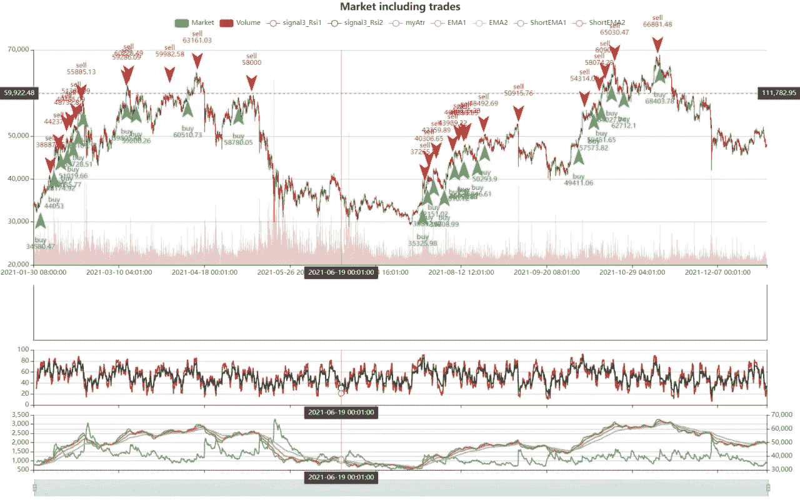
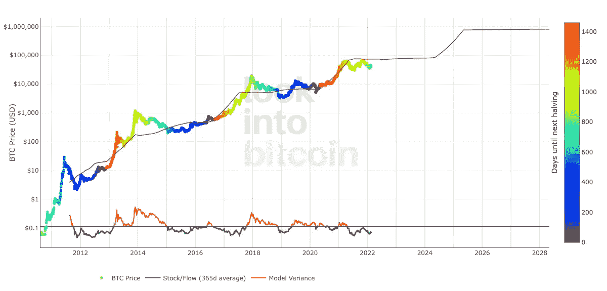

# 在熊市中使用人工智能和股票流动模型交易比特币，获利 120%

> 原文：<https://medium.com/coinmonks/trade-bitcoin-with-120-profit-using-ai-and-the-stock-to-flow-model-in-a-bearish-market-c819e2fad42a?source=collection_archive---------2----------------------->

我们希望与您分享我们的加密货币交易员和程序员一年来的辛勤工作成果。

看看我们的回溯测试结果，我们在上升趋势开始时买入，在价格下跌前卖出。你可能想知道这怎么可能！

它是指标、链上数据和机器学习的结合。

# 机器学习信号

基于一年比特币价格的简单移动平均值，我们使用 TensorFlow 预测了下一个蜡烛线收盘时间。我们可以利用这一预测来决定是购买比特币还是等待。

# 比特币存量到流量模型

这种模式将比特币视为可与黄金、白银或铂金等大宗商品相媲美。这些被称为“价值储存”商品，因为它们相对稀缺，可以在很长时间内保持价值。很难大幅增加其供应量，即寻找黄金然后开采的过程既昂贵又耗时。比特币也类似，因为同样稀缺。事实上，这是有史以来第一个存在的稀缺数字对象。现存的硬币数量有限，挖掘仍待挖掘的 300 万枚硬币需要大量电力和计算工作，因此供应率一直很低。

库存-流量比率用于评估一种商品的当前库存(当前可用的总量)与新生产的流量(当年开采的总量)。

对于黄金、铂金或白银等价值储存(SoV)商品，高比率表明它们在工业应用中基本不被消费。相反，大部分被储存为货币对冲，从而推高了库存流量比率。

较高的比率表明商品越来越稀缺，因此作为价值储存手段更有价值。

来源:https://www.lookintobitcoin.com/charts/stock-to-flow-model/

根据这一点，当我们决定购买或出售比特币时，我们做的第一件事是检查 S2F 模型价格，看看我们还有多远，以及我们是否需要出售比特币或等待价格上涨。

# 平均真实范围

平均真实范围(ATR)是一个波动性指标，显示在给定的时间范围内，资产的平均波动幅度。该指标可以帮助日内交易者确认何时开始交易，并可用于确定止损单的位置。

正如你从回溯测试中看到的，ATR 给了我们一个非常准确的卖出信号。

# 移动平均数

均线(MA)是技术分析中常用的股票指标。计算股票移动平均线的原因是通过创建一个不断更新的平均价格来帮助平滑特定时间段内的价格数据。

有了均线，我们可以确定我们是在牛市还是熊市。如果我们在一个熊市，我们不会进入，会等到市场看涨。

经过一年的研究和对 20 个指标、8 个链上数据和几个机器学习模型的回溯测试，我们找到了在下跌 20%的市场中赚取 120%利润的完美组合。

敬请期待我们与公众分享这一伟大的战略。

这个策略和用户想要创建的任何策略都可以与 SmartStopSet 应用程序一起使用。

如果你今天注册，就可以获得 100 英镑，仅限前 100 名顾客

[SmartStopSet.com](https://smartstopset.com)

将反馈发送至 info[AT]smartstopset.com

**免责声明**

本页的任何信息都不被视为财务建议。在做任何决定之前，你应该做自己的研究。

> 加入 Coinmonks [电报频道](https://t.me/coincodecap)和 [Youtube 频道](https://www.youtube.com/c/coinmonks/videos)了解加密交易和投资

## 也阅读

 [## 杠杆代币[多头代币]终极指南

### 杠杆化令牌是具有杠杆化风险敞口的 ERC20 令牌，不考虑保证金、要求、管理…

medium.com](/coinmonks/leveraged-token-3f5257808b22)  [## 最佳加密交易所| 2022 年十大加密货币交易所| CoinCodeCap

### 哪一个是最好的加密交换？在本文中，我们将根据多种加密货币列出 10 大加密货币交易所

coincodecap.com](https://coincodecap.com/crypto-exchange)  [## 2022 年最佳加密交换平台| CoinCodeCap

### 随着时间的推移，我们大多数人将转向 dex 以获得更好的安全性和隐私。因此。在这里，我们将讨论…

coincodecap.com](https://coincodecap.com/best-swap-platforms)  [## 2022 年最佳加密和比特币赌场(美国批准，存款奖励)

### 接收、支付和赚取加密货币| |有各种各样的最佳在线赌场可供选择，有可能…

coincodecap.com](https://coincodecap.com/best-online-casinos)  [## 2021 年最佳加密借贷平台| 6 大比特币借贷平台

### 获得比特币和其他加密货币的最佳贷款利率

medium.com](/coinmonks/top-5-crypto-lending-platforms-in-2020-that-you-need-to-know-a1b675cec3fa)  [## 2021 年 6 大最佳硬件钱包|顶级加密硬件钱包[更新]

### 最好的加密货币硬件钱包是绝对必要的。我们将在 NGRAVE、Ledger Nano X 和…

medium.com](/coinmonks/the-best-cryptocurrency-hardware-wallets-of-2020-e28b1c124069)  [## 加密交易机器人——19 款最佳免费加密交易机器人

### 2022 年币安、比特币基地、库币和其他密码交易所的最佳密码交易机器人。四进制，位间隙…

medium.com](/coinmonks/crypto-trading-bot-c2ffce8acb2a)  [## 最佳 4 个加密交易信号电报通道

### 这是乏味的找到正确的加密交易信号提供商。因此，在本文中，我们将讨论最好的…

medium.com](/coinmonks/best-crypto-signals-telegram-5785cdbc4b2b)