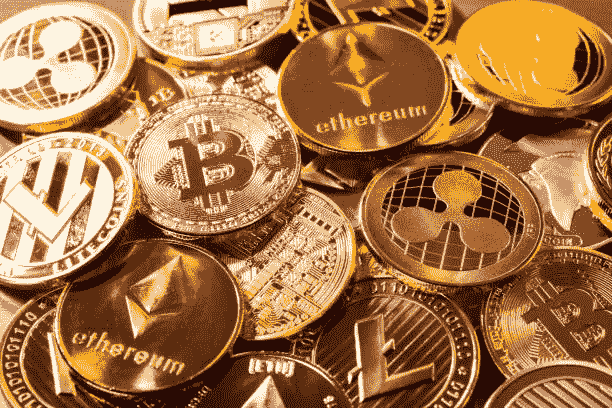

# 立即将您的比特币、以太币、莱特币和其他加密货币兑换成现金

> 原文：<https://medium.com/coinmonks/trade-your-bitcoin-ethereum-litecoin-and-other-cryptocurrencies-for-cash-instantly-dbeae21f4584?source=collection_archive---------72----------------------->

如果你在尼日利亚或加纳，你想出售你的加密货币并立即收到付款，你最好的办法是卖给 Dart Africa 目前非洲最好的密码交换平台。在 Dart Africa，其作为加密货币交易平台的使命之一是为平台上出售的任何加密货币即时支付客户，比特币、USDT、以太坊、Dogecoin 等等。

Trade your crypto currency for cash

Dart Africa 是一个自动化加密交易平台，购买各种类型的加密货币，并根据国家/地区以当地货币(奈拉或塞迪斯)支付给客户。由于 Dart Africa 是一个自动化平台，该系统设计用于在确认客户的加密交易后立即支付款项，而不管加密硬币的类型是比特币、以太币、Dogecoin、莱特币、USDT 和 USDC。相同的原则适用于所有加密硬币。您可以访问 Dart Africa 的[网站](http://dartafrica.io)或通过手机应用程序(可在[谷歌 Play 商店](https://play.google.com/store/apps/details?id=com.dartafrica&hl=en_US&gl=US)和 App Store 下载)来访问 Dart Africa 的服务。

当你想出售你的加密货币时，即时支付不是唯一要考虑的因素，你应该考虑这个平台提供的汇率。Dart Africa 在外汇市场上为加密提供了最好的汇率之一。例如，在我写这篇文章的时候，比特币的价格是 585 美元。如果你熟悉加密货币经济，你会知道价值和利率总是会发生变化。您可以使用[飞镖非洲硬币计算器](https://dartafrica.io/coincalculator)来查看您的加密货币的当前汇率。

Dart Africa 不仅对经验丰富的加密交易商开放，新手也可以无缝地使用该平台出售他们的加密硬币。该平台允许用户点击几下，在几分钟内出售他们的数字硬币。该平台的 web 和 app 版本都采用了用户界面和用户体验设计的优秀实践。

Dart Africa 也了解用户有时在使用平台时可能会遇到问题，因此他们集成了一个全天候的客户支持系统，帮助客户解决他们在使用平台时可能遇到的任何问题。

## **如何在 Dart Africa 上出售您的加密软件**

Dart Africa 的网站是一个令人惊叹的网站，你会被其导航的便捷性和美丽的美学所震撼。加密货币平台的使用非常简单，只需点击几下鼠标，就可以在没有帮助的情况下设置账户并开始交易。按照以下步骤出售您的比特币:

*   [使用您的正确信息在 Dart Africa 上注册](https://dartafrica.io/register)。
*   单击工具栏图标(左上角的三条垂直直线)。您将在您的帐户面板上看到此信息。
*   点击出售硬币。
*   在硬币栏中选择您喜欢的硬币选项。
*   输入你要出售的密码数量，相应的美元和奈拉金额将显示在列中。注意:你可以出售的 BTC 或任何加密货币的最低美元价格是 20 美元。
*   点击立即出售硬币。
*   将提供一个钱包地址和一个 QR 码。您可以通过手动输入地址或扫描二维码来发送您在上述步骤中选择的加密金额。付款被确认后，你将立即被记入贷方。

## **比特币和以太坊的主要区别**

众所周知，比特币和以太坊都是由区块链技术和密码术(公钥和私钥)的原理驱动的，它们两者在许多方面仍然不同。例如，比特币网络交易仅记录交易、发送了多少比特币、发送方和接收方，而以太坊则可能包含可用于 dApps 和智能合约的可执行代码。另一个区别是，比特币交易在几分钟内确认，以太交易在几秒内确认。

比特币和以太网的主要区别在于，虽然比特币主要是作为国家货币的替代品，因此看起来既是价值储存手段，也是交易媒介，但以太坊的创建是为了将基于其区块链的智能联系和去中心化应用货币化。

以太坊是另一种建立在区块链上的数字货币，理论上不应该成为比特币的竞争对手。然而，以太网的日益普及和增长已经将它推向了与所有加密货币的竞争，特别是从交易者的角度来看。自 2015 年年中推出以来，以太一直紧随比特币排名的顶级加密货币 b 市值。

以太坊生态系统多年来经历了显著的增长，这要归功于它在金融、艺术和收藏品(NFT 或不可替代的代币)、游戏和技术等领域的分散化应用程序(dApps)越来越受欢迎。

> 加入 Coinmonks [电报频道](https://t.me/coincodecap)和 [Youtube 频道](https://www.youtube.com/c/coinmonks/videos)了解加密交易和投资

# 另外，阅读

*   [TraderWagon 回顾](https://coincodecap.com/traderwagon-review) | [北海巨妖 vs 双子星 vs BitYard](https://coincodecap.com/kraken-vs-gemini-vs-bityard)
*   [如何在 FTX 交易所交易期货](https://coincodecap.com/ftx-futures-trading) | [OKEx vs 币安](https://coincodecap.com/okex-vs-binance)
*   [OKEx vs KuCoin](https://coincodecap.com/okex-kucoin) | [摄氏替代品](https://coincodecap.com/celsius-alternatives) | [如何购买 VeChain](https://coincodecap.com/buy-vechain)
*   [ProfitFarmers 点评](https://coincodecap.com/profitfarmers-review) | [如何使用 Cornix 交易机器人](https://coincodecap.com/cornix-trading-bot)
*   [如何匿名购买比特币](https://coincodecap.com/buy-bitcoin-anonymously) | [比特币现金钱包](https://coincodecap.com/bitcoin-cash-wallets)
*   [瓦济里克斯 NFT 评论](https://coincodecap.com/wazirx-nft-review)|[Bitsgap vs Pionex](https://coincodecap.com/bitsgap-vs-pionex)|[坦吉姆评论](https://coincodecap.com/tangem-wallet-review)