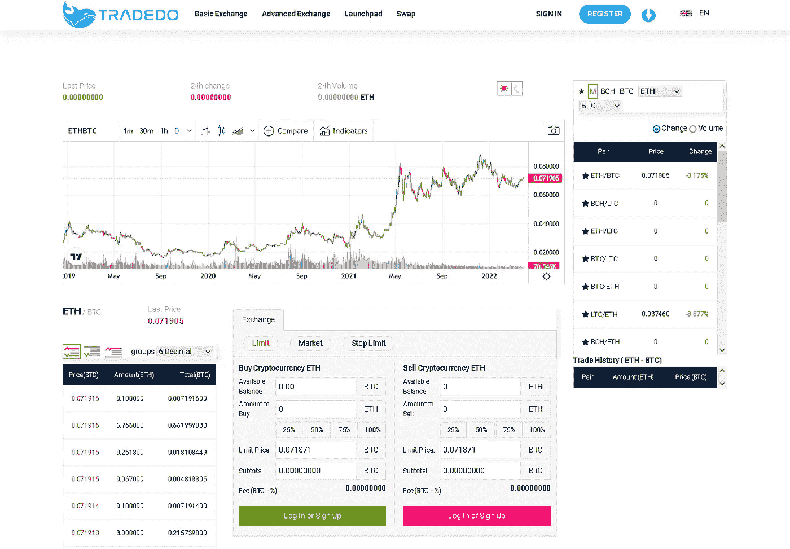
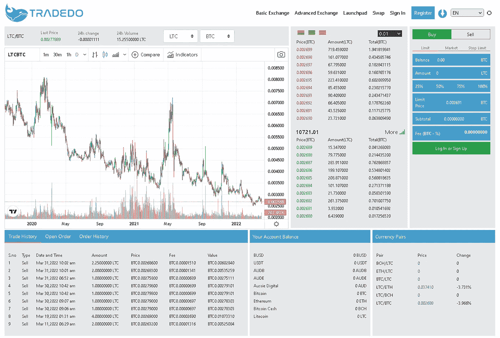
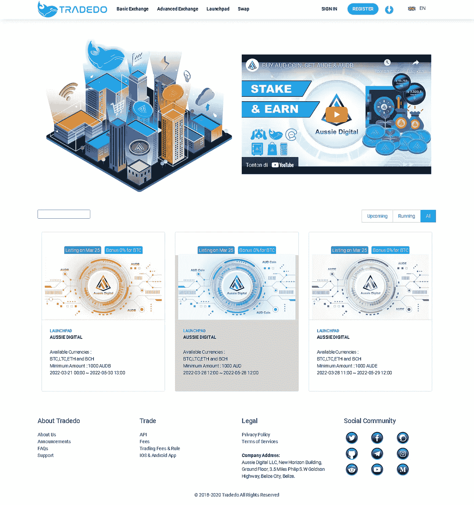

# TRADEDO —测试版发布

> 原文：<https://medium.com/coinmonks/tradedo-beta-version-launch-d6e2bf749f54?source=collection_archive---------39----------------------->

tradedo.io

大家好，团队辛苦了一段时间。我们很高兴地宣布，我们已经推出了 Tradedo exchange 的测试版。这是我们同意推出的众多平台之一。

> Tradedo Exchange 现已开放测试模式。为了让您的帐户获得批准，您需要通过我们的澳大利亚数字门票系统提交门票。您将再次被问及一些关于您在空投期间如何推广 Aussie Digital 的问题，因此在提交机票之前请做好准备。请注意，成为我们电报组的一员是强制性的，因此如果你不是该组的一员，你将不会被批准。

Tradedo.io

> 可用于开始的线对如下。：
> 
> BTC、瑞士联邦理工学院、瑞士联邦理工学院、BCH、USDT、BUSD、澳大利亚元、澳大利亚元和澳大利亚元
> 
> **我们增加了 BNB BUSD 和索尔以及美元作为购买选项**

Trading

该生态系统的原生硬币 AUDCoin 将在 Tradedo 上用于购买其他加密资产。澳新数码背后的创造者将 Tradedo 称为生态系统的“引擎室”。因为它还负责在我们的电子商务平台 Tradezy.io 上运行加密交易。现在，让我们快速了解一下使该加密交易门户成为业界最佳之一的一些亮点。

Trading

(Trededo.io)这是一个你可以进入的领域。下周我们将对这个平台进行许多其他的改变，我们打算用易于使用的功能来宠坏我们的用户。

我们非常清楚这是一个非常漫长的旅程，但我们总是从我们的支持者那里获得能量来完成这项工作。我们创造了区块链生态系统作为澳元硬币的公用事业，而这一旅程才刚刚开始。

Launchpad

Tradedo 是澳新数码的原生交易交流平台。从拥有一个用户友好的界面到成为一个安全的交易平台，Tradedo 让加密交易者，甚至是新手，完全有信心交易加密资产，没有任何麻烦。

WEB WEB WEB WEB WEB WEB WEB WEB WEB WEB WEB WEB WEB WEB WEB WEB WEB WEB WEB WEB WEB WEB WEB WEB WEB WEB WEB WEB WEB WEB WEB WEB WEB WEB WEB WEB WEB WEB WEB WEB WEB WEB WEB WEB WEB WEB WEB WEB WEB WEB WEB WEB WEB WEB WEB WEB WEB WEB WEB WEB WEB WEB WEB WEB WEB WEB WEB WEB WEB WEB WEB WEB WEB WEB WEB WEB WEB WEB