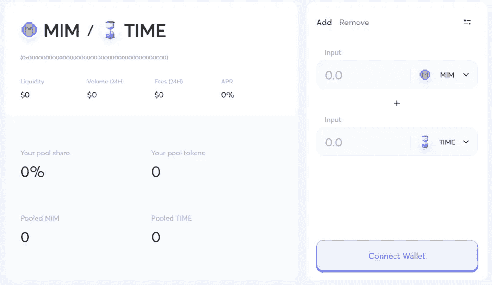

# 乔，雪崩的第一个指数:完全指南

> 原文：<https://medium.com/coinmonks/trader-joe-guide-23a62e8e34f9?source=collection_archive---------10----------------------->

Trader Joe Complete Guide

[**【乔】**](https://traderjoexyz.com/home#/home) ，第一个分散交易所在**雪崩**区块链。一个一体化的协议，让您只需点击一下鼠标，即可进行交易、入股、耕种、借贷。

**目录**

1.  乔，雪崩指数简介
2.  乔的历史，雪崩加密指数
3.  Joe token，雪崩上的加密货币
4.  特色的商人乔，雪崩加密指数
5.  关于乔，雪崩加密指数的结论

# 乔，雪崩指数简介

**乔氏**是雪崩区块链第一个去中心化的交易平台( **DEX** )。该平台允许通过汽车做市商( **AMM** )进行没有中间商的点对点交易，并通过提供流动性、赌注和耕作产生被动收入，这一过程通常被称为产量耕作。

生态系统由用户驱动并为用户服务，协议通过**智能合同**进行管理，这使得 Trader Joe 生态系统可持续发展并且**去中心化**。

今天，Trader Joe 代表着超过 3 亿美元的日交易量。很快，它将代表 1000 个流动性对和 10 亿美元的 TVL(总价值锁定)。

 [## 加密交易机器人——20 个最好的免费加密交易机器人

### 2022 年币安、比特币基地、库币和其他密码交易所的最佳密码交易机器人。Pionex，Bitsgap…

medium.com](/coinmonks/crypto-trading-bot-c2ffce8acb2a) 

# 乔的历史，雪崩加密指数

当时**穿山甲**是雪崩上第一个 **DEX** 。然而，穿山甲努力创新，没有满足客户的需求。乔帮主后来来了，2021 年 6 月。它很快超越穿山甲的 TVL 成为领先者。

现代的界面、功能和高产农业是他们获胜策略的一部分，比如农民乔·梅梅的背景故事。用户开始喜欢上这个项目，并把它推到了顶端。

2021 年 9 月初，Trader Joe 在一次战略销售中筹集了**500 万美元。在投资者中，DeFi 生态系统中的几个大实体，如**德尔福资本**或 **3AC** 。**

Trader Joe 也因其**用户友好的**界面而闻名，并毫不犹豫地提供创新的耕作工具和功能。

# Joe token，雪崩上的加密货币

**JOE** 是协议的原生令牌。你可以下注，以获得 **xJOE** ，治理令牌。通过持有这种货币，你将能够投票并影响协议的决定。部分费用分配给 xJOE 赌注者，并允许**每天回购 JOE** ，带来持续的购买压力。

Trader Joe Token

# 特色的商人乔，雪崩加密指数

# 互换

当然，**乔氏**带给你**互换代币**的可能性。他们的个人触摸是**价格图**的整合，让你直接看到价格的波动。这是一个真正的好处，使交换更加方便用户。

您还可以调整滑点，使可用的流动性与您想要交换的一对代币相匹配。

Trader Joe Swap Interface

一个新的功能将很快添加，并将允许用户直接在 DEX 上设置**订单限制**。

# 流动性提供

你可以给不同的资金池带来流动性。

为了增加流动性，您必须存入一对代币(即 MIM 和 TIME)，每个代币的值相同。作为这一对的回报，您将获得 **LP 代币**，代表您在流动性池中存款的价值。您可以根据您最初拥有的令牌随时更改它们。

Trader Joe Deposit in Liquidity Pool

通过增加流动性，您允许其他用户交换您存放的代币。你的奖励是获得**交易费**。目前，大多数资金池的年利率为 20%。

Trader Joe APR

“ **ZAP** ”功能允许您在一个池中仅存放一项资产。该协议将自动转换您存款的价值，并将其分为两项资产。这避免了多次交易和相关费用。

通过成对存放流动性，你会遭受**暂时性损失**。我邀请你询问这个问题，以避免不愉快的惊喜。

# 农业

一旦你的流动资金被存入，你就有了 LP 代币。这些代表您在协议中存放的令牌数量。使用这些代币进行**产量耕作**是**增加你的收益和产量**的一种方式。

换取您的 LP 代币存款，您将获得**乔**。每个池都有自己的 APY，当协议需要吸引特定一对令牌的流动性时，该值会更高。

# 立桩标界

而且，为了多拿 **xJOE** 和 30%的 APY，有可能把你的 **JOE** 也押上。如果你把你的 xJOE 放在池子里，你会得到 JOE 的奖励，通过重复这个程序，你可以优化你的产量。

Trader Joe Staking

回报来自平台上活动产生的**流动性激励**和**费用**。清算利润和 0.5%的费用被重新分配给 xJOE 股东。

# 银行家乔

自 10 月初以来，现在可以直接在乔氏上借用加密货币，类似于**大院**或 **AAVE** 。用户可以借出他们的加密货币以获取收益，并将其用作贷款的抵押品。TVL**(锁定的总价值)约为 10 亿美元。**

**该团队目前正在开发一个系统，在他们的平台上使用**杠杆来提高产量。****

**清算利润和一部分费用被重新分配给 **xJOE stakers** 。**

# **火箭乔**

**Rocket Joe 是 Trader Joe 上新的创新功能。从根本上说，它就像一个利用当前 Trader Joe 功能的**发射台**。**

****

**用户将能够在一个特殊的池中下注他们的 JOE 来赢得 r JOE，这个令牌允许你拥有一个 **IDO** 的关联分配。对于每 100 个 rJOE，您将能够在初始 LP 中投资 1 个 AVAX。**

**在**公开发布**后，您的 LP 代币将在一周内被授予，但您将能够在此期间赚取交易费。**

**Rocket Joe 是雪崩社区可持续发展项目的主持人。Rocket Joe 扩展了 Trader Joe 平台，并为 tokenomics 的更广泛改革奠定了基础。**

# **关于乔，雪崩加密指数的结论**

**今天，**乔氏**是雪崩上 DeFi 的必备。该协议已经能够通过向其用户提供新的创新、性能和关注来快速确立自身并处于领先地位。**

****

**Trader Joe meme**

**该协议还通过 Twitter 使用了 JOE meme，你可以想象它对社区的影响。**

****Trader Joe** 意为**一体化协议**，允许你互换、提供流动性、耕种、堆叠、借入、借出……还有许多其他功能正在开发中。**

> **加入 Coinmonks [电报频道](https://t.me/coincodecap)和 [Youtube 频道](https://www.youtube.com/c/coinmonks/videos)了解加密交易和投资**

# **另外，阅读**

*   **[3 商业评论](/coinmonks/3commas-review-an-excellent-crypto-trading-bot-2020-1313a58bec92) | [Pionex 评论](https://coincodecap.com/pionex-review-exchange-with-crypto-trading-bot) | [Coinrule 评论](/coinmonks/coinrule-review-2021-a-beginner-friendly-crypto-trading-bot-daf0504848ba)**
*   **[莱杰 vs n rave](/coinmonks/ledger-vs-ngrave-zero-7e40f0c1d694)|[莱杰 nano s vs x](/coinmonks/ledger-nano-s-vs-x-battery-hardware-price-storage-59a6663fe3b0) | [币安评论](/coinmonks/binance-review-ee10d3bf3b6e)**
*   **[Bybit Exchange 审查](/coinmonks/bybit-exchange-review-dbd570019b71) | [Bityard 审查](https://coincodecap.com/bityard-reivew) | [Jet-Bot 审查](https://coincodecap.com/jet-bot-review)**
*   **[3 commas vs crypto hopper](/coinmonks/3commas-vs-pionex-vs-cryptohopper-best-crypto-bot-6a98d2baa203)|[赚取加密利息](/coinmonks/earn-crypto-interest-b10b810fdda3)**
*   **最好的比特币[硬件钱包](/coinmonks/hardware-wallets-dfa1211730c6) | [BitBox02 回顾](/coinmonks/bitbox02-review-your-swiss-bitcoin-hardware-wallet-c36c88fff29)**