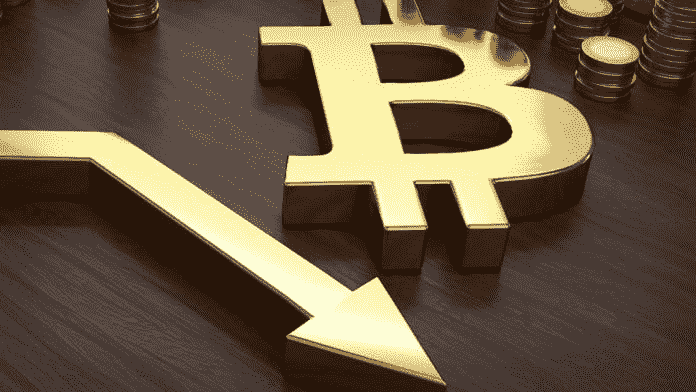
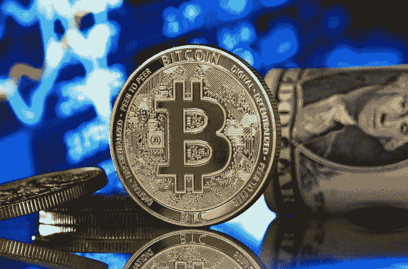

# 交易商展示比特币价格水平以供监控，比特币有跌至 30K 美元底部的风险

> 原文：<https://medium.com/coinmonks/trader-shows-bitcoin-price-levels-to-monitor-with-bitcoin-at-risk-of-falling-to-a-bottom-of-30k-99d1742bb1a7?source=collection_archive---------73----------------------->

加密交易员 Michal van de Poppe 指出比特币潜在的令人印象深刻的上行情况，但也警告说，某些价格水平的反应可能会导致最坏的情况下跌至 3 万美元。

# 39200 美元的比特币支持区

来自 [TradingView](http://tradingview.com/) 的近期图表显示，截至 4 月 27 日，比特币价格的趋势令人担忧，多头正在反击，以夺回关键阻力位。[4 月 26 日，比特币(BTC)](https://bumblebeecrypto.com/) 跌至 37750 美元，随后大幅反弹至 39200 美元。根据 Michal van de Poppe 的说法，比特币价格从这一水平再次下跌，成为一个关键的阻力水平。

在他最新的 youtube 帖子中，他强调了 39，300 美元的价格水平是 BTC 需要超越的水平，以扭转牛市，然后将下一个水平的阻力定在 42，600 美元。他还谈到了比特币无法夺回 39，300 美元价格水平的情况，他解释说，“如果我们失去了这一点，我认为我们正在寻找做空机会，”他解释说，底部可能会低于 37，000 美元的价格水平。

他继续表示，“如果我们失去这一支撑水平，我认为可能会出现暴跌，因为我们将引发流动性跌破低点，然后我们可能会测试一些更低的水平，最终，如果市场真的准备好引爆，我认为 30，000 美元是市场的最终底部。”

Van de Poppe 并不是唯一一个警告比特币价格可能跌至 3 万美元大关的加密交易分析师。最近几周，一些数字给出了 3 万美元的目标，其中包括前 BitMEX 首席执行官亚瑟·海斯(Arthur Hayes)以及其他几位加密 youtubers 用户，他们也提出了类似的观点，如果某些水平不成立，包括卡尔(the moon)和“ [MMCrypto](https://www.youtube.com/c/MMCryptoTube) ”。

Van de Poppe 还补充说，如果我们能够突破 39，300 美元大关，在当前整合到位的情况下，[比特币](https://bumblebeecrypto.com/crypto-prices/)可能会出现“严重挤兑”。

来源:[BumbleBeeCrypto.com](https://BumbleBeeCrypto.com)

*免责声明:本文表达的观点和意见仅代表作者个人，不一定代表 BumbleBeeCrypto.com 的观点或意见，也不应被视为财务建议。每一个投资和交易行为都会带来风险，我们建议您在做出任何交易、投资或财务决策时进行自己的研究。*

> 加入 Coinmonks [电报频道](https://t.me/coincodecap)和 [Youtube 频道](https://www.youtube.com/c/coinmonks/videos)了解加密交易和投资

# 另外，阅读

*   [如何匿名购买比特币](https://coincodecap.com/buy-bitcoin-anonymously) | [比特币现金钱包](https://coincodecap.com/bitcoin-cash-wallets)
*   [币安 vs FTX](https://coincodecap.com/binance-vs-ftx) | [最佳(SOL)索拉纳钱包](https://coincodecap.com/solana-wallets)
*   [比诺莫评论](https://coincodecap.com/binomo-review) | [斯多葛派 vs 3Commas vs TradeSanta](https://coincodecap.com/stoic-vs-3commas-vs-tradesanta)
*   [Capital.com 评论](https://coincodecap.com/capital-com-review) | [香港的加密借贷平台](https://coincodecap.com/crypto-lending-hong-kong)
*   如何在 Uniswap 上交换加密？ | [A-Ads 评论](https://coincodecap.com/a-ads-review)