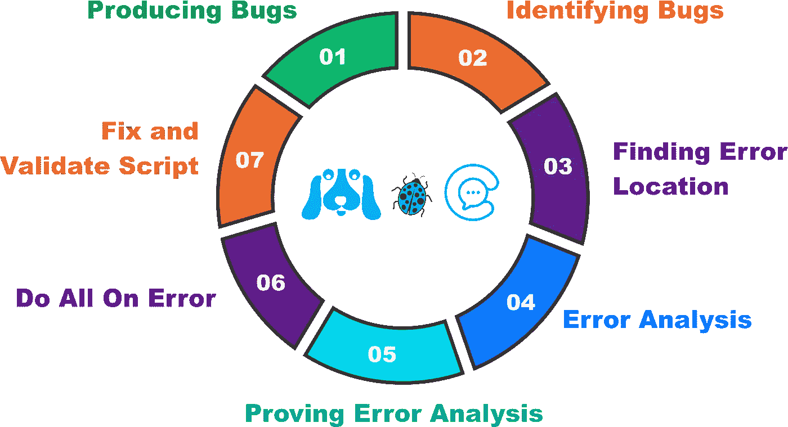

# TRADEZY 和 CHATEZY 调试

> 原文：<https://medium.com/coinmonks/tradezy-and-chatezy-debugging-114ccd1f669d?source=collection_archive---------55----------------------->

Debugging

调试是识别和消除代码中的错误或错误的过程。

此错误会导致应用程序或软件无法正常运行。比如登录失败、输入数据出错、功能失常、蓝屏等。

由于一个程序的编码系统通常是错综复杂的，一个代码错误就能影响整个程序。

Visa and Mastercard

目前，Tradezy 和 Chatezy 正处于删除代码中所有 bug 的阶段。这个过程将比编写程序本身花费更长的时间。

在漏洞清除过程完成后，我们将添加 Visa 和 Mastercard 来处理 Tradezy 和 Chatezy 平台上的支付。

我们将继续努力为我们的用户提供最好的服务。请随时关注我们的最新消息。

我们的信息:

网站:[https://www.aussiedigital.io/](https://www.aussiedigital.io/)
脸书:[https://www.facebook.com/aussiedigital/](https://www.facebook.com/aussiedigital/)
推特:[https://twitter.com/aussie_digital](https://twitter.com/aussie_digital)
电报:[https://t.me/AUDOfficialGroup](https://t.me/AUDOfficialGroup)
Youtube:[https://www.youtube.com/channel/UCGoncZDbjH21YOi4i4YwroA](https://www.youtube.com/channel/UCGoncZDbjH21YOi4i4YwroA)
insta gram:[https://www.instagram.com/aussiedigital.io/](https://www.instagram.com/aussiedigital.io/)
Github:[https://github.com/aussiedigitalio](https://github.com/aussiedigitalio)
Reddit:[https://www.reddit.com/r/aussiedigital_25b/](https://www.reddit.com/r/aussiedigital_25b/)