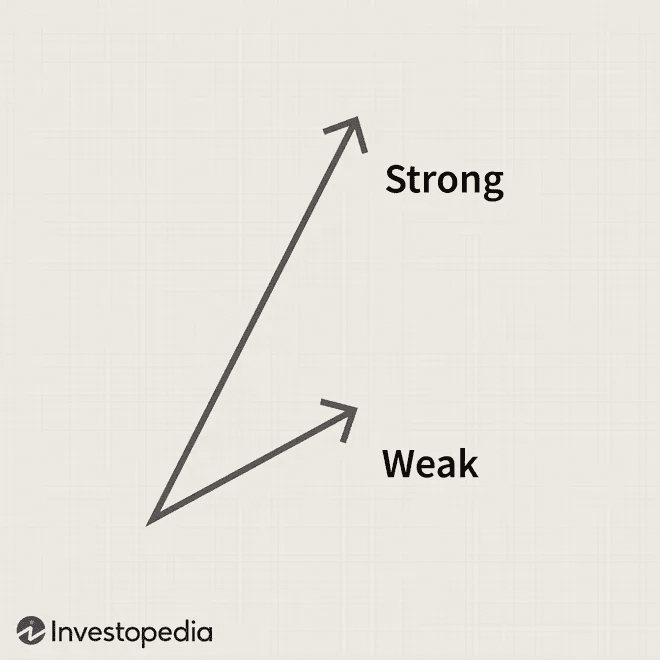
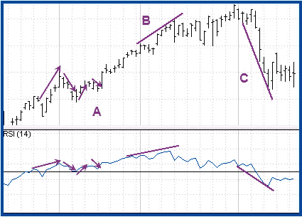
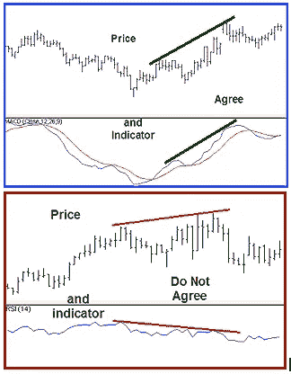
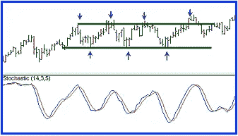
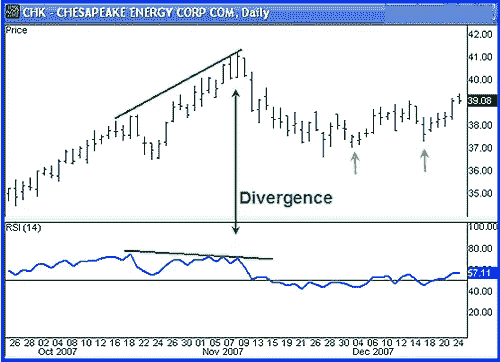
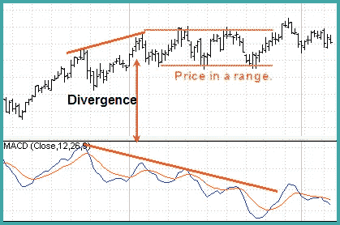
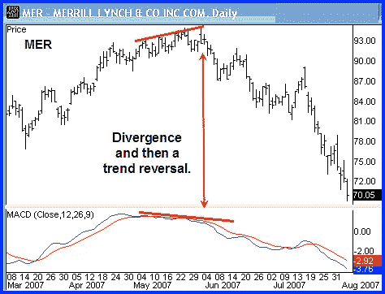
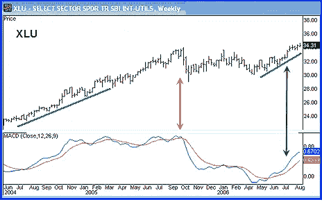

# 交易差异和理解动量|加密和外汇

> 原文：<https://medium.com/coinmonks/trading-divergence-and-understanding-momentum-crypto-forex-e4f3d17a4fdd?source=collection_archive---------25----------------------->

在我们的 YouTube 上观看视频的同时，享受这个流的资源！

YouTube:[https://youtu.be/lhZLfs59Eas](https://youtu.be/lhZLfs59Eas)

不和:【https://discord.gg/J73qhkj7kr】T2

推特:【https://twitter.com/CryptoverseDAO】

linktree:[https://linktr.ee/cryptoversedao](https://linktr.ee/cryptoversedao)

-

交易分歧和理解动量:

因为趋势是由一系列价格波动组成的，动量在评估趋势强度时起着关键作用。因此，知道趋势何时放缓是很重要的。势头减弱并不总是导致反转，但它确实标志着一些事情正在发生变化，趋势可能会巩固或反转。

价格动量是指价格的方向和幅度。比较价格波动有助于交易者洞察价格趋势。在这里，我们将看看如何评估价格动量，并向您展示动量的背离可以告诉您趋势的方向。

价格动量由短期价格波动的长度来衡量，陡坡和长期价格波动代表强动量，而弱动量由浅坡和短期价格波动来代表。
动量指标包括相对强度指数、随机性和变化率。
背离——指标之间的不一致——可能对交易管理有重大影响。

定义价格动力:

价格动量的大小由短期价格波动的长度来衡量。每次波动的开始和结束都是由结构性价格支点决定的，这些支点形成了波动的高点和低点。陡峭的斜坡和长时间的价格波动显示了强劲的势头。微弱的势头被认为是一个浅斜率和短期价格波动。

例如，上升趋势中上升的长度是可以测量的。较长的上升趋势表明上升趋势显示了增加的势头，或者变得更强。较短的上升意味着减弱的势头和趋势强度。等长上涨意味着动量保持不变。
【上午 8:36】
价格波动并不总是容易用肉眼评估，因为价格可能会起伏不定。动量指标通常用于平滑价格波动，并给出一个更清晰的画面。他们允许交易者比较指标波动和价格波动，而不是比较价格。

动量指标:

衡量价格变动的常见动量指标包括相对强度指数(RSI)、随机指标和变化率(ROC)。图 2 是如何使用 RSI 测量动量的例子。RSI 的默认设置是 14。RSI 具有从 0 到 100 的固定边界值。

价格每上涨一次，RSI 就有一次类似的上涨。当价格向下摆动时，RSI 也向下摆动。

指标波动一般跟随价格波动的方向(A)。趋势线可以画在波动的高点(B)和低点上，用来比较价格和指标之间的动量。

动量的研究只是简单的检查价格和指标是否一致。

比较价格和指标，做出更好的交易决定。

气势发散:

指标和价格之间的不一致被称为背离，它对交易管理有很大的影响。同意/不同意的程度是相对的，因此在价格和指标之间的关系中可以有几种不同的模式。对于本文，讨论仅限于基本形式的分歧。

重要的是要注意，必须有足够强度的价格波动才能使动量分析有效。因此，动量在活跃的趋势中是有用的，但在价格波动有限且多变的区间条件中是没用的，如图 4 所示。

在区间条件下，指标不会增加我们从价格上看到的东西。可变枢轴高点和低点显示范围。

上涨趋势中的背离发生在价格创出新高，但指标没有创出新高的时候。在下跌趋势中，当价格出现更低的低点时，就会出现背离，但指标不会出现背离。当发现背离时，价格回撤的可能性更大。图 5 是一个背离的例子，不是反转，而是趋势方向变为横盘。

动量发散和回调。更高的支点高点(橙色小箭头)是价格支撑的信号。背离有助于交易者识别价格变化并做出适当的反应。它告诉我们事情正在发生变化，交易者必须做出决定，例如收紧止损或获利。看到背离会提醒交易者保护利润，从而增加盈利。

注意图 5 中的股票，切萨皮克能源(CHK)，其中股票拉回了支撑位。图 6 中的图表显示趋势不会很快逆转，甚至不会经常逆转。因此，当我们理解趋势动量并在正确的时间将其用于正确的策略时，我们会获得最好的利润。

趋势延续。价格和指标之间的一致给出一个入口(绿色小箭头)。

管理分歧:

背离对交易管理很重要。在图 5 中，获利或卖出看涨期权是很好的策略。价格和指标之间的背离导致回调，然后趋势继续。如果你观察价格在趋势线下方的支点，这通常被称为空头陷阱，错误信号吸引空头，价格迅速反转。当价格的较高低点与图 6 中指标的较高低点(绿色小箭头)一致时，进场信号出现。

背离表明有些事情正在改变，但并不意味着趋势会逆转。这表明交易者必须考虑策略选择——持有、卖出备兑买入期权、收紧止损或部分获利。想要选择顶部或底部的魅力更多的是关于自我，而不是利润。持续盈利就是根据价格的变化选择正确的策略，而不是我们认为价格会做什么。

发散导致射程。上图显示了导致价格横向运行的背离。注意当价格进入一个区间时，移动平均线的收敛发散(MACD)的势头减弱。这表明交易者应该考虑策略选择。当价格和指标不一致时，我们就有分歧。我们无法控制价格的走势。相反，我们只能控制自己的行为。

背离，然后趋势反转。

有时背离会导致趋势反转，如图 8 所示。图 9 所示的公用事业选择部门 SPDR (XLU)支付股息并拥有期权。理解趋势动量给投资者一个利润优势，因为这里有三种获利方式:资本收益、股息和看涨期权。这个例子显示了横盘后趋势的延续，这转化为利润的延续。

当价格和指标一致时，跟着趋势走。

结论:

使用动量指标最有用的方法是知道使用什么策略。价格将起主导作用，但是动量可以指示保持利润的时间。专业交易者的技能在于他们执行正确的价格策略的能力。

> 加入 Coinmonks [电报频道](https://t.me/coincodecap)和 [Youtube 频道](https://www.youtube.com/c/coinmonks/videos)了解加密交易和投资

# 另外，阅读

*   [CoinFLEX 评论](https://coincodecap.com/coinflex-review) | [AEX 交易所评论](https://coincodecap.com/aex-exchange-review) | [UPbit 评论](https://coincodecap.com/upbit-review)
*   [AscendEx 保证金交易](https://coincodecap.com/ascendex-margin-trading) | [Bitfinex 赌注](https://coincodecap.com/bitfinex-staking) | [bitFlyer 点评](https://coincodecap.com/bitflyer-review)
*   [Bitget 回顾](https://coincodecap.com/bitget-review)|[Gemini vs block fi](https://coincodecap.com/gemini-vs-blockfi)cmd |[OKEx 期货交易](https://coincodecap.com/okex-futures-trading)
*   [AscendEx Staking](https://coincodecap.com/ascendex-staking)|[Bot Ocean Review](https://coincodecap.com/bot-ocean-review)|[最佳比特币钱包](https://coincodecap.com/bitcoin-wallets-india)
*   [霍比评论](https://coincodecap.com/huobi-review) | [OKEx 保证金交易](https://coincodecap.com/okex-margin-trading) | [期货交易](https://coincodecap.com/futures-trading)
*   [网格交易机器人](https://coincodecap.com/grid-trading) | [Cryptohopper 审查](/coinmonks/cryptohopper-review-a388ff5bae88) | [Bexplus 审查](https://coincodecap.com/bexplus-review)