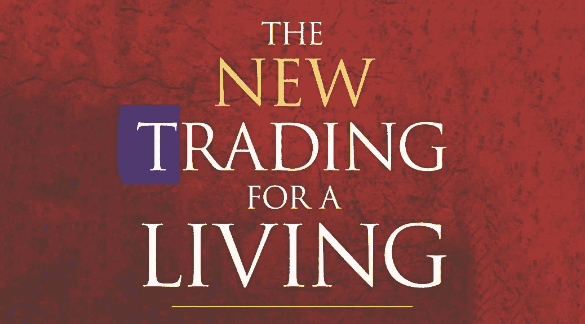

# 亚历山大·艾尔德的《以交易为生》

> 原文：<https://medium.com/coinmonks/trading-for-a-living-by-alexander-elder-fddd428eca5a?source=collection_archive---------16----------------------->

> “当一个新手赢了，他会觉得自己很聪明，不可战胜，然后他会冒很大的风险，失去一切”——亚历山大·埃尔德博士。

T 通过了解图表分析的基本工具、风险最小化原则以及与我们分享在我们刚开始交易时应该避免的新手错误，以新的交易为生教会了我如何对股票交易保持积极的心态。在这本书中，作者解释了关于**滑点**、**买卖差价、佣金、交易心理、技术策略、交易系统、风险管理以及最后做好交易记录。**

这本书的第一部分集中在个人心理，并证明了成功的交易者的首要目标不是像大多数人认为的那样，首先赚钱，而是执行有效的交易。贪婪是一种有害的力量，令人遗憾的是，许多交易者渴望快速成为百万富翁。而不考虑后果。一个交易者的成功取决于他或她对自己的技术和极限诚实的能力。

此外，大多数个人认为交易就像赌博。从两者都涉及风险的意义上来说，它们是相似的。要想在交易中成功，你需要很多纪律和良好的资金管理，但赌博没有这些标准，所以它不是有利可图的。如果你像赌徒一样交易，你的钱会很快花光。为了防止这个问题，停止交易一个月，控制你的冒险倾向，在交易选择上更加自律。

熟练的交易者不会让他们的情绪被市场影响。当股票增值时，他们感到高兴和强大，但当股票不增值时，他们保持冷静。他们也认识到交易只是赚钱一种手段。没有必要在任何资产上投入感情。交易者，尤其是新手，容易出错。正如埃尔德在他的书中所说的，“在交易中，你要和世界上一些最聪明的人竞争，同时还要抵挡佣金和滑点的食人鱼”。

我从《以交易为生》中学到的关键信息是什么:专注、知识和纪律。亚历山大·埃尔德博士说，永远要控制你的情绪。对你的交易要现实，并且要一直记下你的交易，这将有助于你理解你自己的交易结果。他还强调不要关注利润，而是关注交易结果的过程，并学会遵守风险管理的纪律。

其次，使用不同种类的指标将有助于你的考试。趋势跟踪指标包括移动平均线、MACD、ADX、成交量等，这些指标对于识别和捕捉趋势非常有用。振荡指标包括随机指标、ROC、力量指数和许多其他指标，对识别转折点很有用。关键是没有一个指标能给你神奇的买入召唤。不同的指标用于不同的目的和不同的情况。

第三，三重屏幕交易系统使用不同的屏幕来识别市场趋势、市场波动和进场技术，帮助识别不同时间范围内的长期趋势，以便更好地了解交易。

最后，Alexander Elder 博士强调要做自己的交易经理，给自己定下一条规则:一次交易不要超过你资金的 2%,如果你的账户当月超过了 6%,就不要开始新的交易。“2%法则会让你免于灾难性的损失，而 6%法则会让你免于一系列的损失”。

总之，亚历山大·埃尔德博士的书给了我一些宝贵的经验，告诉我如何在这个过程中成为专业交易者。

下面是我在阅读这本书的过程中发现的一些有用的提示，我相信它们能让交易者在这个过程中受益。

> 1.精明的交易者的目标是在平静的时候进入市场，在疯狂的时候获利。当然，这与业余爱好者的行为完全相反:当价格开始上涨时，他们进场或出场，但当价格停滞时，他们就变得厌烦和不感兴趣
> 
> 2.市场是一个巨大的人群。人群中的每个成员都试图通过智取他人的钱财。3.在交易中，你要和世界上最聪明的人竞争，同时还要抵御佣金和滑点的威胁。
> 
> 4.交易意味着试图从别人那里拿钱，而别人也试图拿走你的钱——这就是为什么交易如此艰难。
> 
> 5.“当你在家里交易时，你永远不会是第一个听到消息的人，”他说。
> 
> 6.当人们加入人群时，他们就会改变。他们变得更加轻信和冲动，焦虑地寻找一个领导者，并对情绪做出反应，而不是使用他们的智力。一个卷入群体的个体变得不太能独立思考。
> 
> 7.你的人性导致你在压力下放弃独立。当你进行交易时，你会有模仿他人的欲望，忽略了客观信号。因此，你需要记下并遵循你的交易系统和资金管理规则。它们代表你在交易前做出的理性的个人决定。
> 
> 8.当价格向有利于他们的方向变动时，赢家会觉得得到了回报，当价格向不利于他们的方向变动时，输家会觉得受到了惩罚。人群成员仍然没有意识到，通过关注价格，他们创造了自己的领袖。被价格迷惑的交易者创造了自己的偶像。
> 
> 9.要赚钱交易，你不需要预测未来。你必须从市场中提取信息，找出是多头还是空头在控制市场。
> 
> 10.成功的交易有三个支柱。你需要分析多头和空头之间的力量平衡。你需要练习良好的资金管理。你需要个人自律来遵循你的交易计划，避免在市场中兴奋或沮丧。
> 
> 11.关注价格和指标，而不是看着美元，想着你能用它们买什么。
> 
> 12.MACD 柱状图的作用就像汽车上的前灯一样——它给你前方道路的一瞥。请注意，虽然不是一路回家，但足够以合理的速度安全驾驶了。
> 
> 13.有人问我，当他对一项交易特别有信心时，2%的原则是否可以增加，我回答说，这就像给蹦极的绳子增加额外的长度，因为你喜欢桥上的风景。
> 
> 14.当你当月的亏损和未平仓交易的风险之和达到你账户净值的 6%时，6%原则禁止你在这个月的剩余时间里开始任何新的交易
> 
> 15.进行交易就像潜水寻宝。海底有金子，但是当你把它捞起时，记得看一下你的气压计。海底散落着潜水员的遗骸，他们看到了巨大的机会，但却耗尽了空气。专业潜水员总是考虑他的空气供应。如果他今天拿不到金牌，他明天就会去争取。他需要生存并再次潜水。新手会因耗尽空气而丧命。
> 
> 16.私人交易者没有经理。这就是为什么你需要成为自己的经理。2%法则会让你免于灾难性的损失，而 6%法则会让你免于一系列的损失。6%原则会迫使你做一些大多数人做不到的事情，直到为时已晚——打破连败。
> 
> 17.纪律从做作业开始。
> 
> 18.写下你的交易计划可以加强纪律性。
> 
> 19.纪律在执行这些计划和完成交易记录时达到顶点。
> 
> 20.边学边换小号。
> 
> 21.交易时不要数钱。
> 
> 22.使用风险管理规则，主要是 2%规则。
> 
> 23.写下你的计划，尤其是这三个数字:进场、止损和目标。
> 
> 24.写交易日记，每月至少回顾一次。
> 
> 加入 Coinmonks [电报频道](https://t.me/coincodecap)和 [Youtube 频道](https://www.youtube.com/c/coinmonks/videos)了解加密交易和投资

# 另外，阅读

*   [密码本交易平台](/coinmonks/top-10-crypto-copy-trading-platforms-for-beginners-d0c37c7d698c) | [Coinmama 审核](/coinmonks/coinmama-review-ace5641bde6e)
*   [印度的加密交易所](/coinmonks/bitcoin-exchange-in-india-7f1fe79715c9) | [比特币储蓄账户](/coinmonks/bitcoin-savings-account-e65b13f92451)
*   [OKEx vs KuCoin](https://coincodecap.com/okex-kucoin) | [摄氏替代品](https://coincodecap.com/celsius-alternatives) | [如何购买 VeChain](https://coincodecap.com/buy-vechain)
*   [币安期货交易](https://coincodecap.com/binance-futures-trading)|[3 comas vs Mudrex vs eToro](https://coincodecap.com/mudrex-3commas-etoro)
*   [如何购买 Monero](https://coincodecap.com/buy-monero) | [IDEX 评论](https://coincodecap.com/idex-review) | [BitKan 交易机器人](https://coincodecap.com/bitkan-trading-bot)